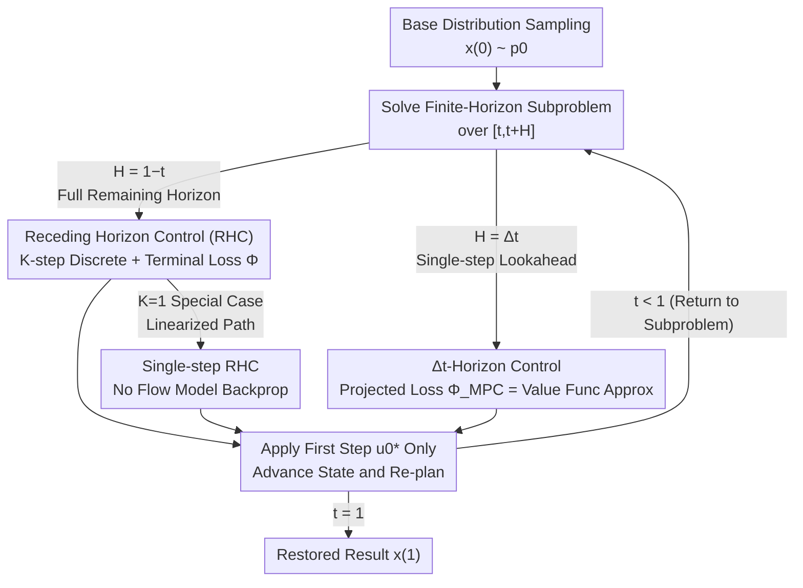

# Solving Inverse Problems with Flow-based Models via Model Predictive Control

**Conference**: ICML 2026  
**arXiv**: [2601.23231](https://arxiv.org/abs/2601.23231)  
**Code**: https://github.com/alexdenker/MPCFlow  
**Area**: Diffusion Models / Image Restoration / Inverse Problem Solving  
**Keywords**: Flow Matching, Optimal Control, Model Predictive Control, Training-Free Guidance, Inverse Problems

## TL;DR
This work reformulates "solving inverse problems with pre-trained flow models" as **Model Predictive Control (MPC)**—instead of optimizing the entire sampling trajectory at once, it solves a short-horizon subproblem at each time step, applies one step of control, and re-plans. This significantly reduces memory usage and leads to a variant that **requires no backpropagation through the flow model**, enabling the scaling of training-free guidance to quantized FLUX.2 (32B) models on consumer-grade 24GB GPUs.

## Background & Motivation

**Background**: Continuous Normalizing Flows (CNFs) trained via Flow Matching have become a dominant framework for high-dimensional data generation. They learn a time-varying velocity field $v_\theta(\bm{x},t)$ to transform a simple base distribution (Gaussian) to the data distribution by solving the ODE $\frac{d\bm{x}(t)}{dt}=v_\theta(\bm{x}(t),t)$. Beyond unconditional generation, it is desirable to solve **inverse problems** $\bm{y}=\mathcal{A}(\bm{x})+\bm{\epsilon}$—recovering the signal $\bm{x}$ from noisy measurements—where $\mathcal{A}$ is a potentially non-linear forward operator.

**Limitations of Prior Work**: Existing training-free guidance methods often inject data fidelity terms directly into the dynamics to "push" the trajectory, but these heuristic approaches lack theoretical guarantees (e.g., consistency with measurements) and can be numerically unstable. A more principled route treats conditional sampling as a **deterministic optimal control problem** (e.g., FlowGrad, OC-Flow), yielding cleaner objectives and better trade-offs between fidelity and prior consistency. However, this requires trajectory optimization over the entire sampling path, necessitating either backpropagation through the ODE solver (memory scales linearly with steps) or solving adjoint equations (doubling runtime with forward/backward passes).

**Key Challenge**: The optimal control perspective is principled but computationally prohibitive. Global optimal control optimizes all control variables $\bm{u}_0,\dots,\bm{u}_{N-1}$ simultaneously; computing the gradient for $\bm{u}_k$ requires $N-k$ nested evaluations of the flow model, which is infeasible for large-scale models.

**Goal**: Retain the principled nature of optimal control (provability, interpretable regularization) while compressing computational and memory costs to enable large-scale model deployment, ideally eliminating backpropagation through the flow model.

**Key Insight**: The authors adopt **Model Predictive Control (MPC)** from robotics and process control. Instead of predicting and executing a full trajectory, MPC plans over a short horizon at each time step, applies only the first control segment, and then re-plans from the new state. This "receding horizon + repeated re-planning" naturally decomposes a large optimization into a sequence of smaller ones, and re-planning corrects accumulated errors.

**Core Idea**: Formulate inverse problem solving as a sequence of short-horizon control subproblems (MPC-Flow). The authors demonstrate that under two extreme horizon settings, it recovers global optimal control; specifically, the "single-step horizon" variant analytically avoids backpropagation through $v_\theta$, scaling training-free guidance to 32B-level quantized models for the first time.

## Method

### Overall Architecture

The starting point is formulating conditional generation as an optimal control problem: superimposing a control term $\bm{u}(t)$ on the original ODE such that the terminal state satisfies the measurement constraint while minimizing control energy:

$$\min_{\bm{u}}\Big\{\int_0^1\|\bm{u}(t)\|_2^2\,dt+\lambda\,\Phi(\bm{x}(1))\Big\}\quad\text{s.t.}\quad\frac{d\bm{x}(t)}{dt}=v_\theta(\bm{x}(t),t)+\bm{u}(t).$$

The integral term is the **control energy regularization** (preventing the trajectory from deviating too far from the pre-trained flow, acting as a "prior distance" regularizer), and the terminal loss $\Phi(\bm{x})=\frac{1}{2\sigma^2}\|\mathcal{A}(\bm{x})-\bm{y}\|_2^2$ encodes data fidelity. Discretizing this globally yields FlowGrad/OC-Flow, which is expensive.

MPC-Flow follows this process: starting from the current state, solve a finite-horizon control subproblem over a planning horizon $[t,t+H]$ to obtain $\bm{u}(\tau)$; **apply only the first segment $\Delta t$**, advance the state; then move the horizon forward and **re-plan** from the new state, repeating until $t=1$. Two extreme cases of $H$ define a spectrum of guidance algorithms:

### Key Designs

**1. Receding Horizon Control (RHC): Re-planning for Provable Global Optimality**

The first extreme sets $H=1-t$, re-planning the entire remaining trajectory $[t,1]$ at each step but only executing the first segment $[t,t+\Delta t]$. Using the value function $V(t,\bm{x})=\inf_{\bm{u}_{[t,1]}}\{\int_t^1\|\bm{u}(\tau)\|^2 d\tau+\lambda\Phi(\bm{x}(1))\}$, the authors prove **Theorem 3.1**: If each subproblem is solved optimally, the resulting control sequence **exactly equals the global optimal control** $\bm{u}^*$. This provides a theoretical anchor—MPC is not a compromised approximation but an equivalent decomposition.

To make it computable, RHC uses **coarse discretization** of the remaining horizon into $K$ steps. As $t$ increases and the remaining horizon shortens, the effective resolution naturally becomes finer near the terminal state. However, if $K>1$, solving the subproblem still requires backpropagation through $K-1$ nested $v_\theta$ evaluations.

**2. Single-step RHC (K=1): Linearized Paths and Backprop Removal**

This is the most practical variant. Setting $K=1$ uses a **single-step Euler** to traverse the remaining interval $[t,1]$ in one go, collapsing the subproblem into:

$$\min_{\bm{u}\in\mathbb{R}^d}\Big\{(1-t')\|\bm{u}\|^2+\lambda\Phi(\bm{x}')\Big\},\quad \bm{x}'=\bm{x}+(1-t')(v_\theta(\bm{x},t')+\bm{u}).$$

This essentially linearizes the flow path. Crucially, $\nabla_{\bm{u}}\mathcal{J}_{K=1}(\bm{u})$ **does not require backpropagation through the flow model $v_\theta$**, as $\bm{x}'$ is explicitly linear in $\bm{u}$, and $v_\theta(\bm{x},t')$ is treated as a constant during this step. This allows MPC-Flow to run on 4-bit quantized FLUX.2 (32B) models, which are normally sensitive to backpropagation noise. The authors note that FlowChef can be viewed as this method without the control regularization.

**3. Δt-Horizon Control: Single-step Lookahead + Value Function as Intermediate Loss**

The other extreme uses the minimal horizon $H=\Delta t$. The challenge is that the ODE only reaches $t+\Delta t$; if $\Phi(\bm{x})$ is used as an intermediate cost, the control becomes "myopic." **Theorem 3.2** states that for $\Delta t$-horizon control to achieve global optimality, the intermediate loss must be the **value function itself**: $\Phi_{\text{MPC}}(\bm{x},t+\Delta t)=V(t+\Delta t,\bm{x})$.

Since the true value function is unknown, it is approximated via a single-step Euler: $V(t,\bm{x})\approx\Phi(\bm{x}+(1-t)v_\theta(\bm{x},t))$. This is equivalent to the Tweedie estimate in diffusion models for affine-linear probability paths.

| Variant | Horizon $H$ | Discretization | Backprop $v_\theta$ | Intermediate Loss |
|------|----------|----------|---------------------|----------|
| RHC ($K>1$) | $1-t$ | $K$ steps | Yes ($\times K$) | $\Phi$ (Terminal) |
| Single-step RHC ($K=1$) | $1-t$ | 1 step | **No** | $\Phi$ |
| $\Delta t$-Horizon | $\Delta t$ | 1 step | Yes ($\times 1$) | Approx. Value Func $\Phi_{\text{MPC}}$ |

### Loss & Training
The framework is **training-free**: $v_\theta$ is frozen, and all guidance occurs at inference via subproblem optimization. Inverse problems use a Gaussian likelihood $\Phi(\bm{x})=\frac{1}{2\sigma^2}\|\mathcal{A}(\bm{x})-\bm{y}\|_2^2$, while style transfer uses CLIP features, and colorization uses luminance consistency. The control regularization $\lambda\|\bm{u}\|^2$ acts as a soft constraint on the pre-trained path.

## Key Experimental Results

### Main Results

Image restoration on CelebA across linear (denoising, super-resolution, inpainting) and non-linear tasks (deblurring). Reconstruction time measured for denoising:

| Method | Denoising PSNR/SSIM | SR PSNR/SSIM | Non-linear Deblur PSNR/SSIM | Time/Img (s) |
|------|----------------|----------------|------------------------|-----------|
| PnP-Flow | **32.45** / **0.911** | 31.49 / 0.907 | 22.19 / 0.643 | 5.97 |
| D-Flow | 26.42 / 0.651 | 30.75 / 0.866 | **26.41** / 0.682 | 26.31 |
| OC-Flow (Global) | 19.39 / 0.559 | 24.95 / 0.746 | 20.17 / 0.528 | 234.76 |
| FlowGrad (Global) | 26.07 / 0.777 | 29.72 / 0.871 | 19.98 / 0.521 | 315.66 |
| **MPC-Δt** | 31.55 / 0.877 | **31.89** / **0.911** | 25.44 / **0.718** | 89.25 |
| **MPC-RHC (K=1)** | 27.30 / 0.708 | 18.02 / 0.421 | 17.63 / 0.405 | **2.05** |

Key takeaway: MPC-$\Delta t$ achieves top-tier results (often 1st or 2nd) and **consistently outperforms global optimal control methods (FlowGrad, OC-Flow) while being over an order of magnitude faster**. MPC-RHC (K=1) is the fastest at **2.05s per image**.

### Ablation Study

| Configuration | Observation | Explanation |
|------|------|------|
| Increase $K$ in RHC | PSNR/SSIM rises and eventually exceeds global control | Re-planning error correction > Global non-convex local minima |
| $K=1$ vs $\Delta t$ | $K=1$ is faster; $\Delta t$ is more stable across operators | Linearized paths can be fragile for strong null-space tasks |
| FLUX.2 (32B) + $K=1$ | Runs on 24GB single GPU for style transfer/colorization | No-backprop variant is essential for quantized large models |

### Key Findings
- **The "No-Backprop" structure is more valuable than raw accuracy**: While MCP-RHC (K=1) might be slightly less accurate on small tasks, it is the only principled method that works with 4-bit quantized FLUX.2 (32B) on consumer hardware, as quantization often degrades backprop gradients.
- **Path regularization improves the Pareto frontier**: In style transfer, methods without control regularization (like FlowChef) tend to produce artifacts under strong guidance. MPC's $\|\bm{u}\|^2$ term keeps the image closer to the original path.
- **MPC ≡ Decomposition of Global Optimal Control**: Theorems 3.1 and 3.2 prove that MPC settings converge to the global optimum, ensuring the speedup doesn't compromise the theoretical foundation.

## Highlights & Insights
- **Applying MPC to Flow Sampling**: Deploying "receding horizon + re-planning" to flow models reduces memory from "linear with steps" to "dependent on horizon," providing engineering leverage for large-scale models.
- **The Elegance of $K=1$**: Setting the discretization to one step makes the control gradient explicit and linear, bypassing $v_\theta$ backpropagation entirely. This aligns perfectly with the constraints of quantized large models.
- **A Unified Spectrum**: By tuning horizon and discretization, the authors unify FlowGrad, FlowChef, and Tweedie-style approximations into a single optimal control framework.

## Limitations & Future Work
- MPC-RHC (K=1) can be weaker for certain operators like super-resolution or inpainting with large null spaces; the paper uses a "vanilla" implementation without additional numeric tricks.
- $\Delta t$-horizon control relies on Euler-based value function approximations; errors for highly non-linear $\mathcal{A}$ are not yet fully quantified.
- Quantitative evaluation on large models (FLUX.2) is currently limited to small sample sizes (10 images).
- The regularization weight $\lambda$ requires manual tuning per task.

## Related Work & Insights
- **vs FlowGrad / OC-Flow**: These attempt global trajectory optimization, which is slow and memory-intensive. MPC proves that re-planning is a more efficient and stable equivalent.
- **vs PnP-Flow / D-Flow**: While these heuristics often reach high PSNR on small tasks, they lack the principled path regularization of optimal control. MPC matches or exceeds their performance while scaling better to large models.
- **vs FlowChef**: MPC-RHC (K=1) can be viewed as a version of FlowChef with explicit control regularization, explaining why MPC achieves a better balance between style and content.

## Rating
- Novelty: ⭐⭐⭐⭐⭐ (First to bring MPC to flow models and derive a no-backprop variant)
- Experimental Thoroughness: ⭐⭐⭐⭐ (Strong on restoration tasks, but large-scale quantitative data is limited)
- Writing Quality: ⭐⭐⭐⭐⭐ (Clear connection between Bellman optimality and engineering solutions)
- Value: ⭐⭐⭐⭐⭐ (Enables principled guidance for 32B models on consumer hardware)

<!-- RELATED:START -->

## Related Papers

- [\[ICLR 2026\] Flower: A Flow-Matching Solver for Inverse Problems](../../ICLR2026/image_restoration/flower_a_flow-matching_solver_for_inverse_problems.md)
- [\[ICML 2026\] Learning Normalized Energy Models for Linear Inverse Problems](learning_normalized_energy_models_for_linear_inverse_problems.md)
- [\[CVPR 2025\] FiRe: Fixed-points of Restoration Priors for Solving Inverse Problems](../../CVPR2025/image_restoration/fire_fixed-points_of_restoration_priors_for_solving_inverse_problems.md)
- [\[ICML 2026\] Triadic Dynamics Aware Diffusion Posterior Sampling for Inverse Problems: Optimizing Guidance and Stochasticity Schedules](triadic_dynamics_aware_diffusion_posterior_sampling_for_inverse_problems_optimiz.md)
- [\[CVPR 2026\] PnP-CM: Consistency Models as Plug-and-Play Priors for Inverse Problems](../../CVPR2026/image_restoration/pnp-cm_consistency_models_as_plug-and-play_priors_for_inverse_problems.md)

<!-- RELATED:END -->
