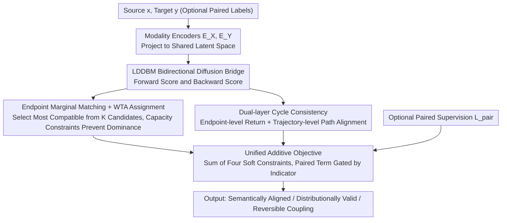

# Structured Diffusion Bridges: Inductive Bias for Denoising Diffusion Bridges

**Conference**: ICML 2026  
**arXiv**: [2605.02973](https://arxiv.org/abs/2605.02973)  
**Code**: None  
**Area**: Diffusion Models / Modality Translation / Image Super-resolution / Unpaired Learning  
**Keywords**: Latent diffusion bridge, Marginal matching, Cycle consistency, Winner-takes-all, Semi-paired training  

## TL;DR
SDB reframes modality translation as "selecting a coupling from the set $\mathcal{P}$ of all couplings satisfying marginal constraints." Built upon LDDBM, it incorporates marginal matching (WTA + capacity constraints) and dual-layer cycle consistency (endpoint and trajectory levels). Paired supervision is treated as an optional heuristic, enabling the model to function under zero, semi, and fully paired budgets. Even under full supervision, it outperforms paired-only baselines (e.g., FFHQ→CelebA-HQ PSNR increases from 25.6 to 25.9).

## Background & Motivation

**Background**: Diffusion bridges (such as DDBM and LDDBM) have emerged as powerful paradigms for distribution translation. LDDBM addresses endpoint dimensional inconsistency via a shared latent space, achieving SOTA results in tasks like image super-resolution and shape↔voxel translation. However, most bridge methods necessitate **full paired supervision**, requiring training samples to be $(x,y)$ pairs like LR-HR or multi-view image-voxel sets.

**Limitations of Prior Work**: Paired data implicitly fulfills three independent constraints: (i) semantic correspondence (correct mapping from source to target), (ii) distributional validity (output aligns with the target marginal), and (iii) geometric consistency (reversibility). Relying solely on a paired loss is suboptimal; even with sufficient data, a model might minimize reconstruction error while deviating from the true manifold. Worse, paired data is scarce or non-existent in many domains (e.g., medical imaging, artistic style transfer), hindering the applicability of bridge methods.

**Key Challenge**: Given only the marginals $p_\mathcal{X}$ and $p_\mathcal{Y}$, the set of feasible joint distributions $\mathcal{P}=\{p(x,y)|p(x)=p_\mathcal{X},p(y)=p_\mathcal{Y}\}$ is **infinite**. Marginal information alone cannot uniquely determine a coupling. Existing methods use paired samples as implicit constraints for the Doob h-transform, which is equivalent to selecting a $p$ through data exhaustion—a process that is both inefficient and fragile.

**Goal**: (i) Explicitly reformulate modality translation as a geometric problem of "selecting a coupling in $\mathcal{P}$"; (ii) Introduce composable structural constraints (marginal matching + cycle consistency) such that paired loss becomes merely one of many heuristics; (iii) Maintain graceful degradation across three paired ratios $\rho\in\{0,0.5,1\}$; (iv) Achieve performance gains even in fully paired settings.

**Key Insight**: Classical unpaired translation (e.g., CycleGAN, CUT) utilizes cycle consistency, while the Schrödinger bridge approach (e.g., UNSB) employs adversarial training and entropy regularization. The authors **transpose these insights to the latent diffusion bridge framework**. This allows them to benefit from the dimension-agnostic convenience of LDDBM while using the intermediate states $z_t$ exposed by the diffusion process to enforce cycle consistency across the **entire trajectory**, not just at the endpoints.

**Core Idea**: The training of a diffusion bridge is reconstructed as a weighted combination of independent heuristics: marginal matching (ensuring the final state lands on the target marginal) + endpoint-level cycle ($y\to x\to\hat y\approx y$) + trajectory-level cycle (aligning latent states of forward and backward trajectories at $t$ and $T-t$) + optional paired supervision.

## Method

### Overall Architecture
SDB addresses how to select a coupling that is semantically aligned, distributionally valid, and geometrically reversible from the infinite set of feasible couplings $\mathcal{P}$ when paired labels are optional. It adopts the bidirectional bridge backbone of LDDBM: modality-specific encoders $E_\mathcal{X}, E_\mathcal{Y}$ map $x, y$ to a shared latent space; the bridge learns forward score $s_{\mathcal{X}\to\mathcal{Y}}(z,t)$ and backward score $s_{\mathcal{Y}\to\mathcal{X}}(z,t)$ in this space. The key modification is that each training step optimizes an additive combination of four independently toggleable geometric constraints. This decomposes the three requirements (correspondence/validity/reversibility) previously burdened by paired data into different heuristics. Consequently, the model functions with pure heuristics when $\rho=0$, while the paired term is simply appended for the paired subset when $\rho>0$.

### Key Designs

**1. Endpoint Marginal Matching + WTA Assignment: Selecting the "Most Compatible" Coupling Without Paired Supervision**

In zero or semi-paired settings, the greatest risk of degradation is "mode mixing," where any $x$ randomly paired with any $y$ could reduce the DSM loss, leading to a blurred coupling. SDB's approach is to independently sample $x\sim p_\mathcal{X}$ and $y\sim p_\mathcal{Y}$. For each target $z_0=E_\mathcal{X}(x)$, it draws $K$ conditional candidates $\{y^{(k)}\}_{k=1}^K\sim p_\mathcal{Y}$ and calculates the denoising score matching loss $\mathcal{L}_{DSM}=\mathbb{E}\|s_\theta(z_t,t|y)-\nabla_{z_t}\log q(z_t|z_0)\|_2^2$ for each. Backpropagation is only performed for the winner $k^\star=\arg\min_k \mathcal{L}_{DSM}(z_0,y^{(k)})$, representing the candidate the bridge currently "explains" best. This is essentially a Winner-Takes-All (WTA) optimization heuristic: it does not guarantee identifiability but picks the locally most compatible pairings to reduce coupling uncertainty, pulling the final state toward the target marginal $p_\mathcal{X}$. To prevent WTA from collapsing into "condition dominance" (where a few low-entropy $y$ samples are repeatedly chosen), a capacity constraint $C_y=2$ is added, limiting how many times each candidate $y^{(i)}$ can be selected within an epoch.

**2. Dual-layer Cycle Consistency: Approximating Reversibility via Endpoints and Trajectories**

Marginal alignment only ensures "landing on the target distribution" but cannot guarantee information reversibility, potentially leading to mode dropping. SDB uses a two-layer cycle consistency. The endpoint level follows the CycleGAN logic: given forward stochastic flow $\Phi_{\mathcal{X}\to\mathcal{Y}}$ and backward $\Phi_{\mathcal{Y}\to\mathcal{X}}$, it constrains the round-trip return to the origin: $\mathcal{L}_{cycle}^{end}=\mathbb{E}\|\hat z_0-z_0\|_2^2$, where $\hat z_0=\Phi_{\mathcal{Y}\to\mathcal{X}}\circ\Phi_{\mathcal{X}\to\mathcal{Y}}(z_0)$. Since the diffusion bridge is a stochastic process, endpoint constraints are insufficient. Thus, trajectory-level consistency is added: forward trajectories $\{z_t^{X\to Y}\}$ and backward trajectories $\{z_{T-t}^{Y\to X}\}$ are paired at corresponding timestamps to minimize $\mathcal{L}_{cycle}^{traj}=\mathbb{E}[w(t)\|z_t^{X\to Y}-z_{T-t}^{Y\to X}\|_2^2]$. The weight $w(t)=1/(\sigma_t^2+\epsilon)$ normalizes scale differences across time. This forces the model to traverse the same "tunnel" in both directions, equivalent to constraining the symmetry of the SDE path—a form of trajectory-level identifiability regularization. In empirical tests, the trajectory term improved unpaired content accuracy from 16% to 87%.

**3. Unified Additive Objective: Downgrading Paired Supervision to One of Four Heuristics**

Finally, the constraints are combined with optional paired supervision into a unified additive objective: $\mathcal{L}_{total}=\mathcal{L}_{DSM}+\lambda_{end}\mathcal{L}_{cycle}^{end}+\lambda_{traj}\mathcal{L}_{cycle}^{traj}+\lambda_{pair}\mathbf{1}_{(x,y)\in\mathcal{D}_{pair}}\mathcal{L}_{pair}$ (Eq. 10). The paired term is gated by the indicator $\mathbf{1}_{(x,y)\in\mathcal{D}_{pair}}$, activating only for the paired subset. All weights $\lambda$ are set to 1 without fine-tuning. Geometrically, this "additive combination + indicator gating" superimposes multiple soft constraints on the feasible coupling set $\mathcal{P}$, gradually compressing it toward the reversible and condition-preserving region. Operationally, the indicator allows the dataloader to treat paired and unpaired samples identically, enabling training under any budget $\rho\in[0,1]$ with graceful degradation.

## Key Experimental Results

### Main Results
FFHQ→CelebA-HQ Super-Resolution (Zero-shot SR, $\rho$ scan):

| Method | $\rho=0$ | $\rho=0.5$ | $\rho=1.0$ |
|---|---|---|---|
| **SDB PSNR↑** | **19.0 ± 0.6** | **25.2 ± 0.3** | **25.9 ± 0.3** |
| DiWa PSNR | n/a | 22.6 ± 0.2 | 23.3 |
| LDDBM PSNR | n/a | 24.9 ± 0.3 | 25.6 ± 0.4 |
| SDB SSIM↑ | 0.54 | 0.68 | 0.69 |
| SDB LPIPS↓ | 0.37 | 0.32 | 0.31 |

Impact of structural constraints on coupling quality on synthetic benchmarks ($\rho=0$):

| Method | SWD ↓ | MMD² ↓ | Content Acc. ↑ | Cycle MSE ↓ |
|---|---|---|---|---|
| Marginal matching only | 0.02021 | $-1.03\times10^{-4}$ | 0.162 | 0.972 |
| + Endpoint cycle | 0.01891 | $-1.69\times10^{-4}$ | 0.662 | 0.831 |
| + Trajectory cycle | 0.01968 | $-1.11\times10^{-4}$ | **0.868** | **0.680** |

### Ablation Study

| Config ($\rho$) | Key Change | Conclusion |
|---|---|---|
| MM only ($\rho=0$) | Content Acc 0.162 | Marginal matching aligns distributions but fails to learn couplings. |
| + Endpoint cycle | Acc 0.662 | Endpoint reversibility significantly restores semantic correspondence. |
| + Trajectory cycle | Acc 0.868 | Trajectory constraints further reduce coupling ambiguity. |
| Paired-only ($\rho=0.5$) | Acc 0.641 | Semi-paired paired loss alone is inferior to SDB's heuristic combination. |
| **SDB Semi-paired ($\rho=0.5$)** | **Acc 0.955** | Heuristics + paired data synergy is most effective. |
| Paired-only ($\rho=1.0$) | Acc 0.887 | Even with full pairs, pure paired loss is inferior to structural constraints. |
| **SDB ($\rho=1.0$)** | **Acc 0.965** | Full pairs + structural constraints together achieve higher performance. |

### Key Findings
- Semi-paired SDB at $\rho=0.5$ matches or exceeds Paired-only performance at $\rho=1.0$, indicating that structural constraints effectively take over tasks previously handled by paired data.
- Even at $\rho=1$, SDB outperforms the pure paired baseline (PSNR 25.9 vs 25.6, Content Acc 0.965 vs 0.887), proving structural constraints are **complementary** rather than redundant.
- At $\rho=0$, the purely heuristic PSNR of 19.0 is meaningful (exceeding random baselines) and marks the first time the LDDBM framework has been trainable in a zero-paired setting.
- In Multi-view→3D Voxel (ShapeNet) experiments, SDB outperforms EDM and LDDBM across $\rho \in \{0.5, 1.0\}$ and remains trainable at $\rho=0$ where baselines fail.

## Highlights & Insights
- **Perspective of Training as a Heuristic Combination**: While previous bridge methods treated the objective as a monolithic goal, SDB decomposes it into four geometrically interpretable constraints. Each ablation corresponds to relaxing a specific type of reversibility.
- **Trajectory-level Cycle Consistency**: Implementing trajectory consistency within a stochastic diffusion framework is stricter than CycleGAN's endpoint cycle. It constrains the **symmetry of the entire SDE path**, representing a brilliant transplantation of reversibility intuitions from OT/Schrödinger bridges into DDBM.
- **WTA + Capacity Constraints**: A lightweight implementation for "selecting couplings without correspondence supervision." It is simpler than adversarial training or InfoNCE and acts as a nearly zero-cost plugin with significant gains in Content Accuracy.
- **Graceful Degradation**: The unified objective works across any paired budget, making SDB a truly practical framework for real-world scenarios where data is often partially paired rather than strictly all-or-nothing.

## Limitations & Future Work
- While $\lambda=1$ is elegant, more difficult high-resolution or 3D tasks might require precise weight tuning; systemic weight studies are missing.
- The number of WTA candidates $K$ and capacity $C_y=2$ are empirical values sensitive to computational budgets; adaptive $K$ is a natural extension.
- Cycle consistency requires synchronous training of bidirectional bridges, doubling parameter counts and training costs.
- Evaluation is limited to mature benchmarks like SR and 3D voxel translation; performance on truly "unaligned semantic" open-domain translation (e.g., sketch↔photo) remains to be verified.
- The connection with Optimal Transport (OT) work could be deepened, such as theorizing the alignment of trajectory cycles with the marginals + cost structure of Schrödinger bridges.

## Related Work & Insights
- **vs LDDBM (Berman 2026)**: The direct baseline; SDB adds structural constraints and makes the paired loss optional.
- **vs DDBM (Zhou 2024)**: DDBM uses Doob h-transform to implicitly constrain the bridge with paired data; SDB makes these constraints **explicit and decomposable**.
- **vs CycleGAN / CUT**: These use deterministic endpoint cycles; SDB generalizes cycles to stochastic diffusion trajectories.
- **vs UNSB (Adversarial Schrödinger bridge)**: UNSB uses GAN training, which is prone to mode collapse; SDB uses score matching and cycles for improved stability.
- **vs LADB**: LADB reduces pairing requirements by reusing pre-trained source latent diffusion; SDB directly adds first-order geometric constraints to the bridge. These paths are orthogonal and composable.

## Rating
- Novelty: ⭐⭐⭐⭐ Generalizing cycle consistency to stochastic trajectories is an elegant innovation; the framework is a well-designed "composition."
- Experimental Thoroughness: ⭐⭐⭐⭐ Three task types + three $\rho$ settings + complete ablation matrix.
- Writing Quality: ⭐⭐⭐⭐⭐ The geometric framing of "translation as coupling selection in $\mathcal{P}$" is exceptionally clear.
- Value: ⭐⭐⭐⭐ Unlocks zero/semi-paired scenarios for LDDBM, providing significant value for domains where paired data is scarce.

<!-- RELATED:START -->

## Related Papers

- [\[CVPR 2026\] Bi-Bridge: Bidirectional Diffusion Bridges for Low-Light Image Enhancement](../../CVPR2026/image_restoration/bi-bridge_bidirectional_diffusion_bridges_for_low-light_image_enhancement.md)
- [\[ICML 2026\] Early Decisions Matter: Proximity Bias and Initial Trajectory Shaping in Non-Autoregressive Diffusion Language Models](early_decisions_matter_proximity_bias_and_initial_trajectory_shaping_in_non-auto.md)
- [\[ICML 2026\] Consistent Diffusion Language Models](consistent_diffusion_language_models.md)
- [\[ICML 2026\] Coevolutionary Continuous Discrete Diffusion: Make Your Diffusion Language Model a Latent Reasoner](coevolutionary_continuous_discrete_diffusion_make_your_diffusion_language_model_.md)
- [\[ICML 2026\] Plan for Speed: Dilated Scheduling for Masked Diffusion Language Models](plan_for_speed_dilated_scheduling_for_masked_diffusion_language_models.md)

<!-- RELATED:END -->
