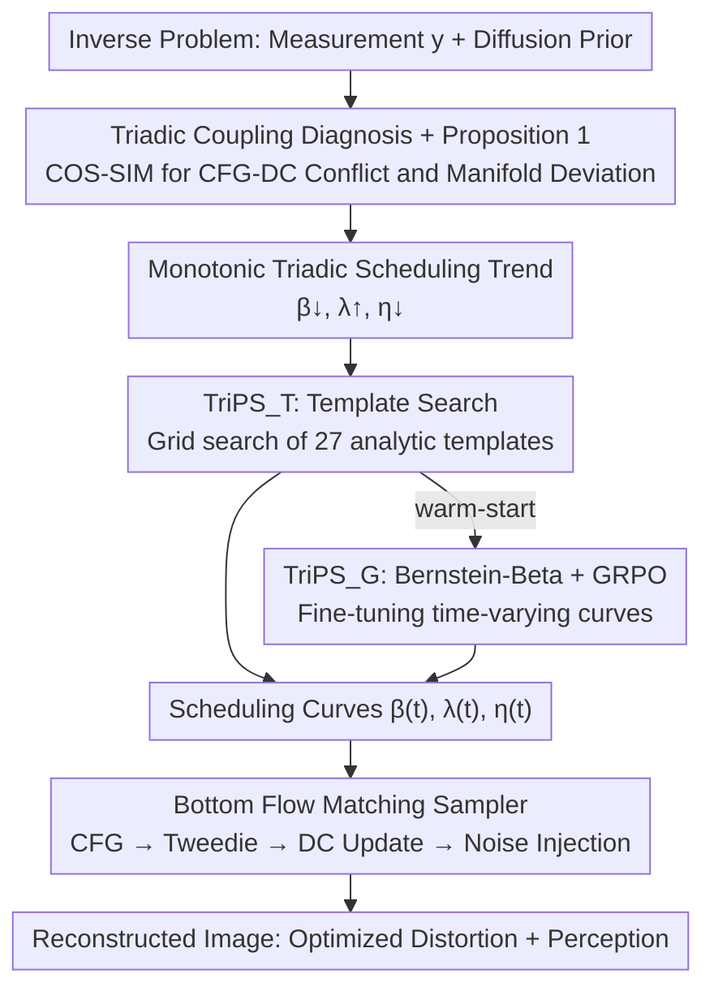

# Triadic Dynamics Aware Diffusion Posterior Sampling for Inverse Problems: Optimizing Guidance and Stochasticity Schedules

**Conference**: ICML 2026  
**arXiv**: [2605.26470](https://arxiv.org/abs/2605.26470)  
**Code**: To be confirmed  
**Area**: Image Restoration / Diffusion Posterior Sampling / Inverse Problems  
**Keywords**: Diffusion Posterior Sampling, CFG Scheduling, Stochasticity Regularization, GRPO, Inverse Problems

## TL;DR
This paper systematically treats the three forces in diffusion posterior sampling—Data Consistency (DC) guidance, Classifier-Free Guidance (CFG), and stochasticity—as a **coupled time-varying triadic system** for the first time. Through theoretical and empirical evidence, it is demonstrated that early CFG conflicts with DC direction while stochasticity pulls the trajectory back to the high-probability manifold. Accordingly, a monotonic triadic scheduling trend of "DC↓, CFG↑, η↓" is proposed. Two methods, "Template Search + GRPO Reinforcement Learning," are utilized to find optimal curves, simultaneously refreshing distortion and perception metrics on super-resolution and deblurring tasks for FFHQ and DIV2K.

## Background & Motivation

**Background**: Diffusion/Flow Matching models have become the mainstream prior for imaging inverse problems (super-resolution, deblurring, inpainting, etc.). A standard posterior sampler performs three actions at each time step: (1) pulling $\hat{x}_{0|t}$ toward the measurement subspace satisfying $y = \mathcal{A}x_0 + n$ using DC guidance; (2) extrapolating the score toward the text-conditioned direction using CFG; and (3) injecting Gaussian noise $\eta(t)\epsilon$ to maintain stochasticity. These forces are controlled by scalars $\beta(t)$, $\lambda(t)$, and $\eta(t)$, respectively.

**Limitations of Prior Work**: Almost all existing works treat these three scalars as **time-invariant constants or only adjust them locally**. FlowChef sets $\lambda(t)=\lambda, \beta(t)=\beta, \eta(t)=0$; PiGDM and Fast Samplers only adjust $\beta(t)$ to prevent over-saturation; ReSample/DDPG/FlowDPS jointly adjust $\beta$ and $\eta$ but leave $\lambda$ untouched. While CFG scheduling has been proven to improve quality in text-to-image generation, it remains largely unexplored in the context of inverse problems.

**Key Challenge**: This work argues that these three forces are **not independently adjustable**; they interfere with each other along the same sampling trajectory. CFG pushes samples toward the semantic manifold, while DC pulls them toward the measurement manifold, creating an inherent directional misalignment. Whether stochasticity can remedy this conflict has not been quantitatively characterized. Consequently, "locally optimal forces $\neq$ globally optimal combined force," leaving significant room for performance gains.

**Goal**: (i) Formulate triadic coupling directional conflicts as computable geometric quantities; (ii) derive a **universal, data-driven validated scheduling trend**; (iii) provide two practical curve optimization frameworks for both "interpretable baselines" and "maximum performance."

**Key Insight**: Posterior sampling is reformulated as a **time-varying optimal control problem**, where the state is $x_t$, the control is $(\beta(t), \lambda(t), \eta(t))$, and the goal is to maximize a composite perception-distortion reward. Once control is time-varying, the coupling between force directions can be observed via first-derivative analysis (Proposition 1) and cosine similarity visualization.

**Core Idea**: In the early high-noise stage, "Strong DC + Weak CFG + Strong Stochasticity" must be used to establish global structure, suppress CFG-DC conflicts, and pull trajectories back into high-probability regions. In the late low-noise stage, "Weak DC + Strong CFG + Weak Stochasticity" should be applied to refine semantics and avoid noise leakage. This is synthesized into a **monotonic triadic scheduling trend**: $\beta(t)\downarrow, \lambda(t)\uparrow, \eta(t)\downarrow$.

## Method

### Overall Architecture
The skeleton of TriPS is a standard Flow Matching posterior sampler (based on SD3.5-M or SD1.5), but it upgrades $\beta, \lambda, \eta$ from constants to learnable/searchable time-varying functions. The algorithm operates in two layers:

1.  **Bottom Sampler**: At each time step, the CFG-augmented velocity field is calculated as $v_t(x_t) = v_\theta(x_t, \varnothing) + \lambda(t)(v_\theta(x_t, c) - v_\theta(x_t, \varnothing))$. The Flow Tweedie formula yields $\hat{x}_{0|t}$ and $\hat{x}_{1|t}$, followed by a DC gradient update $\tilde{x}_{0|t} = \hat{x}_{0|t} - \beta(t)\nabla\mathcal{L}(\mathcal{A}\hat{x}_{0|t}, y)$ (where the DC loss uses a hybrid of Back-Projection and Least-Squares). Finally, stochasticity is injected via $\tilde{x}_{1|t} = \sqrt{1-\eta^2(t)}\hat{x}_{1|t} + \eta(t)\epsilon$, stepping to $x_{t+\Delta t}$ via Euler integration.

2.  **Top Scheduler Optimizer**: Two complementary paradigms generate the $(\beta(t), \lambda(t), \eta(t))$ curves—$\text{TriPS}_\text{T}$ uses an analytic template family for coarse searching, and $\text{TriPS}_\text{G}$ uses GRPO reinforcement learning for fine-tuning, with $\text{TriPS}_\text{T}$ serving as a warm-start for $\text{TriPS}_\text{G}$.

To quantify triadic coupling, the authors define two types of **cosine similarity diagnostic metrics**: $\text{COS-SIM}_1(x_t) = \langle \tilde{b}_\text{dc}, \tilde{b}_\text{cfg}\rangle / (\|\tilde{b}_\text{dc}\|\|\tilde{b}_\text{cfg}\|)$ measures the directional conflict between DC and CFG; $\text{COS-SIM}_2(x_t) = \langle b_\text{det}, \nabla_{x_t}\log p_t(x_t)\rangle / (\cdots)$ measures the alignment between total drift and the unconditional score. Empirical findings show that at $t \simeq 1$, $\text{COS-SIM}_1$ is significantly negative (CFG opposes DC), and larger CFG worsens the conflict, slowing the descent of the residual norm $\mathcal{R}(\hat{x}_{0|t}) = \|y - \mathcal{A}\hat{x}_{0|t}\|^2$. Increasing $\beta$ or $\lambda$ decreases $\text{COS-SIM}_2$ (trajectory deviates from the manifold), while only increasing $\eta$ pulls $\text{COS-SIM}_2$ back to a positive direction. This provides empirical evidence for the "triadic scheduling trend."

### Key Designs

**1. Triadic Coupling Diagnosis + Proposition 1: Transforming "CFG Hinders DC" into a Monitorable Scalar Signal**

Previous works provided empirical schedules without explaining why CFG cannot be fully applied from the start or why noise is needed to "feed" the trajectory back to the manifold. This paper calculates the first derivative of the expected next-step residual norm with respect to the CFG scale: $\partial_{\lambda(t)}\mathbb{E}[\mathcal{R}(\hat{x}_{0|t+\Delta t})|x_t] = -\Delta t\langle\tilde{b}_\text{dc}, \tilde{b}_\text{cfg}\rangle + o(\Delta t)$. When the inner product of DC drift and CFG drift is negative (common in early stages), increasing $\lambda$ actually slows residual reduction, providing rigorous mathematical evidence that "early $\lambda$ must be low." Combined with $\text{COS-SIM}_2$ evidence—where increasing $\beta$ or $\lambda$ deviates the total drift from the score direction, while increasing $\eta$ pulls $b_\text{det}$ back—it further concludes that "early $\eta$ and $\beta$ must be high." Together, these validate the trend $\beta\downarrow, \lambda\uparrow, \eta\downarrow$.

**2. $\text{TriPS}_\text{T}$: Function Template Search for an Interpretable Baseline**

Optimizing three scalars independently at every time step is a high-dimensional problem, and since the sampler is non-differentiable, large-scale numerical optimization is expensive and unstable. $\text{TriPS}_\text{T}$ collapses this problem into low-dimensional template selection. Each curve is chosen from three analytic function families $\mathcal{T} = \{\text{linear, exp, log}\}$, with directions forced to satisfy the triadic monotonic trend. Magnitudes are truncated using $\lambda \in [1, 6], \eta \in [0, 1], \beta \in [\beta_\min^T, \beta_\max^T]$. The search space for each task is reduced to $|\mathcal{T}|^3 = 27$ combinations. Grid search is performed on a small calibration set $\mathcal{D}_\text{cal}$ using a multi-objective utility $\mathcal{U}$ (PSNR and LPIPS): $\tau^\star = \arg\max_\tau \mathcal{U}(\tau; \mathcal{D}_\text{cal})$. The resulting curves naturally fall within valid physical domains and serve as robust baselines and warm-starts for GRPO.

**3. $\text{TriPS}_\text{G}$: Bernstein-Beta Parameterization + GRPO for Extreme Trade-offs**

Since template families cannot capture complex time-varying curves, $\text{TriPS}_\text{G}$ uses $d$-th order Bernstein polynomials $\tilde{s}(t) = \sum_{k=0}^d w_k^{(s)}B_{k,d}(t)$ ($s \in \{\lambda, \beta, \eta\}$) to represent each curve, where coefficients $w_k^{(s)} \sim \text{Beta}(a_k^{(s)}, b_k^{(s)})$. This parameterization ensures exploration is structurally "legal": Beta samples are naturally in $(0, 1)$, and Bernstein bases satisfy the partition of unity, guaranteeing $\tilde{s}(t) \in (0, 1)$. These are then affine-mapped back to $[s_\min, s_\max]$. The policy $\pi_\theta$ with parameters $\theta = \{a_k^{(s)}, b_k^{(s)}\}$ is trained via GRPO: each round samples $G$ sets of coefficients $\{\mathbf{w}_i\}$, runs the full sampler to obtain reconstructed images, and calculates intra-group advantage $\hat{A}_i$ based on a hybrid reward $R = w_\text{dist}R_\text{dist} + w_\text{perc}R_\text{perc}$ (PSNR, LPIPS, CLIP-IQA+, Q-Align). Updates use a PPO-style clipped objective: $\max_\theta\mathbb{E}_i[\min(r_i\hat{A}_i, \text{clip}(r_i, 1\pm\epsilon)\hat{A}_i)] - \beta_\text{KL}D_\text{KL}(\pi_\theta\|\pi_\text{ref})$. GRPO is chosen because it avoids value networks and differentiable samplers, and the reference policy $\pi_\text{ref}$ is initialized with $\text{TriPS}_\text{T}$ results to prevent policy drift.

### Loss & Training
The $\text{TriPS}_\text{T}$ stage involves gradient-free training via grid search on a calibration set. The $\text{TriPS}_\text{G}$ stage uses a weighted sum of PSNR, LPIPS, CLIP-IQA+, and Q-Align as the reward. Hyperparameters such as group size $G$, KL coefficient $\beta_\text{KL}$, and PPO clip $\epsilon$ are provided in Appendix E.2. The reference policy is fixed to the optimal curve from $\text{TriPS}_\text{T}$.

## Key Experimental Results

### Main Results
FFHQ ($768^2$, 1000 images) + DIV2K ($768^2$, 800 images), SD3.5-M backbone, NFE=28, measurement noise $\sigma_n = 0.03$.

| Task / Dataset | Metrics | FlowChef | FlowDPS | FLAIR | $\text{TriPS}_\text{T}$ | $\text{TriPS}_\text{G}$ |
|---|---|---|---|---|---|---|
| FFHQ SR×8 | PSNR↑ / LPIPS↓ | 27.53 / 0.147 | 27.92 / 0.120 | 28.88 / 0.123 | **29.03** / 0.113 | 28.55 / **0.107** |
| FFHQ Motion Deblur | PSNR↑ / FID↓ | 24.88 / 63.48 | 25.15 / 43.18 | 28.80 / 21.57 | **31.20** / 17.28 | **31.20** / **15.89** |
| FFHQ Gaussian Deblur | PSNR↑ / LPIPS↓ | 27.30 / 0.152 | 26.02 / 0.204 | 28.60 / 0.090 | **29.95** / 0.084 | 29.60 / **0.074** |
| DIV2K SR×8 | PSNR↑ / FID↓ | 22.08 / 47.47 | 22.14 / 35.18 | 22.90 / 41.23 | **23.05** / 31.80 | 22.78 / **27.84** |
| DIV2K Motion Deblur | PSNR↑ / LPIPS↓ | 19.62 / 0.366 | 19.88 / 0.322 | 23.90 / 0.129 | **26.29** / 0.066 | 26.19 / **0.066** |

$\text{TriPS}_\text{T}$ generally achieves the strongest distortion metrics, while $\text{TriPS}_\text{G}$ dominates perception metrics. In motion deblurring, PSNR increases over FLAIR by more than 2 dB, and KID/LPIPS are nearly halved.

### Schedule Transfer and Diffusion Backbone Validation
| Setting | Method | PSNR↑ | LPIPS↓ | KID↓ |
|---|---|---|---|---|
| FFHQ Gaussian Deblur (Schedules from SR×8) | FLAIR | 27.74 | 0.109 | 0.012 |
| Same as above | $\text{TriPS}_\text{G}$ on SR×8 | **28.90** | **0.089** | 0.014 |
| FFHQ SR×12 (Cross-degradation transfer) | FLAIR | 27.51 | 0.148 | 0.017 |
| Same as above | $\text{TriPS}_\text{G}$ on SR×8 | **28.80** | **0.099** | **0.012** |

Schedules learned by GRPO outperform baselines on unseen degradation operators, suggesting the triadic trend captures structural patterns weakly correlated with specific $\mathcal{A}$. Consistent advantages were observed using SD1.5 for PSLD/DDPG/P2L/TReg.

### Key Findings
- **Early CFG and DC are Directionally Opposed**: $\text{COS-SIM}_1$ is negative at $t \simeq 1$, worsening with larger $\lambda$. High $\lambda$ causes "tiger-stripe hallucinations" that destroy measurement consistency.
- **Stochasticity as an Early Hidden Regularizer**: While increasing $\beta$ or $\lambda$ deviates the total drift from the manifold, only increasing $\eta$ pulls it back toward the score direction. KID experiments confirm appropriate early noise reduces the gap between generated and real distributions.
- **GRPO is More Aggressive but More Fragile**: Under perception-heavy reward settings, $\text{TriPS}_\text{G}$ wins overall, but PSNR is sometimes lower than $\text{TriPS}_\text{T}$, indicating RL exploration prioritizes reward-dominant directions. Bernstein-Beta + KL constraints prevent it from exiting physical feasibility.

## Highlights & Insights
- **From Parameter Tuning to Trajectory Control**: The paradigm shift to viewing posterior sampling as a time-varying optimal control problem means triadic monotonic trends are nearly inevitable once coupling is explicitly modeled. This can migrate to any diffusion control scenario with multiple guidance forces (e.g., RLHF alignment, controllable generation).
- **Bernstein-Beta as an Elegant RL Constraint**: Embedding the feasibility domain into the parameterization via partition of unity and bounded distributions is more stable than using KL penalties alone.
- **Diagnosis-First Methodology**: Defining quantifiable diagnostics ($\text{COS-SIM}_1$ for conflict, $\text{COS-SIM}_2$ for manifold deviation) before deriving trends and optimization frameworks is more convincing than pure black-box NAS/RL searching.

## Limitations & Future Work
- The "hard monotonicity" constraint ($\beta\downarrow, \lambda\uparrow, \eta\downarrow$) might not be optimal for extreme degradations (strong non-linearity, extreme lighting).
- $\text{TriPS}_\text{G}$ requires running the full sampler multiple times for rewards; training costs scale linearly with group size $G$ and NFE.
- Sensitivity of CFG scheduling to prompt quality (e.g., FFHQ "A high quality photo of a face") was not fully analyzed, which may affect reproducibility in real-world scenes.
- Robustness across data domains (Natural images $\rightarrow$ Medical/Satellite) remains to be investigated.

## Related Work & Insights
- **vs. FlowChef / FlowDPS**: Unlike these works that treat scalars as constants, this study systematizes time-varying control, identifying "Low CFG + High Stochasticity" in early stages as the primary performance driver.
- **vs. FLAIR**: While $\text{TriPS}_\text{T}$ matches FLAIR in PSNR, $\text{TriPS}_\text{G}$ significantly outperforms it in perception metrics (LPIPS/FID/KID) due to non-trivial time-varying curves.
- **vs. Limited Interval CFG**: Similar to findings in pure generation that CFG is only useful in middle intervals, this work migrates the concept to inverse problems with geometric explanations regarding DC coupling.
- **vs. Restart Sampling / DDPM Stochasticity**: While others view stochasticity as a perturbation for "restarting," this work defines it as an "early manifold pullback" mechanism.

## Rating
- Novelty: ⭐⭐⭐⭐ First to model three scalars as a time-varying coupled system; analytical interpretation of CFG-DC conflict and stochasticity regularization is original.
- Experimental Thoroughness: ⭐⭐⭐⭐ Covers various tasks (SR/Deblur), backbones (Flow/Diffusion), and cross-degradation transfer, though mostly on faces/fixed resolutions.
- Writing Quality: ⭐⭐⭐⭐ Clear narrative driven by diagnostic metrics; Proposition 1 provides mathematical support for intuition.
- Value: ⭐⭐⭐⭐ High engineering value; the Triadic Trend + Bernstein-Beta + GRPO combo is directly applicable to other diffusion sampling problems.

<!-- RELATED:START -->

## Related Papers

- [\[ICML 2026\] Learning Normalized Energy Models for Linear Inverse Problems](learning_normalized_energy_models_for_linear_inverse_problems.md)
- [\[CVPR 2026\] Outlier-Robust Diffusion Solvers for Inverse Problems](../../CVPR2026/image_restoration/outlier-robust_diffusion_solvers_for_inverse_problems.md)
- [\[CVPR 2026\] GSNR: Graph Smooth Null-Space Representation for Inverse Problems](../../CVPR2026/image_restoration/gsnr_graph_smooth_null_space_representation_for_inverse_problems.md)
- [\[CVPR 2026\] Variational Garrote for Sparse Inverse Problems](../../CVPR2026/image_restoration/variational_garrote_for_sparse_inverse_problems.md)
- [\[CVPR 2026\] PnP-CM: Consistency Models as Plug-and-Play Priors for Inverse Problems](../../CVPR2026/image_restoration/pnp-cm_consistency_models_as_plug-and-play_priors_for_inverse_problems.md)

<!-- RELATED:END -->
