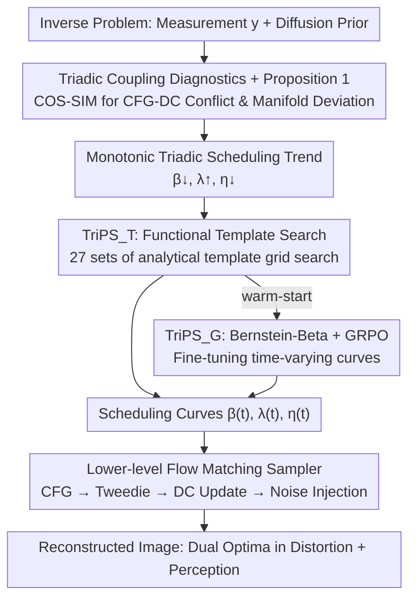

# Triadic Dynamics Aware Diffusion Posterior Sampling for Inverse Problems: Optimizing Guidance and Stochasticity Schedules

**Conference**: ICML 2026  
**arXiv**: [2605.26470](https://arxiv.org/abs/2605.26470)  
**Code**: TBD  
**Area**: Image Restoration / Diffusion Posterior Sampling / Inverse Problems  
**Keywords**: Diffusion Posterior Sampling, CFG Scheduling, Stochasticity Regularization, GRPO, Inverse Problems

## TL;DR
This paper systematically treats the three forces long considered constants in diffusion posterior sampling—Data Consistency (DC) guidance, Classifier-Free Guidance (CFG), and stochasticity—as a **coupled time-varying triadic system** for the first time. It provides theoretical and empirical proof that early-stage CFG conflicts with DC directions, while stochasticity pulls trajectories back toward high-probability manifolds. Based on this, it proposes a monotonic triadic scheduling trend of "DC↓, CFG↑, η↓" and utilizes "Template Search + GRPO Reinforcement Learning" to find optimal curves, simultaneously refreshing distortion and perceptual metrics in super-resolution and deblurring on FFHQ and DIV2K.

## Background & Motivation

**Background**: Diffusion/Flow Matching models have become mainstream priors for imaging inverse problems (super-resolution, deblurring, inpainting, etc.). A standard posterior sampler performs three actions at each timestep: (1) pulling $\hat{x}_{0|t}$ toward the measurement subspace satisfying $y=\mathcal{A}x_0+n$ using DC guidance; (2) extrapolating the score toward the text-conditioned direction using CFG; and (3) injecting Gaussian noise $\eta(t)\epsilon$ to maintain stochasticity. These forces are controlled by scalars $\beta(t)$, $\lambda(t)$, and $\eta(t)$, respectively.

**Limitations of Prior Work**: Almost all existing works treat these three scalars as **time-independent constants or only adjust them locally**. FlowChef sets $\lambda(t)=\lambda, \beta(t)=\beta, \eta(t)=0$; PiGDM and Fast Samplers only adjust $\beta(t)$ to prevent over-saturation; ReSample/DDPG/FlowDPS jointly adjust $\beta, \eta$ but ignore $\lambda$. While adjusting CFG over time has been proven to improve quality in text-to-image generation, it remains largely unexplored in the context of inverse problems.

**Key Challenge**: The authors argue that these three forces are **not independently tunable**; they interfere with each other along the same sampling trajectory. CFG attempts to push samples toward the semantic manifold, while DC pulls them toward the measurement manifold—directions that are inherently inconsistent. The extent to which stochasticity can remedy this conflict has not been quantitatively characterized previously. Consequently, "optimal individual forces" do not equate to "optimal collective forces," leaving significant performance gaps.

**Goal**: (i) Formulate the directional conflict of triadic coupling as computable geometric quantities; (ii) derive a **universal, data-driven validated scheduling trend**; (iii) provide two practical curve optimization frameworks covering both "interpretable baseline" and "performance maximization" needs.

**Key Insight**: Rewrite posterior sampling as a **time-varying optimal control problem**, where the state is $x_t$, the control is $(\beta(t), \lambda(t), \eta(t))$, and the objective is to maximize a composite perception-distortion reward. Once the control is time-varying, one can use first-order derivative analysis (Proposition 1) and cosine similarity visualization to observe the coupling between the three forces.

**Core Idea**: In the early high-noise stages, "Strong DC + Weak CFG + Strong Stochasticity" must be used to establish global structure, suppress CFG-DC conflicts, and pull trajectories back to high-probability regions. In the late low-noise stages, "Weak DC + Strong CFG + Weak Stochasticity" should be used to refine semantics and avoid noise leakage. This condenses into the **monotonic triadic scheduling trend**: $\beta(t)\downarrow, \lambda(t)\uparrow, \eta(t)\downarrow$.

## Method

### Overall Architecture
The backbone of TriPS is a standard Flow Matching posterior sampler (based on SD3.5-M or SD1.5), but it promotes $\beta, \lambda, \eta$ from constants to learnable/searchable time-varying functions. The algorithm operates on two levels:

1. **Lower-level Sampler**: At each timestep, calculate the CFG-enhanced velocity field via $v_t(x_t)=v_\theta(x_t,\varnothing)+\lambda(t)(v_\theta(x_t,c)-v_\theta(x_t,\varnothing))$, obtain $\hat{x}_{0|t}$ and $\hat{x}_{1|t}$ using the Flow Tweedie formula, perform a DC gradient update $\tilde{x}_{0|t}=\hat{x}_{0|t}-\beta(t)\nabla\mathcal{L}(\mathcal{A}\hat{x}_{0|t},y)$ (where DC loss uses a hybrid of Back-Projection and Least-Squares), and finally inject stochasticity $\tilde{x}_{1|t}=\sqrt{1-\eta^2(t)}\hat{x}_{1|t}+\eta(t)\epsilon$, stepping to $x_{t+\Delta t}$ via Euler integration.

2. **Upper-level Scheduler Optimizer**: Two complementary paradigms generate $(\beta(t), \lambda(t), \eta(t))$ curves: $\text{TriPS}_\text{T}$ uses analytical template families for coarse search, while $\text{TriPS}_\text{G}$ uses GRPO reinforcement learning for fine-tuning, with $\text{TriPS}_\text{T}$ serving as a warm-start for $\text{TriPS}_\text{G}$.

To quantify triadic coupling, the authors define two types of **cosine similarity visualization diagnostic quantities**: $\text{COS-SIM}_1(x_t)=\langle \tilde{b}_\text{dc},\tilde{b}_\text{cfg}\rangle/(\|\tilde{b}_\text{dc}\|\|\tilde{b}_\text{cfg}\|)$ measures the directional conflict between DC and CFG; $\text{COS-SIM}_2(x_t)=\langle b_\text{det},\nabla_{x_t}\log p_t(x_t)\rangle/(\cdots)$ measures the alignment between total drift and the unconditional score. Empirical findings show that at early stages $t\simeq 1$, $\text{COS-SIM}_1$ is significantly negative (CFG opposes DC); larger CFG leads to more severe conflict and slower reduction of the residual norm $\mathcal{R}(\hat{x}_{0|t})=\|y-\mathcal{A}\hat{x}_{0|t}\|^2$. While increasing $\beta$ or $\lambda$ decreases $\text{COS-SIM}_2$ (trajectory deviates from the manifold), only increasing $\eta$ pulls $\text{COS-SIM}_2$ back to a positive direction. This provides the empirical basis for the "triadic scheduling trend."

### Key Designs

**1. Triadic Coupling Diagnostics + Proposition 1: Turning "CFG Hinders DC" into a Monitorable Scalar Signal**

Previous works provided empirical schedules without explaining why CFG cannot be fully activated from the start or why noise is needed to "feed" the trajectory back to the manifold. This work takes the first-order derivative of the expected next-step residual norm with respect to the CFG scale, yielding $\partial_{\lambda(t)}\mathbb{E}[\mathcal{R}(\hat{x}_{0|t+\Delta t})|x_t]=-\Delta t\langle\tilde{b}_\text{dc},\tilde{b}_\text{cfg}\rangle+o(\Delta t)$: when the dot product of DC drift and CFG drift is negative (common in early stages), increasing $\lambda$ slows down residual reduction, providing hard mathematical evidence that "early $\lambda$ must be low." Combined with $\text{COS-SIM}_2$ empirical results—where increasing $\beta$ or $\lambda$ deviates the total drift from the score direction, but only increasing $\eta$ restores it—this further suggests that "early $\eta$ and $\beta$ must be high." These conclusions together validate the triadic trend $\beta\downarrow, \lambda\uparrow, \eta\downarrow$ through both mathematics (Proposition 1) and geometry (cosine similarity).

**2. $\text{TriPS}_\text{T}$: Functional Template Search, Producing Interpretable Baselines with Minimal Degrees of Freedom**

Independently tuning three scalars at each timestep is a high-dimensional optimization, and since the sampler lacks gradients, large-scale numerical optimization is costly and unstable. $\text{TriPS}_\text{T}$ collapses this into low-dimensional template selection: each curve is chosen from three analytical function families $\mathcal{T}=\{\text{linear, exp, log}\}$, with directions forced to satisfy the triadic monotonic trend and amplitudes truncated within $\lambda\in[1,6], \eta\in[0,1], \beta\in[\beta_\min^T,\beta_\max^T]$. Consequently, the search space per task is reduced to $|\mathcal{T}|^3=27$ combinations (plus small amplitude grids). Grid search is performed on a small calibration set $\mathcal{D}_\text{cal}$ using a multi-objective utility $\mathcal{U}$ composed of PSNR and LPIPS, taking $\tau^\star=\arg\max_\tau\mathcal{U}(\tau;\mathcal{D}_\text{cal})$. The resulting curves naturally lie within the physically feasible region, serving as robust, interpretable baselines and as a warm-start for $\text{TriPS}_\text{G}$.

**3. $\text{TriPS}_\text{G}$: Bernstein-Beta Parameterization + GRPO, Pushing Trade-offs to the Limit**

Since template families cannot capture more complex time-varying curves, $\text{TriPS}_\text{G}$ uses $d$-degree Bernstein polynomials $\tilde{s}(t)=\sum_{k=0}^d w_k^{(s)}B_{k,d}(t)$ ($s\in\{\lambda, \beta, \eta\}$), where coefficients $w_k^{(s)}\sim\text{Beta}(a_k^{(s)},b_k^{(s)})$. The elegance of this parameterization lies in embedding "legal exploration" into the structure itself: Beta samples naturally fall within $(0,1)$, and Bernstein bases satisfy the partition of unity, ensuring $\tilde{s}(t)$ remains in $(0,1)$ before affine mapping back to $[s_\min, s_\max]$. This prevents RL policies from exceeding boundaries by design. The policy parameters $\theta=\{a_k^{(s)},b_k^{(s)}\}$ are trained using GRPO: in each round, $G$ groups of coefficients $\{\mathbf{w}_i\}$ are sampled, reconstruct images via the sampler, and compute advantage $\hat{A}_i$ using a mixed reward $R=w_\text{dist}R_\text{dist}+w_\text{perc}R_\text{perc}$ (PSNR, LPIPS, CLIP-IQA+, Q-Align). Updates follow a PPO-style clipped objective: $\max_\theta\mathbb{E}_i[\min(r_i\hat{A}_i,\text{clip}(r_i,1\pm\epsilon)\hat{A}_i)]-\beta_\text{KL}D_\text{KL}(\pi_\theta\|\pi_\text{ref})$. GRPO is chosen because it requires neither a value network nor a differentiable sampler, perfectly suiting cases where rewards require full sampling runs.

### Loss & Training
$\text{TriPS}_\text{T}$ is gradient-free, using only grid search on a calibration set. $\text{TriPS}_\text{G}$ uses a weighted sum of PSNR, LPIPS, CLIP-IQA+, and Q-Align as the reward. Hyperparameters like group size $G$, KL coefficient $\beta_\text{KL}$, and PPO clip $\epsilon$ are provided in Appendix E.2. The reference policy is fixed to the optimal curves from $\text{TriPS}_\text{T}$ to provide a warm-start and limit policy drift.

## Key Experimental Results

### Main Results
FFHQ ($768^2$, 1000 images) + DIV2K ($768^2$, 800 images), backbone SD3.5-M, NFE=28, measurement noise $\sigma_n=0.03$.

| Task / Dataset | Metrics | FlowChef | FlowDPS | FLAIR | $\text{TriPS}_\text{T}$ | $\text{TriPS}_\text{G}$ |
|---|---|---|---|---|---|---|
| FFHQ SR×8 | PSNR↑ / LPIPS↓ | 27.53 / 0.147 | 27.92 / 0.120 | 28.88 / 0.123 | **29.03** / 0.113 | 28.55 / **0.107** |
| FFHQ Motion Deblur | PSNR↑ / FID↓ | 24.88 / 63.48 | 25.15 / 43.18 | 28.80 / 21.57 | **31.20** / 17.28 | **31.20** / **15.89** |
| FFHQ Gaussian Deblur | PSNR↑ / LPIPS↓ | 27.30 / 0.152 | 26.02 / 0.204 | 28.60 / 0.090 | **29.95** / 0.084 | 29.60 / **0.074** |
| DIV2K SR×8 | PSNR↑ / FID↓ | 22.08 / 47.47 | 22.14 / 35.18 | 22.90 / 41.23 | **23.05** / 31.80 | 22.78 / **27.84** |
| DIV2K Motion Deblur | PSNR↑ / LPIPS↓ | 19.62 / 0.366 | 19.88 / 0.322 | 23.90 / 0.129 | **26.29** / 0.066 | 26.19 / **0.066** |

$\text{TriPS}_\text{T}$ generally excels in distortion metrics, while $\text{TriPS}_\text{G}$ excels in perceptual metrics; in motion deblurring, PSNR improves by over 2 dB compared to FLAIR, with KID/LPIPS nearly halved.

### Scheduling Transfer and Diffusion Backbone Validation

| Setup | Method | PSNR↑ | LPIPS↓ | KID↓ |
|---|---|---|---|---|
| FFHQ Gaussian Deblur (Transfer schedule from SR×8) | FLAIR | 27.74 | 0.109 | 0.012 |
| Same as above | $\text{TriPS}_\text{G}$ on SR×8 | **28.90** | **0.089** | 0.014 |
| FFHQ SR×12 (Cross-degradation transfer) | FLAIR | 27.51 | 0.148 | 0.017 |
| Same as above | $\text{TriPS}_\text{G}$ on SR×8 | **28.80** | **0.099** | **0.012** |

Schedules learned by GRPO remain superior to baselines on unseen degradation operators, suggesting the triadic trend captures structural patterns weakly correlated with specific $\mathcal{A}$. Table 3 shows consistent advantages across PSLD/DDPG/P2L/TReg on SD1.5.

### Key Findings
- **Early CFG and DC are Directionally Opposed**: $\text{COS-SIM}_1$ in Figure 1 is negative at $t\simeq 1$; higher $\lambda$ increases this negativity. High $\lambda$ directly produces "tiger stripe hallucinations" that destroy measurement consistency, for which Proposition 1 provides an analytical explanation.
- **Stochasticity as an Early Hidden Regularizer**: Figure 2 shows that raising $\beta$ or $\lambda$ monotonically decreases $\text{COS-SIM}_2$ (moving away from the manifold), while only raising $\eta$ stabilizes total drift back toward the score direction. KID experiments also prove that appropriate early noise reduces the gap between generated and real distributions.
- **GRPO is More Powerful but Brittle**: $\text{TriPS}_\text{G}$ wins on perceptual metrics but sometimes lags behind $\text{TriPS}_\text{T}$ in PSNR, reflecting RL exploration bias toward reward-dominant directions. Bernstein-Beta + KL constraints ensure it stays within the physically feasible region.

## Highlights & Insights
- **From "Tuning a Parameter" to "Controlling a Trajectory"**: The major shift is viewing posterior sampling as time-varying optimal control.显式建模 the coupling of CFG, DC, and stochasticity makes the monotonic triadic trend a near-inevitable conclusion—a concept transferable to any diffusion control scenario with multiple guidance forces.
- **Bernstein-Beta Parameterization for Stable RL**: Using partition of unity and bounded distributions embeds feasibility constraints into the architecture, which is more stable than penalty terms or KL constraints alone.
- **Diagnostics-First Methodology**: Defining computable diagnostics ($\text{COS-SIM}_1$ for conflict, $\text{COS-SIM}_2$ for manifold deviation) to derive laws before engineering optimization is more convincing and reproducible than direct NAS/RL search.

## Limitations & Future Work
- The "Hard Monotonicity" constraint ( $\beta\downarrow, \lambda\uparrow, \eta\downarrow$ ) may not be optimal for extreme degradations (strong nonlinearity, extreme lighting).
- High training cost for $\text{TriPS}_\text{G}$ due to repeated full sampling; costs might explode with larger models or higher resolutions.
- Sensitivity to prompt quality was not fully analyzed, which might affect reproducibility in real-world scenarios.
- Robustness across diverse data domains (medical, satellite images) remains to be investigated.

## Related Work & Insights
- **vs FlowChef / FlowDPS**: They treat $\beta, \lambda, \eta$ as constants; this work systematizes them as time-varying controls, with performance gains mainly from the early "Low CFG + High Stochasticity" combination.
- **vs FLAIR**: $\text{TriPS}_\text{T}$ is close in PSNR, but $\text{TriPS}_\text{G}$ significantly outperforms in perceptual metrics (LPIPS/FID/KID) due to non-trivial time-varying curves.
- **vs Limited Interval CFG (Generation Tasks)**: Extends "Interval CFG" from generation to inverse problems with geometric explanations modeling the coupling with DC.
- **vs Restart Sampling / DDPM Stochasticity Study**: Reinterprets stochasticity as an "early manifold restorer" rather than just a perturbation source, consistent with KID results.

## Rating
- Novelty: ⭐⭐⭐⭐ First explicit modeling of triadic scalars as a time-varying coupled system; analytical derivative proof for CFG-DC conflict is highly original.
- Experimental Thoroughness: ⭐⭐⭐⭐ Broad coverage of tasks and backbones; cross-degradation transfer experiments are well-executed.
- Writing Quality: ⭐⭐⭐⭐ Clear narrative supported by mathematical intuition (Proposition 1).
- Value: ⭐⭐⭐⭐ The combination of triadic trends, Bernstein-Beta, and GRPO is highly practical for other diffusion-based control problems.

<!-- RELATED:START -->

<!-- RELATED:END -->

## Related Papers

- [\[CVPR 2026\] Dual Ascent Diffusion for Inverse Problems](../../CVPR2026/image_restoration/dual_ascent_diffusion_for_inverse_problems.md)
- [\[ICLR 2026\] A Statistical Benchmark for Diffusion-Posterior-Sampling Algorithms](../../ICLR2026/image_restoration/a_statistical_benchmark_for_diffusion-posterior-sampling_algorithms.md)
- [\[ICML 2026\] Learning Normalized Energy Models for Linear Inverse Problems](learning_normalized_energy_models_for_linear_inverse_problems.md)
- [\[CVPR 2026\] Outlier-Robust Diffusion Solvers for Inverse Problems](../../CVPR2026/image_restoration/outlier-robust_diffusion_solvers_for_inverse_problems.md)
- [\[CVPR 2026\] GSNR: Graph Smooth Null-Space Representation for Inverse Problems](../../CVPR2026/image_restoration/gsnr_graph_smooth_null_space_representation_for_inverse_problems.md)

<!-- RELATED:END -->
