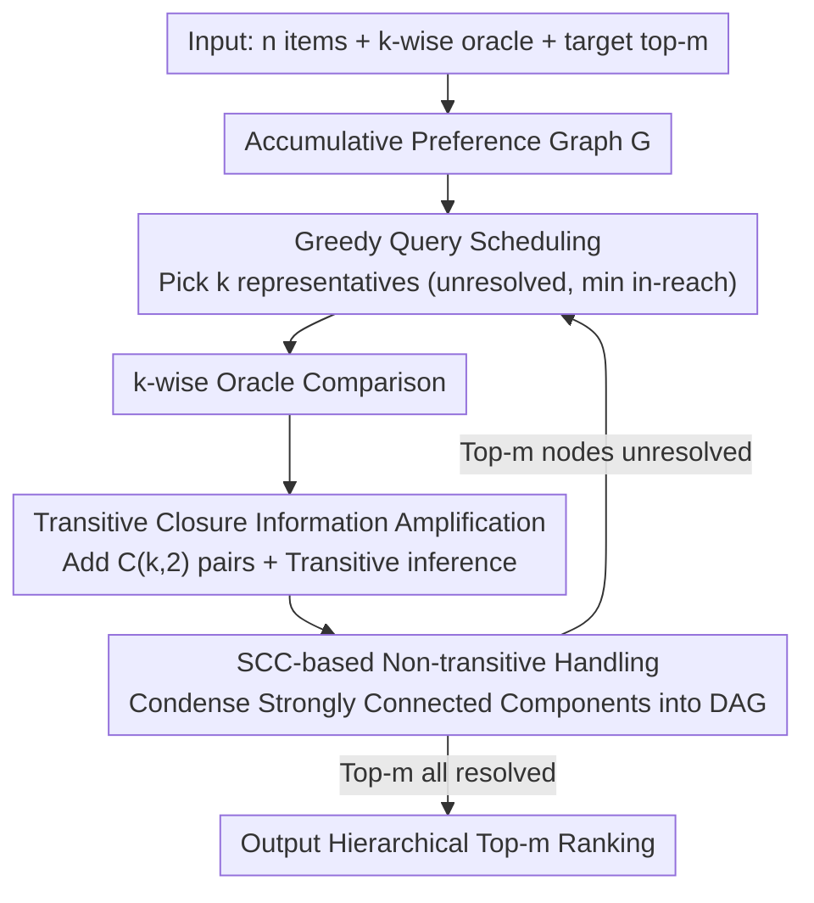

# BlitzRank: Principled Zero-shot Ranking Agents with Tournament Graphs

**Conference**: ICML2026 Spotlight  
**arXiv**: [2602.05448](https://arxiv.org/abs/2602.05448)  
**Code**: https://github.com/ContextualAI/BlitzRank  
**Area**: Information Retrieval  
**Keywords**: Tournament Graphs, k-wise ranking, Zero-shot reranking, Strongly Connected Components, Document reranking  

## TL;DR
The paper proposes BlitzRank, a zero-shot reranking framework based on tournament graphs. By accumulating $\binom{k}{2}$ preference pairs generated by each $k$-wise comparison into a global preference graph and utilizing transitive closure to infer additional ranking relationships, it achieves Pareto optimality across 14 benchmarks and 5 LLM oracles—matching or exceeding the accuracy of existing methods while reducing token consumption by 25–40%.

## Background & Motivation

**Background**: LLM reranking is a core component of retrieve-then-rerank pipelines. Existing methods are categorized into three types: pointwise (scoring documents individually), pairwise (aggregating results after binary comparisons), and listwise (processing multiple documents at once via sliding windows). Sliding Window / RankGPT are representative listwise methods, TourRank employs a tournament elimination format, and Setwise prompts LLMs to select the best from $k$ candidates.

**Limitations of Prior Work**: These methods suffer from significant waste in utilizing comparison information. Pairwise requires $O(n \log n)$ calls to obtain sufficient preferences; Setwise extracts only the winner despite seeing $k$ documents, discarding the remaining $\binom{k}{2} - (k-1)$ preference relationships; Sliding Window uses a fixed step size where information propagation depends on window overlap, lacking a mechanism to determine when the top-$m$ items are sufficiently certain.

**Key Challenge**: Each $k$-wise comparison inherently contains a complete local tournament of $\binom{k}{2}$ preference relationships. However, existing methods either extract only the winner (Setwise/TourRank) or depend on fixed traversal orders (Sliding Window), failing to systematically accumulate and propagate these comparison results. Furthermore, LLM judgments often produce non-transitive preferences ($A \succ B \succ C \succ A$), which existing methods treat as noise rather than exploitable structural information.

**Goal**: (1) Design a framework to extract full tournaments from each $k$-wise comparison and maximize information utility via transitive closure; (2) Provide provably correct termination conditions—stopping when the top-$m$ items are "resolved"; (3) Gracefully handle non-transitive preferences to output hierarchical rankings.

**Key Insight**: The authors draw inspiration from the classic "25 horses racing" puzzle—finding the fastest 3 horses out of 25 with 5 horses per race requires only 7 races. The key insight is that each race does not just produce a winner but reveals $\binom{5}{2}=10$ preference pairs. By accumulating these preferences and performing transitive inference, the top-$m$ can be determined with far fewer comparisons than elimination-based systems.

**Core Idea**: BlitzRank models $k$-wise comparisons as subgraph queries on a tournament graph. It amplifies the information gain of each query through transitive closure and uses the "resolved" status of nodes (where the preference relationship with all other nodes is determined) as the stopping criterion. For non-transitive cases, it produces hierarchical rankings via Strongly Connected Component (SCC) decomposition.

## Method

### Overall Architecture
BlitzRank treats zero-shot reranking as a subgraph query problem on a tournament graph. Given $n$ items, a $k$-wise comparison oracle, and a target top-$m$, it maintains an accumulating preference graph $G=(V,E)$ that grows with each query. Each round follows a closed-loop process: "select $k$ candidates for query → add all $\binom{k}{2}$ preferences and transitive inferences to the graph → check if the top-$m$ are determined" until the top-$m$ are provably certain. The core shift is moving away from discarding losers or relying on fixed window overlaps to consuming all $\binom{k}{2}$ relationships and letting transitive closure "free" additional inferences.

### Key Designs

**1. Transitive Closure Information Amplification: Every edge drives a wave of inference**

The waste in prior methods stems from using only local results. BlitzRank treats every $k$-wise comparison as a full local tournament. After adding $\binom{k}{2}$ edges, it computes the transitive closure, allowing existing paths to automatically combine into new preferences without further oracle calls. To quantify information completeness, it defines in-reach $R_G^-(v)=\{u:u\leadsto_G v\}$ and out-reach $R_G^+(v)=\{u:v\leadsto_G u\}$ for each node $v$. The known relationship set is $K_G(v)=R_G^-(v)\cup R_G^+(v)$. A node $v$ is "resolved" when $\kappa_G(v)=|K_G(v)|=n-1$. The algorithm terminates once the top-$m$ items are all resolved.

**2. SCC-based Non-transitive Handling: Cycles as Hierarchies, Not Noise**

LLM judgments often exhibit non-transitivity ($A\succ B\succ C\succ A$). BlitzRank treats these as meaningful structures by finding Strongly Connected Components (SCC) in the graph $G$. Nodes within the same SCC are mutually reachable, indicating the oracle cannot consistently distinguish them; thus, they are grouped into the same "tier." Condensing these SCCs into super-nodes yields a DAG. For tournament graphs, this condensation is a transitive tournament, naturally providing a total order between tiers. When all SCCs are singletons, the result reverts to a standard total order. This is empirically justified: the BM25 score standard deviation within an SCC is ~40% lower than between neighbors, confirming cycles capture "truly similar" documents.

**3. Greedy Query Scheduling: Guaranteed Progress Each Round**

The selection of $k$ candidates per round determines convergence speed. BlitzRank selects nodes from the condensation graph $[G]$: it takes SCCs containing unresolved nodes with the minimum condensation in-reach. If in-reach is tied, it prioritizes SCCs with smaller out-reach (highest uncertainty) and selects representatives with the smallest $\kappa_G$. Due to the "forced-tie" property (no edges exist between SCCs with the same in-reach), querying these representatives is guaranteed to discover new edges. This ensures the algorithm terminates in at most $\binom{n}{2}$ rounds. The final output ranks items based on their in-reach.

### A Walkthrough Example
Consider the "25 horses" puzzle. Instead of traditional elimination, BlitzRank notes that each race of 5 horses reveals $\binom{5}{2}=10$ pairs. After an initial round of random groupings, all preferences are added to the graph and the transitive closure is computed, automatically inferring many "who is faster than whom" relations. In subsequent rounds, the scheduler selects candidates most likely to be in the top-$m$ that remain unresolved. When the top-3 nodes reach $\kappa_G = n-1$, the algorithm stops. This reaches the solution in significantly fewer oracle calls than traditional methods.

## Key Experimental Results

### Main Results

Evaluated on 14 datasets (6 TREC DL + 8 BEIR), reranking top-100 BM25 results using 5 LLM oracles for $m=10$.

| Method | nDCG@10 | Tokens/query | Relative Cost |
|------|---------|-------------|---------|
| BM25 (No rerank) | 41.1 | 0 | — |
| Pairwise | 57.0 | 324k | 8.1× |
| Setwise | 56.6 | 115k | 2.9× |
| TourRank | 56.0 | 57k | 1.4× |
| SW (Sliding Window) | 56.7 | 54k | 1.4× |
| AcuRank | 56.3 | 69k | 1.7× |
| AcuRank-H | 56.6 | 127k | 3.2× |
| **Blitz-k20** | **56.4** | **40k** | **1.0×** |
| **Blitz-k10** | **56.9** | **42k** | **1.1×** |

(Macro average across 14 datasets × 2 oracles: GPT-4.1 & Gemini-3-Flash)

### Window Size and Sliding Window Comparison

| Method | $k$ | DL19 | DL20 |
|------|-----|------|------|
| Sliding Window | 20 | 74.0 | 70.8 |
| Sliding Window | 10 | 56.4 | 53.2 |
| BlitzRank | 20 | 74.6 | 70.7 |
| BlitzRank | 10 | 73.6 | 72.4 |

Sliding Window quality collapses at $k=10$ (DL19: 74.0→56.4) because its step size of 5 fails to propagate information across the top-10. BlitzRank remains robust at $k=10$ because its correctness is governed by the resolved node criterion rather than window coverage.

### Ablation Study: SCC Analysis

| Configuration | Intra-SCC BM25 Std Dev | Neighbor Std Dev | Ratio |
|------|-------------------|-----------|------|
| $k=10$ | 0.605 | 1.032 | 0.59 |
| $k=20$ | 0.695 | 1.125 | 0.62 |

The BM25 variance within SCCs is ~40% lower than neighboring documents, verifying that cyclic preferences capture "actually similar" documents rather than random noise. Smaller $k$ results in smaller SCCs with lower internal variance, indicating finer-grained comparisons resolve easier ambiguities.

## Highlights & Insights
- **Information Theoretic Perspective**: Generalizes the 25-horse puzzle into a framework where the core insight is that comparison info-gain is far greater than just selecting a winner.
- **Theoretical Completeness**: Proves algorithm correctness (in-reach of a resolved node equals its true rank) and termination (at least one new edge per round).
- **Predictable Convergence**: At $k=10$, it consistently stabilizes within 12–15 rounds, facilitating cost estimation.
- **Variable Windows**: The framework naturally supports rounds with different $k$, allowing adaptation to heterogeneous document lengths.

## Limitations & Future Work
- The framework assumes a deterministic oracle, while LLMs are stochastic; noise is currently handled only indirectly via SCCs.
- Tight query complexity bounds for $m > 1$ remain an open conjecture ($O((n-1)/(k-1) + (m-1)/(k-1) \cdot \log_k m)$).
- High-quality $k$-wise comparison needs verification in other domains like crowdsourced labeling or human evaluation.

## Related Work & Insights
- **RankGPT / Sliding Window** (Sun et al., 2023): Fixed sliding windows; propagation depends on overlaps.
- **Setwise** (Zhuang et al., 2024b): $k$-way selection; discards $\binom{k}{2}-k+1$ relations.
- **Pairwise Ranking Prompting** (Qin et al., 2024): Heapsort aggregation; $O(n\log n)$ calls.
- **TourRank** (Chen et al., 2025): Multi-round elimination with seed aggregation.
- **AcuRank** (Yoon et al., 2025): Bayesian TrueSkill updates with uncertainty-aware reranking.
- Tournament graph theory (Brandt et al., 2016) provides the foundation for SCC decomposition and condensation graphs.

## Rating
- Novelty: 9/10
- Experimental Thoroughness: 9/10
- Writing Quality: 9/10
- Value: 8/10

<!-- RELATED:START -->

## Related Papers

- [\[CVPR 2026\] Explaining CLIP Zero-shot Predictions Through Concepts](../../CVPR2026/information_retrieval/explaining_clip_zero-shot_predictions_through_concepts.md)
- [\[CVPR 2025\] EZSR: Event-based Zero-Shot Recognition](../../CVPR2025/information_retrieval/ezsr_event-based_zero-shot_recognition.md)
- [\[ICML 2026\] Retriever Portfolios: A Principled Approach to Adaptive RAG](retriever_portfolios_a_principled_approach_to_adaptive_rag.md)
- [\[ICLR 2026\] BTZSC: A Benchmark for Zero-Shot Text Classification Across Cross-Encoders, Embedding Models, Rerankers and LLMs](../../ICLR2026/information_retrieval/btzsc_a_benchmark_for_zero-shot_text_classification_across_cross-encoders_embedd.md)
- [\[ICML 2026\] Ranking-Free RAG: Replacing Re-Ranking with Selection in RAG for Sensitive Domains](ranking_free_rag_replacing_re-ranking_with_selection_in_rag_for_sensitive_domain.md)

<!-- RELATED:END -->
