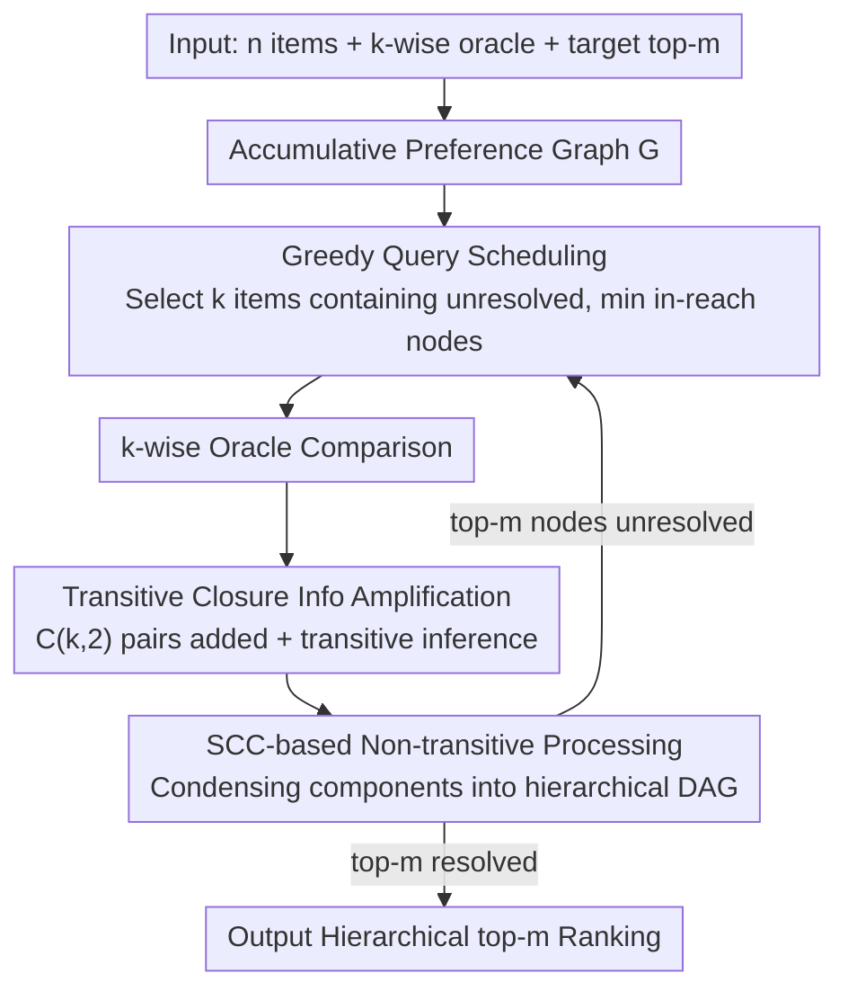

# BlitzRank: Principled Zero-shot Ranking Agents with Tournament Graphs

**Conference**: ICML2026 Spotlight  
**arXiv**: [2602.05448](https://arxiv.org/abs/2602.05448)  
**Code**: https://github.com/ContextualAI/BlitzRank  
**Area**: Information Retrieval  
**Keywords**: tournament graphs, k-wise ranking, zero-shot reranking, strongly connected components, document reranking  

## TL;DR
Ours proposes BlitzRank, a zero-shot reranking framework based on tournament graphs. By accumulating $\binom{k}{2}$ preference pairs generated by each $k$-wise comparison into a global preference graph and utilizing transitive closure to infer additional ranking relations, it achieves Pareto optimality across 14 benchmarks and 5 LLM oracles—reducing token consumption by 25–40% while matching or exceeding the accuracy of existing methods.

## Background & Motivation

**Background**: LLM reranking is a core component of the retrieve-then-rerank pipeline. Existing methods are categorized into three types: pointwise (scoring documents individually), pairwise (aggregating results after one-on-one comparisons), and listwise (processing multiple documents at once via sliding windows). Sliding Window / RankGPT are representative of listwise methods, TourRank adopts a tournament elimination format, and Setwise tasks the LLM with selecting the best candidate from a set of $k$.

**Limitations of Prior Work**: These methods exhibit significant waste in utilizing comparison information. Pairwise methods only obtain one preference pair per call, leading to overhead as high as $O(n \log n)$ calls. While Setwise observes $k$ documents simultaneously, it only extracts the winner and discards the remaining $\binom{k}{2} - (k-1)$ preference relations. Sliding Window uses a fixed stride for movement, making information propagation dependent on window overlap and lacking a mechanism to determine when the top-$m$ items are sufficiently certain.

**Key Challenge**: Each $k$-wise comparison actually contains a complete local tournament—$\binom{k}{2}$ preference relations. However, existing methods either extract only the winner (Setwise/TourRank) or rely on a fixed traversal order (Sliding Window), failing to systematically accumulate and propagate these comparison insights. Furthermore, LLM judgments often produce non-transitive preferences ($A \succ B \succ C \succ A$), which existing methods treat as noise rather than exploitable structures.

**Goal**: (1) Design a framework to extract full tournaments from each $k$-wise comparison and maximize information utility via transitive closure; (2) Provide a provably correct termination condition—stopping once the top-$m$ items are "resolved"; (3) Gracefully handle non-transitive preferences to output hierarchical rankings.

**Key Insight**: The authors draw inspiration from the classic "25 horses racing" puzzle—finding the fastest 3 horses out of 25 using 5-horse races takes only 7 rounds. The key insight is that each race does not just produce a winner but reveals $\binom{5}{2}=10$ preference pairs. By accumulating these preferences and performing transitive inference, one can determine the top-$m$ with far fewer races than an elimination tournament.

**Core Idea**: Model $k$-wise comparison as subgraph queries on a tournament graph, amplify the information per query using transitive closure, and use the node status "resolved" (where preference relations with all other nodes are certain) as the termination criterion. Hierarchical ranking is produced for non-transitive cases via Strongly Connected Component (SCC) decomposition.

## Method

### Overall Architecture
BlitzRank treats zero-shot reranking as a subgraph query problem on a tournament graph. Given $n$ items, a $k$-wise comparison oracle providing a full order for $k$ candidates, and a target top-$m$, it maintains an accumulating preference graph $G=(V,E)$. Each round proceeds through a closed loop: "Select which $k$ to query → Add all preferences from the comparison plus inferred transitive relations to the graph → Check if top-$m$ is determined" until the top-$m$ can be provably identified. The core shift is from ignoring losers (Setwise) or relying on window overlap (Sliding Window) to consuming all $\binom{k}{2}$ relations and allowing transitive closure to "freely" infer further relationships.

### Key Designs

**1. Transitive Closure Information Amplification: Utilizing Inferences from Every New Edge**

Waste in existing methods stems from using only local results. BlitzRank treats every $k$-wise comparison as a full local tournament, inserting $\binom{k}{2}$ edges into the graph and computing the transitive closure. This allows existing paths to automatically form new preferences without additional oracle calls. To quantify information gaps, for each node $v$, it defines in-reach $R_G^-(v)=\{u:u\leadsto_G v\}$ and out-reach $R_G^+(v)=\{u:v\leadsto_G u\}$ (where $\leadsto_G$ denotes directed reachability). The known relation set is $K_G(v)=R_G^-(v)\cup R_G^+(v)$. A node $v$ is "resolved" when $\kappa_G(v)=|K_G(v)|=n-1$. The algorithm terminates when all top-$m$ items are resolved.

**2. SCC-based Non-transitive Preference Handling: Treating Cycles as Tiers**

LLM judgments often exhibit non-transitivity ($A\succ B\succ C\succ A$). BlitzRank treats this as a meaningful structure by identifying Strongly Connected Components (SCC). Nodes within the same SCC are mutually reachable, indicating the oracle cannot consistently distinguish them; they are grouped into the same "tier." The graph is condensed into a Directed Acyclic Graph (DAG) where SCCs serve as hyper-nodes. This condensation graph is a transitive tournament, naturally providing a total order between tiers. Experiments show the BM25 score standard deviation within an SCC is ~40% lower than that of adjacent documents, confirming that cycles capture "truly similar" documents.

**3. Greedy Query Scheduling: Guaranteeing Progress**

The selection of $k$ items per round determines convergence speed. BlitzRank selects nodes from the condensation graph $[G]$ of the current preference graph: it takes SCCs that contain unresolved nodes and have the minimum condensation in-reach. If multiple SCCs have the same in-reach, it prioritizes those with smaller out-reach (highest uncertainty) and selects the representative with the smallest $\kappa_G$. This rule ensures that every query reveals at least one new edge (the "forced-tie" property), guaranteeing termination in at most $\binom{n}{2}$ rounds.

### Mechanism Example
Consider the "25 horses" puzzle: 25 horses, 5 per race, find the top 3. While elimination takes many rounds, BlitzRank utilizes the $\binom{5}{2}=10$ preference pairs per race. Round 1 involves random grouping and racing; these preferences are added to the graph, and transitive closure reveals many "free" relations. Subsequent rounds use the scheduler to pick nodes with minimum in-reach that are likely contenders for top-3 but are not yet resolved. Once the top-3 nodes reach $\kappa_G = n-1$, the algorithm stops, typically requiring fewer races than elimination methods.

## Key Experimental Results

### Main Results

Evaluated on 14 datasets (6 TREC DL + 8 BEIR) by reranking top-100 BM25 results with 5 LLM oracles for $m=10$.

| Method | nDCG@10 | Tokens/query | Relative Cost |
|------|---------|-------------|---------|
| BM25 (No rerank) | 41.1 | 0 | — |
| Pairwise | 57.0 | 324k | 8.1× |
| Setwise | 56.6 | 115k | 2.9× |
| TourRank | 56.0 | 57k | 1.4× |
| SW (Sliding Window) | 56.7 | 54k | 1.4× |
| AcuRank | 56.3 | 69k | 1.7× |
| AcuRank-H | 56.6 | 127k | 3.2× |
| **Blitz-k20** | **56.4** | **40k** | **1.0×** |
| **Blitz-k10** | **56.9** | **42k** | **1.1×** |

(Macro average across 14 datasets × 2 oracles: GPT-4o & Gemini-1.5-Flash)

### Window Size and Sliding Window Comparison

| Method | $k$ | DL19 | DL20 |
|------|-----|------|------|
| Sliding Window | 20 | 74.0 | 70.8 |
| Sliding Window | 10 | 56.4 | 53.2 |
| BlitzRank | 20 | 74.6 | 70.7 |
| BlitzRank | 10 | 73.6 | 72.4 |

Sliding Window quality drops significantly at $k=10$ (DL19: 74.0→56.4) because a stride of 5 propagates only the top-5, failing to resolve the top-10. BlitzRank maintains performance at $k=10$ because correctness is guaranteed by the resolution criterion rather than window coverage.

### Ablation Study (SCC Analysis)

| Configuration | BM25 Std Dev (Intra-SCC) | Std Dev (Neighbors) | Ratio |
|------|-------------------|-----------|------|
| $k=10$ | 0.605 | 1.032 | 0.59 |
| $k=20$ | 0.695 | 1.125 | 0.62 |

The variance of BM25 scores for documents within an SCC is ~40% lower than for neighbors, validating that cyclical preferences capture "truly similar" documents.

## Highlights & Insights
- **Information Theory Perspective**: Generalizes the 25-horse puzzle into a framework where info-per-comparison is maximized.
- **Theoretical Thoroughness**: Proves correctness (resolved in-reach equals true rank) and termination (at least one new edge per round), providing a query complexity bound of $\lceil(n-1)/(k-1)\rceil$ for selecting top-1.
- **Predictable Convergence**: Converges consistently within 12–15 rounds at $k=10$ (mean 13.6, std 0.58), allowing for cost estimation.
- **Variable Windows**: Naturally supports varying $k$ values per round to adapt to heterogeneous document lengths.

## Limitations & Future Work
- Assumes a deterministic oracle; LLM stochasticity is currently only handled indirectly via SCCs.
- Tight query complexity bounds for $m > 1$ remain an open conjecture ($O((n-1)/(k-1) + (m-1)/(k-1) \cdot \log_k m)$).
- Validation is limited to document reranking; applications in other $k$-wise scenarios (crowdsourcing, human evaluation) require further study.

## Related Work & Insights
- **RankGPT / Sliding Window** (Sun et al., 2023): Fixed windows, propagation via overlap.
- **Setwise** (Zhuang et al., 2024b): Selects 1 from $k$, discarding many relations.
- **Pairwise Ranking Prompting** (Qin et al., 2024): $O(n\log n)$ calls via aggregation.
- **TourRank** (Chen et al., 2025): Multi-round elimination.
- **AcuRank** (Yoon et al., 2025): Bayesian TrueSkill updates with uncertainty-based reranking.
- Tournament graph theory (Brandt et al., 2016; Landau, 1953) provides the foundation for SCC decomposition and condensation.

## Rating
- Novelty: 9/10
- Experimental Thoroughness: 9/10
- Writing Quality: 9/10
- Value: 8/10

<!-- RELATED:START -->

## Related Papers

- [\[CVPR 2026\] Explaining CLIP Zero-shot Predictions Through Concepts](../../CVPR2026/information_retrieval/explaining_clip_zero-shot_predictions_through_concepts.md)
- [\[CVPR 2025\] EZSR: Event-based Zero-Shot Recognition](../../CVPR2025/information_retrieval/ezsr_event-based_zero-shot_recognition.md)
- [\[ICML 2026\] Retriever Portfolios: A Principled Approach to Adaptive RAG](retriever_portfolios_a_principled_approach_to_adaptive_rag.md)
- [\[ICML 2026\] Ranking-Free RAG: Replacing Re-Ranking with Selection in RAG for Sensitive Domains](ranking_free_rag_replacing_re-ranking_with_selection_in_rag_for_sensitive_domain.md)
- [\[ICLR 2026\] BTZSC: A Benchmark for Zero-Shot Text Classification Across Cross-Encoders, Embedding Models, Rerankers and LLMs](../../ICLR2026/information_retrieval/btzsc_a_benchmark_for_zero-shot_text_classification_across_cross-encoders_embedd.md)

<!-- RELATED:END -->
