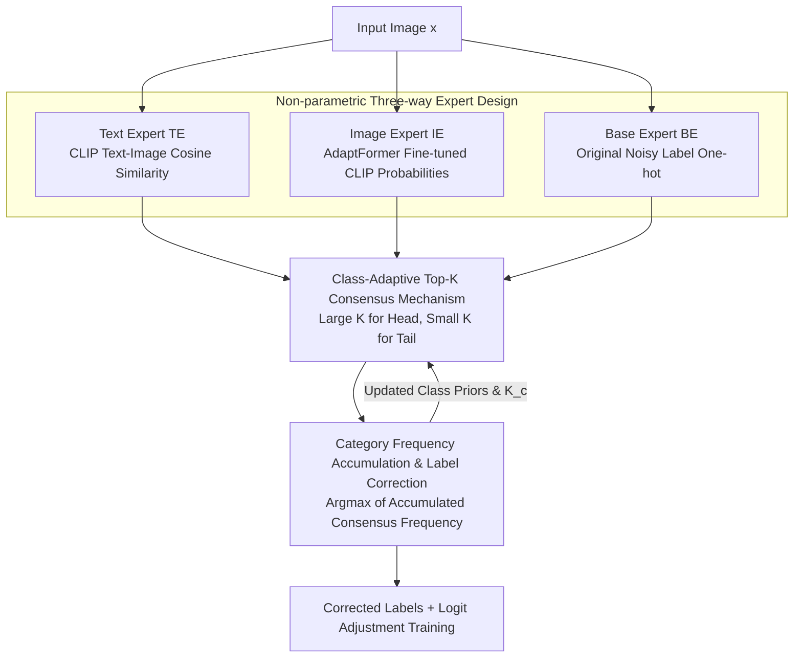

# CARE: Class-Adaptive Expert Consensus for Reliable Learning with Long-Tailed Noisy Labels

**Conference**: ICML 2026  
**arXiv**: [2605.23254](https://arxiv.org/abs/2605.23254)  
**Code**: https://github.com/qwq123-study/CARE (Yes)  
**Area**: Self-supervised/Representation Learning  
**Keywords**: Noisy label learning, long-tailed distribution, vision-language models, expert consensus, label correction  

## TL;DR

Ours proposes the CARE framework, which utilizes three-way complementary experts (VLM text embeddings, image features, and original labels) to achieve reliable label correction in long-tailed noisy label scenarios via a class-adaptive Top-$K$ consensus mechanism, consistently surpassing SOTA by up to 3.0% on synthetic and real-world benchmarks.

## Background & Motivation

**Background**: Real-world data typically faces the dual challenges of annotation noise and long-tailed distributions. When handled separately, long-tailed learning methods assume clean labels and may amplify annotation errors in tail classes; noisy label methods assume class balance and tend to discard noisy samples, leading to the loss of valuable information for tail classes.

**Limitations of Prior Work**: Recent LTNL (Long-Tailed Noisy Label) methods attempt joint processing but mostly adopt **class-agnostic** label correction strategies. For example, RLA corrects labels before using the corrected distribution for logit adjustment, but the correction process treats head and tail classes identically. Experiments show that even if the overall noise rate drops significantly, if tail labels are not sufficiently corrected, performance decreases due to inaccurate regularization introduced during long-tail calibration (e.g., the total accuracy of RLD 2 drops from 79.5% to 76.8%).

**Key Challenge**: Head classes have sufficient samples and high label reliability, allowing for loose correction; tail classes have scarce samples and higher noise rates, requiring more stringent correction. A uniform threshold cannot balance both requirements.

**Goal**: Design a framework without additional parameters to achieve **class-aware** noise filtering and distribution calibration during the label correction phase.

**Key Insight**: Utilize the text semantics and visual features naturally provided by pre-trained VLMs (CLIP) as two independent "experts," which, together with the original labels, constitute three-way complementary signals.

**Core Idea**: Implement differentiated consistency checks across experts through a class-adaptive Top-$K$ consensus vote—larger $K$ for head classes and smaller $K$ for tail classes—to achieve reliable label correction.

## Method

### Overall Architecture

The overall pipeline of CARE: Given an image $x$, category confidence vectors are obtained from three non-parametric experts: **(1)** Text Expert (TE) utilizes the CLIP text encoder to calculate cosine similarity between category text and image features; **(2)** Image Expert (IE) utilizes the CLIP image encoder fine-tuned with AdaptFormer to output category probabilities; **(3)** Base Expert (BE) directly uses the one-hot vector of the original (potentially noisy) label. The three-way confidences are aggregated through a class-adaptive consensus mechanism to output a corrected category frequency distribution. Finally, corrected labels are used with a logit adjustment loss for long-tail calibration training.

### Key Designs

1.  **Class-Adaptive Top-$K$ Consensus Mechanism**:
    The core idea is to dynamically adjust the number of candidate classes retained for each expert based on class frequency. For TE and IE, their respective Top-$K_c$ predictions are taken, where $K_c \propto n_c^e$ ($n_c^e$ is the sample count of class $c$ in epoch $e$). Head classes have a large $K$, allowing more candidates, while tail classes have a small $K$, enforcing stricter consistency. Each expert contributes confidence only to categories within its Top-$K$: $g_m(c) = \mathbb{I}[c \in \mathcal{T}_K^m] \cdot p_c^m$. If the observed label $\tilde{y}$ appears in an expert's Top-$K$, the expert is deemed reliable, and its confidence is weighted; otherwise, only Top-$K$ predictions are kept to avoid reinforcing noise. Theoretically (Theorem 1), since true labels are far more likely to appear jointly in multi-expert Top-$K$ than noisy labels, the consensus mechanism naturally denoises. Compared to a uniform $K$, class-adaptive $K_t$ improves tail class consensus accuracy (Proposition 4).

2.  **Category Frequency Dynamic Accumulation and Label Correction**:
    During training, consensus frequencies for each category are accumulated per sample: $F_c^{(e)} = F_c^{(e-1)} + \sum_{m} \alpha_m(x) \cdot g_m(c)$. The corrected label is the category with the highest frequency: $y^{r,(e)} = \arg\max_c F_c^{(e)}$. As training progresses, correct labels dominate the frequency matrix, achieving progressive self-correction (Corollary 2). The corrected category distribution $n_c^{r,(e)}$ is used to re-estimate class prior probabilities, driving subsequent logit adjustment calibration.

3.  **Non-parametric Three-way Expert Design**:
    The three experts introduce no additional trainable parameters. TE uses a frozen CLIP text encoder to provide semantic priors via $p_c^{TE} = \text{softmax}(s \cdot \cos(\mathbf{t}_c, \hat{\mathbf{f}}))$. IE reuses the CLIP image encoder (AdaptFormer) fine-tuned during training to provide task-adapted visual confidence via $p_c^{IE} = \text{softmax}(s \cdot \cos(\mathbf{w}_c, \mathbf{f}))$. BE uses the one-hot observed label. These are complementary: TE is unaffected by label correction and provides stable anchors; IE evolves with training but may be affected by noise; BE remains informative for head classes. Ablations show that no single expert or pair can reduce the noise rate effectively; only the three together reduce noise from 50% to 27.8%.

## Key Experimental Results

| Setup | Dataset | CLIP+LA | CLIP+RLA | CLIP+LA w. CARE | Gain |
|------|--------|---------|----------|-----------------|------|
| Joint NR=50%, IF=10 | CIFAR-100-LTN | 79.5% | 80.7% | **80.7%** | +1.2% vs LA |
| Joint NR=50%, IF=100 | CIFAR-100-LTN | 75.3% | 66.7% | **76.7%** | +1.4% vs LA, +10.0% vs RLA |
| Sym NR=60%, IF=10 | CIFAR-100-LTN | 76.0% | 77.0% | **79.2%** | +3.2% vs LA |
| Asym NR=40%, IF=10 | CIFAR-100-LTN | 68.2% | 69.3% | **70.5%** | +2.3% vs LA |
| Real noise, IF=100 | Food101N | 83.7% | 77.2% | **84.1%** | +6.9% vs RLA |
| Real noise | WebVision-50 | 85.1% | 85.0% | **85.3%** | +0.3% vs LA |

| Ablation Study | Combination | Noise Rate (%) | Accuracy (%) |
|----------|------|-----------|----------|
| BE only | ✓ / ✗ / ✗ | 50.0 | 78.7 |
| BE + TE | ✓ / ✓ / ✗ | 50.0 | 78.7 |
| BE + IE | ✓ / ✗ / ✓ | 50.0 | 78.7 |
| BE + TE + IE (Ours) | ✓ / ✓ / ✓ | **27.8** | **80.3** |

## Highlights & Insights

- **Key Finding**: Reducing the overall noise rate is insufficient; the accuracy of tail class label correction must be guaranteed, otherwise the regularization introduced by long-tail calibration becomes harmful.
- **Novelty**: CARE introduces no extra parameters during the consensus phase. IE reuses the fine-tuned encoder from the main pipeline, and TE uses a frozen pre-trained encoder.
- **Cross-backbone Generalization**: Not limited to CLIP—ResNet + GloVe, the TABASCO framework, and MLP-Mixer architectures all achieved consistent gains, showing the benefit stems from the consensus mechanism itself.
- **Theoretical Support**: Provides a reliability amplification theorem for consensus denoising (Theorem 1) and a proposition for accuracy improvement using tail-adaptive $K$ (Proposition 4).

## Limitations & Future Work

- Tail class gains come at the cost of slight head class degradation (Table 8: head 83.4% → 81.8%), stemming from stronger LA regularization on head classes after correction.
- Dependence on pre-trained VLMs like CLIP for text and visual experts limits applicability in scenarios where no pre-trained models are available.
- The setting where $K_c$ is proportional to class frequency is relatively simple; more refined adaptive strategies (e.g., considering inter-class semantic similarity) could further improve performance.

## Related Work & Insights

- **Long-Tailed Learning**: LDAM-DRW, LA (logit adjustment), MiSLAS, etc., handle imbalance at the loss/classifier level but assume clean labels.
- **Noisy Label Learning**: Co-teaching, DivideMix, UNICON, etc., handle noise via sample selection/mixup but assume class balance.
- **LTNL Joint Methods**: TABASCO considers differences between observed and intrinsic distributions; RCAL/ECBS/RLA handle both jointly but mostly use class-agnostic strategies.
- **Insights**: Multi-modal signals (text + vision) from VLMs can serve as natural label auditing tools. The idea of class-adaptive consensus thresholds can be generalized to other scenarios requiring differentiated trust allocation.

## Rating

- Novelty: 7/10 — Class-adaptive consensus voting is an insightful design, though the overall framework (multi-expert voting for correction) is intuitive.
- Experimental Thoroughness: 9/10 — Synthetic + 3 real-world datasets, 5 noise settings, 3 backbone architectures, with comprehensive ablations.
- Writing Quality: 8/10 — Clear motivation, complete theoretical analysis, and effective intuitive demonstration in Figure 1.
- Value: 7/10 — Practical value for LTNL scenarios, though the magnitude of gain over strong baselines (CLIP+LA) is moderate.

<!-- RELATED:START -->

## Related Papers

- [\[AAAI 2026\] Neighbor-aware Instance Refining with Noisy Labels for Cross-Modal Retrieval](../../AAAI2026/information_retrieval/neighbor-aware_instance_refining_with_noisy_labels_for_cross-modal_retrieval.md)
- [\[ICCV 2025\] External Knowledge Injection for CLIP-Based Class-Incremental Learning](../../ICCV2025/information_retrieval/external_knowledge_injection_for_clip-based_class-incremental_learning.md)
- [\[ICML 2026\] Retriever Portfolios: A Principled Approach to Adaptive RAG](retriever_portfolios_a_principled_approach_to_adaptive_rag.md)
- [\[ICML 2026\] Very Efficient Listwise Multimodal Reranking for Long Documents](very_efficient_listwise_multimodal_reranking_for_long_documents.md)
- [\[ICML 2026\] ParisKV: Fast and Drift-Robust KV-Cache Retrieval for Long-Context LLMs](pariskv_fast_and_drift-robust_kv-cache_retrieval_for_long-context_llms.md)

<!-- RELATED:END -->
