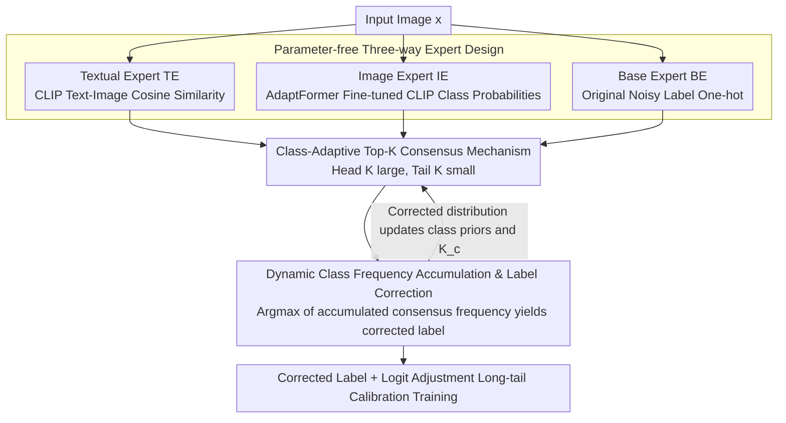

# CARE: Class-Adaptive Expert Consensus for Reliable Learning with Long-Tailed Noisy Labels

**Conference**: ICML 2026  
**arXiv**: [2605.23254](https://arxiv.org/abs/2605.23254)  
**Code**: https://github.com/qwq123-study/CARE (Available)  
**Area**: Self-Supervised/Representation Learning  
**Keywords**: Noisy Label Learning, Long-Tailed Distribution, Vision-Language Models, Expert Consensus, Label Correction  

## TL;DR

The CARE framework is proposed, which leverages three-way complementary experts—VLM text embeddings, image features, and original labels—to achieve reliable label correction in long-tailed noisy label scenarios through a class-adaptive Top-$K$ consensus mechanism, consistently surpassing SOTA by up to 3.0% on synthetic and real-world benchmarks.

## Background & Motivation

**Background**: Real-world data typically suffers from the simultaneous challenges of annotation noise and long-tailed distributions (class imbalance). When handled separately, long-tailed learning methods assume clean labels and may amplify annotation errors in tail classes; conversely, noisy label methods assume a balanced distribution and tend to discard noisy samples, leading to the loss of precious information for tail classes.

**Limitations of Prior Work**: Recent Long-Tailed Noisy Label (LTNL) methods attempt joint processing but mostly adopt **class-agnostic** label correction strategies. For example, RLA corrects labels before applying logit adjustment to the corrected distribution, but the correction process treats head and tail classes equally. Experiments show that even if the overall noise rate drops significantly, performance can still degrade (e.g., RLD 2's total accuracy drops from 79.5% to 76.8%) due to inaccurate regularization introduced during long-tail calibration if tail labels are not sufficiently corrected.

**Key Challenge**: Head classes have sufficient samples and high label reliability, allowing for relaxed correction; tail classes have scarce samples and higher noise rates, requiring stricter correction. A unified threshold cannot accommodate both.

**Goal**: Design a parameter-free framework that achieves **class-aware** noise filtering and distribution calibration during the label correction phase.

**Key Insight**: Utilize the text semantics and visual features naturally provided by pre-trained VLMs (CLIP) as two independent "experts," forming three-way complementary signals with the original labels.

**Core Idea**: Implement reliable label correction through class-adaptive Top-$K$ consensus voting—where head classes take a larger $K$ and tail classes take a smaller $K$—enforcing differentiated consistency checks among experts.

## Method

### Overall Architecture

The overall pipeline of CARE: Given an image $x$, class confidence vectors are obtained from three parameter-free experts: **(1)** the Textual Expert (TE) utilizes the CLIP text encoder to calculate the cosine similarity between class text and image features; **(2)** the Image Expert (IE) utilizes a CLIP image encoder fine-tuned with AdaptFormer to output class probabilities; **(3)** the Base Expert (BE) directly uses the one-hot vector of the original (potentially noisy) label. The three confidence paths are aggregated via a class-adaptive consensus mechanism to output a corrected class frequency distribution. Finally, corrected labels are used in conjunction with a logit adjustment loss for long-tail calibration training.

### Key Designs

1. **Class-Adaptive Top-$K$ Consensus Mechanism**:

   The core idea is to dynamically adjust the number of candidate classes retained by each expert based on class frequency. For TE and IE, the Top-$K_c$ predictions of their respective confidence scores are taken, where $K_c \propto n_c^e$ ($n_c^e$ is the number of samples in class $c$ at epoch $e$). Head classes have a large $K$ to allow more candidates, while tail classes have a small $K$ to force stricter consistency. Each expert contributes confidence only to classes within its Top-$K$: $g_m(c) = \mathbb{I}[c \in \mathcal{T}_K^m] \cdot p_c^m$. If the observed label $\tilde{y}$ appears in an expert's Top-$K$, the expert is considered reliable, and its confidence is weighted and enhanced; otherwise, only the Top-$K$ predictions are kept to avoid reinforcing noisy labels. Theoretically (Theorem 1), since the probability of the true label jointly appearing in multiple experts' Top-$K$ is much higher than that of noisy labels, the consensus mechanism naturally possesses a denoising effect. Compared to a global uniform $K$, the class-adaptive $K_t$ improves consensus accuracy for tail classes (Proposition 4).

2. **Dynamic Class Frequency Accumulation and Label Correction**:

   During training, consensus frequencies for each category are accumulated per sample: $F_c^{(e)} = F_c^{(e-1)} + \sum_{m} \alpha_m(x) \cdot g_m(c)$. The corrected label is taken as the category with the highest frequency: $y^{r,(e)} = \arg\max_c F_c^{(e)}$. As training progresses, correct labels increasingly dominate the frequency matrix, achieving progressive self-correction (Corollary 2). The corrected class distribution $n_c^{r,(e)}$ is used to re-estimate class prior probabilities, driving subsequent logit adjustment calibration.

3. **Parameter-free Three-way Expert Design**:

   The three experts do not introduce additional trainable parameters. TE uses a frozen CLIP text encoder to provide semantic priors via $p_c^{TE} = \text{softmax}(s \cdot \cos(\mathbf{t}_c, \hat{\mathbf{f}}))$. IE reuses the CLIP image encoder (AdaptFormer) fine-tuned during training to provide task-adapted visual confidence via $p_c^{IE} = \text{softmax}(s \cdot \cos(\mathbf{w}_c, \mathbf{f}))$. BE directly uses the one-hot observed label. The three are complementary: TE is unaffected by label correction and provides a stable semantic anchor; IE evolves with training but may be affected by noise; BE remains informative for head classes. Ablation studies verify that no single expert or pair of experts can effectively reduce the noise rate; only the combination of all three reduces noise from 50% to 27.8%.

## Key Experimental Results

### Main Results

| Setting | Dataset | CLIP+LA | CLIP+RLA | CLIP+LA w. CARE | Gain |
|------|--------|---------|----------|-----------------|------|
| Joint NR=50%, IF=10 | CIFAR-100-LTN | 79.5% | 80.7% | **80.7%** | +1.2% vs LA |
| Joint NR=50%, IF=100 | CIFAR-100-LTN | 75.3% | 66.7% | **76.7%** | +1.4% vs LA, +10.0% vs RLA |
| Sym NR=60%, IF=10 | CIFAR-100-LTN | 76.0% | 77.0% | **79.2%** | +3.2% vs LA |
| Asym NR=40%, IF=10 | CIFAR-100-LTN | 68.2% | 69.3% | **70.5%** | +2.3% vs LA |
| Real noise, IF=100 | Food101N | 83.7% | 77.2% | **84.1%** | +6.9% vs RLA |
| Real noise | WebVision-50 | 85.1% | 85.0% | **85.3%** | +0.3% vs LA |

### Ablation Study

| Ablation | Combination (BE/TE/IE) | Noise Rate (%) | Accuracy (%) |
|----------|------|-----------|----------|
| BE only | ✓ / ✗ / ✗ | 50.0 | 78.7 |
| BE + TE | ✓ / ✓ / ✗ | 50.0 | 78.7 |
| BE + IE | ✓ / ✗ / ✓ | 50.0 | 78.7 |
| BE + TE + IE (CARE) | ✓ / ✓ / ✓ | **27.8** | **80.3** |

## Highlights & Insights

- **Key Findings**: Reducing the overall noise rate is insufficient; ensuring the accuracy of label correction for tail classes is mandatory. Otherwise, the regularization introduced by long-tail calibration becomes harmful.
- **Parameter-free Design**: CARE introduces no additional parameters during the expert consensus stage. IE reuses the fine-tuned encoder from the main training pipeline, and TE uses a frozen pre-trained encoder.
- **Cross-Backbone Generalization**: The method is not limited to CLIP—improvements were consistently observed with ResNet + GloVe combinations, the TABASCO framework, and MLP-Mixer architectures, indicating that the gain stems from the consensus mechanism itself rather than a strong backbone.
- **Theoretical Support**: Reliable amplification theorems for consensus denoising (Theorem 1) and accuracy improvement propositions for class-adaptive $K$ in tail classes (Proposition 4) are provided.

## Limitations & Future Work

- Tail class accuracy improvements come at the cost of slight head class performance drops (Table 8: head 83.4% → 81.8%), stemming from the stronger regularization effect of LA on head classes after correction.
- The method relies on pre-trained VLMs like CLIP to provide textual and visual experts, limiting its applicability in scenarios where pre-trained models are unavailable.
- Setting $K_c$ proportional to class frequency is relatively simple; more refined adaptive strategies (e.g., considering inter-class semantic similarity) might further improve performance.

## Related Work & Insights

- **Long-Tailed Learning**: LDAM-DRW, LA (logit adjustment), and MiSLAS handle imbalance at the loss/classifier level but assume clean labels.
- **Noisy Label Learning**: Co-teaching, DivideMix, and UNICON address noise through sample selection/mixup but assume class balance.
- **Joint LTNL Methods**: TABASCO considers differences between observed and intrinsic distributions; RCAL, ECBS, and RLA handle both jointly but mostly use class-agnostic strategies.
- **Insights**: Multi-modal signals from VLMs (text + vision) can serve as natural label auditing tools. The idea of class-adaptive consensus thresholds can be generalized to other scenarios requiring differentiated trust allocation.

## Rating

- Novelty: 7/10 — The class-adaptive consensus voting is an insightful design, though the overall framework (multi-expert voting for label correction) is somewhat intuitive.
- Experimental Thoroughness: 9/10 — Comprehensive ablation on synthetic and three real-world datasets, five noise settings, and three backbone architectures.
- Writing Quality: 8/10 — Clear motivation, complete theoretical analysis, and effective intuitive demonstration in Figure 1.
- Value: 7/10 — Practical value for LTNL scenarios, though the gain over strong baselines (CLIP+LA) is relatively moderate.

<!-- RELATED:START -->

## Related Papers

- [\[ICCV 2025\] External Knowledge Injection for CLIP-Based Class-Incremental Learning](../../ICCV2025/information_retrieval/external_knowledge_injection_for_clip-based_class-incremental_learning.md)
- [\[ICML 2026\] Retriever Portfolios: A Principled Approach to Adaptive RAG](retriever_portfolios_a_principled_approach_to_adaptive_rag.md)
- [\[ICML 2026\] ParisKV: Fast and Drift-Robust KV-Cache Retrieval for Long-Context LLMs](pariskv_fast_and_drift-robust_kv-cache_retrieval_for_long-context_llms.md)
- [\[ICML 2026\] Graph-R1: Towards Agentic GraphRAG Framework via End-to-end Reinforcement Learning](graph-r1_towards_agentic_graphrag_framework_via_end-to-end_reinforcement_learnin.md)
- [\[ICLR 2026\] Beyond RAG vs. Long-Context: Learning Distraction-Aware Retrieval for Efficient Knowledge Grounding](../../ICLR2026/information_retrieval/beyond_rag_vs_long-context_learning_distraction-aware_retrieval_for_efficient_kn.md)

<!-- RELATED:END -->
