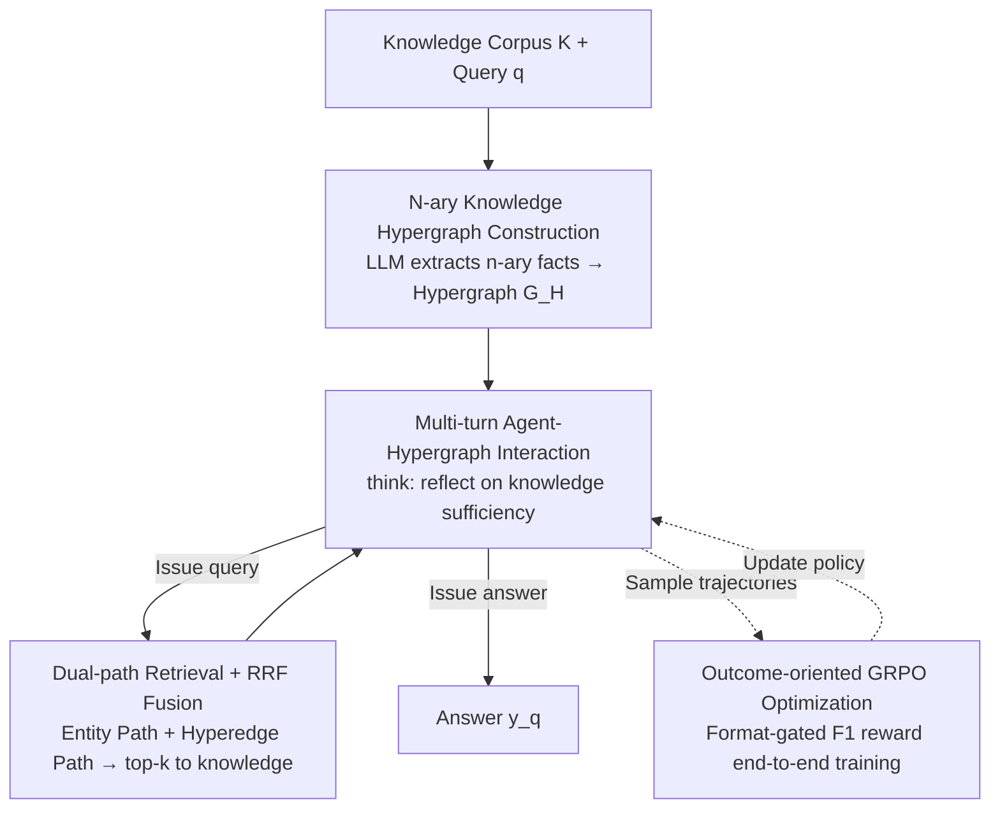

# Graph-R1: Towards Agentic GraphRAG Framework via End-to-end Reinforcement Learning

**Conference**: ICML 2026  
**arXiv**: [2507.21892](https://arxiv.org/abs/2507.21892)  
**Code**: https://github.com/LHRLAB/Graph-R1 (Available)  
**Area**: Information Retrieval / GraphRAG / Agent  
**Keywords**: GraphRAG, Reinforcement Learning, Knowledge Hypergraph, Agentic Retrieval, Multi-turn Reasoning

## TL;DR
Graph-R1 reformulates GraphRAG as an end-to-end RL framework featuring a "knowledge hypergraph environment + multi-turn think–query–retrieve–answer agent + outcome-oriented GRPO." By utilizing lightweight n-ary hypergraph construction and dual-path hyperedge retrieval with RRF fusion, it improves the F1 score of 7B models from Search-R1's 46.19 to 57.82 across six standard RAG datasets.

## Background & Motivation

**Background**: RAG utilizes chunk-based retrieval to mitigate LLM hallucinations but ignores structural relationships between entities. GraphRAG approaches (GraphRAG, LightRAG, HyperGraphRAG, PathRAG, HippoRAG2, etc.) model knowledge as entity-relationship graphs, feeding results to LLMs for long-context reasoning via subgraph retrieval and path pruning.

**Limitations of Prior Work**: The authors identify three specific bottlenecks in current GraphRAG:
- High construction costs and semantic loss: Compressing natural language into binary (head, rel, tail) triplets is inherently lossy and requires massive LLM calls.
- "One-shot" fixed retrieval process: Most GraphRAG systems retrieve a single subgraph for a query, relying on prompt engineering for complex multi-hop questions.
- Heavy reliance on large models, long contexts, and meticulous prompting: Small models struggle with graph knowledge, and methods like HyperGraphRAG show negligible gains over StandardRAG, suggesting structural information is underutilized.

**Key Challenge**: There is a contradiction between the potential gains of graph structures (higher information density) and the current "one-shot static retrieval + prompt concatenation" workflow. To effectively use structure, the model must iteratively re-examine the graph based on intermediate states—an capability prompt-only pipelines lack.

**Goal**: (i) Make graph construction more information-dense (n-ary hyperedges instead of binary triplets); (ii) Transform retrieval into a multi-turn process where the agent decides when to stop; (iii) Use RL to optimize the "think-retrieve-rethink-generate" trajectory end-to-end, learning *when* and *what* to query rather than relying on prompt tuning.

**Key Insight**: Inspired by DeepSeek-R1 and Search-R1, GraphRAG is re-modeled as an RL problem: hypergraphs as the environment, n-ary facts as observations, think/query/retrieve/answer as actions, and token-level F1 plus format compliance as rewards, optimized via GRPO.

**Core Idea**: Replace "heavy graph construction + one-shot subgraph retrieval + long-context prompts" with "lightweight n-ary knowledge hypergraphs + multi-turn agent-hypergraph interaction + outcome-oriented GRPO," enabling small models to extract reasoning benefits from graph structures.

## Method

### Overall Architecture
Input: Knowledge corpus $K=\{d_1,\dots,d_N\}$ and user query $q$. Output: Natural language answer $y_q$.

The pipeline consists of two stages: **Offline**, the corpus is extracted into a knowledge hypergraph $\mathcal{G}_H=(V,E_H,\phi)$, where each hyperedge $h_i$ is a semantic segment linked to multiple entities $\mathcal{V}_{h_i}$, with embeddings calculated via a shared encoder $\phi(\cdot)$ (bge-large-en-v1.5). **Online**, an LLM agent $\pi_\theta$ interacts with $\mathcal{G}_H$ through multi-turn trajectories $\tau=((\mathbf{s}_1,\mathbf{a}_1),\dots,(\mathbf{s}_T,\mathbf{a}_T))$.

In each step, the agent first reflects in `<think>` whether current knowledge is sufficient. It then either issues a `<query>` to execute dual-path retrieval (inserting results back into `<knowledge>`) or issues `<answer>` to terminate. The trajectory is trained end-to-end via GRPO using a reward signal based on "format compliance + answer F1," requiring no intermediate step supervision or SFT warm-start.

### Key Designs

**1. Lightweight n-ary Knowledge Hypergraph Construction: Preserving multi-participant facts as single hyperedges**
Binary triplets force multi-participant facts into multiple $(h,r,t)$ pairs, causing semantic loss and edge explosion. Graph-R1 uses an LLM extractor $\pi_{\text{ext}}(d)\to\{(h_i,\mathcal{V}_{h_i})\}_{i=1}^m$ to directly extract n-ary relationship facts—where $h_i$ is the relationship/fact text and $\mathcal{V}_{h_i}$ is the set of participating entities. Both share encoder $\phi(\cdot)$ to obtain $\phi(v)$ and $\phi(h_i)$. This treats each hyperedge as a "semantic segment + entity set" environment. Compared to HyperGraphRAG, it removes confidence-score steps, reducing costs on 2Wiki (5.69s / \$2.81 per 1K tokens) compared to GraphRAG (\$3.35) and HyperGraphRAG (\$4.14), eventually generating 120K nodes and 98K hyperedges. Preserving facts whole maintains granularity and enables dual-path retrieval entry points.

**2. Multi-turn Agent-Hypergraph Interaction: Dual-path retrieval + RRF fusion instead of one-shot subgraphs**
Complex multi-hop questions are handled via a think–query–retrieve–answer loop. The action $\mathbf{a}_t=(\mathbf{a}_t^{\text{think}},\alpha_t,\mathbf{a}_t^{\text{out}})$ is decomposed via a hierarchical policy $\pi_\theta(\mathbf{a}_t^{\text{out}}\mid\alpha_t,\mathbf{a}_t^{\text{think}},\mathbf{s}_t)\cdot\pi_\theta(\alpha_t\mid\cdot)\cdot\pi_\theta(\mathbf{a}_t^{\text{think}}\mid\mathbf{s}_t)$. When a query is issued, two parallel paths are executed: the **Entity Path** $\mathcal{R}_V=\arg\max^{k_V}_v \text{sim}(\phi(V_{\mathbf{a}_t^{\text{query}}}),\phi(v))$, which finds relevant entities then collects their hyperedges; and the **Hyperedge Path** $\mathcal{R}_H=\arg\max^{k_H}_{e_H}\text{sim}(\phi(\mathbf{a}_t^{\text{query}}),\phi(e_H))$, which retrieves hyperedges directly. Results are merged via Reciprocal Rank Fusion $\text{Score}(f)=1/r_V+1/r_H$ to feed top-$k$ results back. On 7B models, agents average 2.3–2.5 turns and 1200–1500 tokens, which is shorter yet more accurate than Search-R1.

**3. Outcome-oriented End-to-end GRPO Optimization: Format-gated answer scoring without SFT cold-start**
To learn *how* to use the graph environment, Graph-R1 uses a scalar reward to optimize policy $\pi_\theta$. The format reward $R_{\text{format}}(\tau)=\min(1.0, 0.5\cdot\sum_t \mathbb{I}\{(\mathbf{a}_t^{\text{think}},\alpha_t,\mathbf{a}_t^{\text{out}})\})$ encourages the think→query/answer structure, solving the cold-start issue where agents fail to use tags. The answer reward $R_{\text{answer}}$ uses token-level F1 to align with ground truth. The total reward $R(\tau)=-1.0+R_{\text{format}}(\tau)+\mathbb{I}\{R_{\text{format}}(\tau)=1.0\}\cdot R_{\text{answer}}$ uses an indicator function—the answer score is only calculated if the format is perfect. This hard constraint forces the policy into the structured output space without SFT and avoids shortcutting. GRPO is chosen to normalize advantage $\hat A(\tau_i)=(R(\tau_i)-\text{mean}(\{R(\tau_j)\}))/F_{\text{norm}}(\cdot)$ within groups, proving more effective than PPO/REINFORCE++.

### Loss & Training
GRPO objective: $\mathcal{J}_{\text{GRPO}}(\theta)=\mathbb{E}[\frac{1}{N}\sum_i\frac{1}{|\tau_i|}\sum_t\min(\rho_\theta\hat A,\text{clip}(\rho_\theta,1\pm\epsilon)\hat A)-\beta\mathbb{D}_{\text{KL}}(\pi_\theta\|\pi_{\text{ref}})]$, where $\rho_\theta=\pi_\theta/\pi_{\theta_{\text{old}}}$. Base models: Qwen2.5-{1.5B, 3B, 7B}-Instruct. Hardware: 4×A100-80G. Extraction uses GPT-4o-mini; retrieval uses bge-large-en-v1.5.

## Key Experimental Results

### Main Results
Average across 6 RAG datasets (2Wiki, HotpotQA, Musique, NQ, PopQA, TriviaQA) using 7B base model:

| Method (Qwen2.5-7B base) | EM | F1 | R-S | G-E |
|--------|------|------|------|------|
| StandardRAG | 5.34 | 15.89 | 52.67 | 65.18 |
| HyperGraphRAG (GPT-4o-mini, prompt-only) | 13.15 | 29.40 | 61.82 | 78.92 |
| Search-R1 (chunk + RL) | 38.54 | 46.19 | 51.60 | 68.60 |
| R1-Searcher (chunk + RL) | 34.51 | 42.29 | 51.26 | 69.08 |
| **Graph-R1 (Ours)** | **48.57** | **57.82** | 60.40 | **76.23** |

On 1.5B/3B bases, Graph-R1 also significantly outperforms RL-RAG baselines (Search-R1), with absolute F1 gains of approximately +10–16 points.

### Ablation Study
Mean of 2Wiki + HotpotQA:

| Configuration | EM (3B) | F1 (3B) | EM (7B) | F1 (7B) | Description |
|------|--------|---------|---------|---------|------|
| Full Graph-R1 | 50.39 | 57.16 | 56.25 | 63.87 | Complete model |
| w/o K.C. | 38.48 | 46.11 | 46.68 | 53.87 | Remove hypergraph (revert to chunk) |
| w/o M.I. | 26.37 | 35.99 | 39.07 | 45.91 | Remove multi-turn (one-shot retrieval) |
| w/o R.L. | 3.13 | 10.74 | 1.56 | 17.79 | Remove RL (pure prompt agent) |

### Key Findings
- **RL is the primary contributor**: Without RL, EM drops to single digits, proving that multi-turn agents in graph environments cannot function on prompts alone. Multi-turn interaction (M.I.) ranks second in importance.
- **Synergy between RL and Knowledge Representation**: Figure 5(b) illustrates that "No Knowledge < Chunk + RL < Binary Graph + RL < Hypergraph + RL." While prompt-only HyperGraphRAG barely beats StandardRAG, adding RL significantly raises the performance ceiling for graph structures.
- **Improved Efficiency**: Performance on 2Wiki shows Graph-R1 (7B) takes 7.0s per query with \$0 generation cost (learned stopping), whereas HyperGraphRAG takes 9.6s/\$8.76.
- **Scaling Gains**: The gap between Graph-R1 and Search-R1 widens as the base model size increases, suggesting structured reasoning benefits scale with the base model.
- **Conflict with Prior RL**: On Qwen3-4B (already RL-tuned), Graph-R1 performed slightly worse, as the model tended to over-rely on internal reasoning rather than querying the graph.

## Highlights & Insights
- The "format reward gating answer reward" design is effective: using $\mathbb{I}\{R_{\text{format}}=1.0\}$ as a coefficient provides behavior constraint and reward shaping without SFT, applicable to other agentic RL scenarios.
- Dual-path retrieval (Entity + Hyperedge) + RRF fusion merges dense retrieval perspectives without needing a cross-encoder or rerank model, offering a practical trick for industry RAG.
- The narrative shifts from "graphs are better" to "graphs require RL to be used effectively." Solving the failure of prompt-only GraphRAG methods with RL is a compelling argument.

## Limitations & Future Work
- Construction still heavily relies on GPT-4o-mini; the impact of using open-source models for n-ary relationship extraction remains unexplored.
- Experiments focus on QA-style benchmarks; effectiveness for long-form generation or code QA is unknown.
- The performance drop on Qwen3-4B suggests potential conflicts when layering RL on top of already RL-tuned models.
- Hypergraphs are static; the costs of incremental updates for streaming knowledge were not addressed.

## Related Work & Insights
- **vs HyperGraphRAG**: Both use n-ary hypergraphs, but HyperGraphRAG is prompt-only. Graph-R1 simplifies construction and adds RL to double the F1 score.
- **vs Search-R1 / R1-Searcher**: These use RL for chunk retrieval. Graph-R1 proves that replacing chunks with hypergraphs in the same RL framework significantly raises the performance ceiling.
- **vs DeepSeek-R1 / GRPO**: Extends the R1 paradigm from "internal CoT + tools" to "internal CoT + multi-turn graph environment interaction" using the GRPO optimizer.

## Rating
- Novelty: ⭐⭐⭐⭐ Clean combination of agentic RL, n-ary hypergraphs, and GRPO.
- Experimental Thoroughness: ⭐⭐⭐⭐ Broad coverage across datasets and base models; lacks hyperparameter sensitivity analysis.
- Writing Quality: ⭐⭐⭐⭐ Logical flow from challenges to design; includes theoretical proofs.
- Value: ⭐⭐⭐⭐ Open-source and practical for running GraphRAG on small models.

<!-- RELATED:START -->

## Related Papers

- [\[ACL 2026\] End-to-End Optimization of LLM-Driven Multi-Agent Search Systems via Heterogeneous-Group-Based Reinforcement Learning](../../ACL2026/information_retrieval/end-to-end_optimization_of_llm-driven_multi-agent_search_systems_via_heterogeneo.md)
- [\[ACL 2026\] Agentic Conversational Search with Contextualized Reasoning via Reinforcement Learning](../../ACL2026/information_retrieval/agentic_conversational_search_with_contextualized_reasoning_via_reinforcement_le.md)
- [\[ACL 2025\] Gumbel Reranking: Differentiable End-to-End Reranker Optimization](../../ACL2025/information_retrieval/gumbel_reranking.md)
- [\[ACL 2026\] Learning to Extract Rational Evidence via Reinforcement Learning for Retrieval-Augmented Generation](../../ACL2026/information_retrieval/learning_to_extract_rational_evidence_via_reinforcement_learning_for_retrieval-a.md)
- [\[ACL 2025\] MEMERAG: A Multilingual End-to-End Meta-Evaluation Benchmark for Retrieval Augmented Generation](../../ACL2025/information_retrieval/memerag_a_multilingual_end-to-end_meta-evaluation_benchmark_for_retrieval_augmen.md)

<!-- RELATED:END -->
