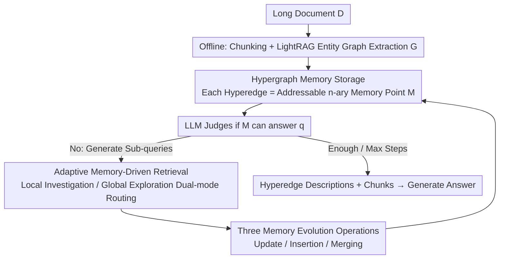

# HGMem: Hypergraph-based Working Memory to Improve Multi-step RAG for Long-Context Complex Relational Modeling

**Conference**: ICML 2026  
**arXiv**: [2512.23959](https://arxiv.org/abs/2512.23959)  
**Code**: https://github.com/Encyclomen/HGMem (Available)  
**Area**: Information Retrieval / RAG / Working Memory / Long-Context Reasoning  
**Keywords**: Hypergraph Memory, Multi-step RAG, High-order Relational Modeling, Global Sense-making, Long Document Understanding

## TL;DR
This paper reconstructs the working memory in multi-step RAG from a "flat list of facts" into a **hypergraph**. Each hyperedge serves as a memory point that can be updated, inserted, or merged. By leveraging the inherent ability of hyperedges to connect $n \geq 2$ entities, the system allows memory to continuously consolidate low-order facts into high-order concepts during interactions, significantly improving performance in long-context QA tasks that require "global sense-making."

## Background & Motivation

**Background**: When dealing with complex QA for long documents of 100k+ tokens, single-step RAG is often insufficient. The mainstream approach is multi-step RAG (IRCOT, ReAct, DeepRAG, ComoRAG, etc.), which alternates between retrieval and reasoning while maintaining a working memory to accumulate intermediate states. Memory formats have evolved from initial unstructured natural language descriptions to structured relational tables, knowledge graphs (KGs), and event logs.

**Limitations of Prior Work**: Existing memories are almost exclusively treated as **static fact repositories** that merely append primitive facts. However, human working memory does not function this way; it actively **reorganizes scattered facts into higher-order concepts** (Baddeley 2000; Oberauer 2019). This "reorganization capability" is particularly critical for tasks requiring global sense-making, where complex latent connections between events dispersed across sections must be aggregated into a unified perspective to answer a query.

**Key Challenge**: The "edges" in structured memories like KGs or event logs are inherently **binary relations**, which cannot directly express $n$-ary relations where "multiple facts collectively constitute a comprehensive proposition." Conversely, while unstructured descriptions are flexible, they lose traceability to the original text and precision in cross-step operations. There is a systematic **trade-off between expressiveness and operability, as well as between low-order facts and high-order concepts**.

**Goal**: Design a working memory that simultaneously satisfies: (1) precise traceability to original document chunks; (2) support for precise cross-step operations (update / insert / merge); (3) direct expression of $n$-ary high-order relations; (4) ability to drive retrieval strategies to adaptively switch between "local investigation" and "global exploration."

**Key Insight**: Hypergraphs naturally generalize "edges" into "hyperedges"—a single hyperedge can connect any number of vertices. This allows a complex event, which would require multiple binary edges in a KG, to be collapsed into a single $n$-ary unit. By treating hyperedges as memory points, the topology of the hypergraph naturally carries the semantics of how facts are organized into concepts.

**Core Idea**: Use a **hypergraph instead of a knowledge graph** as the working memory for multi-step RAG. Memory points (hyperedges) evolve dynamically through three operations: update, insertion, and **merging**, where merging is the key step for explicitly constructing high-order relations. Simultaneously, an adaptive "Local Investigation vs. Global Exploration" strategy is introduced on the retrieval side, allowing the hypergraph to both store information and guide retrieval paths.

## Method

### Overall Architecture

HGMem addresses the issue where working memory in long-document QA only stacks primitive facts and fails to express multi-fact synthetic propositions. It achieves this by transforming memory from a flat list of facts into an evolvable hypergraph. In the offline phase, the long document $\mathcal{D}$ is split into 200-token chunks (50-token overlap). Entities and binary relations are extracted using GPT-4o + LightRAG to construct an entity graph $\mathcal{G}=(\mathcal{V}_{\mathcal{G}}, \mathcal{E}_{\mathcal{G}})$. Entities, relations, and chunks are all encoded into a vector database using bge-m3. In the online phase, the system maintains a hypergraph memory $\mathcal{M}=(\mathcal{V}_{\mathcal{M}}, \tilde{\mathcal{E}}_{\mathcal{M}})$, which shares vertices with $\mathcal{G}$ ($\mathcal{V}_{\mathcal{M}}\subseteq \mathcal{V}_{\mathcal{G}}$), but hyperedges can connect $\geq 2$ vertices, with each hyperedge acting as a "memory point" carrying a specific perspective.

The entire online process is an interactive loop: starting from an initial sub-query $\mathcal{Q}^{(0)}=\{\hat{q}\}$, at each interaction step $t$, the LLM first determines if the current $\mathcal{M}^{(t)}$ can answer the target query $\hat{q}$. If not, it generates a new set of sub-queries $\mathcal{Q}^{(t)}$ and routes each to either "Local Investigation" or "Global Exploration." Candidate entities $\mathcal{V}_{\mathcal{Q}^{(t)}}$, adjacent relations $\mathcal{E}(\mathcal{V}_{\mathcal{Q}^{(t)}})$, and source chunks $\mathcal{D}(\mathcal{V}_{\mathcal{Q}^{(t)}})$ are retrieved accordingly. The memory then evolves to the next state $\mathcal{M}^{(t+1)}\leftarrow \mathrm{LLM}(\mathcal{M}^{(t)}, \mathcal{V}_{\mathcal{Q}^{(t)}}, \mathcal{E}(\mathcal{V}_{\mathcal{Q}^{(t)}}), \mathcal{D}(\mathcal{V}_{\mathcal{Q}^{(t)}}))$. Once memory is sufficient or the maximum steps are reached, all hyperedge descriptions and corresponding chunks are fed to the LLM to generate the final answer. Thus, the hypergraph acts as both a retrieval-augmented storage and a guide for subsequent retrieval steps.

### Key Designs

**1. Hypergraph Memory Storage: Hyperedges as Addressable $n$-ary Memory Points**

This addresses the pain point where edges in KGs or event logs are binary, forcing complex propositions involving multiple facts to be split into multiple binary edges, losing global semantics. HGMem uses a hypergraph to compress these synthetic propositions into single atomic units: vertices $v_i=(\Omega^{ent}_{v_i}, \mathcal{D}_{v_i})$ bind entity descriptions to source chunks, and hyperedges $\tilde{e}_j=(\Omega^{rel}_{\tilde{e}_j}, \mathcal{V}_{\tilde{e}_j})$ bind relational descriptions to the set of connected vertices. Each hyperedge has an independent embedding in the vector database, allowing it to be directly retrieved by sub-queries. Because its vertices are constrained to exist in the offline graph $\mathcal{G}$, any hyperedge can be traced back to original chunks. This combines the flexibility of unstructured descriptions with the traceability and precise operability of structured memory—a complex event where "three roles perform different functions" is stored as a single hyperedge that can be referenced, modified, or merged as a whole.

**2. Adaptive Memory-Driven Retrieval: Dual-mode Routing for Local Investigation and Global Exploration**

Multi-step RAG often suffers from two extremes: deep-diving into existing clues (top-k) or aimless expansion across the entire database. HGMem allows the LLM to tag each generated sub-query with a mode to align with the cognitive stage. If a sub-query $q$ aims to dig deeper into an existing hyperedge $\tilde{e}_j$ (**Local Investigation**), the neighborhood of the vertices connected to that hyperedge is used as the candidate set $\mathcal{N}(\mathcal{V}_{\tilde{e}_j})=\bigcup_{v\in\mathcal{V}_{\tilde{e}_j}}(\mathcal{N}_{\mathcal{M}^{(t)}}(v)\cup \mathcal{N}_{\mathcal{G}}(v))$, from which $\mathcal{V}_q=\mathcal{R}_{\mathcal{N}(\mathcal{V}_{\tilde{e}_j})}(q)$ is retrieved. If the goal is to find new perspectives (**Global Exploration**), vector retrieval is performed on the complement set of entities outside current memory $\mathcal{C}(\mathcal{M}^{(t)})=\mathcal{V}_{\mathcal{G}}-\mathcal{V}_{\mathcal{M}^{(t)}}$. This is effective because the hypergraph serves as a retrieval scaffold—the LLM can judge which areas remain untouched and which deserve deep dives.

**3. Three Memory Evolution Operations: Update / Insertion / Merging**

This is the core mechanism that transforms memory from a passive repository into an active cognitive structure. After retrieving information at each step, the LLM performs three operations: **Update** (revising descriptions of existing hyperedges with new evidence), **Insertion** (adding newly discovered facts as new hyperedges), and **Merging**. For Merging, the LLM scans existing hyperedges and consolidates those that are semantically or logically part of a unified whole. Using the target query $\hat{q}$ as an anchor, it generates a new relational description $\Omega^{rel}_{\tilde{e}_k}\leftarrow \mathrm{LLM}(\Omega^{rel}_{\tilde{e}_i}, \Omega^{rel}_{\tilde{e}_j}, \hat{q})$ and takes the union of vertices $\mathcal{V}_{\tilde{e}_k}=\mathcal{V}_{\tilde{e}_i}\cup \mathcal{V}_{\tilde{e}_j}$. Merging is critical for the emergence of high-order concepts; without it, memory remains limited to primitive facts.

Notably, the framework requires no training. All judgments—routing sub-queries, selecting evolution operations, and choosing hyperedges to merge—are performed by the LLM in a zero-shot manner via prompting. The backbone is GPT-4o or Qwen2.5-32B-Instruct.

## Key Experimental Results

### Main Results

Evaluated on 4 long-context sense-making tasks: Longbench V2 subset (Generative QA, evaluated by GPT-4o on Comprehensiveness / Diversity), NarrativeQA, NoCha, and Prelude (Accuracy %).

| Dataset | Metric | HGMem (Ours, GPT-4o) | Best Prev. Baseline | Gain |
|--------|------|--------------------|--------------------|------|
| Longbench | Comprehensiveness | **65.73** | 63.62 (DeepRAG) | +2.11 |
| Longbench | Diversity | **69.74** | 65.98 (DeepRAG) | +3.76 |
| NarrativeQA | Acc (%) | **55.00** | 54.00 (ComoRAG) | +1.00 |
| NoCha | Acc (%) | **73.81** | 72.22 (HippoRAG v2) | +1.59 |
| Prelude | Acc (%) | **62.96** | 61.48 (LightRAG) | +1.48 |

Using Qwen2.5-32B-Instruct, HGMem achieved NarrativeQA 51.00 / NoCha 70.63 / Prelude 62.22, showing that **open-source 32B models can match or outperform several GPT-4o-driven baselines** (e.g., 51.00 on NarrativeQA is close to GraphRAG-GPT4o's 53.00, and 62.22 on Prelude exceeds GraphRAG-GPT4o's 59.26).

### Ablation Study

Backbone fixed to Qwen2.5-32B-Instruct.

| Configuration | NarrativeQA Acc | NoCha Acc | Prelude Acc | Description |
|------|-----------------|-----------|-------------|------|
| HGMem (full) | 51.00 | 70.63 | 62.22 | Full Model |
| w/. GE Only | 47.00 | 68.25 | 59.26 | Global Exploration only, 2-4 pt drop |
| w/. LI Only | 43.00 | 63.49 | 60.00 | Local Investigation only, largest drop |
| w/o. Update | 50.00 | 68.25 | 60.00 | Remove Update, 1-2 pt drop |
| **w/o. Merging** | **43.00** | **61.11** | **57.78** | **Remove Merging, 8-9 pt drop (Most critical)** |

### Key Findings

- **Merging is the core operation**: Removing it caused drops of 9.52 on NoCha and 8.00 on NarrativeQA, confirming that the "emergence of high-order relations" relies on merging rather than simply inserting new facts.
- **Structural gains on sense-making queries**: The authors manually labeled 120 queries as "primitive" (direct facts) or "sense-making" (synthetic understanding). On sense-making queries, HGMem's average entities per hyperedge (Avg-$N_v$) jumped from 3.74-4.10 (w/o merging) to 5.25-7.97, with accuracy increasing accordingly. In contrast, primitive queries showed little change in Avg-$N_v$ and accuracy.
- **Optimal at 3 steps**: HGMem peaks at $t=3$ steps; further steps increase cost without significant gains.
- **Robustness to offline graph**: Even when randomly removing 50% of entities/relations or using LLM-free Stanford OpenIE, HGMem maintained a stable lead over other methods.

## Highlights & Insights

- **Hypergraph as "Memory" vs. "Index"**: While HypergraphRAG/Hyper-RAG use hypergraphs as static offline indices, HGMem uses them as an **online dynamic working memory**. This places the expressiveness of hypergraphs directly into the reasoning process, allowing the structure to be reshaped per query.
- **Transferability of Merging-as-Cognition**: Any multi-step agent requiring synthesis can benefit from storing intermediate states as mergeable discrete units anchored by the target problem.
- **Avg-$N_v$ as a Lightweight Metric**: Using the "average number of entities per hyperedge" as an implicit cognitive complexity indicator provides a mechanistic explanation for performance gains, offering diagnostic value for similar graph/memory systems.

## Limitations & Future Work

- **Zero-shot Dependency**: All decisions (routing, merging) rely on zero-shot LLM prompts, which might fail with weaker models.
- **Cost/Latency**: Multi-step processes with merging operations significantly increase LLM calls; explicit cost analysis relative to NaiveRAG was only provided in the appendix.
- **Redundancy for Primitive Queries**: The system tends to consolidate even when not needed, slightly degrading performance on simple factual queries.
- **Lack of Incremental Learning**: Merging decisions are transient; future work could explore hypergraph structures that solidify over long-term user interactions.

## Related Work & Insights

- **Compared to ComoRAG / DeepRAG**: While these also use working memory, their memories are essentially fact lists or reasoning traces. In HGMem, **memory itself is a structured object that can be merged**, leading to a ~10% accuracy lead on sense-making tasks.
- **Compared to GraphRAG / HippoRAG**: These are single-step graph-enhanced RAG systems using community summaries or PageRank on offline indices. HGMem's online hypergraph memory enables the dynamic growth of "query-specific" high-order concepts.

## Rating

- Novelty: ⭐⭐⭐⭐
- Experimental Thoroughness: ⭐⭐⭐⭐
- Writing Quality: ⭐⭐⭐⭐
- Value: ⭐⭐⭐⭐

<!-- RELATED:START -->

## Related Papers

- [\[ACL 2026\] HyperMem: Hypergraph Memory for Long-Term Conversations](../../ACL2026/information_retrieval/hypermem_hypergraph_memory_for_long-term_conversations.md)
- [\[ICLR 2026\] Q-RAG: Long Context Multi-Step Retrieval via Value-Based Embedder Training](../../ICLR2026/information_retrieval/q_rag_long_context_multi_step_retrieval.md)
- [\[ICLR 2026\] Q-RAG: Long Context Multi‑Step Retrieval via Value‑Based Embedder Training](../../ICLR2026/information_retrieval/q-rag_long_context_multistep_retrieval_via_valuebased_embedder_training.md)
- [\[ICML 2026\] ParisKV: Fast and Drift-Robust KV-Cache Retrieval for Long-Context LLMs](pariskv_fast_and_drift-robust_kv-cache_retrieval_for_long-context_llms.md)
- [\[ICML 2026\] Less Is More: Elevating RAG via Performance-Driven Context Compression](less_is_more_elevating_rag_via_performance-driven_context_compression.md)

<!-- RELATED:END -->
