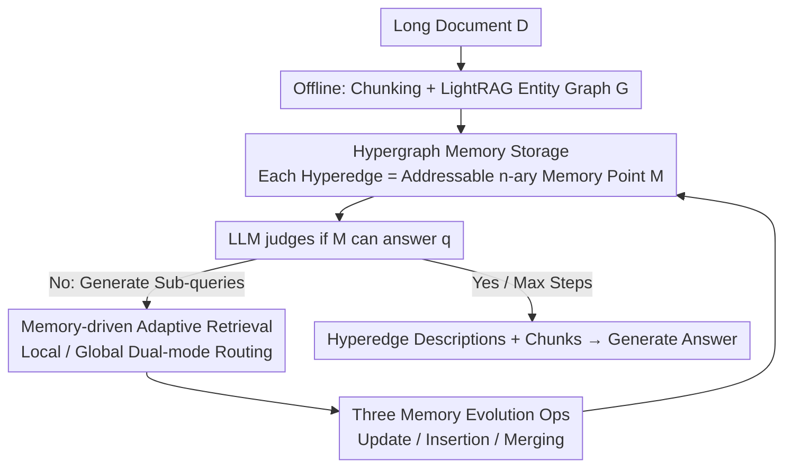

# HGMem: Hypergraph-based Working Memory to Improve Multi-step RAG for Long-Context Complex Relational Modeling

**Conference**: ICML 2026  
**arXiv**: [2512.23959](https://arxiv.org/abs/2512.23959)  
**Code**: https://github.com/Encyclomen/HGMem (Available)  
**Area**: Information Retrieval / RAG / Working Memory / Long-Context Reasoning  
**Keywords**: Hypergraph Memory, Multi-step RAG, High-order Relational Modeling, Global Sense-making, Long Document Understanding

## TL;DR
This paper reconstructs the working memory in multi-step RAG from a "flat list of facts" into a **hypergraph**. Each hyperedge serves as a memory point that can be updated, inserted, or merged. By leveraging the natural ability of hyperedges to connect $n \geq 2$ entities, the memory continuously aggregates low-order facts into high-order concepts during interaction, significantly improving long-context QA performance that requiring "global sense-making."

## Background & Motivation

**Background**: When dealing with complex QA for long documents of 100k+ tokens, single-step RAG is often insufficient. The mainstream approach is multi-step RAG (e.g., IRCOT, ReAct, DeepRAG, ComoRAG), which interleaves retrieval and reasoning while maintaining a working memory to accumulate intermediate states. Memory formats have evolved from unstructured natural language descriptions to structured relational tables, knowledge graphs (KGs), and event logs.

**Limitations of Prior Work**: Existing memories are treated as **static fact repositories** that only append primitive facts. However, human working memory actively **reorganizes scattered facts into higher-order concepts** (Baddeley 2000; Oberauer 2019). This "reorganization capability" is critical for tasks requiring global sense-making, where complex latent connections between events scattered across segments must be aggregated into a unified perspective.

**Key Challenge**: The "edges" in structured memories like KGs and event logs are essentially **binary relations**, which cannot directly express $n$-ary relations where multiple facts constitute a single comprehensive proposition. Conversely, while unstructured descriptions are flexible, they lack traceability to original text and precision for step-wise operations. There is a systematic **trade-off between expressiveness and operability, and between low-order facts and high-order concepts**.

**Goal**: To design a working memory that simultaneously satisfies: (1) precise traceability to original source chunks; (2) precise step-wise operations (update / insert / merge); (3) direct expression of $n$-ary high-order relations; (4) driving retrieval strategies to switch adaptively between "local investigation" and "global exploration."

**Key Insight**: Hypergraphs naturally generalize "edges" to "hyperedges"—a single hyperedge can connect any number of vertices, collapsing complex events (which would require multiple binary edges in a KG) into a single $n$-ary unit. By treating hyperedges as memory points, the hypergraph topology naturally carries the semantics of how facts are organized into concepts.

**Core Idea**: Replace the KG with a **hypergraph** as the working memory for multi-step RAG. Memory points (hyperedges) evolve dynamically via update, insertion, and **merging** operations, with merging being the key step for explicitly constructing high-order relations. Simultaneously, an adaptive "local investigation vs. global exploration" strategy is introduced on the retrieval side, allowing the hypergraph to both store information and guide retrieval paths.

## Method

### Overall Architecture

HGMem addresses the issue where working memory in long-context QA only accumulates primitive facts without expressing comprehensive propositions. It replaces the flat list of facts with an evolvable hypergraph. In the offline phase, long documents $\mathcal{D}$ are split into 200-token chunks (50-token overlap), and entities/binary relations are extracted using GPT-4o + LightRAG to form an entity graph $\mathcal{G}=(\mathcal{V}_{\mathcal{G}}, \mathcal{E}_{\mathcal{G}})$. Entities, relations, and chunks are encoded into a vector database using bge-m3. In the online phase, a hypergraph memory $\mathcal{M}=(\mathcal{V}_{\mathcal{M}}, \tilde{\mathcal{E}}_{\mathcal{M}})$ is maintained, sharing vertices with $\mathcal{G}$ ($\mathcal{V}_{\mathcal{M}}\subseteq \mathcal{V}_{\mathcal{G}}$), but hyperedges can connect $\geq 2$ vertices, each acting as a "memory point" carrying a specific perspective.

The online process is an interactive loop: starting from an initial sub-query $\mathcal{Q}^{(0)}=\{\hat{q}\}$, at each step $t$, the LLM judges if $\mathcal{M}^{(t)}$ can answer $\hat{q}$. If not, it generates new sub-queries $\mathcal{Q}^{(t)}$, routing each to "Local Investigation" or "Global Exploration." Candidate entities $\mathcal{V}_{\mathcal{Q}^{(t)}}$, adjacent relations $\mathcal{E}(\mathcal{V}_{\mathcal{Q}^{(t)}})$, and source chunks $\mathcal{D}(\mathcal{V}_{\mathcal{Q}^{(t)}})$ are retrieved to evolve the memory: $\mathcal{M}^{(t+1)}\leftarrow \mathrm{LLM}(\mathcal{M}^{(t)}, \mathcal{V}_{\mathcal{Q}^{(t)}}, \mathcal{E}(\mathcal{V}_{\mathcal{Q}^{(t)}}), \mathcal{D}(\mathcal{V}_{\mathcal{Q}^{(t)}}))$. This continues until the memory is sufficient or the max steps are reached, at which point hyperedge descriptions and corresponding chunks are fed to the LLM for final generation.

### Key Designs

**1. Hypergraph Memory Storage: $n$-ary Addressable Memory Points**

Standard memory structures like KGs or event logs use binary relations, which split comprehensive propositions into fragmented binary edges, losing holistic semantics. HGMem uses hypergraphs to compress such propositions into single atomic units: vertices $v_i=(\Omega^{ent}_{v_i}, \mathcal{D}_{v_i})$ bind entity descriptions to source chunks, and hyperedges $\tilde{e}_j=(\Omega^{rel}_{\tilde{e}_j}, \mathcal{V}_{\tilde{e}_j})$ bind relational descriptions to the set of connected vertices. Each hyperedge has an independent embedding for direct retrieval; since vertices reside in the offline graph $\mathcal{G}$, hyperedges maintain full traceability. This combines the flexibility of unstructured text with the traceability and operability of structured memory.

**2. Adaptive Memory-driven Retrieval: Local vs. Global Dual-mode Routing**

Multi-step RAG often fluctuates between deep digging of existing clues or aimless global expansion. HGMem requires the LLM to label each sub-query mode. If a sub-query $q$ targets an existing hyperedge $\tilde{e}_j$ (**Local Investigation**), the neighborhood of its vertices $\mathcal{N}(\mathcal{V}_{\tilde{e}_j})=\bigcup_{v\in\mathcal{V}_{\tilde{e}_j}}(\mathcal{N}_{\mathcal{M}^{(t)}}(v)\cup \mathcal{N}_{\mathcal{G}}(v))$ is used as the candidate set for retrieval. For new perspectives (**Global Exploration**), the complement set of entities $\mathcal{C}(\mathcal{M}^{(t)})=\mathcal{V}_{\mathcal{G}}-\mathcal{V}_{\mathcal{M}^{(t)}}$ is used. The hypergraph acts as a retrieval scaffold, allowing the LLM to judge unexplored areas and binding retrieval cost to cognitive stages.

**3. Three Memory Evolution Operations: Update / Insertion / Merging**

This mechanism transforms memory from a passive repository into an active cognitive structure. After retrieval, the LLM performs: **Update** (revising existing hyperedge descriptions with new evidence), **Insertion** (adding newly discovered facts), and **Merging**. Merging scans existing hyperedges to combine those that are semantically or logically unified based on the target query $\hat{q}$, where $\Omega^{rel}_{\tilde{e}_k}\leftarrow \mathrm{LLM}(\Omega^{rel}_{\tilde{e}_i}, \Omega^{rel}_{\tilde{e}_j}, \hat{q})$ and $\mathcal{V}_{\tilde{e}_k}=\mathcal{V}_{\tilde{e}_i}\cup \mathcal{V}_{\tilde{e}_j}$. Merging is the key to the emergence of high-order concepts; without it (Insertion-only), memory remains at the primitive fact level.

All logical decisions—routing, operation selection, and merging—are performed by the LLM (GPT-4o or Qwen2.5-32B-Instruct) in a zero-shot manner.

## Key Experimental Results

### Main Results

Evaluated on 4 long-context sense-making tasks: Longbench V2 (subset), NarrativeQA, NoCha, and Prelude.

| Dataset | Metric | HGMem (GPT-4o) | Prev. SOTA | Gain |
|--------|------|--------------------|--------------------|------|
| Longbench | Comprehensiveness | **65.73** | 63.62 (DeepRAG) | +2.11 |
| Longbench | Diversity | **69.74** | 65.98 (DeepRAG) | +3.76 |
| NarrativeQA | Acc (%) | **55.00** | 54.00 (ComoRAG) | +1.00 |
| NoCha | Acc (%) | **73.81** | 72.22 (HippoRAG v2) | +1.59 |
| Prelude | Acc (%) | **62.96** | 61.48 (LightRAG) | +1.48 |

HGMem using Qwen2.5-32B-Instruct achieved 51.00 on NarrativeQA and 70.63 on NoCha, **matching or exceeding several GPT-4o-driven baselines** (e.g., 51.00 vs. GraphRAG-GPT4o's 53.00 on NarrativeQA).

### Ablation Study

Backbone: Qwen2.5-32B-Instruct.

| Configuration | NarrativeQA Acc | NoCha Acc | Prelude Acc | Note |
|------|-----------------|-----------|-------------|------|
| HGMem (full) | 51.00 | 70.63 | 62.22 | Full Model |
| w/. GE Only | 47.00 | 68.25 | 59.26 | Global Exploration only |
| w/. LI Only | 43.00 | 63.49 | 60.00 | Local Investigation only; significant drop |
| w/o. Update | 50.00 | 68.25 | 60.00 | -1~2 points |
| **w/o. Merging** | **43.00** | **61.11** | **57.78** | **-8~9 points (Most critical)** |

### Key Findings

- **Merging is the core operation**: Removing it causes a 9.52 drop on NoCha, confirming that high-order relations emerge through aggregation rather than simple accumulation.
- **Structural gains on sense-making queries**: On manually labeled "sense-making" queries, the average entities per hyperedge (Avg-$N_v$) jumped from 3.74 to 7.97 after Merging, with accuracy rising synchronously. On "primitive" queries, Avg-$N_v$ and accuracy remained flat, suggesting high-order memory is "activated on demand."
- **Efficiency**: HGMem reaches peak performance at $t=3$ steps.
- **Robustness**: Performance remains leading even when 50% of the offline graph is removed or a lower-quality OpenIE graph is used.

## Highlights & Insights

- **Hypergraph as Memory vs. Index**: Unlike HypergraphRAG which uses hypergraphs as static offline indices, HGMem treats them as **online dynamic working memory**. This places the expressive power of hypergraphs directly at the "reasoning site."
- **Merging-as-cognition**: The insight of merging discrete units based on target anchors is transferable to any multi-step agent beyond RAG, providing a more controllable alternative to long-history self-reflection.
- **Adaptive Routing**: By defining "Local" via the neighborhood of existing hyperedges and "Global" via the memory complement, HGMem aligns retrieval cost with the cognitive phase better than fixed top-k strategies.
- **Avg-$N_v$ as a Metric**: Using the average number of entities per hyperedge as a proxy for "cognitive complexity" provides a mechanistic explanation for performance gains.

## Limitations & Future Work

- **Dependency on strong LLMs**: All decisions rely on zero-shot LLM prompts, which may fail on smaller models (<7B).
- **Cost / Latency Transparency**: Higher overhead due to 3+ LLM rounds and merging prompts; specific cost figures compared to NaiveRAG are primarily in the appendix.
- **Redundancy in Primitive Queries**: Accuracy is slightly lower on simple facts due to over-aggregation tendencies; a more precise "merging trigger" is needed.
- **No Lifelong Learning**: Merging decisions are transient; future work could combine GNNs for scoring or persist hypergraph structures across sessions.

## Related Work & Insights

- **vs. ComoRAG / DeepRAG**: These also use working memory, but their memory remains at the level of fact lists or reasoning traces. HGMem's **structurally operable memory** provides a ~10% lead on sense-making tasks like NoCha.
- **vs. GraphRAG / HippoRAG**: These are single-step graph-enhanced RAG methods focusing on offline indexing (summaries, PageRank). HGMem enables the dynamic growth of "query-specific" high-order concepts.
- **vs. HypergraphRAG / PropRAG**: These use hypergraphs as **static offline indices**. HGMem's use of hypergraphs as **online working memory** represents a complementary research direction.

## Rating

- Novelty: ⭐⭐⭐⭐ Shifting hypergraphs from indexing to working memory with explicit merging is a well-grounded extension of cognitive theory.
- Experimental Thoroughness: ⭐⭐⭐⭐ Comprehensive coverage across datasets, backbones, and ablation types, including deep analysis of primitive vs. sense-making queries.
- Writing Quality: ⭐⭐⭐⭐ Clear motivation, rigorous notation, and intuitive diagrams.
- Value: ⭐⭐⭐⭐ A specific, reproducible paradigm for long-context RAG; particularly significant given that the 32B model matches GPT-4o baselines.

<!-- RELATED:START -->

## Related Papers

- [\[ACL 2026\] HyperMem: Hypergraph Memory for Long-Term Conversations](../../ACL2026/information_retrieval/hypermem_hypergraph_memory_for_long-term_conversations.md)
- [\[ICLR 2026\] Q-RAG: Long Context Multi-Step Retrieval via Value-Based Embedder Training](../../ICLR2026/information_retrieval/q_rag_long_context_multi_step_retrieval.md)
- [\[ICML 2026\] ParisKV: Fast and Drift-Robust KV-Cache Retrieval for Long-Context LLMs](pariskv_fast_and_drift-robust_kv-cache_retrieval_for_long-context_llms.md)
- [\[ICML 2026\] Less Is More: Elevating RAG via Performance-Driven Context Compression](less_is_more_elevating_rag_via_performance-driven_context_compression.md)
- [\[ICML 2026\] Understanding LoRA as Knowledge Memory: An Empirical Analysis](understanding_lora_as_knowledge_memory_an_empirical_analysis.md)

<!-- RELATED:END -->
