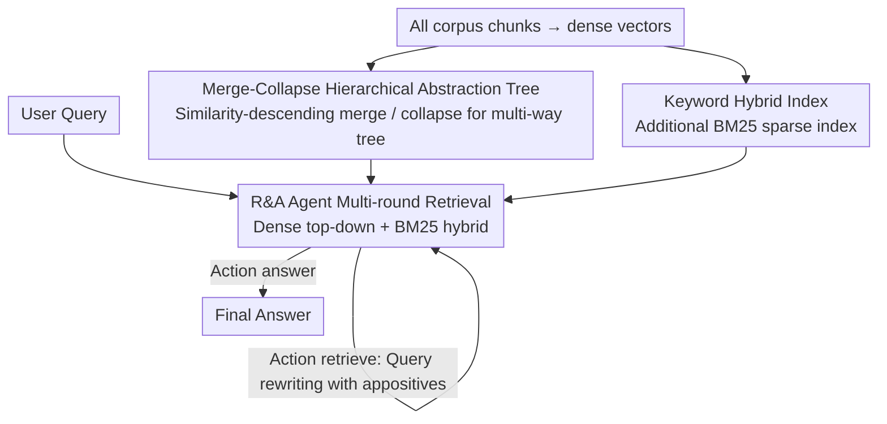

# Hierarchical Abstract Tree for Cross-Document Retrieval-Augmented Generation

**Conference**: ICML 2026  
**arXiv**: [2605.00529](https://arxiv.org/abs/2605.00529)  
**Code**: https://github.com/Newiz430/Psi-RAG (Available)  
**Area**: Information Retrieval / Retrieval-Augmented Generation / Multi-hop QA  
**Keywords**: Tree-RAG, Cross-Document Multi-hop, Hierarchical Abstraction, Agentic Retrieval, Hybrid Sparse Retrieval

## TL;DR
Ψ-RAG replaces the k-means clustering in RAPTOR with a "merge-collapse" hierarchical clustering to construct cross-document abstraction trees. Coupled with a retrieval-answering Agent capable of multi-round rewriting and a hybrid BM25 index, it enables Tree-RAG to match or surpass Graph-RAG in corpus-level cross-document multi-hop QA for the first time, achieving an average F1 score $25.9\%$ higher than RAPTOR and $7.4\%$ higher than HippoRAG 2.

## Background & Motivation

**Background**: Current RAG research follows two primary structural paths. One is Graph-RAG (e.g., GraphRAG, HippoRAG 2), which uses knowledge graphs to explicitly model relationships between documents, offering strong multi-hop capabilities but incurring massive overhead during indexing due to OpenIE. The other is Tree-RAG (represented by RAPTOR), which clusters documents bottom-up using k-means into an abstraction tree, allowing retrieval at token, passage, and document granularities, which is particularly suitable for summarization but mainly serves single-document scenarios.

**Limitations of Prior Work**: Applying Tree-RAG directly to "corpus-level, cross-document, multi-hop" scenarios exposes three problems: (1) k-means clustering implies a spherical distribution assumption, which creates a "uniform effect" in skewed corpora, misallocating documents from major clusters to minor ones and introducing noise; (2) the tree structure lacks explicit links between leaves, preventing the causal jumping across documents found in Graph-RAG; (3) top-level abstractions are too coarse, making it difficult for dense vectors to align specific query entities with high-level abstract concepts.

**Key Challenge**: To retain the multi-granularity advantages of tree structures while acquiring the cross-document causal reasoning capabilities of Graph-RAG, though traditional clustering objectives and static dense matching do not support this goal.

**Goal**: This is decomposed into three sub-problems: (a) designing a hierarchical indexing method that does not rely on distribution assumptions and adapts to skewed corpora; (b) adding cross-document jumping capabilities to the retriever without modifying the tree structure; (c) providing fine-grained evidence channels for the coarse-grained matching of abstract nodes.

**Key Insight**: The authors start from agglomerative hierarchical clustering (AHC), using the Dasgupta cost to prove that this greedy merging naturally prefers "skewed" rather than "uniform" distributions. Furthermore, they borrow from the iterative agent in IRCoT, letting the LLM judge "when to retrieve again." For fine-grained matching, they simply add a BM25 keyword index for hybrid retrieval.

**Core Idea**: Replace k-means tree construction with "similarity ranking → iterative merging & collapse → abstraction," supplemented by an R&A Agent and agentic sparse retrieval, upgrading Tree-RAG into a versatile framework for cross-document multi-hop tasks.

## Method

### Overall Architecture
Ψ-RAG solves the problem of bringing summarization-oriented Tree-RAG to corpus-level cross-document multi-hop scenarios by replacing the indexing, retrieval, and fine-grained matching components. In the indexing phase, instead of k-means, all chunks are encoded as dense vectors and processed in pairs from highest to lowest similarity, iteratively "merging/collapsing" into a multi-way abstraction tree. Leaves are original chunks, and each internal node has a summative summary (or keyword summary) written by an abstraction agent and re-encoded. In the retrieval phase, the query is handed to an R&A Agent: it first performs a hybrid dense top-down and BM25 retrieval, feeds the evidence back into the context, and decides whether to `<answer>` or `<retrieve>`. If the latter is chosen, it rewrites a more specific sub-query for the next round until it answers or exhausts its budget.

### Key Designs

**1. Merge-Collapse Hierarchical Abstraction Tree: Avoiding k-means Distribution Assumptions via Greedy Merging**

The k-means/GMM clustering in RAPTOR implies a spherical distribution assumption. In skewed corpora, this causes documents from majority classes to be misaligned into minority clusters, triggering "uniform effect" noise. Ψ-RAG uses a merge-collapse process similar to agglomerative hierarchical clustering: it calculates a symmetric similarity matrix $S = e(D)e(D)^\top$ and enumerates chunk pairs $(u,v)$ in descending order of similarity, handling three cases: if neither has a parent, a new abstract node $a$ is created where $c(a)=\{u,v\}$ (merging); if $u$ is already under $p(u)$ and $v$ is independent, $v$ is attached to $p(u)$ (leaf node collapse); if both have different roots, they are aligned by depth—if depths match, a common ancestor is created; if they differ, the shallower tree is grafted to the corresponding layer of the deeper tree (abstract node collapse). This process takes exactly $n-1$ steps to connect $n$ chunks into a tree, followed by splitting overly broad nodes to prevent context overflow for the abstraction agent. Its effectiveness is proven via Dasgupta cost first-order analysis: moving a leaf in a perfectly uniform tree reduces the cost, indicating the algorithm naturally dislikes uniformity. In a skewed tree, moving nodes from majority classes to minority ones increases the cost, showing it automatically maintains skewness—thus avoiding the uniform effect of k-means without needing a new training objective.

**2. R&A Agent Driven Multi-round Retrieval: Enabling LLMs to补 out Missing Cross-Doc Links**

Abstract trees lack explicit links between leaf nodes. For multi-hop queries like "Who is the wife of the producer of the documentary about the singer who influenced Beyoncé?", the initial dense match is often dominated by "Beyoncé" or "documentary," missing the intermediate entity (David Gest). Ψ-RAG endows the retriever with the ability to "check if evidence is sufficient, and if not, rewrite the query and search again." The Agent outputs a triple $a=(R,\langle\text{action}\rangle,\cdot)$ at each step, choosing between `<answer>` and `<retrieve>`. When retrieving, it produces a new query $q'_i$, and the result $D^*_i = r(q'_i,\mathcal{T})$ along with the history $\{(I(D^*_j)\cup a_j)\}$ is fed back until an answer is provided or the limit $i_{\max}$ is reached. Each underlying retrieval still uses the top-down beam approach of RAPTOR—starting from the root and taking top-$k$ nodes based on $s(q,u)$ layer by layer. This step essentially uses the LLM to dynamically reconstruct the missing "cross-document links" at search time, replacing the explicit multi-hop reasoning of Graph-RAG with iterative agentic re-retrieval.

**3. Keyword Hybrid Index + Query Rewriting: Providing Fine-Grained Channels for Coarse Abstractions**

Top-level abstract nodes are often too summarized, making it hard for dense vectors to match specific entities in the query. Therefore, the indexing phase builds an additional BM25 sparse index. During retrieval, the Agent fuses dense and sparse top-$k$ results using either a parameterized reranker or non-parametric RRF (reciprocal rank fusion). More cleverly, when the Agent performs `<retrieve>`, it not only rewrites the query but also adds "descriptive appositives" (e.g., supplementing "David Gest's wife" to "The wife of American film producer David Gest"). This helps BM25 capture more thematic keywords while providing high-level context for dense retrieval to locate abstract nodes. Both pathways benefit: BM25 compensates for the coarse granularity of the abstraction tree in literal matching, and query rewriting transforms "short questions" into "long questions with modifiers," making it easier for both sparse and dense retrieval to hit the correct nodes.

The entire process is training-free: encoders, rerankers, and the LLM used for the Agent (Llama-3.3-70B, Qwen3-Embedding-8B) all reuse open-source weights. Indexing relies on similarity ranking and LLM summaries, while retrieval relies on a prompt-controlled Agent. The only hyperparameters requiring adjustment are top-$k$, $i_{\max}$, and the hybrid fusion method.

## Key Experimental Results

### Main Results

| Task (Multi-hop F1) | RAPTOR | HippoRAG 2 | Ψ-RAG (Ours) | Gain vs RAPTOR |
|---|---|---|---|---|
| Avg (HotpotQA / 2Wiki / MuSiQue / MultiHop-RAG) | Baseline | Strong Baseline | +25.9% F1 vs RAPTOR; +7.4% vs HippoRAG 2 | Significant |
| Corpus-level indexing time vs Graph-RAG | — | Slow | ≈10× Faster | — |
| Token-level QA (NQ / PopQA) retrieval | Baseline | — | +23.7% retrieval | Significant |

| Capability Dimension | Traditional RAG | Graph-RAG | Tree-RAG (RAPTOR) | Ψ-RAG |
|---|---|---|---|---|
| Single-document | ✓ | ✓ | ✓ | ✓ |
| Cross-document | Partial | ✓ | Partial | ✓ |
| Token-level QA | ✓ | ✓ | Weak | ✓ |
| Passage-level | Partial | ✓ | ✓ | ✓ |
| Document-level Summary | Weak | Partial | ✓ | ✓ |

### Ablation Study

| Configuration | Key Findings |
|---|---|
| Full Ψ-RAG | Achieved best or near-best performance across all four task types (single-hop, multi-hop, narrative, summarization). |
| w/o R&A Agent | Multi-hop F1 degraded significantly because cross-document jumps were no longer performed. |
| w/o BM25 Hybrid | Token-level factual questions suffered most, proving coarse abstractions need fine-grained compensation. |
| w/o Merge-Collapse (replaced with k-means) | Abstract nodes started mixing with the majority class in skewed corpora, triggering "uniform effect" noise. |

### Key Findings
- On artificially skewed corpora like "Sports[:50] + Business[:5]", RAPTOR's top-level abstract nodes treat majority class (Sports) chunks as minority ones, introducing "confused abstraction" noise. In Ψ-RAG's circular tree visualization, this confusion almost disappears, aligning with Dasgupta cost predictions.
- The core improvement of Ψ-RAG comes from the synergy of "hierarchical abstraction + multi-round Agent." Changing only the indexing improves summarization tasks, while adding only the Agent has limited impact on token-level tasks. Only the combination outperforms Graph-RAG on multi-hop QA.
- Indexing speed is approximately an order of magnitude faster than GraphRAG / HippoRAG 2 because it avoids OpenIE for entity extraction, which is critical for real-world deployment.

## Highlights & Insights
- The use of Dasgupta cost theoretically clarifies that "AHC is inherently resistant to the uniform effect and suitable for skewed distributions." This bridges the gap between "heuristic clustering" and "task performance" with a clean geometric argument, making it more robust than pure empirical comparison.
- "Patch-based enhancement" is placed at two correct locations: the indexing side adds geometric structure, while the retrieval side adds semantic jumps. Finally, BM25 fixes the "coarseness" of abstractions. Each of the three patches addresses a different issue without overlap, a commendable "divide and conquer" engineering approach.
- The small trick of the Agent rewriting queries by adding appositives is nearly zero-cost but helps both dense and sparse pathways. This "lightweight patch for a bottleneck" has high transfer value to other multi-hop search, Code RAG, and long-document QA scenarios.

## Limitations & Future Work
- The latency bottleneck of the system lies entirely in the multiple LLM Agent calls. Latency scales linearly with $i_{\max}$, and the authors do not provide an adaptive strategy for "when to stop."
- The quality of the abstraction tree depends on the summarization capability of the underlying LLM. If smaller local models are used, abstract nodes might lose key entities, causing the dense matching to collapse. The paper does not provide degradation curves for low-cost LLMs.
- "Merging & collapse" is a streaming greedy algorithm sensitive to the order of chunks with very similar scores. In practice, multiple shuffles might be needed before aggregation, but stability is not discussed in depth.
- In comparisons with Graph-RAG, HippoRAG 2's PPR inference is effectively replaced by multi-round Agent retrieval. However, for jumps $\geq 4$, parallel diffusion in explicit graphs might still outperform serial Agent calls. Sensitivity analysis for extreme multi-hop settings is missing.

## Related Work & Insights
- **vs RAPTOR**: Both follow the Tree-RAG route, but RAPTOR uses k-means GMM bottom-up clustering, which triggers the "uniform effect" in skewed corpora. Ψ-RAG uses AHC-style merge-collapse with multi-way rebalancing, avoiding distribution assumptions and natively supporting corpus-level indexing.
- **vs HippoRAG 2 / GraphRAG**: Graph-RAG builds graphs using OpenIE and uses PPR for multi-hop inference, making offline indexing very expensive. Ψ-RAG defers "cross-document relationships" to be dynamically discovered by the Agent at retrieval time, resulting in indexing $\approx 10\times$ faster with superior multi-hop accuracy.
- **vs IRCoT**: IRCoT couples "multi-step reasoning + multi-step retrieval" on a single chain, but the underlying retriever is a single-layer dense index. Ψ-RAG applies similar multi-round ideas on top of an abstraction tree and hybrid retrieval, making it more versatile for multi-granularity tasks.
- Insight: When a static index structure (tree/graph/inverted) alone cannot handle multi-hop, rather than modifying the index structure, "letting the LLM act as a temporary graph during retrieval" is a lower-cost shortcut. This logic can be transferred to Code RAG (jumping by call relationships) or long-paper QA (jumping by citations).

## Rating
- Novelty: ⭐⭐⭐⭐ The combination of "merge-collapse + Dasgupta cost theory + Agent hybrid retrieval" is a first in Tree-RAG, though individual components have precedents.
- Experimental Thoroughness: ⭐⭐⭐⭐ Comparison across four task types, 6 datasets, and multiple baselines with visualization and theory; lacks extreme multi-hop and small model degradation curves.
- Writing Quality: ⭐⭐⭐⭐⭐ Framework diagrams, merge step illustrations, Dasgupta proofs, and visualization comparisons are all well-executed, providing excellent readability.
- Value: ⭐⭐⭐⭐ Elevates Tree-RAG to multi-hop capabilities on par with Graph-RAG, while being training-free and $10\times$ faster in indexing, making it deployment-friendly.

<!-- RELATED:START -->

## Related Papers

- [\[ACL 2025\] Hierarchical Document Refinement for Long-context Retrieval-augmented Generation](../../ACL2025/information_retrieval/hierarchical_document_refinement_for_long-context_retrieval-augmented_generation.md)
- [\[ICML 2026\] LazyAttention: Efficient Retrieval-Augmented Generation with Deferred Positional Encoding](lazyattention_efficient_retrieval-augmented_generation_with_deferred_positional_.md)
- [\[ACL 2025\] Cross-Lingual Relevance Transfer for Document Retrieval](../../ACL2025/information_retrieval/cross-lingual_relevance_transfer_for_document_retrieval.md)
- [\[ICML 2026\] Predictive Prefetching for Retrieval-Augmented Generation](predictive_prefetching_for_retrieval-augmented_generation.md)
- [\[NeurIPS 2025\] Benchmarking Retrieval-Augmented Multimodal Generation for Document Question Answering](../../NeurIPS2025/information_retrieval/benchmarking_retrievalaugmented_multimodal_generation_for_do.md)

<!-- RELATED:END -->
