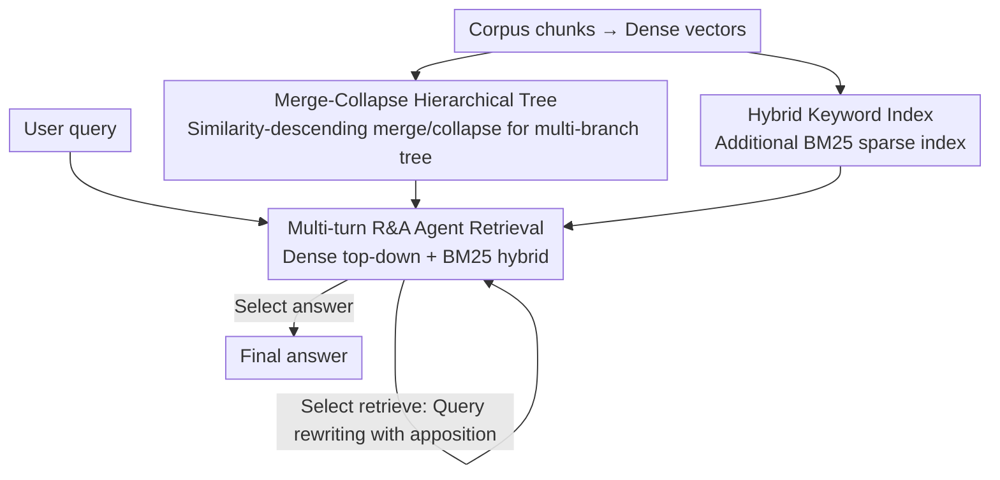

# Hierarchical Abstract Tree for Cross-Document Retrieval-Augmented Generation

**Conference**: ICML 2026  
**arXiv**: [2605.00529](https://arxiv.org/abs/2605.00529)  
**Code**: https://github.com/Newiz430/Psi-RAG (Available)  
**Area**: Information Retrieval / Retrieval-Augmented Generation / Multi-hop QA  
**Keywords**: Tree-RAG, Cross-document Multi-hop, Hierarchical Abstraction, Agentic Retrieval, Hybrid Sparse Retrieval

## TL;DR
Ψ-RAG replaces RAPTOR's k-means with a "merge-collapse" hierarchical clustering to construct cross-document abstraction trees. It incorporates a retrieval-response Agent with multi-turn rewriting capabilities and a hybrid BM25 index, enabling Tree-RAG to match or exceed Graph-RAG in corpus-level, multi-hop QA for the first time. The average F1 score is 25.9% higher than RAPTOR and 7.4% higher than HippoRAG 2.

## Background & Motivation

**Background**: Current RAG follows two primary structural paths. One is Graph-RAG (e.g., GraphRAG, HippoRAG 2), which uses knowledge graphs to explicitly model relationships between documents; while powerful for multi-hop tasks, the heavy reliance on OpenIE during indexing leads to extreme overhead. The other is Tree-RAG (represented by RAPTOR), which performs bottom-up k-means clustering to build abstraction trees. This allows retrieval at token, passage, and document granularities, making it ideal for summarization, though it primarily serves single-document scenarios.

**Limitations of Prior Work**: Directly applying Tree-RAG to "corpus-level, cross-document, multi-hop" scenarios exposes three issues: (1) k-means clustering implicitly assumes a spherical distribution, causing a "uniform effect" in skewed corpora where major cluster documents are misallocated to minority clusters, introducing noise; (2) the tree leaves lack explicit edges, preventing the causal jumps between documents characteristic of Graph-RAG; (3) top-level abstractions are too coarse, making it difficult for dense vectors to align specific entities in a query with high-level abstract concepts.

**Key Challenge**: The goal is to retain the multi-granularity advantages of tree structures while gaining the cross-document causal reasoning capabilities of Graph-RAG. However, traditional clustering objectives and static dense matching do not support this combined objective.

**Goal**: The objective is decomposed into three sub-problems: (a) designing a hierarchical indexing method that does not rely on distribution assumptions and adapts to skewed corpora; (b) introducing cross-document jumping capabilities to the retriever without modifying the tree structure; (c) providing fine-grained evidence channels for the coarse matching of abstract nodes.

**Key Insight**: The authors start from agglomerative hierarchical clustering (AHC), using Dasgupta's cost to prove that greedy merging naturally prefers "skewed" over "uniform" distributions. They then adopt an iterative agent approach similar to IRCoT, delegating the decision of "when to retrieve again" to the LLM, and supplement fine-grained retrieval with a simple BM25 keyword index for hybrid matching.

**Core Idea**: Replace k-means tree construction with "similarity ranking → iterative merging & collapse → abstraction," and add an R&A Agent + agentic sparse retrieval. This upgrades Tree-RAG into a comprehensive framework capable of handling cross-document multi-hop tasks.

## Method

### Overall Architecture
Ψ-RAG extends summarization-oriented Tree-RAG to corpus-level multi-hop scenarios by replacing indexing, retrieval, and fine-grained alignment components. In the indexing phase, k-means is discarded. Instead, all chunks are encoded into dense vectors and processed by pairwise similarity. A multi-branch abstraction tree is iteratively "merged/collapsed"—leaves are original chunks, and each internal node is summarized by an abstraction agent (generating a summary or keywords) and re-encoded. During retrieval, the query is managed by an R&A Agent, which performs a hybrid dense (top-down) + BM25 retrieval. After populating evidence into the context, the agent decides between `<answer>` or `<retrieve>`. Choosing the latter triggers query rewriting for the next round until a final answer is generated or the budget is exhausted.

### Key Designs

**1. Merge-Collapse Hierarchical Tree: Avoiding Distribution Assumptions**

RAPTOR's k-means/GMM clustering assumes spherical distributions. In skewed corpora, this misallocates majority-class chunks into minority clusters, creating "uniform effect" noise. Ψ-RAG utilizes a merge-collapse process similar to agglomerative hierarchical clustering. It calculates a symmetric similarity matrix $S = e(D)e(D)^\top$ and processes chunk pairs $(u,v)$ in descending order of similarity. Three cases are handled: if neither has a parent, a new abstract node $a$ is created where $c(a)=\{u,v\}$ (merging); if $u$ has a parent $p(u)$ but $v$ is independent, $v$ is attached to $p(u)$ (leaf node collapse); if both have different roots, they are aligned by depth, creating a common ancestor if depths match or grafting the shallower tree into the deeper one otherwise (abstract node collapse). This process connects $n$ chunks into a tree in exactly $n-1$ steps. Overly wide nodes are split to prevent exceeding the context limit of the abstraction agent. This is effective because, as proven via Dasgupta's cost, moving a leaf in a perfectly uniform tree reduces cost (showing no inherent preference for uniformity), whereas moving nodes from majority to minority clusters in a skewed tree increases cost, thereby automatically maintaining the skewed distribution.

**2. R&A Agent-Driven Multi-turn Retrieval: LLM-driven Latent Edges**

Leaf nodes in an abstraction tree lack explicit edges. For multi-hop queries like "Who is the wife of the producer of the documentary about the singer who influenced Beyoncé?", initial dense matching is often dominated by "Beyoncé" or "documentary," missing the intermediate entity (David Gest). Ψ-RAG empowers the retriever to evaluate evidence: the agent outputs a triplet $a=(R,\langle\text{action}\rangle,\cdot)$, choosing between `<answer>` or `<retrieve>`. Selecting retrieve generates a new query $q'_i$, and the retrieval results $D^*_i = r(q'_i,\mathcal{T})$ along with the history $\{(I(D^*_j)\cup a_j)\}$ are fed back into the model until an answer is produced or $i_{\max}$ is reached. Each retrieval step uses RAPTOR's top-down beam search. This dynamically restores missing "cross-document edges" using the language model, converting Graph-RAG's explicit multi-hop reasoning into the agent's serial re-retrieval.

**3. Hybrid Keyword Index + Query Rewriting: Fine-grained Channels for Coarse Abstractions**

Coarse top-level abstract nodes make it difficult for dense vectors to match specific entities. Thus, a BM25 sparse index is built. During retrieval, the agent fuses dense and sparse top-$k$ results using a parameterized reranker or non-parametric RRF (Reciprocal Rank Fusion). Critically, when selecting `<retrieve>`, the agent does not just rewrite the query but adds "descriptive appositives" (e.g., expanding "David Gest's wife" to "The wife of American film producer David Gest"). This helps BM25 capture thematic keywords and provides dense retrieval with higher-level context to locate abstract nodes. Consequently, both paths benefit: BM25 compensates for the coarse granularity of the tree, while query rewriting transforms short questions into long ones with modifiers, facilitating hits on correct nodes for both sparse and dense retrieval.

Ours is entirely training-free: encoders, rerankers, and the agent's LLM (Llama-3.3-70B, Qwen3-Embedding-8B) use open-source weights. Indexing relies on similarity ranking + LLM summarization, and retrieval is controlled via prompts. Only three hyperparameters require tuning: top-$k$, $i_{\max}$, and the hybrid fusion method.

## Key Experimental Results

### Main Results

| Task (Multi-hop F1) | RAPTOR | HippoRAG 2 | Ψ-RAG (Ours) | Relative Gain vs RAPTOR |
|---|---|---|---|---|
| HotpotQA / 2Wiki / MuSiQue / MultiHop-RAG Avg | Baseline | Strong Baseline | +25.9% F1 vs RAPTOR; +7.4% vs HippoRAG 2 | Significant |
| Corpus-level Indexing Time vs Graph-RAG | — | Slow | ≈10× Faster | — |
| Token-level QA (NQ / PopQA) retrieval | Baseline | — | +23.7% retrieval | Significant |

| Capabilities | Traditional RAG | Graph-RAG | Tree-RAG (RAPTOR) | Ψ-RAG |
|---|---|---|---|---|
| Single-document | ✓ | ✓ | ✓ | ✓ |
| Cross-document | Partial | ✓ | Partial | ✓ |
| Token-level QA | ✓ | ✓ | Weak | ✓ |
| Passage-level | Partial | ✓ | ✓ | ✓ |
| Document-level Summary | Weak | Partial | ✓ | ✓ |

### Ablation Study

| Configuration | Key Findings |
|---|---|
| Full Ψ-RAG | Achieved best or near-best performance across all four task types (single-hop, multi-hop, narrative, summarization). |
| w/o R&A Agent | Multi-hop F1 degraded significantly due to the loss of cross-document jumping capabilities. |
| w/o BM25 Hybrid | Token-level factual questions were most affected, proving coarse abstractions need fine-grained support. |
| w/o Merge-Collapse (k-means) | On skewed corpora, abstract nodes began mixing into the majority class, triggering "uniform effect" noise. |

### Key Findings
- On artificial skewed corpora (e.g., "Sports[:50] + Business[:5]"), RAPTOR's top-level nodes misclassify majority-class (Sports) chunks as minority-class, introducing "confused abstraction" noise. In Ψ-RAG, this confusion nearly disappears, aligning with Dasgupta cost predictions.
- The primary improvement in Ψ-RAG stems from the synergy between "hierarchical abstraction" and "multi-turn agent retrieval." Changing only the indexing improves only summarization tasks; adding only the agent has limited impact on token-level tasks. Combined, they outperform Graph-RAG on multi-hop QA.
- Indexing speed is approximately one order of magnitude faster than GraphRAG/HippoRAG 2 because it bypasses OpenIE entity extraction, which is critical for practical deployment.

## Highlights & Insights
- The theoretical explanation using Dasgupta's cost—proving that AHC is inherently resistant to the uniform effect and suited for skewed distributions—bridges the gap between heuristic clustering and task performance with a clean geometric argument.
- "Patch-style enhancements" are applied at the correct locations: the indexing end fixes geometric structure, the retrieval end adds semantic jumps, and BM25 fixes "coarse abstraction." Each patch addresses a specific "disease" without overlap, representing an effective "divide and conquer" engineering approach.
- The query rewriting trick (adding appositives) is virtually cost-free but benefits both dense and sparse paths. This "lightweight patch at a bottleneck" is highly transferable to other tasks like Code RAG or long-document QA.

## Limitations & Future Work
- The system's latency bottleneck lies entirely in the multi-turn LLM agent calls; latency scales linearly with $i_{\max}$, and no adaptive strategy for "when to stop" is provided.
- Abstraction quality depends on the LLM's summarization capability. If smaller local models are used, abstract nodes might lose key entities, potentially causing dense matching to collapse. The paper does not provide degradation curves for low-cost LLMs.
- "Merge & collapse" is a streaming greedy algorithm sensitive to the order of chunks with very similar scores. Stability across multiple shuffles and aggregations is not discussed.
- In comparisons with Graph-RAG, HippoRAG 2's PPR reasoning is effectively replaced by multi-turn agent retrieval. However, for jumps $\geq 4$, the parallel diffusion of explicit graphs might still outperform serial agent calls; no sensitivity analysis for ultra-multi-hop settings was conducted.

## Related Work & Insights
- **vs RAPTOR**: Both follow the Tree-RAG path, but RAPTOR's bottom-up clustering with k-means/GMM triggers the "uniform effect" in skewed corpora. Ψ-RAG uses AHC-style merging-collapse with multi-branch rebalancing to avoid distribution assumptions and natively support corpus-level indexing.
- **vs HippoRAG 2 / GraphRAG**: Graph-RAG uses OpenIE for graph construction and PPR for multi-hop reasoning, making offline indexing very expensive. Ψ-RAG defers "cross-document relationship" discovery to the agent at retrieval time, making indexing ~10× faster while exceeding multi-hop accuracy.
- **vs IRCoT**: IRCoT couples multi-step reasoning and retrieval in one chain, but the underlying retriever is single-layer dense. Ψ-RAG applies similar multi-turn logic on top of abstraction trees and hybrid retrieval, making it more versatile for multi-granularity tasks.
- Insight: When a static index (tree/graph/inverted) cannot handle multi-hop tasks alone, using the LLM as a "temporary graph" during retrieval is a lower-cost shortcut. This can be extended to Code RAG (jumping by call relationships) or scientific paper QA (jumping by citations).

## Rating
- Novelty: ⭐⭐⭐⭐ The combination of "merge-collapse + Dasgupta cost theory + hybrid agent retrieval" is a first for Tree-RAG, though individual components have precedents.
- Experimental Thoroughness: ⭐⭐⭐⭐ Comparison across four task types, six datasets, and multiple baselines, supported by visualization and theory; lacks analysis on ultra-multi-hop and small model degradation.
- Writing Quality: ⭐⭐⭐⭐⭐ Excellent framework diagrams, merging step illustrations, Dasgupta proofs, and visual comparisons.
- Value: ⭐⭐⭐⭐ Elevates Tree-RAG to Graph-RAG levels of multi-hop capability while being training-free and 10× faster at indexing, making it deployment-friendly.

<!-- RELATED:START -->

## Related Papers

- [\[ICLR 2026\] Hierarchical Encoding Tree with Modality Mixup for Cross-modal Hashing](../../ICLR2026/information_retrieval/hierarchical_encoding_tree_with_modality_mixup_for_cross-modal_hashing.md)
- [\[ICLR 2026\] CFT-RAG: An Entity Tree Based Retrieval Augmented Generation Algorithm With Cuckoo Filter](../../ICLR2026/information_retrieval/cft-rag_an_entity_tree_based_retrieval_augmented_generation_algorithm_with_cucko.md)
- [\[ACL 2025\] Hierarchical Document Refinement for Long-context Retrieval-augmented Generation](../../ACL2025/information_retrieval/hierarchical_document_refinement_for_long-context_retrieval-augmented_generation.md)
- [\[ICML 2026\] LazyAttention: Efficient Retrieval-Augmented Generation with Deferred Positional Encoding](lazyattention_efficient_retrieval-augmented_generation_with_deferred_positional_.md)
- [\[ICML 2026\] Vector Linking based on Cross-Model Local Isometric Consistency](vector_linking_via_cross-model_local_isometric_consistency.md)

<!-- RELATED:END -->
