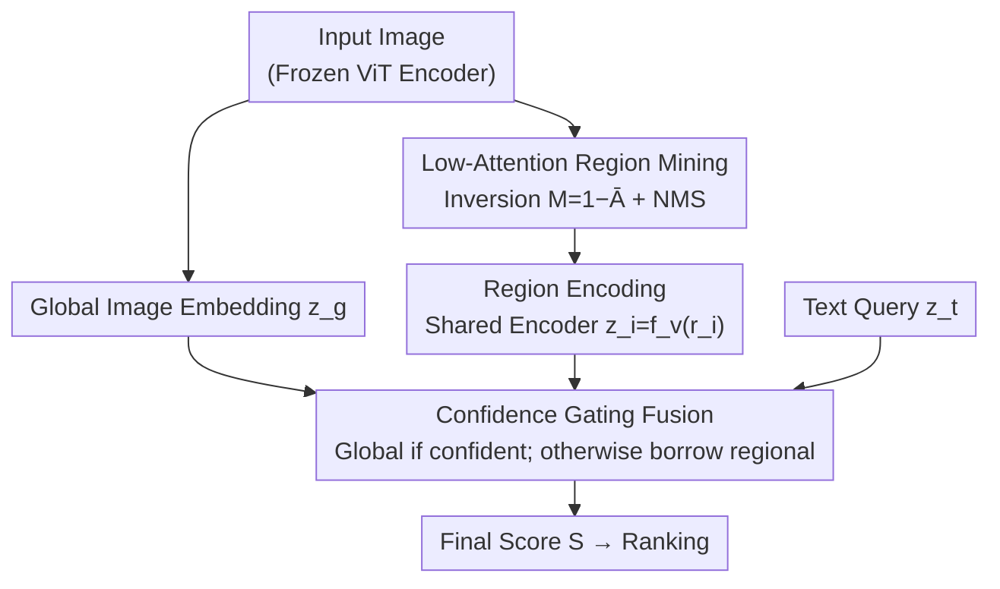

# LARE: Low-Attention Region Encoding for Text–Image Retrieval

**Conference**: ICML2026  
**arXiv**: [2606.18885](https://arxiv.org/abs/2606.18885)  
**Code**: https://github.com/AbdulmalikDS/LARE  
**Area**: Information Retrieval / Multimodal VLM  
**Keywords**: Text–Image Retrieval, Low-Attention Regions, Training-free, Attention Inversion, Dense Scenes

## TL;DR
LARE is a **training-free** text–image retrieval framework: it extracts "low-attention" regions from a frozen vision encoder, re-encodes them, and integrates them into global similarity scores via confidence gating. This significantly improves recall for CLIP/SigLIP-style dual-encoders in crowded scenes with small or rare objects while maintaining performance on standard datasets.

## Background & Motivation

**Background**: The mainstream of text–image retrieval is dominated by dual-encoder models such as CLIP, ALIGN, and SigLIP. These models project images and text into a shared semantic space and rank results using direct similarity between global vectors. This paradigm is efficient and zero-shot transferable, becoming a de facto standard.

**Limitations of Prior Work**: Dual-encoders compress the entire image into **a single global vector**. This representation naturally favors prominent subjects or global context while "averaging out" small or non-salient elements. Consequently, when a query's key clue lies in a non-dominant small object (e.g., "a stroller in a crowded street"), the model often matches the "crowded street" context but loses the local clue that determines relevance.

**Key Challenge**: There is a fundamental tension between the **salience bias** of global pooling and the local evidence required for fine-grained retrieval. The more an image is summarized into a single vector, the more likely rare or small objects are erased. The authors note that this is an inherent property of global embeddings that even powerful encoders like SigLIP 2 cannot eliminate through scale alone.

**Goal**: To recover region-level evidence ignored by global representations without **retraining, adding parameters, or changing architecture**, utilizing it only when necessary to avoid degrading standard queries.

**Key Insight**: Self-attention in Transformer-based vision encoders **implicitly encodes spatial signals**, indicating which patches contribute least to the final embedding. Instead of only trusting the global vector, one can exploit these signals to locate "under-attended" regions.

**Core Idea**: Invert the attention maps to pinpoint low-attention regions, use the same frozen encoder to represent these regions, and combine these scores with global similarity using a confidence-gated mechanism—effectively "patching" salience bias with low-attention region encoding.

## Method

### Overall Architecture

LARE is an **inference-time enhancement** built on existing dual-encoders (CLIP/SigLIP/SigLIP 2). It runs in a single forward pass through three steps: (1) Low-attention region detection—localizing ignored areas from self-attention; (2) Region encoding—encoding these areas into the same semantic space; (3) Confidence-gated scoring—fusing global and regional similarity based on "global confidence." The authors also introduce the **Dense-Set** evaluation benchmark to isolate salience bias issues.

### Key Designs

**1. Low-Attention Region Mining: Inverting attention maps to localize ignored areas**

The pain point is that global vectors erase small/rare objects, which correspond to areas the encoder "ignores." LARE extracts patch-to-patch attention matrices $\mathbf{A}^{(h)}\in\mathbb{R}^{HW\times HW}$ from an intermediate layer $\ell$. It measures the total attention received by each patch $i$ via **column sums**: $a_i^{(h)}=\sum_j A_{j,i}^{(h)}$. These maps are reshaped, normalized, and averaged across the top-$k$ heads with the highest spatial variance to produce an average attention map $\bar{\mathbf{A}}$. Crucially, this map is **inverted**: $\mathbf{M}=\mathbf{1}-\bar{\mathbf{A}}$. High values in $\mathbf{M}$ indicate under-attended patches. Sliding windows and Non-Maximum Suppression (NMS) are applied to $\mathbf{M}$ to extract $N$ candidate regions $\mathcal{R}=\{r_1,\dots,r_N\}$. Unlike methods requiring external detectors, these signals are extracted directly from pre-computed attention.

**2. Region Encoding with Shared Encoder: Training-free reuse of feature space**

Extracted regions must be comparable to text. LARE encodes each candidate region using the **same frozen encoder** $f_v$: $\mathbf{z}_i=f_v(r_i),\ i=1,\dots,N$, yielding a set of regional features $\{\mathbf{z}_1,\dots,\mathbf{z}_N\}$. Because weights are shared, these regional embeddings reside in the **same feature space** as global embeddings, allowing direct similarity computation without additional projection or alignment. This is the key to it being "training-free and plug-and-play."

**3. Confidence Gating Fusion: Borrowing regional evidence only when global confidence is low**

A strategy is needed to merge regional and global scores. Prior video retrieval works used **hard-max** (taking the maximum of global or regional scores), but this risks magnifying false regional matches when the global embedding is already accurate. LARE employs **confidence gating**: let $s_g = \text{sim}(\mathbf{z}_t, \mathbf{z}_g)$ and $s_r = \max_i \text{sim}(\mathbf{z}_t, \mathbf{z}_i)$. If $s_g$ exceeds a threshold $\tau$, the final score **follows the global score** $S=s_g$. Only when $s_g < \tau$ and a region matches better than the global vector ($s_r > s_g$) is the regional evidence interpolated:

$$\alpha=\min\bigl(2(s_r-s_g),\,0.5\bigr),\qquad S=(1-\alpha)\,s_g+\alpha\,s_r$$

With $\tau=0.25$ and $\alpha$ capped at 0.5, the global score remains dominant. This gating ensures **"no-regression for standard queries, recovery for dense queries"**: most standard queries target dominant content where global confidence is high, while regional evidence is activated only when global representations fail.

**4. Dense-Set Evaluation: Isolating salience bias via density ranking and rare-class filtering**

To verify the utility of capturing low-attention regions, a benchmark targeting fine-grained retrieval is necessary, as standard COCO/Flickr30K captions describe dominant scenes. The authors build **Dense-Set**: they use a YOLO detector on COCO and Flickr30K test sets, rank images by total object count, and select the **top 10%** as high-density candidates (average objects increase from ~6.7 to ~20). They further filter for images containing at least one **"rare class"** (a single-instance category in that image). Finally, BLIP-2 is used for **caption rewriting**: rare classes occupying >15% area are filtered to avoid saliency, and class-aware templates are used to prompt BLIP-2 to shift caption focus to these ignored objects. This yields a benchmark that specifically exposes salience bias.

### Loss & Training
LARE requires **no training**: all encoder weights are frozen. The method operates strictly during inference with no additional parameters or architecture modifications. Key hyperparameters include the number of regions $N$ and the confidence threshold $\tau=0.25$.

## Key Experimental Results

### Main Results
Evaluated in a zero-shot retrieval setting (no fine-tuning on target benchmarks) using Recall@K. The table below shows R@1 (%), demonstrating that LARE maintains performance on standard splits while significantly boosting Dense-Set:

| Backbone / Method | COCO R@1 | Flickr30K R@1 | COCO-Dense R@1 | Flickr30K-Dense R@1 |
|------|------|------|------|------|
| CLIP (L/14) | 36.10 | 65.00 | 17.79 | 3.48 |
| **LARE (CLIP)** | 36.10 | 65.00 | **22.97** (+5.18) | **9.73** (+6.25) |
| SigLIP (So/14) | 54.24 | 82.94 | 26.61 | 5.05 |
| **LARE (SigLIP)** | 54.26 | 82.94 | **29.94** (+3.33) | **12.33** (+7.28) |
| SigLIP 2 (So/16) | 56.55 | 83.72 | 27.56 | 5.12 |
| **LARE (SigLIP 2)** | 56.56 | 83.76 | **31.00** (+3.44) | **13.28** (+8.16) |

CLIP achieves a ~29% relative improvement on COCO-Dense. On Flickr30K-Dense, the gains are even more dramatic: CLIP +6.25 (+180% relative), SigLIP +7.28 (+144%), and SigLIP 2 +8.16 (+159%). The consistent benefit across backbones proves salience bias is a universal issue in global embeddings.

### Key Findings
- **"No-regression" by design**: The negligible change on standard splits is due to the confidence gate letting confident global scores pass through. Gains are isolated to fine-grained scenarios.
- **Greater gains on sparse labels**: Flickr30K-Dense benchmarks have extremely low baseline R@1 (3–5%), which LARE triples, proving low-attention regions contain critical relevance clues.
- **Backbone-agnostic**: Performance improves stably from CLIP to SigLIP 2, qualifying LARE as a general post-processing tool.

## Highlights & Insights
- **Clever Attention Inversion**: While most work focuses on "where the encoder looks," LARE looks at "where the encoder ignores," turning the same attention signal into a new source of evidence.
- **Robust Gating**: Replacing hard-max with confidence gating avoids amplifying false regional matches, providing an elegant engineering solution for "global+local" scoring.
- **Training-free Deployment**: Since it involves zero weight changes or architecture modifications, LARE can be added to existing CLIP/SigLIP systems with minimal friction.
- **Dense-Set Benchmark**: The pipeline of density ranking + rare class filtering + VLM rewriting fills an evaluation gap for fine-grained retrieval in dense scenes.

## Limitations & Future Work
- **Inference Overhead**: Encoding $N$ extra regions per image increases computational cost, requiring a trade-off in large-scale indexing.
- **Dependency on Attention Quality**: The reliability of low-attention regions depends on whether the frozen encoder's attention maps accurately reflect semantic importance.
- **Rewriting Bias**: The use of BLIP-2 and heuristic thresholds (e.g., 15% area) for Dense-Set might introduce specific data biases.
- **Hyperparameter Tuning**: $\tau$ and $\alpha$ are empirical values that might require recalibration for different domains.

## Related Work & Insights
- **vs CLIP / SigLIP / ALIGN (Global Dual-Encoders)**: These suffer from salience bias; LARE supplements them with regional evidence without retraining.
- **vs FILIP / RegionCLIP / ELIP (Fine-grained/Region Alignment)**: Unlike these, which require expensive retraining or modified architectures, LARE is strictly inference-time.
- **vs Video Retrieval with Inverse Attention (Alhajari et al., 2026)**: While sharing similar logic, LARE focuses on image retrieval and introduces confidence gating to prevent performance regression on standard queries.

## Rating
- Novelty: ⭐⭐⭐⭐
- Experimental Thoroughness: ⭐⭐⭐⭐
- Writing Quality: ⭐⭐⭐⭐
- Value: ⭐⭐⭐⭐

<!-- RELATED:START -->

## Related Papers

- [\[ICLR 2026\] Bayesian Attention Mechanism: A Probabilistic Framework for Positional Encoding and Context Length Extrapolation](../../ICLR2026/information_retrieval/bayesian_attention_mechanism_a_probabilistic_framework_for_positional_encoding_a.md)
- [\[ACL 2026\] VisRet: Visualization Improves Knowledge-Intensive Text-to-Image Retrieval](../../ACL2026/information_retrieval/visret_visualization_improves_knowledge-intensive_text-to-image_retrieval.md)
- [\[ICML 2026\] LazyAttention: Efficient Retrieval-Augmented Generation with Deferred Positional Encoding](lazyattention_efficient_retrieval-augmented_generation_with_deferred_positional_.md)
- [\[ACL 2026\] Reliable Evaluation Protocol for Low-Precision Retrieval](../../ACL2026/information_retrieval/reliable_evaluation_protocol_for_low-precision_retrieval.md)
- [\[ACL 2025\] LDIR: Low-Dimensional Dense and Interpretable Text Embeddings with Relative Representations](../../ACL2025/information_retrieval/ldir_low-dimensional_dense_and_interpretable_text_embeddings_with_relative_repre.md)

<!-- RELATED:END -->
