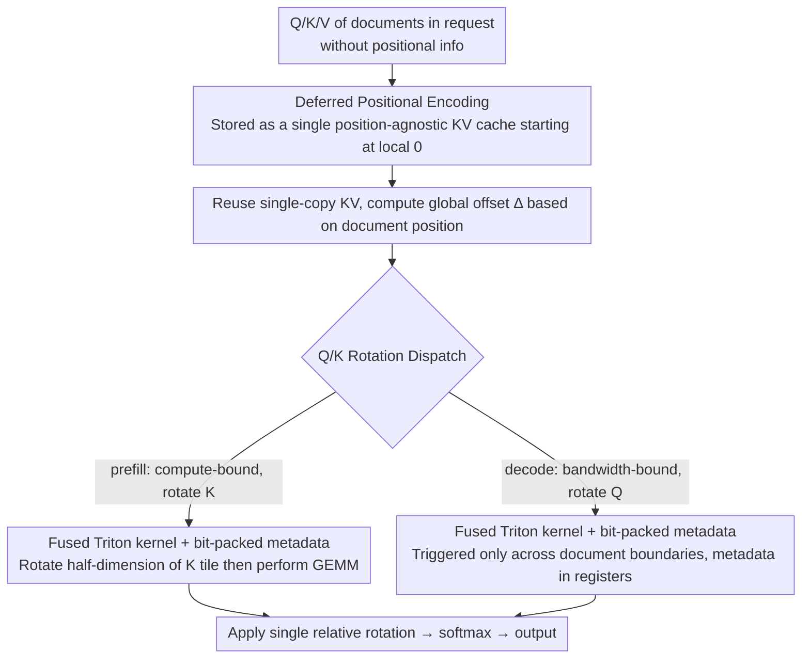

# LazyAttention: Efficient Retrieval-Augmented Generation with Deferred Positional Encoding

**Conference**: ICML 2026  
**arXiv**: [2606.04302](https://arxiv.org/abs/2606.04302)  
**Code**: https://github.com/illinoisdata/lazy-attention  
**Area**: LLM Serving Efficiency / RAG / KV Cache  
**Keywords**: KV cache reuse, RoPE decoupling, fused attention kernel, position-agnostic cache, vLLM

## TL;DR
LazyAttention defers RoPE positional encoding from the KV cache write stage to on-the-fly execution within the attention kernel. This allows a single physical KV copy to be reused by any logical position. On skewed RAG workloads, it reduces TTFT by 1.37× and improves throughput by 1.40× compared to SOTA Block-Attention, with negligible loss in generation quality.

## Background & Motivation
**Background**: In long-context scenarios like RAG and ICL, prefill is the latency bottleneck, and KV cache reuse is the primary method for cost reduction. Methods such as Prompt Cache, CacheBlend, TurboRAG, and Block-Attention attempt to reuse KV caches across requests to avoid redundant document computation.

**Limitations of Prior Work**: Current KV caches are **position-aware**, meaning positional information is eagerly encoded into K (e.g., RoPE applied directly) before writing to cache. This forces the storage of multiple KV copies when the same document appears at different positions. Block-Attention and TurboRAG choose to re-encode positions, but this requires copying KV or limits reuse to prefixes; in-place updates introduce race conditions within the same batch.

**Key Challenge**: Cache reuse is limited by GPU HBM capacity, while position-aware designs waste capacity on "different position variants of the same document." Quantitative analysis shows that given Zipf popularity, $D$ potential positions, and a budget of $C$ KV entries, position-agnostic caching can store the top-$C$ documents, while position-aware caching only stores $\lfloor C/D \rfloor$. The hit ratio ratio is $\sum_{i=1}^{C} i^{-\alpha} / \sum_{i=1}^{\lfloor C/D \rfloor} i^{-\alpha}$, which can reach 2.86× at $D=20, C=100$ under moderate Zipf skew.

**Goal**: Achieve truly position-agnostic KV caching without increasing HBM copy overhead or significantly raising the computation/bandwidth costs of the attention kernel.

**Key Insight**: A core fact of RoPE is that attention scores only depend on the **relative** position $n-m$, i.e., $(R_m q)^\top (R_n k) = q^\top R_{n-m} k$. This implies that positional encoding can theoretically be applied "on the spot" during attention calculation rather than being pre-baked into K.

**Core Idea**: Kernelize **RoPE-decoupling**. Defer positional encoding until the inner loop of a fused Triton attention kernel. This ensures zero-copy and zero extra HBM writes, allowing a single KV copy to serve requests at any logical position.

## Method

### Overall Architecture
LazyAttention addresses the issue of KV caches being inflated by position variants. It shifts the timing of positional encoding for the Transformer block: Q/K/V are written to the KV cache without any positional information, with each document stored as "pure content key-value pairs" starting from local position 0. During inference, the fused attention kernel applies a relative rotation $R_\Delta$ to Q or K on-the-fly based on the global offset $\Delta$ of that document in the current request. Since RoPE attention scores only depend on relative positions ($(R_m q)^\top(R_n k)=q^\top R_{n-m}k$), this "on-the-spot" algorithm is mathematically equivalent to standard RoPE where K is pre-rotated, but only one physical KV copy is needed.

### Key Designs

**1. Deferred Positional Encoding: Deferring RoPE from Caching to Attention**

Position-aware caching eagerly bakes positions into K, requiring separate KV copies for each position a document occupies. LazyAttention leverages the relativity of RoPE ($q^\top R_{n-m}k$) to cache Q/K/V without positions. During attention, it uses an offset $\Delta$ to perform a single half-dimension rotation on K (or Q): $k'_1 = k_1\cos\Delta - k_2\sin\Delta, k'_2 = k_1\sin\Delta + k_2\cos\Delta$. Crucially, this is a **single relative rotation** rather than a naive "rotate back to 0, then to target," which would double decoding FLOPs/IO. This makes the KV cache position-agnostic, allowing a fixed HBM budget to cover more documents and increasing hit ratios according to the Zipf formula.

**2. Tiling-aware Q/K Rotation Dispatch: Rotate K for Prefill, Q for Decode**

The feasibility of deferred RoPE depends on minimizing overhead. Since prefill and decode have different bottlenecks, the choice of which side to rotate differs. Prefill is compute-bound, and with PagedAttention defaults ($M=128, N=16$), the Q tile is much larger than the K tile, making rotating K cheaper: each K scalar adds only 3 FLOPs, with relative overhead $\epsilon_{\text{prefill}}=\tfrac{3}{4M}\approx 0.59\%$. Decode is bandwidth-bound ($M=1$), where rotating K would scan the entire tile; thus, rotating Q is preferred. This is only triggered when the KV tile crosses document boundaries at a rate $r=1/B$ ($B$ is the number of blocks per document). The average overhead $\epsilon_{\text{decode}}=r\cdot\tfrac{3}{4N}=\tfrac{3}{4BN}$ is $\le 0.01\%$ for documents >1600 tokens.

**3. Fused Triton Kernel + Bit-packed Metadata: Bringing Savings End-to-End**

To avoid overhead from extra HBM access or register spills, deferred rotation is implemented within fused kernels. Two independent kernels were developed: the prefill kernel performs half-dimension rotation on each K tile before GEMM, and the decode kernel **bit-packs (block id, offset, mask) into a single 64-bit register**. The inner loop uses register shifts to extract metadata, bypassing global loads. End-to-end runtime overhead is measured at ~0.2%. This mechanism is also compatible with interleaved RoPE, NTK/YaRN scaled RoPE, and GQA/MQA.

## Key Experimental Results

### Main Results
Model: Tulu3-Block-FT (Llama-3.1-8B derivative), H100 96GB. Benchmarks: 2WikiMQA, HotpotQA, TriviaQA, NarrativeQA.

**TTFT and Throughput**: Under skewed traffic (Zipf $\alpha=2.1$), TTFT is reduced by 1.37× and throughput increased by 1.40× compared to Block-Attention (vLLM). Under uniform traffic, performance is parity with Block-Attn and significantly better than Prefix Caching or CacheBlend.

**KV VRAM Hit Ratio** (%):

| KV Budget | Skew | Prefix | CacheBlend | Block-Attn (vLLM) | Ours |
|--------|------|--------|------------|-------------------|-----------------|
| 1 GB | High (α=2.1) | 0.00 | 5.96 | 7.27 | **13.57** |
| 1 GB | Low (α=1.1) | 0.00 | 1.51 | 1.84 | **3.47** |
| 10 GB | Mid | 0.55 | 17.33 | 21.13 | **23.89** |
| 50 GB | Mid | 1.95 | 21.87 | 26.67 | **28.44** |
| No-limit (~66 GB) | Mid | 2.16 | 22.45 | 27.38 | **29.09** |

Hit ratios nearly double under tight constraints and maintain a steady lead under relaxed budgets.

**Generation Quality** (Exact Match):

| Dataset | Full-Attn | Block-Attn (vLLM) | Ours |
|--------|-----------|-------------------|----------|
| 2WikiMQA | 73.6 | 71.4 | 70.7 |
| TriviaQA | 75.2 | 72.1 | 73.0 |
| NarrativeQA | 62.2 | 61.0 | 59.7 |
| HotpotQA | 76.2 | 72.5 | 73.3 |
| Average | 71.8 | 69.3 | 69.2 |

Ours is mathematically equivalent to Block-Attention; score differences stem from tokenization and floating-point variance.

### Ablation Study
Single RAG request (5 × 4096-token documents + 64-token query, 3 documents hot):

| Stage | Key Finding |
|------|----------|
| Document processing | Latency for hot documents drops to near zero (no re-computation); baseline is dominated by re-computation costs. |
| Query prefilling | Parity with baseline; extra FLOPs for K tile rotation is only $3/(4M)$. |
| Decoding | Extra overhead per token is 0.13%, consistent with theoretical $r \cdot 3/(4N)$. |

### Key Findings
- Benefits stem from a **capacity multiplier**: Position-agnostic caching allows more documents in the same HBM, directly improving TTFT/throughput via higher hit ratios, especially for small budgets and skewed traffic.
- Decode overhead $\le 0.2\%$ is a critical engineering result achieved by (a) rotating Q instead of K, (b) triggering only at boundaries, and (c) bit-packing metadata into registers.
- Consistent trends across different GPUs (A100/A40) and larger models (Llama-3.1-70B) demonstrate the mechanism's robustness.

## Highlights & Insights
- **Reducing reuse to "position dependency"**: The authors use a Zipf hit ratio formula to pinpoint the bottleneck of KV cache reuse—not the strategy, but the position-aware representation itself.
- **Kernel-aware algorithm design**: The choice of rotating K for prefill and Q for decode is derived directly from the roofline model and tiling shapes, representing effective hardware-software co-design.
- **Transferable idea**: The deferred encoding concept can be generalized to other score-space positional encodings or used to "defer materialization" in MoE routing or speculative decoding caches.

## Limitations & Future Work
- Not applicable to linear attention, where the state entails sequence summation rather than score-level position injection.
- Cannot handle cases where document content is modified; assumes cached chunks are identical across requests except for their positions.
- Implementation depends on specific vLLM/Triton paths; migration to other frameworks (SGLang, TensorRT-LLM) requires rewriting bit-packed and fused paths.

## Related Work & Insights
- **vs Block-Attention / TurboRAG**: While they also decouple RoPE, they materialize position-adjusted KV copies, leading to HBM overhead or prefix-only reuse. Ours uses fused kernel rotations to eliminate this trade-off.
- **vs CacheBlend**: CacheBlend uses mask reconstruction for accuracy but remains within a position-aware framework. Ours offers significantly better TTFT and hit ratios in skewed traffic.
- **vs Prompt Cache / Prefix Caching**: Limited to strict prefix reuse; ours allows reuse at any offset at the document level.

## Rating
- Novelty: ⭐⭐⭐⭐
- Experimental Thoroughness: ⭐⭐⭐⭐
- Writing Quality: ⭐⭐⭐⭐
- Value: ⭐⭐⭐⭐⭐

<!-- RELATED:START -->

## Related Papers

- [\[ICLR 2026\] Bayesian Attention Mechanism: A Probabilistic Framework for Positional Encoding and Context Length Extrapolation](../../ICLR2026/information_retrieval/bayesian_attention_mechanism_a_probabilistic_framework_for_positional_encoding_a.md)
- [\[ICLR 2026\] HiPRAG: Hierarchical Process Rewards for Efficient Agentic Retrieval Augmented Generation](../../ICLR2026/information_retrieval/hiprag_hierarchical_process_rewards_for_efficient_agentic_retrieval_augmented_ge.md)
- [\[ICML 2026\] LARE: Low-Attention Region Encoding for Text–Image Retrieval](lare_low-attention_region_encoding_for_text-image_retrieval.md)
- [\[ICML 2026\] Hierarchical Abstract Tree for Cross-Document Retrieval-Augmented Generation](hierarchical_abstract_tree_for_cross-document_retrieval-augmented_generation.md)
- [\[ICML 2026\] ML-Embed: Inclusive and Efficient Embeddings for a Multilingual World](ml-embed_inclusive_and_efficient_embeddings_for_a_multilingual_world.md)

<!-- RELATED:END -->
