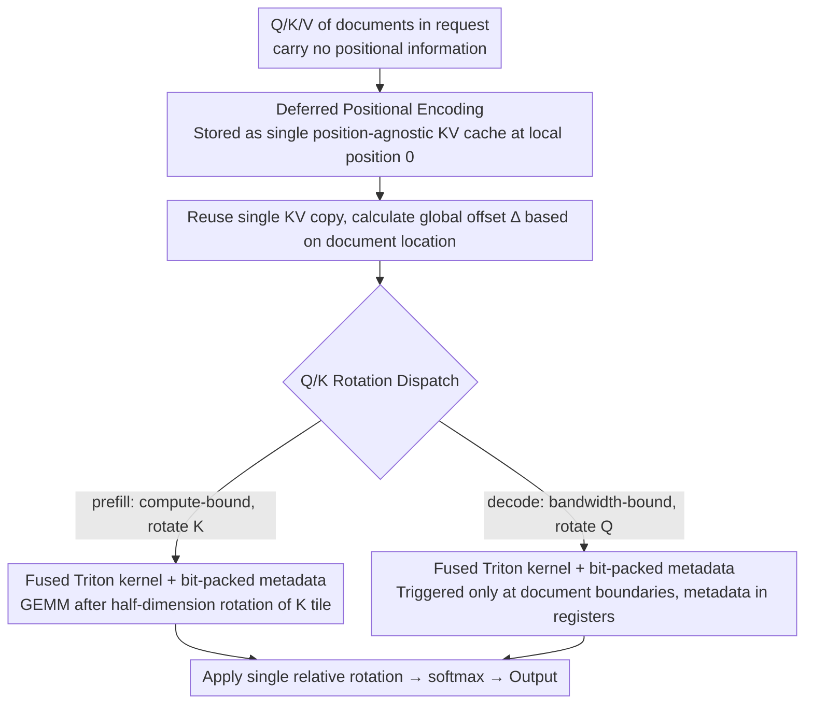

# LazyAttention: Efficient Retrieval-Augmented Generation with Deferred Positional Encoding

**Conference**: ICML 2026  
**arXiv**: [2606.04302](https://arxiv.org/abs/2606.04302)  
**Code**: https://github.com/illinoisdata/lazy-attention  
**Area**: LLM Inference Efficiency / RAG / KV Cache  
**Keywords**: KV Cache Reuse, RoPE Decoupling, Fused Attention Kernel, Position-agnostic Cache, vLLM

## TL;DR
LazyAttention defers Rotary Positional Encoding (RoPE) from the KV cache write stage to being performed on-the-fly within the attention kernel. This allows a single physical KV copy to be reused by any logical position. On skewed RAG workloads, it reduces TTFT by 1.37× and improves throughput by 1.40× compared to SOTA Block-Attention, while maintaining generation quality.

## Background & Motivation
**Background**: In long-context scenarios such as RAG and ICL, prefill is the latency bottleneck, and KV cache reuse is the primary method for cost reduction. Existing methods like Prompt Cache, CacheBlend, TurboRAG, and Block-Attention attempt to reuse KV pairs across requests to avoid redundant computations for previously processed documents.

**Limitations of Prior Work**: Existing schemes utilize **position-aware** KV caches, where positional information is eagerly encoded into the Key (K) before being written to the cache (typically via RoPE). Consequently, multiple KV copies must be stored when the same document appears at different positions in different prompts. While Block-Attention/TurboRAG choose to re-encode positions, they require copying KV or are restricted to prefix reuse; in-place updates introduce race conditions within the same batch.

**Key Challenge**: KV cache reuse efficiency is constrained by GPU HBM capacity. Position-aware designs force valuable capacity to be spent on "different positional variants of the same document." Quantitative analysis shows that under a Zipf popularity distribution with $D$ possible positions and a budget of $C$ KV entries, position-agnostic caching can store top-$C$ documents, while position-aware caching can only store $\lfloor C/D \rfloor$. The hit ratio ratio is $\sum_{i=1}^{C} i^{-\alpha} / \sum_{i=1}^{\lfloor C/D \rfloor} i^{-\alpha}$, which reaches 2.86× when $D=20, C=100$, and Zipf is moderate.

**Goal**: To make KV cache truly position-agnostic without increasing HBM copy overhead or significantly adding to attention kernel computation/bandwidth costs.

**Key Insight**: A core fact of RoPE is that attention scores only depend on the **relative** position $n-m$ of the query and key, i.e., $(R_m q)^\top (R_n k) = q^\top R_{n-m} k$. This implies that positional encoding can theoretically be applied "in-situ" during attention calculation rather than being pre-baked into K.

**Core Idea**: To **kernelize** RoPE-decoupling by performing deferred positional encoding transiently within the inner loop of a fused Triton attention kernel. This involves zero copies and zero additional HBM writes, allowing a single KV copy to serve requests at any logical position.

## Method

### Overall Architecture
LazyAttention addresses the issue of KV cache bloat caused by position-awareness by delaying the "timing" of positional encoding. During cache writing, Q/K/V are stored without positional information; each document is stored as a "pure content key-value pair" starting from local position 0. During inference, a single relative rotation $R_\Delta$ is applied on-the-fly to Q or K within the fused attention kernel based on the global offset $\Delta$ of the document in the current request. Since RoPE scores depend only on relative positions ($(R_m q)^\top(R_n k)=q^\top R_{n-m}k$), this "in-situ" algorithm is mathematically equivalent to standard RoPE while physically requiring only one KV copy. For example (Example 3.1), if documents $d_1, d_2$ are cached starting from position 0 as $C_1, C_2$, reusing $C_2$ in a request $d_1\mathbin\Vert d_2\mathbin\Vert Q$ only requires rotating $Q$ backwards by $|d_1|$ steps to align with the state of $C_2$.

### Key Designs

**1. Deferred Positional Encoding: Postponing RoPE from Cache Writing to Attention**
Position-aware caches bake positions into K eagerly, forcing separate KV storage for every new position a document occupies. LazyAttention leverages the relativity $q^\top R_{n-m}k$ to keep Q/K/V in the cache position-free. During attention, an offset $\Delta$ is used to perform a half-dimension RoPE rotation on K (or Q) once: $k'_1 = k_1\cos\Delta - k_2\sin\Delta, k'_2 = k_1\sin\Delta + k_2\cos\Delta$. Crucially, this is a **single relative rotation** rather than a naive "rotate back to 0, then to target" approach—the latter would require two rotations, increasing decoding FLOPs/IO to an unacceptable ~100%–150% range. This transforms the KV cache into position-agnostic content pairs, increasing hit rates as per the Zipf formula.

**2. Tiling-aware Q/K Rotation Dispatch: Rotating K for Prefill, Q for Decode**
The viability of deferred RoPE depends on minimizing overhead. Prefill and decode have different bottlenecks, requiring different rotation strategies. Prefill is compute-bound. With PagedAttention settings (e.g., $M=128, N=16$), the Q tile is much larger than the K tile, making K-side rotation cheaper: each K scalar adds only 3 FLOPs, with a relative overhead $\epsilon_{\text{prefill}}=\tfrac{3}{4M}\approx 0.59\%$. Decode is bandwidth-bound with $M=1$. Rotating K would require scanning the entire tile, whereas rotating Q only involves $3D$ fixed FLOPs. Therefore, Q is rotated only when crossing document boundaries (offset changes). The trigger rate $r=1/B$ ($B$ being document blocks) results in an average overhead $\epsilon_{\text{decode}}=r\cdot\tfrac{3}{4N}=\tfrac{3}{4BN}$, which is $\le 0.01\%$ for documents >1600 tokens.

**3. Fused Triton Kernel + Bit-packed Metadata: End-to-End Efficiency**
To ensure algorithmic savings are realized, deferred rotation must be implemented in a fused kernel (vLLM/FlashAttention style) without extra HBM access. Two independent kernels were developed: a prefill kernel that rotates K tiles before GEMM and a decode kernel that **bit-packs (block id, offset, mask) into a single 64-bit register**. Metadata is extracted in the inner loop using register shifts, bypassing global loads. In extremely IO-bound cases, cos/sin values can be calculated on-the-fly. The implementation adds ~0.2% runtime overhead, translating algorithmic logic into real-world efficiency.

The mechanism is compatible with various RoPE variants (interleaved, NTK/YaRN) by changing metadata and supports GQA/MQA with zero modifications to score calculation. It also applies to score-space relative position methods like ALiBi.

## Key Experimental Results

### Main Results
Model: Tulu3-Block-FT (Llama-3.1-8B derivative); Hardware: H100 96GB; Benchmarks: 2WikiMQA / HotpotQA / TriviaQA / NarrativeQA.

**TTFT and Throughput**: Under skewed traffic (Zipf $\alpha=2.1$), TTFT is reduced by 1.37× and throughput increases by 1.40× compared to Block-Attention (vLLM). Performance is comparable to Block-Attn under uniform traffic and significantly better than Prefix Caching / Prompt Cache / CacheBlend.

**KV Cache Hit Ratio** (VRAM hit ratio %, trace-driven):

| KV Budget | Skew | Prefix | CacheBlend | Block-Attn (vLLM) | LazyAttn (Ours) |
| :--- | :--- | :--- | :--- | :--- | :--- |
| 1 GB | High (α=2.1) | 0.00 | 5.96 | 7.27 | **13.57** |
| 1 GB | Low (α=1.1) | 0.00 | 1.51 | 1.84 | **3.47** |
| 10 GB | Mid | 0.55 | 17.33 | 21.13 | **23.89** |
| 50 GB | Mid | 1.95 | 21.87 | 26.67 | **28.44** |
| No-limit (~66 GB) | Mid | 2.16 | 22.45 | 27.38 | **29.09** |

Hit ratios nearly double under tight constraints and remain consistently superior even with generous budgets.

**Generation Quality** (Exact Match):

| Dataset | Full-Attn | Block-Attn (vLLM) | LazyAttn |
| :--- | :--- | :--- | :--- |
| 2WikiMQA | 73.6 | 71.4 | 70.7 |
| TriviaQA | 75.2 | 72.1 | 73.0 |
| NarrativeQA | 62.2 | 61.0 | 59.7 |
| HotpotQA | 76.2 | 72.5 | 73.3 |
| Average | 71.8 | 69.3 | 69.2 |

LazyAttention is mathematically equivalent to Block-Attention; minor score differences stem from tokenization and floating-point variance.

### Ablation Study
Single RAG request (5 docs of 4096 tokens + 64-token query, 3 docs hot) comparing baseline vs. deferred rotation:

| Stage | Key Finding |
| :--- | :--- |
| Document processing | Hot document latency drops to near zero (reuse); baseline dominated by recomputation. |
| Query prefilling | Comparable to baseline; K-tile relative rotation FLOPs overhead only $3/(4M)$. |
| Decoding | 0.13% overhead per token, consistent with theoretical $r \cdot 3/(4N)$. |
| Long Context | Conclusions hold for doc lengths up to 16K and context up to 128K. |

### Key Findings
- Gains originate from the **capacity multiplier** rather than raw calculation speed: position-agnosticism allows more documents in HBM, directly improving TTFT/throughput via hit rate.
- Decoding overhead $\le 0.2\%$ is achieved through (a) rotating Q instead of K, (b) triggering only at document boundaries, and (c) bit-packing metadata into registers.
- Consistent trends across different GPUs (A100/A40) and larger models (Llama-3.1-70B) demonstrate method robustness.

## Highlights & Insights
- **Reducing "reuse" to "positional dependence"**: The authors pinpoint the KV cache bottleneck using a Zipf formula—the limitation is not the strategy, but the position-aware representation.
- **Kernel-aware Algorithm Design**: Deciding to rotate K in prefill and Q in decode is derived from the roofline model and fused kernel tiling, exemplifying "algorithm-system co-design."
- **Transferable Idea**: The concept of "deferred encoding" (injecting metadata into scores rather than baking it into states) can be applied to other relative position methods or scenarios like MoE routing and speculative decoding.

## Limitations & Future Work
- Inapplicable to linear attention: Since states represent sequence summaries, positions cannot be injected solely into scores.
- Cannot handle "semantic rewriting": Assumes cached chunks are identical across requests except for position; does not address prefix-conditioned encoding shifts.
- Portability cost: Implementation in other frameworks (SGLang, TensorRT-LLM) requires rewriting the fused bit-packed paths.

## Related Work & Insights
- **vs Block-Attention / TurboRAG**: These methods materialize position-adjusted KV copies, necessitating HBM overhead or limiting reuse to prefixes. LazyAttention avoids this trade-off using relative rotation.
- **vs CacheBlend**: CacheBlend uses mask reconstruction for accuracy but remains in a position-aware framework with high reconstruction costs.
- **vs Prompt Cache**: Limited to fixed prefixes; LazyAttention allows document-level reuse at any offset.

## Rating
- Novelty: ⭐⭐⭐⭐ While decoupling RoPE is not entirely new, kernelizing it into a zero-copy Triton implementation is.
- Experimental Thoroughness: ⭐⭐⭐⭐ Strong coverage across models, traffic distributions, and micro-benchmarks.
- Writing Quality: ⭐⭐⭐⭐ Logical flow from Zipf motivation to roofline analysis and implementation.
- Value: ⭐⭐⭐⭐⭐ Direct, deployable improvement for RAG cost and latency.

<!-- RELATED:START -->

## Related Papers

- [\[ICLR 2026\] Bayesian Attention Mechanism: A Probabilistic Framework for Positional Encoding and Context Length Extrapolation](../../ICLR2026/information_retrieval/bayesian_attention_mechanism_a_probabilistic_framework_for_positional_encoding_a.md)
- [\[ICML 2026\] Hierarchical Abstract Tree for Cross-Document Retrieval-Augmented Generation](hierarchical_abstract_tree_for_cross-document_retrieval-augmented_generation.md)
- [\[ICML 2026\] ML-Embed: Inclusive and Efficient Embeddings for a Multilingual World](ml-embed_inclusive_and_efficient_embeddings_for_a_multilingual_world.md)
- [\[ICML 2026\] Very Efficient Listwise Multimodal Reranking for Long Documents](very_efficient_listwise_multimodal_reranking_for_long_documents.md)
- [\[ICML 2026\] Predictive Prefetching for Retrieval-Augmented Generation](predictive_prefetching_for_retrieval-augmented_generation.md)

<!-- RELATED:END -->
