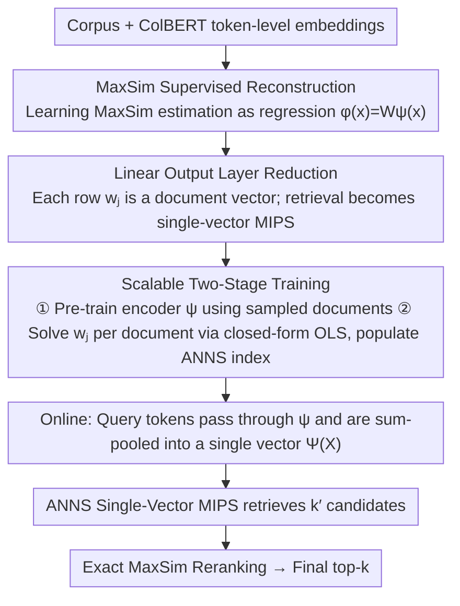

# LEMUR: Learned Multi-Vector Retrieval

**Conference**: ICML 2026  
**arXiv**: [2601.21853](https://arxiv.org/abs/2601.21853)  
**Code**: [github.com/ejaasaari/lemur](https://github.com/ejaasaari/lemur)  
**Area**: Information Retrieval  
**Keywords**: Multi-vector retrieval, Approximate Nearest Neighbor Search, MaxSim, Supervised dimensionality reduction, ColBERT  

## TL;DR
Lemur reformulates multi-vector similarity search as a supervised learning problem. By using a two-layer MLP to map token-level embeddings into a low-dimensional latent space and leveraging existing single-vector ANNS indices for retrieval, it achieves speeds an order of magnitude faster than methods like PLAID and MUVERA.

## Background & Motivation

**Background**: Late interaction models, typified by ColBERT, achieve higher retrieval precision than single-vector models by representing each token with an embedding. The similarity between a query and a document is measured via MaxSim, which is the sum of the inner products of each query token and its most similar document token.

**Limitations of Prior Work**: The computational cost of MaxSim is extremely high, as it requires evaluating inner products between all query embeddings and all document embeddings. Existing acceleration methods (PLAID, DESSERT, EMVB, IGP) rely on token-level pruning as an initial step. however, the similarity of individual tokens is an imprecise proxy for document-level MaxSim, forcing candidate sets to remain large to ensure recall. MUVERA reduces the problem to single-vector search via Fixed Dimension Encoding (FDE), but it requires 10,240 dimensions for sufficient precision, resulting in high memory and latency costs.

**Key Challenge**: A fundamental contradiction exists between the high-precision advantages of multi-vector retrieval and its high latency. Existing methods either depend on imprecise token-level proxies (PLAID family) or require extremely high-dimensional, data-independent encodings (MUVERA); neither efficiently bridges this gap.

**Goal**: Design a lightweight, corpus-specific search dimensionality reduction framework that reduces multi-vector search to low-dimensional single-vector search while maintaining high recall.

**Key Insight**: MaxSim can be decomposed into the sum of per-token contributions: $\text{MaxSim}(X,C) = \sum_{x \in X} \max_{c \in C} \langle x,c \rangle$. The contribution of each token to all documents, $g(x) \in \mathbb{R}^m$, can be modeled as a regression problem from $\mathbb{R}^d$ to $\mathbb{R}^m$ and learned using an MLP.

**Core Idea**: Use a two-layer MLP to learn the mapping from tokens to document similarities, then utilize the structure of its linear output layer to reduce multi-vector search to a single-vector Max-Inner Product Search (MIPS) problem in the latent space.

## Method

### Overall Architecture
Lemur addresses the contradiction between high multi-vector retrieval precision and slow MaxSim computation by decomposing the search into two reductions: first, learning MaxSim estimation as a regression problem using a two-layer MLP, and second, leveraging the linear output layer to reduce retrieval to single-vector MIPS in a latent space. This allows the direct reuse of mature ANNS indices. Implementation is split into offline and online phases: offline, the MLP is trained, and each row of the output layer's weight matrix is stored as a document's single-vector representation in an ANNS index; online, all query tokens pass through the MLP's hidden layer and are combined via sum-pooling into a single-vector query, which is used to retrieve $k'$ candidates via ANNS before final top-$k$ reranking using exact MaxSim.

### Key Designs

**1. MaxSim Supervised Reconstruction: Turning Similarity Estimation into Multi-Output Regression**

Existing acceleration methods are slow because they use single-token similarity as a pruning proxy, which often deviates significantly from document-level MaxSim. Lemur bypasses this proxy: observing that $\text{MaxSim}(X,C)=\sum_{x\in X}\max_{c\in C}\langle x,c\rangle$, the target is defined as $g_l(x)=\max_{c\in C_l}\langle x,c\rangle$, representing the MaxSim contribution of a token embedding $x$ to the $l$-th document. This is a multi-output regression from $\mathbb{R}^d$ to $\mathbb{R}^m$. A two-layer network $\phi(x)=W\psi(x)$ is used to fit this, where $\psi$ is a hidden layer feature encoder and $W\in\mathbb{R}^{m\times d'}$ is a linear output layer. Since each $g_l$ is a convex piecewise linear function, the two-layer structure provides sufficient fitting capacity. By optimizing for estimation accuracy rather than using data-independent encoding, a 2048-dimensional representation outperforms MUVERA’s 10,240-dimensional FDE.

**2. Reduction from Linear Output Layer to Single-Vector MIPS: Reusing Existing ANNS**

The regression itself is an intermediate step; the core ingenuity lies in the linearity of the output layer. The estimation is expressed as $f(X)\approx W\Psi(X)$, where $\Psi(X)=\sum_{x\in X}\psi(x)$ is the single vector obtained by sum-pooling query tokens after the hidden layer. Finding the $k'$ documents with the highest MaxSim estimates is thus equivalent to finding the $k'$ weight row vectors $w_j$ that have the largest inner product with $\Psi(X)$ in a $d'$-dimensional space. This is standard single-vector MIPS. Consequently, there is no need for specialized multi-vector data structures; each row $w_j$ of the output layer naturally serves as the document representation in latent space, suitable for highly optimized ANNS libraries like HNSW.

**3. Scalable Two-Stage Training: Linear Scalability for Index Construction**

Training an MLP with $m$-dimensional outputs end-to-end is memory-intensive for million-scale corpora (where $m$ is the number of documents). Lemur decouples feature learning and linear fitting. In the first stage, the feature encoder $\psi$ is pre-trained on $m'\ll m$ sampled documents. In the second stage, $\psi$ is fixed, and for each document $j$, the output layer row $w_j=Z^{+}y_j$ is solved analytically via OLS regression, where $Z$ is the feature matrix of training samples through $\psi$, and $y_j$ contains the true MaxSim contributions of those samples. Since each $w_j$ has an independent closed-form solution, the process is inherently parallelizable. Index construction scales linearly with the number of documents, and new documents can be added incrementally with a single OLS regression and an HNSW insertion.

## Key Experimental Results

### Main Results (ColBERTv2, k=100, QPS@≥80% Recall)

| Dataset | Lemur | MUVERA | IGP | DESSERT | PLAID |
|--------|-------|--------|-----|---------|-------|
| MSMARCO (8.8M docs) | **799** | 150 | 62 | — | 13 |
| HotpotQA (5.2M docs) | **426** | 22 | 37 | — | 10 |
| NQ (2.7M docs) | **869** | 79 | 107 | 38 | 16 |
| Quora (523K docs) | **4068** | 787 | 679 | 284 | 89 |
| FiQA (58K docs) | **2416** | 239 | 310 | 242 | 51 |
| SCIDOCS (26K docs) | **2591** | 391 | 320 | 285 | 85 |

### Ablation Study (Effect of Hidden Dimension $d'$ on Performance)

| Configuration | MaxSim Approximation Accuracy | End-to-End Latency Trend | Description |
|------|----------------|---------------|------|
| $d'=1024$ | Exceeds MUVERA 10240D FDE on 7/8 datasets | Fastest ANNS | Precision already exceeds 10x larger FDE |
| $d'=2048$ (Default) | Significantly better than $d'=1024$ | Best price-performance | Negligible latency increase |
| $d'=4096$ | Slightly better than $d'=2048$ | Diminishing returns | ANNS cost partially offsets precision gains |

### Key Findings
- Lemur is 5–16x faster than the best baseline at ≥80% recall across all 8 BEIR datasets.
- 1024-dimensional Lemur embeddings achieve higher recall than 10,240-dimensional MUVERA FDE on 7/8 datasets, demonstrating the superiority of supervised representations over data-independent encodings.
- On non-ColBERTv2 models (e.g., GTE-ModernColBERT, LFM2-ColBERT), MUVERA's recall fails to exceed 60%, whereas Lemur remains stable.
- Pearson and Spearman correlation coefficients exceed 0.94 across all datasets, indicating extremely high MaxSim estimation quality.

## Highlights & Insights
- The "double reduction" strategy—transforming multi-vector search into supervised regression and then to single-vector MIPS—is highly elegant. The key insight is that output layer row vectors naturally serve as latent document representations.
- Feature encoders using random weights (ELM mode) remain effective, suggesting the hidden layer primarily provides non-linear feature expansion rather than highly specialized representations. This helps explain the structure of late interaction embedding spaces.
- The index supports incremental updates (new documents require only one OLS regression and one HNSW insertion), which is critical for production systems.
- Using corpus documents as training data (without separate training queries) is effective, significantly lowering the barrier to deployment; however, training with real queries further improves performance.

## Limitations & Future Work
- Dependent on corpus-specific training, with limited direct transferability across different corpora. However, the two-stage design keeps retraining costs low (approx. 4.8 hours for the 8.8M document MSMARCO index).
- Compatibility with ultra-low-precision vector compression (e.g., 2-bit quantization) has not been explored; standard scalar and product quantization should be applicable but require verification.
- The performance advantage narrows on visual document retrieval (ViDoRe), as the number of embeddings per image document is much higher than for text (average 1073 vs 68), making the reranking stage the bottleneck.
- Future work could explore cross-corpus transfer learning and synthetic training sets to reduce dependence on specific corpora.

## Related Work & Insights
- **vs MUVERA**: MUVERA uses data-independent FDE for single-vector reduction, while Lemur uses supervised learning for corpus-specific reduction, outperforming the former with 1/10 of the dimensions at the cost of training.
- **vs PLAID/DESSERT/IGP**: These methods rely on token-level pruning for candidate filtering, which is imprecise and requires large candidate sets. Lemur estimates MaxSim at the document level for smaller, more accurate candidate sets.
- **vs TCT-ColBERT**: TCT trains a general single-vector retriever to distill MaxSim. Lemur trains a lightweight search dimensionality reduction rather than an end-to-end retriever, making it more flexible and compatible with any late interaction model.
- **vs BGE-M3**: BGE-M3 jointly trains dense, sparse, and multi-vector modes via self-distillation as a general embedding model. Lemur does not train the encoder but builds an efficient search index for existing models.

## Rating
- Novelty: ⭐⭐⭐⭐⭐ The double reduction concept is highly original, framing retrieval as regression + MIPS.
- Experimental Thoroughness: ⭐⭐⭐⭐⭐ Conducted across 8 BEIR datasets with 5 text models and 2 vision models, plus comprehensive ablations.
- Writing Quality: ⭐⭐⭐⭐⭐ Mathematical derivations are clear, and the transition from problem definition to algorithm design is seamless.
- Value: ⭐⭐⭐⭐⭐ Directly applicable for accelerating ColBERT-based retrieval systems; code is open-sourced.

<!-- RELATED:START -->

## Related Papers

- [\[ACL 2026\] Hybrid-Vector Retrieval for Visually Rich Documents: Combining Single-Vector Efficiency and Multi-Vector Accuracy](../../ACL2026/information_retrieval/hybrid-vector_retrieval_for_visually_rich_documents_combining_single-vector_effi.md)
- [\[ACL 2026\] Prune-then-Merge: Towards Efficient Multi-Vector Visual Document Retrieval](../../ACL2026/information_retrieval/sculpting_the_vector_space_towards_efficient_multi-vector_visual_document_retrie.md)
- [\[ICML 2025\] POQD: Performance-Oriented Query Decomposer for Multi-Vector Retrieval](../../ICML2025/information_retrieval/poqd_performance-oriented_query_decomposer_for_multi-vector_retrieval.md)
- [\[ICML 2026\] HGMem: Hypergraph-based Working Memory to Improve Multi-step RAG for Long-Context Complex Relational Modeling](hgmem_hypergraph-based_working_memory_to_improve_multi-step_rag_for_long-context.md)
- [\[CVPR 2025\] LotusFilter: Fast Diverse Nearest Neighbor Search via a Learned Cutoff Table](../../CVPR2025/information_retrieval/lotusfilter_fast_diverse_nearest_neighbor_search_via_a_learned_cutoff_table.md)

<!-- RELATED:END -->
