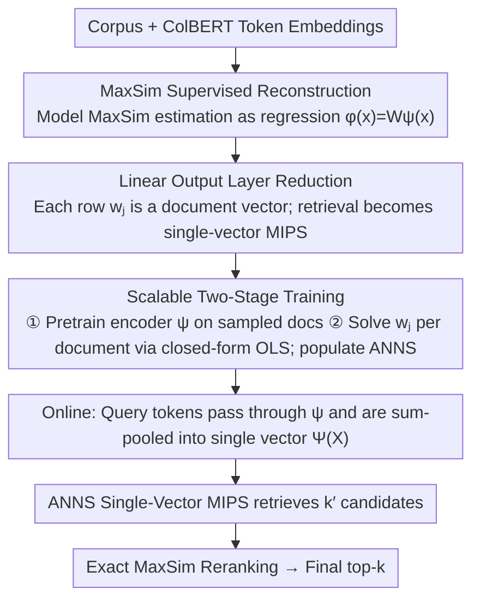

# LEMUR: Learned Multi-Vector Retrieval

**Conference**: ICML 2026  
**arXiv**: [2601.21853](https://arxiv.org/abs/2601.21853)  
**Code**: [github.com/ejaasaari/lemur](https://github.com/ejaasaari/lemur)  
**Area**: Information Retrieval  
**Keywords**: Multi-vector retrieval, approximate nearest neighbor search (ANNS), MaxSim, supervised dimensionality reduction, ColBERT  

## TL;DR
Lemur transforms multi-vector similarity search into a supervised learning problem. By using a two-layer MLP to map token-level embeddings to a low-dimensional latent space and leveraging existing single-vector ANNS indices for retrieval, it achieves speeds an order of magnitude faster than methods like PLAID and MUVERA.

## Background & Motivation

**Background**: Late interaction models, exemplified by ColBERT, achieve higher retrieval accuracy than single-vector models by representing each token as an embedding. The similarity between a query and a document is measured via MaxSim, which is the sum of inner products between each query token and its most similar document token.

**Limitations of Prior Work**: Computing MaxSim is extremely expensive, as it requires evaluating inner products between all query embeddings and all document embeddings. Current acceleration methods (PLAID, DESSERT, EMVB, IGP) rely on token-level pruning as an initial step, but single-token similarity is an imprecise proxy for document-level MaxSim, requiring large candidate sets to maintain recall. MUVERA reduces the problem to single-vector search via Fixed Dimension Encoding (FDE) but necessitates 10240 dimensions for sufficient accuracy, incurring high memory and latency costs.

**Key Challenge**: There is a fundamental conflict between the high accuracy of multi-vector retrieval and its high latency. Existing methods either rely on imprecise token-level proxies (the PLAID family) or require extremely high-dimensional, data-agnostic encoding (MUVERA); neither effectively bridges the gap.

**Goal**: To design a lightweight, corpus-specific dimensionality reduction framework for search that reduces multi-vector retrieval to low-dimensional single-vector search while maintaining high recall.

**Key Insight**: MaxSim can be decomposed into the sum of per-token contributions: $\text{MaxSim}(X,C) = \sum_{x \in X} \max_{c \in C} \langle x,c \rangle$. Estimating the contribution of each token to all documents $g(x) \in \mathbb{R}^m$ is a regression problem from $\mathbb{R}^d$ to $\mathbb{R}^m$ that can be learned using an MLP.

**Core Idea**: Utilize a two-layer MLP to learn the mapping from tokens to document similarity, then leverage the structure of the linear output layer to reduce multi-vector search to a single-vector MIPS problem in a latent space.

## Method

### Overall Architecture
Lemur addresses the bottleneck of MaxSim efficiency through a "dual reduction" approach. It first models MaxSim estimation as a regression problem using a two-layer MLP, then utilizes the linear output layer to reduce retrieval to single-vector MIPS in a latent space, directly reusing mature ANNS indices. The implementation consists of offline and online phases: offline, the MLP is trained, and each row of the output layer weight matrix is stored in an ANNS index as a single-vector document representation; online, query tokens are passed through the MLP's hidden layer and sum-pooled into a single-vector query to retrieve $k'$ candidates from the ANNS, followed by exact MaxSim reranking for the final top-$k$.

### Key Designs

**1. Supervised Reconstruction of MaxSim: Multi-Output Regression**

Existing acceleration methods are slow because they use single-token similarity as a pruning proxy, which deviates significantly from document-level MaxSim. Lemur bypasses this proxy: MaxSim is decomposed as $\text{MaxSim}(X,C)=\sum_{x\in X}\max_{c\in C}\langle x,c\rangle$. The target is defined as $g_l(x)=\max_{c\in C_l}\langle x,c\rangle$, representing the contribution of token embedding $x$ to the $l$-th document. This is a multi-output regression from $\mathbb{R}^d$ to $\mathbb{R}^m$. A two-layer network $\phi(x)=W\psi(x)$ is used to fit this, where $\psi$ is a hidden feature encoder and $W\in\mathbb{R}^{m\times d'}$ is a linear output layer. Since each $g_l$ is a convex piecewise linear function, the two-layer structure provides sufficient fitting capacity. By optimizing for accuracy directly rather than using data-agnostic encoding, a 2048-dimensional representation outperforms MUVERA’s 10240-dimensional FDE.

**2. Reduction from Linear Output Layer to Single-Vector MIPS**

The core innovation lies in the linearity of the output layer. The estimation is expressed as $f(X)\approx W\Psi(X)$, where $\Psi(X)=\sum_{x\in X}\psi(x)$ is the single-vector obtained by sum-pooling query tokens after the hidden layer. Consequently, finding the $k'$ documents with the highest MaxSim estimation is equivalent to finding the $k'$ weight row vectors $w_j$ with the largest inner product with $\Psi(X)$ in $d'$-dimensional space. This is a standard single-vector MIPS problem. Each row $w_j$ naturally serves as the latent single-vector representation of a document, allowing the use of highly optimized ANNS libraries like HNSW.

**3. Scalable Two-Stage Training**

End-to-end training of an MLP with $m$ outputs is memory-intensive for large corpora. Lemur decouples feature learning and linear fitting. Phase one pretrains the feature encoder $\psi$ on $m'\ll m$ sampled documents. Phase two fixes $\psi$ and analytically solves for each document $j$'s output row $w_j=Z^{+}y_j$ via OLS regression, where $Z$ is the feature matrix after passing training samples through $\psi$, and $y_j$ is the ground-truth MaxSim contribution. Since each $w_j$ is an independent closed-form solution, training is naturally parallelizable and scales linearly with the number of documents.

## Key Experimental Results

### Main Results (ColBERTv2, k=100, QPS @ ≥80% Recall)

| Dataset | Lemur | MUVERA | IGP | DESSERT | PLAID |
|--------|-------|--------|-----|---------|-------|
| MSMARCO (8.8M docs) | **799** | 150 | 62 | — | 13 |
| HotpotQA (5.2M docs) | **426** | 22 | 37 | — | 10 |
| NQ (2.7M docs) | **869** | 79 | 107 | 38 | 16 |
| Quora (523K docs) | **4068** | 787 | 679 | 284 | 89 |
| FiQA (58K docs) | **2416** | 239 | 310 | 242 | 51 |
| SCIDOCS (26K docs) | **2591** | 391 | 320 | 285 | 85 |

### Ablation Study (Impact of Hidden Layer Dimension $d'$)

| Configuration | MaxSim Approx. Accuracy | End-to-End Latency Trend | Note |
|------|----------------|---------------|------|
| $d'=1024$ | Beats MUVERA 10240D FDE on 7/8 datasets | Fastest ANNS | Surpasses 10x larger FDE |
| $d'=2048$ (Default) | Significantly better than $d'=1024$ | Best Trade-off | Latency increase is negligible |
| $d'=4096$ | Slightly better than $d'=2048$ | Diminishing returns | ANNS cost offsets accuracy gain |

### Key Findings
- Lemur is 5–16x faster than the best baseline at $\geq 80\%$ recall across 8 BEIR datasets.
- 1024-dimensional Lemur embeddings achieve higher recall than 10240-dimensional MUVERA FDE on 7/8 datasets, demonstrating that supervised representations are superior to data-agnostic ones.
- On non-ColBERTv2 models (e.g., GTE-ModernColBERT, LFM2-ColBERT), MUVERA's recall fails to exceed 60%, while Lemur remains stable.
- Pearson and Spearman correlation coefficients exceed 0.94 across all datasets, indicating high-quality MaxSim estimation.

## Highlights & Insights
- The "dual reduction" strategy is elegant—the row vectors of the linear output layer inherently serve as document representations in the latent space without requiring additional projection.
- Using random weights for the feature encoder (ELM mode) remains effective, suggesting the hidden layer primarily serves for non-linear feature expansion rather than learning specialized representations.
- The index supports incremental updates (new documents only require one OLS regression and one HNSW insertion), which is critical for production.
- Training on corpus documents themselves (without a separate training query set) is viable, significantly lowering deployment barriers.

## Limitations & Future Work
- The method depends on corpus-specific training, which limits cross-corpus transferability; however, the two-stage training design keeps costs low (approximately 4.8 hours for 8.8M documents).
- Compatibility with ultra-low precision vector compression (e.g., 2-bit quantization) has not been explored, though standard scalar and product quantization should be applicable.
- Performance gains are smaller in visual document retrieval (ViDoRe) because the number of embeddings per document is much higher (1073 vs. 68), making the reranking phase a bottleneck.

## Related Work & Insights
- **vs. MUVERA**: MUVERA uses data-agnostic FDE for single-vector reduction; Lemur uses supervised learning for corpus-specific reduction, outperforming the former at 1/10th the dimensionality at the cost of training.
- **vs. PLAID/DESSERT/IGP**: These methods rely on token-level pruning with imprecise proxies; Lemur performs document-level MaxSim estimation, resulting in smaller and more accurate candidate sets.
- **vs. TCT-ColBERT**: TCT distills MaxSim into a general single-vector retriever; Lemur trains a lightweight search reduction framework rather than an end-to-end retriever, making it more flexible.

## Rating
- Novelty: ⭐⭐⭐⭐⭐ 
- Experimental Thoroughness: ⭐⭐⭐⭐⭐ 
- Writing Quality: ⭐⭐⭐⭐⭐ 
- Value: ⭐⭐⭐⭐⭐ 

<!-- RELATED:START -->

## Related Papers

- [\[ACL 2026\] Hybrid-Vector Retrieval for Visually Rich Documents: Combining Single-Vector Efficiency and Multi-Vector Accuracy](../../ACL2026/information_retrieval/hybrid-vector_retrieval_for_visually_rich_documents_combining_single-vector_effi.md)
- [\[ICML 2025\] POQD: Performance-Oriented Query Decomposer for Multi-Vector Retrieval](../../ICML2025/information_retrieval/poqd_performance-oriented_query_decomposer_for_multi-vector_retrieval.md)
- [\[ICML 2026\] Vector Linking based on Cross-Model Local Isometric Consistency](vector_linking_via_cross-model_local_isometric_consistency.md)
- [\[ICLR 2026\] MILCO: Learned Sparse Retrieval Across Languages via a Multilingual Connector](../../ICLR2026/information_retrieval/milco_learned_sparse_retrieval_across_languages_via_a_multilingual_connector.md)
- [\[ICML 2026\] HGMem: Hypergraph-based Working Memory to Improve Multi-step RAG for Long-Context Complex Relational Modeling](hgmem_hypergraph-based_working_memory_to_improve_multi-step_rag_for_long-context.md)

<!-- RELATED:END -->
