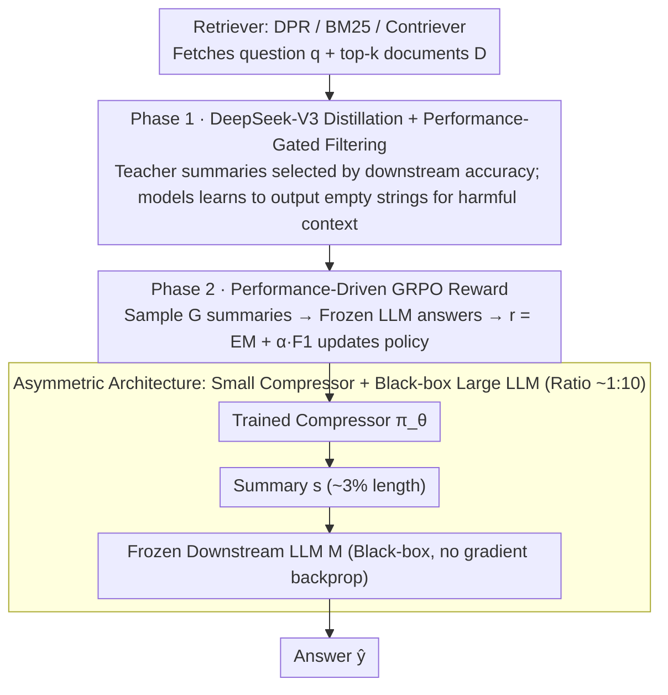

# Less Is More: Elevating RAG via Performance-Driven Context Compression

**Conference**: ICML 2026  
**arXiv**: [2508.19282](https://arxiv.org/abs/2508.19282)  
**Code**: https://github.com/ziqiangcui/CORE-RAG-ICML26 (Available)  
**Area**: Information Retrieval / RAG / Context Compression  
**Keywords**: RAG, Context Compression, GRPO, Knowledge Distillation, Performance-driven

## TL;DR
CORE-RAG trains a 1.5B small compressor using GRPO reinforcement learning with "performance-as-reward," compressing retrieved top-k documents into summaries of ~3% original length. It not only avoids performance degradation but also achieves an average improvement of 3.3 EM over full-context RAG across four QA benchmarks.

## Background & Motivation

**Background**: RAG enhances the factual QA performance of LLMs by 10+ EM by prepending top-k retrieved documents to the query. However, the token count increases linearly—5 documents require ~700 tokens, and 10 documents require ~1400 tokens, significantly increasing encoding costs and latency.

**Limitations of Prior Work**: Existing compression methods (RECOMP / NoiseFilter-IB / LongLLMLingua / QGC, etc.) almost always suffer from performance drops, typically losing 2-6 EM compared to the full-context baseline. This is because their training objectives rely on **proxy heuristics**: maximizing mutual information between original text and summary, imitating teacher outputs, BM25 lexical overlap, or information entropy pruning. There is no causal link between these objectives and whether the downstream LLM correctly answers the question.

**Key Challenge**: Compression tasks lack ground-truth labels—it is unknown what kind of summary is "optimal" for a downstream LLM to answer a specific question. All surrogate losses are approximations; inaccuracy leads to performance loss. Simultaneously, some compression models (e.g., NoiseFilter-IB) have parameter counts approaching the downstream LLM itself, consuming the computational budget saved by compression.

**Goal**: (i) Align the compression objective strictly with downstream task performance to achieve "lossless or superior" results; (ii) Ensure the compressor is much smaller than the downstream LLM to realize actual computational savings.

**Key Insight**: Since gold summaries do not exist, the **accuracy of the downstream LLM can be used as the reward**, allowing the compressor to learn as a policy within an RL framework. The downstream LLM remains frozen (black box), while only the lightweight compressor is trained, making it naturally compatible with API-based models.

**Core Idea**: Compression is viewed as a decision-making process. The compressor is optimized via GRPO using downstream EM/F1 as rewards. A warm-start is performed using DeepSeek-V3 distillation combined with a set of data filtering rules, followed by RL refinement.

## Method

### Overall Architecture

CORE-RAG addresses the performance drop in RAG compression by redefining compression from "finding a good summary" to "finding a summary that enables the downstream LLM to answer correctly." The system involves three roles: a retriever (DPR / BM25 / Contriever) retrieves question $q$ and $k$ documents $D$; a small language model compressor $\pi_\theta:(q,D)\mapsto s$ (Qwen2.5-1.5B-Instruct in main experiments); and a frozen downstream LLM as a black box $M:(s,q)\mapsto\hat{y}$ (Qwen2.5-14B-Instruct in main experiments). Training occurs in two stages: first, distillation using DeepSeek-V3 to give the small model a stable starting point, followed by GRPO reinforcement learning using downstream accuracy as the reward. During inference, only two steps remain: $s=\pi_\theta(q,D)$ and $\hat{y}=M(s,q)$, with the compressor acting as a plug-in before any LLM.

### Key Designs

**1. Downstream Performance-Driven GRPO Reward: Using Accuracy Directly as Reward**

Compression tasks lack gold summaries, and all surrogate losses are guesses at what makes a "good" summary. CORE-RAG treats the compressor $\pi_\theta$ as a policy. For each input $x=(q,D)$, it samples $G$ summaries $\{s_i\}$, feeds them with $q$ to the frozen $M$ to get answers $\hat{y}_i=M(s_i,q)$, and calculates reward $r=r_{\text{EM}}+\alpha\cdot r_{\text{F1}}$. Here $r_{\text{EM}}=\mathbb{I}(\hat{y}=y)$ is a sparse hard signal, while $r_{\text{F1}}$ provides a dense token-level partial signal, with $\alpha\in(0,1]$ adjusting their weights. Optimization follows GRPO, where advantages $A_i=(r_i-\text{mean})/\text{std}$ are computed over $G$ rollouts within a group, eliminating the need for a critic model. A KL term $\beta\mathbb{D}_{\text{KL}}(\pi_\theta\|\pi_{\theta_{\text{ref}}})$ prevents deviation from the warm-start. This directly optimizes the user's objective without proxy errors and naturally fits the RAG scenario. Unlike TACO, which uses binary token-level decisions, CORE uses generative summarization, modifying and synthesizing content.

**2. DeepSeek-V3 Distillation + Performance-Gated Data Filtering: A Stable Starting Point for RL**

A 1.5B model fails to explore effectively with RL from scratch. CORE aligns distillation data with task performance. DeepSeek-V3 (671B) generates teacher summaries $\hat{s}$ for each $(q,D)$. The downstream LLM answers twice: once with the summary and once with the original context, yielding scores $p_{\text{summary}}$ and $p_{\text{original}}$. Sample selection follows: if $p_{\text{summary}}>p_{\text{original}}$, the teacher summary $\hat{s}$ is the target; if $p_{\text{original}}=1$ but $p_{\text{summary}}<p_{\text{original}}$ (summary causes error), the target is set to an empty string to teach "refusal when necessary"; otherwise, the sample is discarded. Standard SFT is performed on the filtered set $\mathcal{X}_f$ using token-level cross-entropy $\mathcal{L}_d=-\frac{1}{|\mathcal{X}_f|}\sum\sum_t\log P_{\pi_\theta}(\hat{s}_t\mid q,D,\hat{s}_{<t})$.

**3. Asymmetric Architecture: Realizing Actual Computational Savings**

Prior compressors often match the size of the downstream LLM, offsetting computational gains. CORE uses a $\pi_\theta$ significantly smaller than $M$ (1.5B vs. 14B, ~1:10). During training, only the compressor gradients are updated. During inference, the compressor generates ~30-50 tokens for 5-10 documents, reducing input sequences from ~700-1400 tokens to ~50 tokens (compression ratio ~3-6%). As $M$ does not participate in training, the framework is compatible with API-based black-box models like GPT-4 and generalizes well across different downstream models.

### Loss & Training

Phase 1 distillation uses token-level cross-entropy $\mathcal{L}_d$. Phase 2 utilizes the GRPO objective $\mathcal{J}(\theta)$ with clipping coefficient $\epsilon$, KL coefficient $\beta$, group size $G$, and composite reward $r=r_{\text{EM}}+\alpha r_{\text{F1}}$. Greedy decoding is used for the compressor during inference to ensure deterministic results.

## Key Experimental Results

### Main Results
Evaluation spans 4 QA benchmarks (NQ / TriviaQA / HotpotQA / 2WikiMultihopQA). Downstream LLM = Qwen2.5-14B-Instruct. Baselines use Qwen2.5-1.5B-Instruct initialized with 5 documents.

| Dataset | Metric | Full-context top-5 | CORE(1.5B) | Gain vs Full | Token Compression |
|---------|--------|--------------------|------------|--------------|-------------------|
| NQ | EM | 38.03 | **41.02** | +2.99 | 712→46 (~6.5%) |
| TriviaQA | EM | 64.10 | **65.63** | +1.53 | 715→32 (~4.5%) |
| HotpotQA | EM | 32.99 | **33.67** | +0.68 | 737→36 (~4.9%) |
| 2WikiMultihopQA | EM | 29.64 | **36.72** | +7.08 | 766→49 (~6.4%) |

CORE (1.5B) outperforms all compression baselines (RECOMP, NoiseFilter-IB, etc., which typically drop 2-6 EM) and even surpasses the DeepSeek-V3 teacher and the top-10 full-context baseline (top-10 EM 38.67 vs. CORE top-5 41.02).

**Length Generalization**: Zero-shot transfer from top-5 training to top-10 testing shows CORE maintains an advantage (NQ EM 41.88 with ~3.6% compression ratio) over top-10 full-context (EM 38.67).

### Ablation Study

| Configuration | NQ EM | TQA EM | HotpotQA EM | 2Wiki EM | Note |
|---------------|-------|--------|-------------|----------|------|
| CORE (full) | **41.02** | **65.63** | **33.67** | **36.72** | Distillation + GRPO RL |
| w/o distillation | 36.37 | 65.23 | 32.01 | 31.40 | RL cold start; significant drops on NQ/2Wiki |
| w/o RL | 34.18 | 60.31 | 28.96 | 30.25 | SFT only; widespread drops of 3-6 EM |

### Key Findings
- **RL is the major contributor**: Removing RL leads to a larger drop than removing distillation, confirming teacher summaries are not task-optimal and performance-driven signals are indispensable.
- **Distillation is crucial**: Without it, the 1.5B model struggles to converge to an optimal policy via exploration alone.
- **Cross-length/model generalization**: The compressor trained on top-5 generalizes to top-10, and zero-shot transfer to Llama-3.1-8B maintains superior performance.
- **Efficiency of small compressors**: Backbones from 1B-3B all benefit; 1.5B is sufficient, suggesting training signals are more critical than capacity.

## Highlights & Insights
- **Simplicity of performance-based rewards**: Abandoning surrogate losses (mutual information, BM25) for direct optimization of the final objective proves highly effective.
- **Power of empty string outputs**: Teaching the model to output empty strings when context is harmful or unnecessary provides a critical degree of freedom often ignored in compression.
- **Black-box compatibility**: Since the downstream LLM requires no gradients, the method works seamlessly with proprietary API models.
- **Paradigm value of GRPO**: It demonstrates that GRPO, previously popular for mathematical reasoning, is highly suitable for generative compression tasks where group comparisons align with identifying optimal summaries.

## Limitations & Future Work
- **Generalized evaluation**: Open-ended generation tasks lack hard rewards like EM; authors suggest LLM-as-Judge or ROUGE-based rewards but experiments were not included.
- **Dataset dependency**: The method relies on supervised RL with ground-truth answers, which may be costly for new domains.
- **Model-reward coupling**: Rewards are calculated for a specific $M$. While transfer works well to similar models, transfer to vastly different domains (e.g., code, different languages) is unverified.

## Related Work & Insights
- **vs RECOMP**: Uses distillation with token-level CE. CORE replaces the objective with performance-driven RL, enabling "lossless" compression where RECOMP fails.
- **vs NoiseFilter-IB**: Uses information bottleneck theories. CORE uses target performance directly with a compressor ~10x smaller.
- **vs TACO**: Both use RL, but TACO is limited to binary token decisions; CORE is generative.
- **vs Search-augmented models**: Models like ReSearch or DeepResearcher integrate search into the LLM logic, demanding large, white-box parameter sets. CORE provides a lightweight, plug-in alternative.

## Rating
- Novelty: ⭐⭐⭐⭐ The "performance-as-reward" approach is effective; distillation via "empty string" samples is clever.
- Experimental Thoroughness: ⭐⭐⭐⭐⭐ Extensive results across benchmarks, retrievers, and LLMs.
- Writing Quality: ⭐⭐⭐⭐ Clear motivation and well-organized methodology.
- Value: ⭐⭐⭐⭐⭐ Effectively solves the performance drop issue in RAG compression, offering significant industrial utility for API-based RAG systems.

<!-- RELATED:START -->

## Related Papers

- [\[ICLR 2026\] FrugalRAG: Less is More in RL Finetuning for Multi-hop Question Answering](../../ICLR2026/information_retrieval/frugalrag_less_is_more_in_rl_finetuning_for_multi-hop_question_answering.md)
- [\[ICLR 2026\] OSCAR: Online Soft Compression for RAG](../../ICLR2026/information_retrieval/oscar_online_soft_compression_for_rag.md)
- [\[ACL 2025\] EXIT: Context-Aware Extractive Compression for Enhancing Retrieval-Augmented Generation](../../ACL2025/information_retrieval/exit_context-aware_extractive_compression_for_enhancing_retrieval-augmented_gene.md)
- [\[ACL 2026\] More Than Efficiency: Embedding Compression Improves Domain Adaptation in Dense Retrieval](../../ACL2026/information_retrieval/more_than_efficiency_embedding_compression_improves_domain_adaptation_in_dense_r.md)
- [\[ICLR 2026\] Attributing Response to Context: A Jensen-Shannon Divergence Driven Mechanistic Study of Context Attribution in Retrieval-Augmented Generation](../../ICLR2026/information_retrieval/attributing_response_to_context_a_jensen-shannon_divergence_driven_mechanistic_s.md)

<!-- RELATED:END -->
