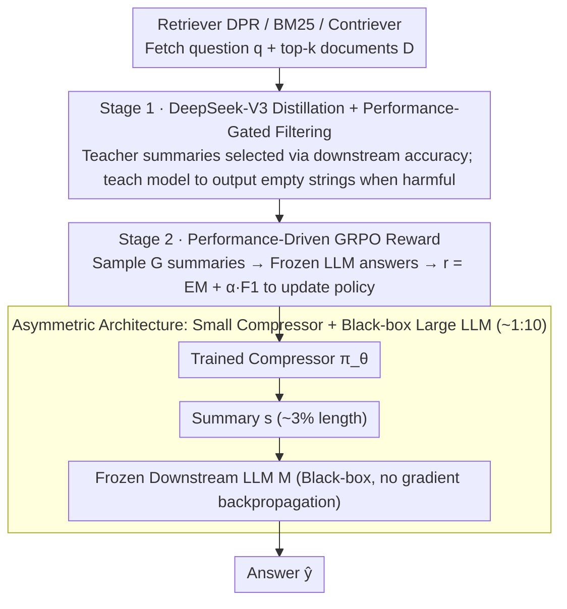

# Less Is More: Elevating RAG via Performance-Driven Context Compression

**Conference**: ICML 2026  
**arXiv**: [2508.19282](https://arxiv.org/abs/2508.19282)  
**Code**: https://github.com/ziqiangcui/CORE-RAG-ICML26 (Available)  
**Area**: Information Retrieval / RAG / Context Compression  
**Keywords**: RAG, Context Compression, GRPO, Knowledge Distillation, Performance-Driven

## TL;DR
CORE-RAG utilizes "Performance-as-Reward" GRPO reinforcement learning to train a 1.5B small compressor that compresses retrieved top-k documents into summaries approximately 3% of their original length. Consequently, this method not only avoids performance degradation but also achieves an average improvement of 3.3 EM across four QA benchmarks compared to full-context RAG.

## Background & Motivation

**Background**: RAG enhances the factual QA performance of LLMs by over 10 EM by prepending top-k retrieved documents to the query. However, token counts increase linearly—approximately 700 tokens for 5 documents and 1400 tokens for 10 documents—leading to high encoding costs and latency.

**Limitations of Prior Work**: Existing compression methods (RECOMP / NoiseFilter-IB / LongLLMLingua / QGC, etc.) almost invariably suffer from performance drops, typically losing 2-6 EM compared to the full-context baseline. This is because their training objectives rely on **proxy heuristics**: maximizing mutual information between the original and the summary, imitating teacher outputs, BM25 surface-level overlap, or information entropy pruning. There is no causal chain between these objectives and whether the downstream LLM answers correctly.

**Key Challenge**: The compression task lacks ground-truth labels—it is unknown which summary is "optimal" for a downstream LLM to answer a specific question. All surrogate losses are approximations; inaccuracies lead to performance loss. Meanwhile, some compression models (e.g., NoiseFilter-IB) have parameters comparable to the downstream LLMs themselves, causing the saved compute to be consumed by the compressor itself.

**Goal**: (i) Align the compression objective strictly with downstream task performance to achieve "lossless or superior" results; (ii) Ensure the compressor is much smaller than the downstream LLM to realize actual compute savings.

**Key Insight**: Since gold summaries do not exist, **the downstream LLM's answer accuracy should be used directly as the reward**, allowing the compressor to learn as a policy within an RL framework. The downstream LLM remains frozen (black-box), only training the lightweight compressor, which naturally fits API-based model scenarios.

**Core Idea**: Compression is viewed as a decision process. GRPO is used to optimize the compressor with downstream EM/F1 as rewards. A warm-start is performed using DeepSeek-V3 distillation combined with data filtering rules, followed by RL refinement.

## Method

### Overall Architecture

CORE-RAG addresses the issue of unavoidable performance loss in RAG compression by redefining compression from "finding a good summary" to "finding a summary that enables the downstream LLM to answer correctly." The system involves three roles: a retriever (DPR / BM25 / Contriever) that fetches question $q$ and $k$ documents $D$; a small language model compressor $\pi_\theta:(q,D)\mapsto s$ (Main Experiment: Qwen2.5-1.5B-Instruct); and a frozen black-box downstream LLM $M:(s,q)\mapsto\hat{y}$ (Main Experiment: Qwen2.5-14B-Instruct). Training consists of two stages: first, distillation using DeepSeek-V3 to give the small model a stable starting point, followed by GRPO reinforcement learning using downstream answer accuracy as the reward. During inference, only two steps remain: $s=\pi_\theta(q,D)$ and $\hat{y}=M(s,q)$, with the compressor acting as a plug-in for any LLM.

### Key Designs

**1. Performance-Driven GRPO Reward: Using "Direct Accuracy" as Reward**

Compression tasks lack gold summaries, and proxy heuristics (MI, BM25 overlap) fail to guarantee downstream success. CORE bypasses this by treating the compressor $\pi_\theta$ as a policy. For each input $x=(q,D)$, it samples $G$ summaries $\{s_i\}$, feeds them with $q$ into the frozen $M$ to get answers $\hat{y}_i=M(s_i,q)$, and calculates reward $r=r_{\text{EM}}+\alpha\cdot r_{\text{F1}}$—where $r_{\text{EM}}=\mathbb{I}(\hat{y}=y)$ is a sparse hard signal and $r_{\text{F1}}$ is a dense token-level partial credit signal. $\alpha\in(0,1]$ adjusts the weights. Optimization follows GRPO, normalizing group rollouts for advantage $A_i=(r_i-\text{mean})/\text{std}$, which eliminates the need for a critic model and reduces VRAM. A KL term $\beta\mathbb{D}_{\text{KL}}(\pi_\theta\|\pi_{\theta_{\text{ref}}})$ prevents deviation from the warm-start. This design is effective because the reward simplifies the target to the objective the user actually cares about, and group comparisons naturally suit the "long input to short output" compression scenario. Unlike TACO, which uses binary token-level decisions and proxy rewards, CORE's generator-based compressor is more flexible and API-compatible.

**2. DeepSeek-V3 Distillation + Performance-Gated Filtering: A Robust Start for RL**

Directly applying RL to a 1.5B model often leads to exploration failure due to a weak initial policy. CORE utilizes distillation data aligned with task performance: DeepSeek-V3 (671B) generates summary $\hat{s}$ for $(q,D)$. The downstream LLM scores answers under "summary" and "original" conditions ($p_{\text{summary}}$, $p_{\text{original}}$). Training samples are selected: if $p_{\text{summary}}>p_{\text{original}}$, the sample is kept with $\hat{s}$ as target; if $p_{\text{original}}=1$ and $p_{\text{summary}}<p_{\text{original}}$ (summary causes error), the target is set to an empty string to teach "refusal when necessary"; otherwise, the sample is discarded. Standard SFT is then performed on the filtered set $\mathcal{X}_f$ using token-level cross-entropy $\mathcal{L}_d=-\frac{1}{|\mathcal{X}_f|}\sum\sum_t\log P_{\pi_\theta}(\hat{s}_t\mid q,D,\hat{s}_{<t})$. This embeds the logic of the RL reward into the SFT phase and introduces the critical "empty output" functionality often overlooked in other works.

**3. Asymmetric Architecture: Realizing Compute Savings**

Many prior works (e.g., NoiseFilter-IB) utilize compressors nearly as large as the downstream LLM, making speedups illusory. CORE intentionally designs $\pi_\theta \ll M$ (1.5B vs. 14B). Only compressor gradients are backpropagated. During inference, the compressor generates ~30-50 tokens for 5-10 documents, reducing the input sequence from ~700-1400 tokens to ~50 tokens (compression ratio ~3-6%). Since $M$ is not involved in training, the framework is compatible with proprietary API models (GPT-4/Claude) and the compressor generalizes zero-shot across different downstream LLMs. This is significantly more cost-effective than the search-reasoning paths (e.g., ReSearch) that require training large white-box generators.

### Loss & Training

Stage 1 (Distillation) uses token-level cross-entropy $\mathcal{L}_d$ (Eq. 1). Stage 2 (GRPO) uses the objective $\mathcal{J}(\theta)$ (Eq. 2), including clipping coefficient $\epsilon$, KL coefficient $\beta$, and group size $G$. The composite reward is $r=r_{\text{EM}}+\alpha r_{\text{F1}}$. Inference uses greedy decoding for deterministic summaries.

## Key Experimental Results

### Main Results
4 QA benchmarks (NQ / TriviaQA / HotpotQA / 2WikiMultihopQA), Downstream LLM = Qwen2.5-14B-Instruct. Trainable baselines use Qwen2.5-1.5B-Instruct initialization with 5 documents.

| Dataset | Metric | Full Context (top-5) | CORE (1.5B) | Gain over Full | Token Ratio |
|---------|--------|----------------------|-------------|----------------|-------------|
| NQ | EM | 38.03 | **41.02** | +2.99 | 712→46 (~6.5%) |
| TriviaQA | EM | 64.10 | **65.63** | +1.53 | 715→32 (~4.5%) |
| HotpotQA | EM | 32.99 | **33.67** | +0.68 | 737→36 (~4.9%) |
| 2WikiMultihopQA | EM | 29.64 | **36.72** | +7.08 | 766→49 (~6.4%) |

Compared to strong baselines (RECOMP-Abs/Ext, NoiseFilter-IB, LongLLMLingua, QGC) which typically lose 2-6 EM vs. full context, CORE (1.5B) exceeds all compression baselines and the DeepSeek-V3 teacher by 4-5 EM. It even outperforms the top-10 full context baseline (38.67 EM on NQ) using only top-5 compressed inputs (41.02 EM).

**Length Generalization**: A compressor trained on top-5 generalizes zero-shot to top-10 documents. On NQ, it achieves 41.88 EM with only 52 tokens (ratio ~3.6%), still beating the top-10 full context (38.67 EM).

### Ablation Study
| Configuration | NQ EM | TQA EM | HotpotQA EM | 2Wiki EM | Note |
|---------------|-------|---------|-------------|----------|------|
| CORE (full) | **41.02** | **65.63** | **33.67** | **36.72** | Distillation + GRPO RL |
| w/o distillation | 36.37 | 65.23 | 32.01 | 31.40 | RL cold start; NQ/2Wiki drop ~5 EM |
| w/o RL | 34.18 | 60.31 | 28.96 | 30.25 | SFT only; universal 3-6 EM drop |

### Key Findings
- **RL is the primary driver**: Removing RL causes a larger drop than removing distillation (NQ 41.02→34.18 vs. 41.02→36.37), confirming that teacher summaries are sub-optimal and performance-driven signals are indispensable.
- **Distillation is essential for warm-start**: Removing distillation significantly weakens RL (especially 2Wiki 36.72→31.40), indicating 1.5B models struggle to converge to optimal strategies via GRPO from scratch.
- **Cross-length/LLM Generalization**: Top-5 trained compressors still excel on top-10 inputs, suggesting they learn task-relevant tradeoffs rather than simple truncation. Generalization to Llama-3.1-8B remains robust.
- **Small compressors are sufficient**: 1B-3B Llama/Qwen backbones all benefit. 3B does not significantly outperform 1.5B, suggesting the bottleneck lies in training signals rather than capacity.

## Highlights & Insights
- **Simplicity of "Performance-as-Reward"**: Abandoning surrogate losses (MI, BM25) to optimize the actual goal directly. This "Reward-is-the-Task" approach is extensible to reranking, query rewriting, and prompt engineering.
- **"Summary as Empty" as a Critical Degree of Freedom**: By using specific training signals to teach "silence when harmful," CORE gives the compressor a switch frequently overlooked by other works.
- **Black-box LLM + Lightweight Plug-in**: Downstream LLMs do not require gradient access, making the method perfectly compatible with API-only models like GPT-4 or Claude.
- **Paradigm Value of GRPO in Compression**: CORE demonstrates that GRPO, typically used in mathematical reasoning, is equally effective for "long-to-short" generative compression where group comparisons identify the summary that helps the LLM succeed.

## Limitations & Future Work
- **Lack of Hard Rewards for Open Tasks**: Open-ended generation lacks EM/F1 metrics. LLM-as-Judge or ROUGE and BARTScore combined with hallucination penalties are suggested remedies but were not tested.
- **Reliance on Ground-truth Answers**: The method is essentially supervised RL, posing a high cost for domains without labeled QA pairs (e.g., proprietary knowledge bases).
- **Coupling with Downstream LLM**: Reward signals are tied to a specific $M$. While zero-shot transfer (Qwen to Llama) worked, radical transfers (e.g., to code LLMs or different languages) are uncertain.
- **Future Improvements**: (i) Process rewards for better credit assignment; (ii) Joint training with retrievers; (iii) Upgrading rewards to calibrated LLM-as-Judge; (iv) Introducing compression ratio as an auxiliary reward for explicit token-quality control.

## Related Work & Insights
- **vs RECOMP (Xu et al., 2024)**: RECOMP uses token-level CE to mimic teachers. CORE replaces this with performance-driven RL, achieving 41.02 EM on NQ vs. RECOMP's 34.18.
- **vs NoiseFilter-IB (Zhu et al., 2024)**: NoiseFilter-IB uses Information Bottleneck (IB) as a proxy; its compressor is nearly as large as the LLM. CORE aligns with performance and is 10x smaller.
- **vs LongLLMLingua / QGC**: These focus on token-level pruning. CORE is generative, can rewrite/synthesize, and uses performance rather than entropy for guidance.
- **vs TACO (Shandilya et al., 2025)**: Also uses RL but focuses on binary keep/drop decisions. CORE's generative approach avoids TACO's performance degradation.
- **vs Search-Reasoning Models (ReSearch, R1-Searcher)**: Those models train the main generator to integrated search. CORE trains a plug-in compressor, which is cheaper and compatible with black-box APIs.

## Rating
- Novelty: ⭐⭐⭐⭐ "Downstream performance as reward" is elegant for compression; empty string supervision is a clever addition.
- Experimental Thoroughness: ⭐⭐⭐⭐⭐ Comprehensive coverage across benchmarks, retrievers, LLMs, and backbones.
- Writing Quality: ⭐⭐⭐⭐ Logical flow and clear methodology, though open-ended generation remained theoretical.
- Value: ⭐⭐⭐⭐⭐ Solves the "compression loss" pain point for industrial RAG systems (API LLMs + long context) with high potential for extensibility.

<!-- RELATED:START -->

## Related Papers

- [\[ACL 2026\] More Than Efficiency: Embedding Compression Improves Domain Adaptation in Dense Retrieval](../../ACL2026/information_retrieval/more_than_efficiency_embedding_compression_improves_domain_adaptation_in_dense_r.md)
- [\[ACL 2025\] EXIT: Context-Aware Extractive Compression for Enhancing Retrieval-Augmented Generation](../../ACL2025/information_retrieval/exit_context-aware_extractive_compression_for_enhancing_retrieval-augmented_gene.md)
- [\[ICLR 2026\] Attributing Response to Context: A Jensen-Shannon Divergence Driven Mechanistic Study of Context Attribution in Retrieval-Augmented Generation](../../ICLR2026/information_retrieval/attributing_response_to_context_a_jensen-shannon_divergence_driven_mechanistic_s.md)
- [\[ACL 2026\] BRIEF-Pro: Universal Context Compression with Short-to-Long Synthesis for Fast and Accurate Multi-Hop Reasoning](../../ACL2026/information_retrieval/brief-pro_universal_context_compression_with_short-to-long_synthesis_for_fast_an.md)
- [\[ICML 2026\] Ranking-Free RAG: Replacing Re-Ranking with Selection in RAG for Sensitive Domains](ranking_free_rag_replacing_re-ranking_with_selection_in_rag_for_sensitive_domain.md)

<!-- RELATED:END -->
