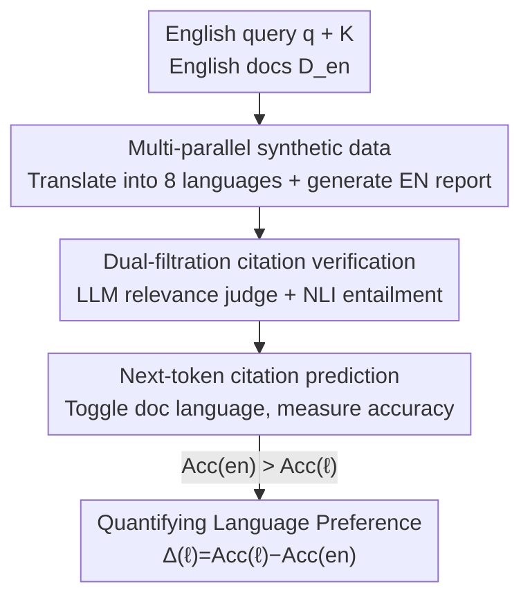

# Linguistic Nepotism: Trading-off Quality for Language Preference in Multilingual RAG

**Conference**: ICML 2026  
**arXiv**: [2509.13930](https://arxiv.org/abs/2509.13930)  
**Code**: https://github.com/dayeonki/lang_preference  
**Area**: Information Retrieval / Multilingual RAG / Model Interpretability Analysis  
**Keywords**: Multilingual RAG, Citation Preference, Linguistic Bias, Next-token Prediction, Logit Lens

## TL;DR
This paper designs a controllable method to measure "language preference" in multilingual RAG using internal signals (next-token citation prediction probability). It finds that six open-source LLMs systematically prefer citing English documents during long-form generation, even when English documents are irrelevant—suggesting language itself influences citation selection more than document relevance.

## Background & Motivation
**Background**: Retrieval-Augmented Generation (RAG) is a core component of modern LLM pipelines, feeding external knowledge to models for knowledge-intensive tasks. As over half of digital content is non-English, RAG has been extended to multilingual scenarios (mRAG), allowing cross-lingual queries and evidence. In long-form mRAG, model outputs are reports with in-line citations rather than single-sentence answers.

**Limitations of Prior Work**: Previous work observed that models exhibit "language preference"—systematically favoring certain languages. However, existing measurements have two major flaws. First (**C1**), in long-form mRAG, preference is typically estimated by comparing "citation frequency vs. document language distribution," which is a coarse signal heavily confounded by document relevance and informativeness—making it unclear if English is cited more due to preference or higher relevance. Second (**C2**), in-line citations are prone to hallucinations; a model might cite a document that does not support the statement, meaning observed "preferences" might be spurious citations rather than true attribution.

**Key Challenge**: To cleanly measure language preference, the "language" variable must be decoupled from "relevance/informativeness" and "citation correctness"—factors that are naturally intertwined in real-world data.

**Goal**: Construct a controlled measurement framework to answer three questions: (i) What factors amplify language preference? (ii) What role does the query language play? (iii) Is citation behavior driven by document relevance or language?

**Key Insight**: Instead of observing final generated citations (which are contaminated by hallucinations), one should directly examine internal "next-token citation prediction." By fixing all variables and only switching the language of the cited document, changes in the accuracy of predicting the correct citation ID provide a pure signal of language preference.

**Core Idea**: Utilize a triad of "multi-parallel synthetic data + double-filtered verified citations + next-token citation prediction accuracy" to isolate language as a single variable for clean quantification of language preference.

## Method

### Overall Architecture
The method consists of four steps: translating the same English evidence documents into multiple languages (ensuring identical content/relevance), generating an English reference report with citations using a strong model, applying two filters to retain only "truly supported" claims, and finally measuring the next-token accuracy of the correct citation ID in a controlled context where only the cited document's language is toggled. A drop in accuracy upon switching languages indicates a preference for the higher-accuracy language.

### Key Designs

**1. Multi-parallel Synthetic Data: Decoupling Language from Relevance**

The primary obstacle to measuring "pure language preference" is that English documents often possess higher relevance and information density. To address **C1**, this work starts with English evidence $D_{en}=\{d_1,\dots,d_K\}$ and uses machine translation (Google Translate API) to translate each into 8 target languages, yielding $D_{\ell}=\{\mathrm{MT}_{\ell}(d_1),\dots,\mathrm{MT}_{\ell}(d_K)\}$. Thus, English and Swahili versions of the same document are **content-parallel with constant relevance**, differing only in language. A strong model (OpenAI o3) generates a reference report $r=M_{gen}(q,D_{en})$ with sentence-level "claim + citation ID" pairs $(s_i,[c_i])$.

**2. Dual-Filtration Citation Verification: Retaining Truly Supported Claims**

To address **C2** (citation hallucinations), each single-citation claim ($|c_i|=1$) must pass two stages. First, **LLM-as-Relevance-Judge**: Three top-tier models (o4-mini, QWEN-3 32B, Gemini 2.5 Pro) select the "most supportive" document from the set. Majority agreement ($\geq 2$ votes) is required. Second, **NLI Entailment Check**: An NLI classifier $\phi$ verifies if the cited document $d_{c_i}$ (premise) entails the claim $s_i$ (hypothesis). Retention rates are 90.35% and 96.12% respectively, yielding 792 verified claims.

**3. Next-Token Citation Prediction: Fixing All, Toggling Language**

For each pair $(s_i,c_i)$, a prompt is constructed ending in $s_i[$ (where $[$ triggers a citation). A **controlled context** is created: only the cited document $d_{c_i}$ is switched to language $\ell$, while others remain in English: $\text{Context}(d_{c_i}\to\ell, d_{\neg c_i}\to en)$. The probability of predicting the correct ID as the top-1 next token $p_\theta^{(\ell)}(c_i)$ is measured, and accuracy is calculated:

$$\text{Acc}(\ell)=\frac{1}{n}\sum_{i=1}^{n}\mathbb{1}(\hat{c}_i^{(\ell)}=c_i),\quad \hat{c}_i^{(\ell)}=\arg\max_t p_\theta^{(\ell)}$$

Language preference is quantified as $\Delta(\ell_{target})=\text{Acc}(\ell_{target})-\text{Acc}(en)$. $\Delta<0$ indicates an English preference. Since relevance, position, and query language are fixed, any change in accuracy is **solely attributable to the cited document's language**.

**4. Logit Lens Layer Analysis: Where Preference Solidifies**

To understand how English preference forms—whether the model initially picks English and corrects it, or decides immediately—the logit lens projects intermediate representations into the vocabulary space. This tracks whether the top-1 citation token prediction is the correct target ID, an incorrect English ID, or an invalid token, providing a "timeline" of preference formation.

### Loss & Training
Ours does not involve model training or parameter updates; it is a "measurement + diagnosis" study. All signals are derived from forward inference of frozen weights.

## Key Experimental Results

### Experimental Setup
- **Datasets**: ELI5 long-form QA (270 queries from WebGPT) with $K<10$ to ensure single-token citation IDs. MIRACL was used for relevance vs. language experiments.
- **Languages**: 8 target languages across different resource levels—Arabic, Bengali, Spanish, French, Korean, Russian, Swahili, Chinese.
- **Models**: 6 open-source LLMs—LLAMA-3.1 8B, LLAMA-3.3 70B, QWEN-3 8B/14B, GEMMA-3 27B, AYA23 8B.

### Main Results: Citation Accuracy by Language

| Language | LLAMA-3.1 8B | QWEN-3 8B | AYA23 8B | GEMMA-3 27B | LLAMA-3.3 70B |
|------|------|------|------|------|------|
| English | 67.4 | 62.6 | 60.0 | 86.2 | 85.9 |
| French | 62.9 (-4.5) | 48.4 (-14.2) | 48.5 (-11.5) | 79.0 (-7.2) | 77.4 (-8.5) |
| Korean | 61.7 (-5.7) | 49.7 (-12.9) | 42.2 (-17.8) | 77.5 (-8.7) | 69.2 (-16.7) |
| Bengali | 56.6 (-10.8) | 41.3 (-21.3) | 27.2 (-32.8) | 77.9 (-8.3) | 68.8 (-17.1) |
| Swahili | 53.0 (-14.4) | 30.4 (-32.2) | 22.4 (-37.6) | 74.0 (-12.2) | 67.3 (-18.6) |

Every model across all target languages showed a consistent English preference ($\Delta<0$). Even the multilingual-optimized AYA23 8B showed significant drops for low-resource languages (Swahili -37.6).

### Amplification Factors and Comparative Analysis

| Dimension | Key Finding |
|---------|---------|
| Resource Level | Lower resource level linked to stronger preference: Swahili avg. -23.9%, while French/Spanish only -8.8%/-8.1%. |
| Document Position | $\Delta$ is largest when cited docs are in the middle, showing "lost in the middle" amplifies English preference. |
| Layer (Logit Lens)| LLAMA-3.1 8B shows no valid prediction in first 17 layers; preference solidifies at layers 22+. |
| Query Language | Models prefer the query language and benefit from linguistic contrast (cited doc = query language). |
| Relevance vs. Language | Models frequently cite irrelevant English documents over relevant non-English ones. |

### Key Findings
- **English preference is universal and systematic**: All 6 models across 8 languages showed $\Delta<0$.
- **Lower resources, higher bias**: Low-resource languages suffer most, suggesting mRAG further marginalizes underrepresented languages.
- **Persistence of preference**: Logit lens shows models do not "correct" their choice; once the preference solidifies in transitional layers, it rarely changes.
- **Language overrides relevance**: Models sacrifice quality for preference, citing irrelevant English documents even when specific information is elsewhere.

## Highlights & Insights
- **Internal Signals bypass Hallucinations**: Measuring next-token probability rather than final generation moves measurement from "contaminated output" to "clean internal signals."
- **Controllability via Multi-parallel Data**: Maintaining constant relevance across languages provides the foundation for isolated variable measurement.
- **"Linguistic Nepotism"**: A poignant term highlighting that machines, like humans, favor "their own" (pre-training) language.
- **Methodological Rigor**: Combining LLM-as-a-Judge (relative choice), NLI verification, and Bonferroni-corrected t-tests ensures statistical reliability.

## Limitations & Future Work
- **Reliance on MT Quality**: Dependence on Google Translate (avg. COMET 0.541) introduces noise. It's hard to fully decouple model bias from translation artifacts in low-resource settings.
- **Single-token ID Constraint**: The method requires $K<10$ for single-token prediction, limiting evaluation of large-scale retrieval.
- **Next-token vs. End-to-end**: Measuring internal states at specific points might not perfectly reflect free-form generation behavior.
- **Diagnostic vs. Solution**: The paper identifies the problem but does not propose a mitigation strategy for linguistic fairness in mRAG.

## Related Work & Insights
- **vs. Short-form mRAG Preference**: Prior works used info-overlap or embeddings for short answers but couldn't isolate citation correctness; Ours uses internal signals to control relevance and veracity.
- **vs. Citation Frequency Methods**: Prior work confounded preference with document distribution (C1); Ours isolates language via parallel data.
- **vs. Multilingual Representation**: Prior work found English-alignment in early layers; Ours extends this to citation generation, finding preference solidifies at specific transitional layers.

## Rating
- Novelty: ⭐⭐⭐⭐⭐ Clean measurement via internal signals + multi-parallel data is highly innovative.
- Experimental Thoroughness: ⭐⭐⭐⭐⭐ 6 models x 8 languages + multi-dimensional analysis.
- Writing Quality: ⭐⭐⭐⭐ Clear logic and strong terminology, though some conclusions rely on heavy appendix data.
- Value: ⭐⭐⭐⭐⭐ Highlights systematic marginalization in mRAG, critical for multilingual knowledge equity.

<!-- RELATED:START -->

## Related Papers

- [\[ACL 2025\] Investigating Language Preference of Multilingual RAG Systems](../../ACL2025/information_retrieval/investigating_language_preference_of_multilingual_rag_systems.md)
- [\[ACL 2026\] Enhancing Multilingual RAG Systems with Debiased Language Preference-Guided Query Fusion](../../ACL2026/information_retrieval/enhancing_multilingual_rag_systems_with_debiased_language_preference-guided_quer.md)
- [\[ACL 2026\] All Languages Matter: Understanding and Mitigating Language Bias in Multilingual RAG](../../ACL2026/information_retrieval/all_languages_matter_understanding_and_mitigating_language_bias_in_multilingual_.md)
- [\[ICML 2026\] Temporal Preference Optimization for Unsupervised Retrieval](temporal_preference_optimization_for_unsupervised_retrieval.md)
- [\[ACL 2026\] Language-Coupled Reinforcement Learning for Multilingual Retrieval-Augmented Generation](../../ACL2026/information_retrieval/language-coupled_reinforcement_learning_for_multilingual_retrieval-augmented_gen.md)

<!-- RELATED:END -->
