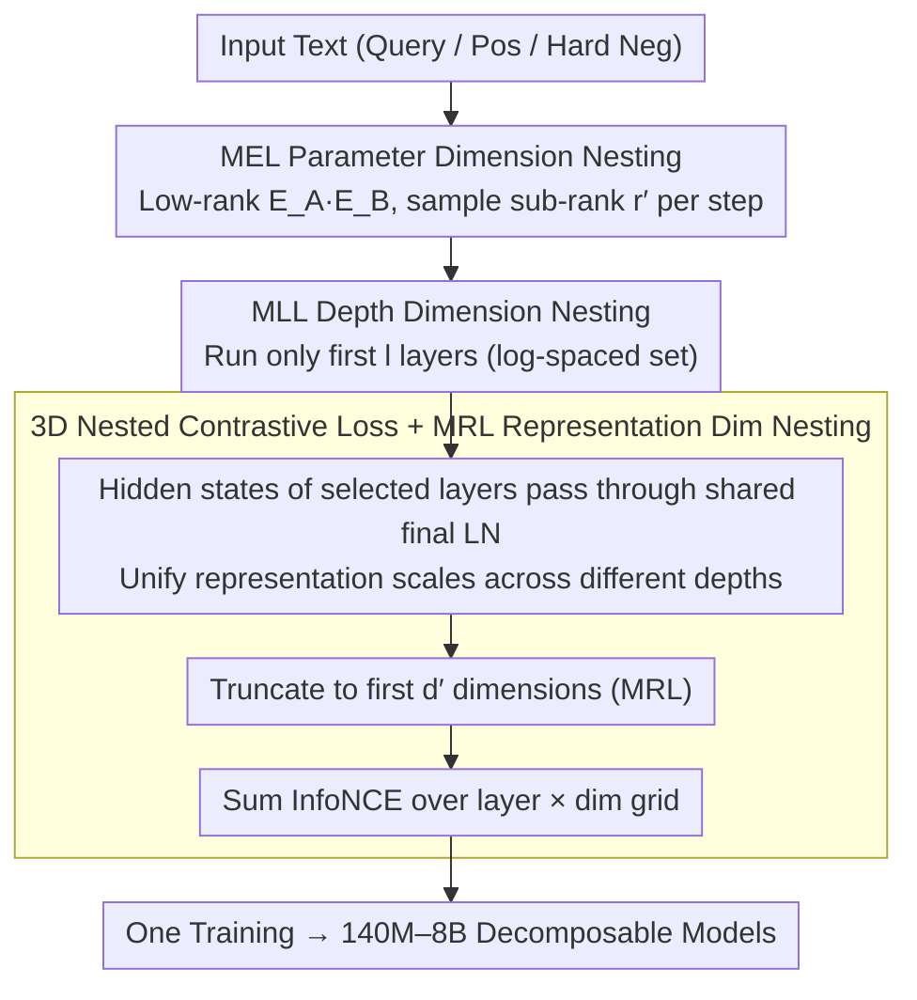

# ML-Embed: Inclusive and Efficient Embeddings for a Multilingual World

**Conference**: ICML 2026  
**arXiv**: [2605.15081](https://arxiv.org/abs/2605.15081)  
**Code**: https://github.com/codefuse-ai/CodeFuse-Embeddings  
**Area**: Text Embeddings / Multilingual Models / Efficient Training  
**Keywords**: Matryoshka Representation Learning, Multi-dimensional Nesting, MTEB, Low-resource Languages, decoder-based embeddings

## TL;DR
ML-Embed extends the Matryoshka concept from one dimension (representation dimension) to **three dimensions**—performing full-stack nested training across embedding parameters (MEL), model depth (MLL), and representation dimensions (MRL). By constructing a multilingual training set of 50 million samples covering 282 natural languages and 40 programming languages, the authors introduce a family of open-source models (140M-8B) that rank first on 9 out of 17 MTEB benchmarks, with significant gains in Polish (+22.89) and Vietnamese (+6.88).

## Background & Motivation

**Background**: Text embeddings serve as the foundation for RAG and semantic search. Current SOTA models are almost entirely decoder LLMs (E5-Mistral / NV-Embed / Qwen3-Embedding / Gemini-Embedding) repurposed for embeddings. While effective, this path is costly: explosive training costs, massive inference VRAM requirements, neglect of low-resource languages, and a growing trend of closed-source APIs.

**Limitations of Prior Work**: Three major barriers exist. (1) **Computational Barrier**: Decoder-based embedding models often exceed 7B parameters, making training and deployment difficult; existing Matryoshka Representation Learning (MRL) only optimizes **storage** dimensions (shortening output embeddings) without reducing training or inference costs. (2) **Linguistic Barrier**: On MTEB, Polish has only one model with complete results, Japanese has 11, and Vietnamese has 17, compared to 154 for English and 146 for multilingual—a vicious cycle where fewer resources lead to less attention. (3) **Transparency Barrier**: Leading models (Qwen3-Embedding / Gemini-Embedding / EmbeddingGemma) are either closed APIs or open-weight without disclosing training data or recipes, hindering replication and improvement.

**Key Challenge**: There is an implicit trade-off between efficiency, performance, and language coverage. Existing MRL methods only nest the **output dimension**, but the true costs of decoder-based models lie in **parameters (especially the embedding layer in small/multilingual models) + depth (Transformer layers) + output dimension**. Nesting a single dimension is insufficient. While LoRA-style methods save training parameters, they still require loading the full model during inference, failing to address deployment pain points.

**Goal**: (1) Design a unified framework for **simultaneous nested training across three dimensions**, allowing one training run to produce multiple sizes, depths, and dimensions; (2) Build multilingual models with extensive coverage of low-resource languages; (3) Open-source the full dataset, weights, and code to break transparency barriers.

**Key Insight**: The authors noted an overlooked detail—in small decoders like Qwen3-0.6B, the **embedding layer accounts for 1/4 of total parameters** due to the massive multilingual vocabulary. This area is untouched by existing MRL and represents "low-hanging fruit." Simultaneously, Matryoshka Layer Learning (MLL) can address inference depth. Integrating these three aspects into a single nested loss results in 3D-ML.

**Core Idea**: **3D-Matryoshka Learning**: During each forward pass, the model simultaneously samples an embedding rank $r'$, network depth $l$, and representation dimension $d'$. By ensuring the loss function converges for any combination of the three, a single training run yields a cube-shaped decomposable model space.

## Method

### Overall Architecture

ML-Embed follows a two-stage training strategy within the 3D-ML framework:
- **Data**: 121 public sources aggregated into 50 million samples, covering 282 natural languages and 40+ programming languages, unified into three contrastive formats (retrieval, clustering, and two-way classification).
- **Training**: Stage 1 builds the semantic foundation on 2700 million retrieval samples. Stage 2 performs fine-tuning on 8.3 million mixed samples with task-specific instructions.
- **Loss Function**: Instead of standard InfoNCE, it uses a 3D-ML loss summed over a nested layer × MRL dimension grid.
- **Model Family**: A single training run produces six scales: 140M, 330M, 0.6B, 1.7B, 4B, and 8B.

In each forward pass, the input undergoes: (1) MEL embedding using sub-rank $r'$ → (2) Processing through the first $l$ transformer layers → (3) Passing hidden states of each layer through a final LN → (4) Truncating to the first $d'$ dimensions for the contrastive loss. These three sampling processes occur **simultaneously**, forcing the model to provide useful representations under all possible combinations.

### Key Designs

**1. Matryoshka Embedding Learning (MEL): Parameter Dimension Nesting—Saving the Bulkiest Embedding Layer**

In small decoders like Qwen3-0.6B, the embedding layer accounts for 1/4 of total parameters due to the large multilingual vocabulary, yet it was completely skipped by prior Matryoshka methods (MRL for output dims, MLL for depth). MEL addresses this by using truncated SVD to decompose the original embedding $E \in \mathbb{R}^{v \times d_{model}}$ into $E_A \leftarrow U_r S_r \in \mathbb{R}^{v \times r}$ and $E_B \leftarrow V_r^{\top} \in \mathbb{R}^{r \times d_{model}}$, updating only these small matrices. The Matryoshka trick involves randomly sampling a sub-rank $r' < r$ from $\{64, 128, 256, 512, 1024\}$ for each forward pass using $E_{effective} = E_A[:, :r'] E_B[:r', :]$, forcing the model to condense critical information into the first $r'$ columns. This allows for two deployment modes: **Compatibility Mode**, which multiplies $E_A E_B$ back into a standard matrix for zero-code-change deployment, and **Efficiency Mode**, which retains the low-rank form and refactorizes to a smaller $r'' \ll r$ to drastically reduce VRAM. Unlike LoRA, which only saves training parameters, MEL reduces both training and inference footprints. SVD initialization ensures $E_A E_B$ starts close to the original matrix, preserving pre-trained knowledge.

**2. Matryoshka Layer Learning (MLL): Depth Dimension Nesting—Making Shallow Layers Qualified Exit Points**

Simply pruning the last few layers of a decoder usually causes a severe performance drop because deep semantics are not anchored in shallow layers. MLL selects a set of log-spaced layers $\mathcal{L}_{layers} = \{1, 2, 4, 8, 16, 32, L\}$ and passes the hidden state $h_l$ of each selected layer through the same $\text{LN}_{final}$ (reusing the final layer norm to ensure consistent scales) before calculating the contrastive loss. This is essentially a variant of early-exit training where all exits share the final LN. By forcing each milestone layer to meet performance standards, they become qualified exit points. During inference, loading only the first $l$ layers produces a fully functional smaller embedding model, compatible with Hugging Face `AutoModel` by simply adjusting `num_hidden_layers`.

**3. Unified 3D Nested Contrastive Loss + Matryoshka Representation Learning (MRL): Merging Three Dimensions**

To make the first two dimensions effective, they must be integrated into a single objective function that converges under any combination. 3D-ML applies truncation and contrastive loss for each selected MLL layer $l$ and each MRL dimension $d' \in \mathcal{D}_{mrl}$: $v_{l, d'}(\cdot) = \text{proj}_{d'}(\text{LN}_{final}(h_l(\cdot)))$. The total loss is summed over the layer × dim grid:

$$\mathcal{L}_{3D\text{-}ML} = \sum_{l \in \mathcal{L}_{layers}} \sum_{d' \in \mathcal{D}_{mrl}} c_{l, d'} \mathcal{L}_{cl}(q_i, d_i^+, \{d_{i,j}^-\}; v_{l, d'})$$

Where $\mathcal{L}_{cl}$ is the standard InfoNCE loss. The sub-rank $r'$ for MEL is sampled independently at each step, while layers and dimensions are enumerated. This compresses the cost of training $N$ model variants into a single shared forward pass and gradient update. Reusing $\text{LN}_{final}$ for every exit is critical to prevent scale mismatch between shallow and deep hidden states.

### Loss & Training

The total loss is the 3D-ML loss defined above. Data is organized into three contrastive formats: retrieval (query, pos, hard negs mined using Qwen3-Embedding-8B), clustering (anchor, same-class pos, diff-class neg), and two-way classification (text-as-anchor + label-text-as-pos/neg). Training is split into two stages: Stage 1 on 27 million retrieval samples for basic semantics, and Stage 2 on 8.3 million mixed samples with task instructions for fine-tuning.

## Key Experimental Results

### Main Results

Comparison of average scores against Top-1 / Top-5 leaderboard models on 17 MTEB benchmarks:

| Benchmark (Tasks) | Top-1 | Top-5 | **ML-Embed-8B** | ML-Embed-4B | ML-Embed-1.7B | ML-Embed-0.6B |
|------|------|------|------|------|------|------|
| Multilingual (131) | 72.32 | 69.45 | 66.79 | 65.80 | 63.70 | 61.30 |
| English (41) | 75.97 | 74.61 | 73.26 | 72.89 | 71.19 | 70.01 |
| European (73) | 63.60 | 62.32 | **68.00** | 67.53 | 65.47 | 63.40 |
| Indic (20) | 70.15 | 67.39 | **76.76** | 75.15 | 72.58 | 66.11 |
| German (19) | 59.96 | 55.72 | **66.43** | 65.49 | 63.99 | 61.58 |
| French (25) | 70.37 | 67.25 | **71.91** | 70.97 | 68.94 | 66.64 |
| Polish (17) | 50.95 | n.a. | **73.84** | 73.14 | 71.12 | 68.13 |
| Persian (52) | 71.58 | 65.26 | **71.12 (≈top-1)** | 69.94 | 68.35 | — |
| Vietnamese (50) | 54.74 | 52.37 | **61.62** | 61.20 | 60.27 | — |
| Average | 68.46 | 65.95 | **70.24** | 69.29 | 67.58 | — |

The 8B model achieves first place in 9 out of 17 benchmarks, with extreme improvements in low-resource languages: Polish +22.89 (73.84 vs 50.95), Vietnamese +6.88. Even the 0.6B model reaches 68.13 in Polish, far exceeding the previous Top-1 of 50.95.

### Ablation Study

| Configuration | Avg MTEB | Description |
|------|---------|------|
| Full 3D-ML | Best | MEL + MLL + MRL simultaneously enabled |
| w/o MEL | Close, but high cost | Embedding layer is not low-rank; training VRAM spikes |
| w/o MLL | Slight drop | Loss of depth flexibility; inference requires full depth |
| w/o MRL | Fixed dimension | Loss of storage/retrieval efficiency flexibility |
| Separate Training | N× Total Cost | Performance similar to corresponding 3D-ML, but N× resources |

### Key Findings

- **Gains are largest for low-resource languages**: Polish +22.89, Vietnamese +6.88. This suggests previous Top-1 models lacked sufficient training data for these languages. ML-Embed's "real-world data distribution" strategy outperforms "benchmark-optimized" strategies.
- **The embedding layer is a bottleneck for small models**: In Qwen3-0.6B, MEL compresses the embedding layer to 1/10 its original size (rank=128) with negligible MTEB performance loss.
- **MLL early exit is effective**: The 0.6B model achieves 61.30 on the multilingual benchmark, close to the 1.7B's 63.70, proving that shallow exits with shared final LN are viable.
- **3D-ML is not a simple summation of three losses**: Joints sampling is required; optimizing MEL or MLL in isolation breaks the nested property.
- **Open-source strategy is a primary contribution**: By releasing all data, weights, and code, the authors provide a reproducible baseline for languages like Polish that previously lacked proper model support.

## Highlights & Insights

- **3D Matryoshka is a concise product-level abstraction**: While prior work addressed storage (MRL), depth (MLL), or training parameters (LoRA) separately, ML-Embed integrates them into a single loss. This "multi-task during training, single binary for deployment" mode can be extended to all foundation model training.
- **Low-rank + Matryoshka for embedding layers is an underrated optimization**: Since embedding layers account for 25% of parameters in multilingual models, MEL's combination of SVD initialization and sub-rank nesting is highly effective.
- **"Real Data Distribution" vs "Benchmark Optimization"**: Training data follows the actual population and corpus distribution of languages like Spanish and Arabic. This stance suppresses benchmark-gaming and results in massive gains for long-tail languages.
- **Shared final LN across layers**: This critical engineering detail normalizes output scales, making contrastive losses comparable across different depths and preventing training instability.

## Limitations & Future Work

- **The 8B model trails Top-1 on MTEB-Multilingual (66.79 vs 72.32)**: It hasn't reached first place in the most comprehensive balanced benchmark, with strengths concentrated in specific regions (Europe/India).
- **Inference latency is not reported**: The paper lacks actual throughput/TTFT data for different MLL depths, only proving theoretical feasibility.
- **Precision drop after MEL refactorization**: Using smaller $r''$ for inference is mentioned, but the performance decay curve for extreme $r''$ values is not provided.
- **2-Stage Training Curriculum**: The sequence of retrieval-then-mixed is used, but the paper does not explore if a more aggressive curriculum (e.g., low-resource followed by high-resource) would further boost small language performance.

## Related Work & Insights

- **vs MRL (Kusupati 2022)**: Original MRL targets only representation dimensions; ML-Embed extends this to parameters, depth, and dimensions for full lifecycle optimization.
- **vs Matryoshka Layer Learning (Li 2024)**: While they proposed depth nesting, ML-Embed joint-optimizes the layer × dim grid.
- **vs LoRA / QLoRA / AdaLoRA**: These only save training parameters; MEL reduces both training and inference parameters while allowing Matryoshka-style selection during inference.
- **vs Qwen3-Embedding / Gemini-Embedding / NV-Embed**: These SOTA models are often closed or hide training recipes; ML-Embed leads in transparency by open-sourcing everything.
- **vs KaLM-Embedding**: One of the few transparent multilingual models, but heavily biased towards English and Chinese. ML-Embed provides far better coverage for long-tail languages.

## Rating
- Novelty: ⭐⭐⭐⭐ MEL (Matryoshka for embeddings) and 3D joint nesting are new; MRL and MLL were existing components now systematically integrated.
- Experimental Thoroughness: ⭐⭐⭐⭐⭐ Extremely comprehensive with 17 benchmarks, six model scales, and over 430 tasks.
- Writing Quality: ⭐⭐⭐⭐ Clear motivation and barrier analysis; however, some ablation data is relegated to the appendix.
- Value: ⭐⭐⭐⭐⭐ Full open-source release with significant boosts for low-resource languages provides a strong baseline for the community.

<!-- RELATED:START -->

## Related Papers

- [\[ICML 2026\] Very Efficient Listwise Multimodal Reranking for Long Documents](very_efficient_listwise_multimodal_reranking_for_long_documents.md)
- [\[ACL 2025\] Towards Storage-Efficient Visual Document Retrieval: An Empirical Study on Reducing Patch-Level Embeddings](../../ACL2025/information_retrieval/towards_storage-efficient_visual_document_retrieval_an_empirical_study_on_reduci.md)
- [\[ICML 2026\] LazyAttention: Efficient Retrieval-Augmented Generation with Deferred Positional Encoding](lazyattention_efficient_retrieval-augmented_generation_with_deferred_positional_.md)
- [\[ACL 2026\] CORAL: Adaptive Retrieval Loop for Culturally-Aligned Multilingual RAG](../../ACL2026/information_retrieval/coral_adaptive_retrieval_loop_for_culturally-aligned_multilingual_rag.md)
- [\[ACL 2025\] REAL-MM-RAG: A Real-World Multi-Modal Retrieval Benchmark](../../ACL2025/information_retrieval/real-mm-rag_a_real-world_multi-modal_retrieval_benchmark.md)

<!-- RELATED:END -->
