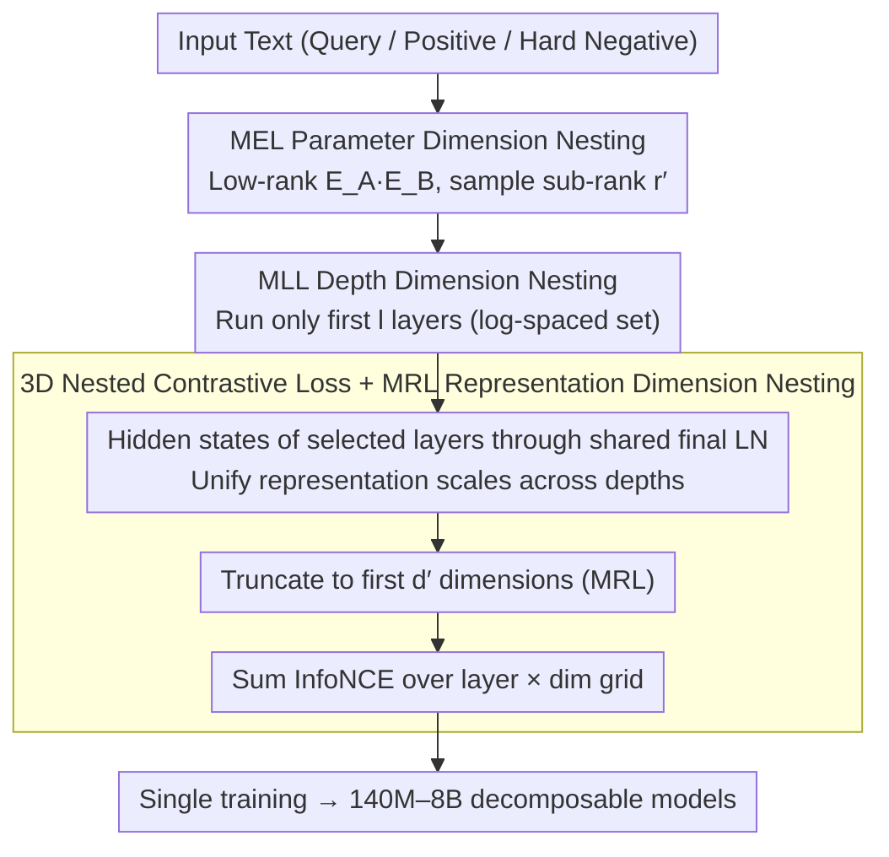

# ML-Embed: Inclusive and Efficient Embeddings for a Multilingual World

**Conference**: ICML 2026  
**arXiv**: [2605.15081](https://arxiv.org/abs/2605.15081)  
**Code**: https://github.com/codefuse-ai/CodeFuse-Embeddings  
**Area**: Text Embedding / Multilingual Models / Efficient Training  
**Keywords**: Matryoshka Representation Learning, Multidimensional Nesting, MTEB, Low-resource Languages, Decoder-based Embeddings

## TL;DR
ML-Embed extends the Matryoshka concept from one dimension (representation dimension) to **three dimensions**—implementing full-stack nested training across embedding parameters (MEL), model depth (MLL), and representation dimension (MRL). Simultaneously, it constructs a multilingual training set of 50 million samples covering 282 natural languages and 40 programming languages. A family of open-source models (140M-8B) is released, achieving first place on 9 out of 17 MTEB benchmarks, with improvements of $+22.89$ in Polish and $+6.88$ in Vietnamese.

## Background & Motivation

**Background**: Text embeddings serve as the foundation for RAG and semantic search. Current SOTA models are mostly constructed by adapting decoder LLMs (e.g., E5-Mistral, NV-Embed, Qwen3-Embedding, Gemini-Embedding) into embedding models. While effective, this path is costly: explosive training costs, massive inference VRAM requirements, neglect of low-resource languages, and an increasing number of closed-source APIs.

**Limitations of Prior Work**: Three major barriers exist. (1) **Computational Barrier**: Decoder-based embedding models often exceed 7B parameters, making training and deployment difficult. Existing Matryoshka Representation Learning (MRL) only optimizes the **storage** dimension (truncatable embedding outputs) without reducing training or inference costs. (2) **Language Barrier**: On MTEB, Polish has only one model with complete results, Japanese has 11, and Vietnamese has 17, compared to 154 for English and 146 for multilingual—a vicious cycle where low-resource languages receive less attention. (3) **Transparency Barrier**: Leading models (Qwen3-Embedding, Gemini-Embedding, EmbeddingGemma) are either closed-source APIs or open-weight without disclosing training data/recipes, making reproduction and improvement difficult.

**Key Challenge**: An implicit trade-off exists between efficiency, performance, and language coverage. Existing MRL-like methods only nest at the **output dimension**, but the true costs of decoder-based models lie in three areas: **Parameters (embedding layers are particularly large in small/multilingual models) + Depth (Transformer layers) + Output Dimension**. Nesting in a single dimension is insufficient. While LoRA-like methods save training parameters, they still require loading the full model during inference, failing to address deployment pain points.

**Goal**: (1) Design a unified framework capable of **simultaneous nested training across all three dimensions**, allowing a single training run to produce usable models of various sizes, depths, and dimensions; (2) Use this framework to build multilingual models with large-scale coverage of low-resource languages; (3) Open-source the full dataset, weights, and code to break transparency barriers.

**Key Insight**: The authors noticed an overlooked detail—in small decoders like Qwen3-0.6B, **the embedding layer accounts for 1/4 of total parameters** (due to the massive multilingual vocabulary). This area, untouched by existing MRL, is a "low-hanging fruit." They also observed that Matryoshka Layer Learning (MLL) could address inference depth. Integrating all three into a nested loss produces 3D-ML.

**Core Idea**: **3D-Matryoshka Learning**: Simultaneously sample embedding rank $r'$, network depth $l$, and representation dimension $d'$ during every forward pass. Ensure the loss function converges for any combination of these three, yielding a cube-shaped decomposable model space from a single training run.

## Method

### Overall Architecture

ML-Embed follows a two-stage training process within the 3D-ML framework:
- **Data**: 121 public data sources merged into 50 million samples, covering 282 natural languages and 40+ programming languages, unified into three contrastive formats (retrieval, clustering, two-way classification).
- **Training**: Stage 1 builds semantic foundations on 27 million retrieval samples; Stage 2 performs fine-tuning on 8.3 million mixed samples with task-specific instructions.
- **Objective Function**: Instead of standard InfoNCE, it uses a 3D-ML loss summed over a nested grid of layers × MRL dimensions.
- **Model Family**: Produces six scales: 140M, 330M, 0.6B, 1.7B, 4B, and 8B.

For each forward pass, the input undergoes: (1) An MEL embedding layer with sub-rank $r'$; (2) Execution of the first $l$ Transformer layers; (3) Extraction of hidden states from every layer followed by a final LN; (4) Truncation to the first $d'$ dimensions for contrastive loss. These three samplings occur **simultaneously** during training, forcing the model to provide useful representations under all possible combinations.

### Key Designs

**1. Matryoshka Embedding Learning (MEL): Parameter Nesting—Saving the Heaviest Layer**

In small decoders like Qwen3-0.6B, the embedding layer occupies 1/4 of total parameters due to the large multilingual vocabulary, yet it was bypassed by previous Matryoshka methods. MEL addresses this by using truncated SVD to split the original embedding $E \in \mathbb{R}^{v \times d_{model}}$ into $E_A \leftarrow U_r S_r \in \mathbb{R}^{v \times r}$ and $E_B \leftarrow V_r^{\top} \in \mathbb{R}^{r \times d_{model}}$. Only these small matrices are updated during training. A Matryoshka trick randomly samples sub-rank $r' < r$ from $\{64, 128, 256, 512, 1024\}$, using $E_{effective} = E_A[:, :r'] E_B[:r', :]$ to force the model to pack critical information into the first $r'$ columns. For deployment, **Compatibility Mode** merges $E_A E_B$ into a standard matrix, while **Efficiency Mode** retains the low-rank form for lower memory usage. Unlike LoRA, MEL saves parameters for both training and inference. SVD initialization ensures $E_A E_B$ starts close to the original matrix, facilitating a smooth transition to low-rank fine-tuning.

**2. Matryoshka Layer Learning (MLL): Depth Nesting—Making Shallow Layers Qualified Exit Points**

Truncating the last few layers of a decoder usually causes significant performance drops because deep semantics are not anchored in shallow layers. MLL selects a set of log-spaced layers $\mathcal{L}_{layers} = \{1, 2, 4, 8, 16, 32, L\}$ and passes the hidden state $h_l$ of each selected layer through the same $\text{LN}_{final}$. This variant of early-exit training forces every milestone layer to reach performance standards. During inference, loading only the first $l$ layers yields a complete, smaller embedding model compatible with Hugging Face `AutoModel` by simply modifying `num_hidden_layers`.

**3. Unified 3D Nested Contrastive Loss + MRL: Integrating Three Dimensions into One Objective**

To make the first two dimensions effective, they must be integrated into an objective that converges under any combination. 3D-ML performs truncation and contrastive loss for each selected MLL layer $l$ and each MRL dimension $d' \in \mathcal{D}_{mrl} = \{8, 16, 32, \ldots, d_{model}\}$. The truncated representation is $v_{l, d'}(\cdot) = \text{proj}_{d'}(\text{LN}_{final}(h_l(\cdot)))$, and the total loss is summed over the layer × dim grid:

$$\mathcal{L}_{3D\text{-}ML} = \sum_{l \in \mathcal{L}_{layers}} \sum_{d' \in \mathcal{D}_{mrl}} c_{l, d'} \mathcal{L}_{cl}(q_i, d_i^+, \{d_{i,j}^-\}; v_{l, d'})$$

where $\mathcal{L}_{cl}$ is the standard InfoNCE. The MEL sub-rank $r'$ is sampled at each step, while layers and dimensions are enumerated. This compresses the cost of training multiple scales into a single shared forward pass. Reusing $\text{LN}_{final}$ at every exit is critical to maintaining a consistent scale for the contrastive loss.

### Loss & Training

The total loss is the 3D-ML loss described above. Data is organized into three contrastive formats: retrieval (query, pos, hard negs mined using Qwen3-Embedding-8B), clustering (anchor, same-class pos, diff-class neg), and two-way classification (text-as-anchor + label-text-as-pos/neg). Training is divided into: Stage 1 for basic semantics using 27M retrieval samples, and Stage 2 for fine-tuning using 8.3M mixed samples with task instructions.

## Key Experimental Results

### Main Results

Comparison of the top-1 and top-5 average scores on 17 MTEB benchmarks:

| Benchmark (# Tasks) | Top-1 | Top-5 | **ML-Embed-8B** | ML-Embed-4B | ML-Embed-1.7B | ML-Embed-0.6B |
|------|------|------|------|------|------|------|
| Multilingual (131) | 72.32 | 69.45 | 66.79 | 65.80 | 63.70 | 61.30 |
| English (41) | 75.97 | 74.61 | 73.26 | 72.89 | 71.19 | 70.01 |
| European (73) | 63.60 | 62.32 | **68.00** | 67.53 | 65.47 | 63.40 |
| Indic (20) | 70.15 | 67.39 | **76.76** | 75.15 | 72.58 | 66.11 |
| German (19) | 59.96 | 55.72 | **66.43** | 65.49 | 63.99 | 61.58 |
| French (25) | 70.37 | 67.25 | **71.91** | 70.97 | 68.94 | 66.64 |
| Polish (17) | 50.95 | n.a. | **73.84** | 73.14 | 71.12 | 68.13 |
| Persian (52) | 71.58 | 65.26 | **71.12 (≈top-1)** | 69.94 | 68.35 | — |
| Vietnamese (50) | 54.74 | 52.37 | **61.62** | 61.20 | 60.27 | — |
| Average | 68.46 | 65.95 | **70.24** | 69.29 | 67.58 | — |

The 8B model takes first place in 9 out of 17 benchmarks, with massive gains in low-resource languages: Polish $+22.89$ (73.84 vs 50.95) and Vietnamese $+6.88$. Even the 0.6B model reaches 68.13 in Polish, far exceeding the previous top-1 of 50.95.

### Ablation Study

| Configuration | Avg MTEB | Description |
|------|---------|------|
| Full 3D-ML | Best | MEL + MLL + MRL enabled |
| w/o MEL | Close, but high cost | Embedding layer not low-rank; training VRAM spikes |
| w/o MLL | Dropped focus | Loss of depth flexibility |
| w/o MRL | Fixed dim | Loss of storage/retrieval flexibility |
| Separate Training | N× cost | Performance similar to 3D-ML, but N× resource usage |

### Key Findings

- **Gains are largest for low-resource languages**: Polish $+22.89$, Vietnamese $+6.88$. This reflects that historical top-1 models on the leaderboard lacked sufficient training data for these languages. ML-Embed's strategy of being "real-world data distribution driven" rather than "benchmark optimized" allows it to surpass prior SOTA in neglected languages.
- **Embedding layers are a bottleneck for small models**: In Qwen3-0.6B, the embedding layer is 25% of parameters. MEL compresses this to rank=128 (1/10th the size) with negligible MTEB performance loss.
- **MLL early exit is effective**: The 0.6B model achieves 61.30 on the multilingual benchmark, close to the 1.7B's 63.70, proving that shallow exits trained with log-spacing and shared LN are viable.
- **3D-ML is not a simple sum of independent losses**: The three dimensions must be **jointly sampled**; separate optimization breaks nested attributes (e.g., prefix dimensions won't be optimized if only layers are sampled).
- **Open-source strategy as a contribution**: By releasing all data, weights, and code, the authors distinguish themselves from the "closed-source trend." This helps the community improve on languages like Polish that previously had only one model on the leaderboard.

## Highlights & Insights

- **3D Matryoshka is a concise product-level abstraction**: Previously, MRL handled storage, MLL handled depth, and LoRA handled training params. ML-Embed unifies these into a single loss, enabling "train once, deploy in many forms"—a pattern applicable to all foundation model training.
- **Low-rank Matryoshka embeddings are underrated**: Optimizing the embedding layer (25% of params) via SVD initialization and sub-rank nesting is a clever engineering move.
- **"Real-world data distribution" vs "Benchmark optimization"**: Training on actual population and corpus distributions (e.g., Spanish, Arabic) rather than overfitting to MTEB tasks is a stance that pays off in low-resource language performance.
- **Shared final LN across layers**: This detail normalizes the "output scale," making the contrastive loss comparable across different depths—a key factor in stable nested training.

## Limitations & Future Work

- **8B model lags behind top-1 in Multilingual (66.79 vs 72.32)**: It is not yet #1 on the most comprehensive multilingual benchmark. Strengths are currently concentrated in specific regions (European, Indic).
- **Missing inference latency reports**: Throughput/TTFT data for different MLL depth exits are not provided.
- **MEL re-factorization precision drop**: The performance curve when re-factorizing to extremely small $r''$ values during inference is missing.
- **2-stage training order**: The study does not explore whether a more aggressive curriculum (e.g., low-resource before high-resource) could further push low-resource performance.

## Related Work & Insights

- **vs MRL (Kusupati 2022)**: Original MRL only nested representation dimensions; ML-Embed extends this to parameters, depth, and dimensions.
- **vs Matryoshka Layer Learning (Li 2024)**: ML-Embed sums MLL and MRL in the loss to achieve joint grid optimization.
- **vs LoRA / QLoRA**: MEL reduces both training and inference parameters, and Matryoshka allows for further reduction at inference time.
- **vs Qwen3-Embedding / Gemini-Embedding**: These are closed or do not disclose training recipes; ML-Embed leads in transparency.
- **vs KaLM-Embedding**: One of the few transparent multilingual models, but heavily biased toward EN-ZH; ML-Embed has much better coverage of long-tail languages.

## Rating
- Novelty: ⭐⭐⭐⭐ MEL and 3D joint nesting are new; MRL/MLL are existing concepts integrated systematically.
- Experimental Thoroughness: ⭐⭐⭐⭐⭐ 17 MTEB benchmarks across six model scales and 430 tasks make this extremely comprehensive.
- Writing Quality: ⭐⭐⭐⭐ Clear motivations and barrier discussions; however, many ablation details are relegated to the appendix.
- Value: ⭐⭐⭐⭐⭐ Full open-sourcing and significant low-resource gains provide a strong, reproducible baseline for the multilingual embedding community.

<!-- RELATED:START -->

## Related Papers

- [\[ICML 2026\] LazyAttention: Efficient Retrieval-Augmented Generation with Deferred Positional Encoding](lazyattention_efficient_retrieval-augmented_generation_with_deferred_positional_.md)
- [\[ICLR 2026\] Beyond Text-Only: Towards Multimodal Table Retrieval in Open-World](../../ICLR2026/information_retrieval/beyond_text-only_towards_multimodal_table_retrieval_in_open-world.md)
- [\[ACL 2026\] CORAL: Adaptive Retrieval Loop for Culturally-Aligned Multilingual RAG](../../ACL2026/information_retrieval/coral_adaptive_retrieval_loop_for_culturally-aligned_multilingual_rag.md)
- [\[ICCV 2025\] LangBridge: Interpreting Image as a Combination of Language Embeddings](../../ICCV2025/information_retrieval/langbridge_interpreting_image_as_a_combination_of_language_embeddings.md)
- [\[ACL 2025\] Redundancy, Isotropy and Intrinsic Dimensionality of Prompt-Based Text Embeddings](../../ACL2025/information_retrieval/redundancy_isotropy_and_intrinsic_dimensionality_of_prompt-based_text_embeddings.md)

<!-- RELATED:END -->
