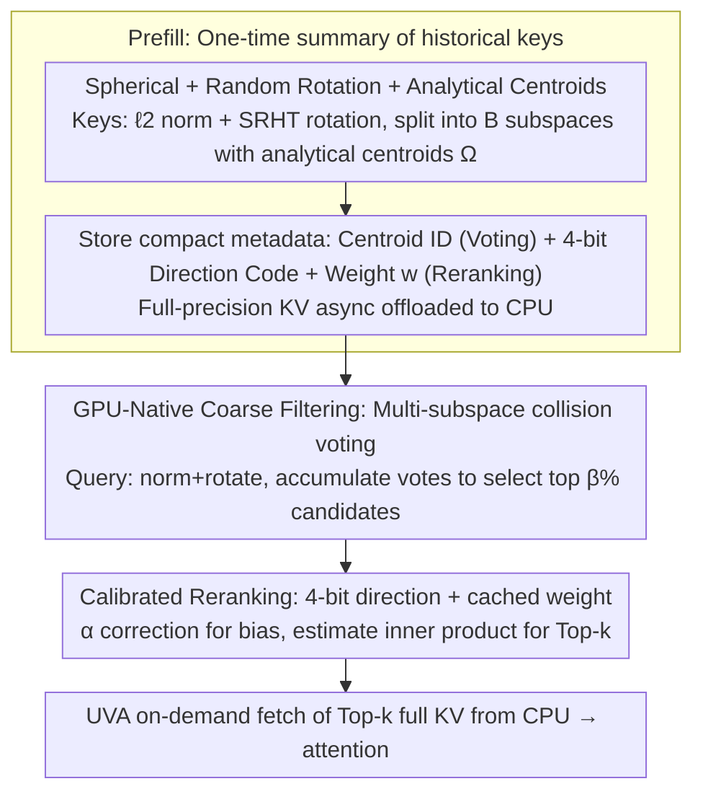

# ParisKV: Fast and Drift-Robust KV-Cache Retrieval for Long-Context LLMs

**Conference**: ICML 2026  
**arXiv**: [2602.07721](https://arxiv.org/abs/2602.07721)  
**Code**: https://github.com/amy-77/ParisKV/tree/main  
**Area**: LLM Efficiency / Long-Context Inference / KV-Cache Retrieval  
**Keywords**: KV-Cache Retrieval, Long Context, Drift-Robust, GPU-Native, UVA Offloading

## TL;DR
ParisKV reduces Top-$k$ KV retrieval decoding latency by 17–44× compared to MagicPIG/PQCache on million-token contexts by normalizing and randomly rotating keys/queries onto a unit hypersphere and replacing prefill-learned centroids with "data-independent analytical centroids." Combined with a two-stage GPU-native "collision voting + 4-bit quantized reranking" pipeline and UVA-based on-demand KV fetching, it achieves or exceeds full attention accuracy in 7 out of 9 long-generation tasks.

## Background & Motivation

**Background**: Long-context LLM inference is memory-bound—each decoding step requires reading all historical KV pairs, with bandwidth growing linearly with context length. Sparse/selective attention is a mainstream mitigation strategy. Among these, *KV-cache retrieval* (retaining all KVs and dynamically picking Top-$k$ at each step) is more suitable for open-ended long generation than *KV-cache dropping* (permanent deletion), as it avoids failure from prematurely discarding early tokens. Representative methods include Quest, MagicPIG, PQCache, and RetrievalAttention.

**Limitations of Prior Work**: Existing retrieval methods generally fail in "long-generation + large-context" scenarios. The authors summarize three pain points: (C1) **Speed–quality tradeoff**: Coarse clustering/low-bit quantization sacrifices recall for speed; regaining accuracy requires increasing the retrieval budget, neutralizing the benefits of sparsity. (C2) **Decoding drift**: Centroids are learned by clustering historical keys during the prefill stage. As generation progresses and new keys accumulate, prefill-only centroids gradually mismatch the actual key distribution, causing recall to crash after long decoding (Fig. 1(a) shows PQCache recall collapsing on AIME). (C3) **CPU-side retrieval bottleneck**: When KVs are offloaded to CPU, traditional methods use CPU search + CPU→GPU copying, where end-to-end performance is throttled by CPU orchestration and memcpy, and the GPU only sees centroids/low-bit codes with approximation errors.

**Key Challenge**: Centroids learned from data will inevitably drift; "data-independent" hashes or grids usually suffer from uneven buckets and failed collision statistics due to the anisotropic nature of original key distributions.

**Goal**: (1) Maintain stable Top-$k$ recall under decoding drift; (2) Keep retrieval decisions entirely on the GPU to avoid CPU orchestration; (3) Achieve end-to-end latency close to GPU-native performance despite KV offloading to CPU.

**Key Insight**: The authors observe that by $\ell_2$-normalizing keys/queries onto a unit hypersphere and applying a shared random orthogonal rotation (preserving inner products and spreading information uniformly), subspaces become approximately isotropic. In this state, a fixed set of centroids representing sign patterns like $\{\pm 1/\sqrt{m}\}^m$ can approximately cover all directions on the sphere uniformly. *Any newly generated key will remain close to at least one of these centroids.* This fundamentally solves the drift problem: centroids become data-independent and permanent.

**Core Idea**: Use "Spherical + Random Rotation + Analytical Centroids" instead of "prefill-learned clustering centroids" for KV-cache Top-$k$ retrieval. This is paired with a GPU-native two-stage pipeline (collision voting + 4-bit quantized reranking) and UVA on-demand KV fetching to achieve drift-robust, low-latency, million-token scalability.

## Method

### Overall Architecture

ParisKV is an algorithm-system co-design addressing the drift and latency issues of Top-$k$ KV retrieval during long decoding. The core transformation is replacing "learned" centroids with "calculated" ones. During prefill, it generates one-time summaries of historical keys: first applying normalize + rotate, then splitting into $B$ subspaces to store an analytical centroid ID (for voting) and a 4-bit quantized direction code $\text{code}_{i,b}$ with a scalar weight $w_{i,b}$ (for reranking). Full-precision KVs are asynchronously offloaded to CPU, leaving only compact metadata $\{(\text{centroid\_id}_{i,b}, \text{code}_{i,b}, w_{i,b})\}$ on the GPU. During decoding, for each query, the GPU performs coarse multi-subspace collision voting to select a $\beta$ percentage of candidates, followed by fine reranking using 4-bit codes to estimate inner products for the final Top-$k$. Finally, the system uses UVA to allow kernels to fetch full-precision KV pairs for these $k$ keys directly from CPU memory for attention, bypassing explicit memcpy and CPU scheduling.

GPU KV cache is organized into four contiguous regions: Sink (early high-attention tokens), Retrieval (offloaded and indexed historical tokens), Local (recent tokens kept on GPU), and Update Buffer (temporary cache for new tokens). Dense attention runs on Sink+Local, while the Retrieval region uses sparse Top-$k$. When the update buffer reaches $m$ tokens, a sliding window triggers: old local tokens are asynchronously evicted to the retrieval region (GPU→CPU copy) and new metadata is encoded on the GPU.

### Key Designs

**1. Spherical + Random Rotation + Analytical Centroids: Eliminating Drift at the Root**

This step addresses PQCache/MagicPIG's pain point C2 (centroid staleness). If centroids are learned from prefill keys, they inevitably mismatch the distribution as more keys accumulate. ParisKV applies $\ell_2$-normalization $\hat{\mathbf{k}}_i = \mathbf{k}_i / \|\mathbf{k}_i\|_2$ to project vectors onto the unit hypersphere, then uses a shared orthogonal matrix $\mathbf{R}$ (via SRHT) to perform rotation $\tilde{\mathbf{k}}_i = \mathbf{R}\hat{\mathbf{k}}_i$. This spreads information and makes the subspaces approximately isotropic. The $D$ dimensions are split into $B$ subspaces of $m=D/B$ dimensions, where each subspace uses the analytical centroid set $\Omega = \{\pm 1/\sqrt{m}\}^m$. These $2^m$ points correspond to the vertices of an $m$-dimensional hypercube projected onto the sphere, uniformly covering all $2^m$ orthants. Any new key will be close to one of these centroids. Polar decomposition $\tilde{\mathbf{k}}_{i,b} = r_{i,b}\mathbf{u}_{i,b}$ separates the direction $\mathbf{u}_{i,b}$ (voting) and radius $r_{i,b}$ (reranking calibration). Since $\Omega$ is fixed and data-independent, centroids never become stale. This is theoretically grounded by Proposition 4.1, which proves that after Haar random rotation, energy $z_b = r_b^2 \sim \mathrm{Beta}(m/2, (D-m)/2)$ and coordinates $(u_b)_j^2 \sim \mathrm{Beta}(1/2, (m-1)/2)$, guiding the design of quantization levels.

**2. GPU-Native Coarse Filtering: Multi-subspace Collision Voting**

Coarse filtering reduces $n_t$ candidates to $\beta n_t$ cheaply without sorting. Queries undergo the same norm+rotate+split process. In each subspace $b$, the inner product $\tilde{\mathbf{q}}_b^\top \mathbf{c}$ of $\tilde{\mathbf{q}}_b$ with $2^m$ analytical centroids is computed, and only the top $\rho$ fraction of centroids contribute "non-zero votes." Any key assigned to one of these centroids in a subspace gets 1 vote. Votes are accumulated across $B$ subspaces, and the top $\beta$ fraction (typically 5%–10%) are selected. The process uses bit-level matching and integer addition without sorting; the authors implemented a custom `bucket_topk` CUDA kernel for bucket-based selection and parallel collision kernels. Compared to single hash tables or full query-centroid sorting, multi-subspace voting is cheap and redundant (one subspace error doesn't break the system), naturally resisting noise. Selecting $\beta=5$–$10\%$ reduces the candidate pool by over 10× with high recall, fitting the GPU's efficiency in integer operations and atomic additions.

**3. Calibrated Reranking Estimator: 4-bit Quantized Direction + Cached Weights**

Reranking accurately estimates $\langle \mathbf{k}_i, \mathbf{q} \rangle$ for candidates without accessing CPU full-precision keys. ParisKV quantizes each subspace direction into 4 bits (1-bit sign + 3-bit magnitude) $\mathbf{v}_{i,b}$ and defines alignment $\alpha_{i,b} = \langle \mathbf{v}_{i,b}, \mathbf{u}_{i,b} \rangle$. Since quantization typically compresses this value, using $\langle \mathbf{v}_{i,b}, \tilde{\mathbf{q}}_b \rangle$ would systematically underestimate the inner product. ParisKV uses $\langle \mathbf{u}_{i,b}, \tilde{\mathbf{q}}_b \rangle \approx \langle \mathbf{v}_{i,b}, \tilde{\mathbf{q}}_b \rangle / \alpha_{i,b}$ for correction. All key-dependent terms are pre-calculated into $w_{i,b} = \|\mathbf{k}_i\|_2 \cdot r_{i,b} / \alpha_{i,b}$ during prefill. During decoding, inner product estimation collapses into a weighted accumulation $\widehat{\langle \mathbf{k}_i, \mathbf{q} \rangle} = \|\mathbf{q}\|_2 \sum_{b=1}^{B} w_{i,b} \langle \mathbf{v}_{i,b}, \tilde{\mathbf{q}}_b \rangle$, fused into a single gather+unpack+score CUDA kernel. This addresses C1 and C3: 4-bit quantization reduces metadata to $\sim 1/32$ of the original size, $\alpha_{i,b}$ correction ensures accuracy, and UVA only fetches the final $k$ keys for true attention.

### Loss & Training

ParisKV is a **purely inference-time method** requiring no training or fine-tuning; it is plug-and-play for any pre-trained Transformer LLM. All centroids and quantization levels are pre-calculated offline based on Beta priors. The rotation matrix $\mathbf{R}$ is constructed directly via SRHT. The system provides four custom CUDA kernels: `bucket_topk`, parallel collision, fused reranking, and a UVA-based fetch kernel.

## Key Experimental Results

Models: Qwen-3-4B/8B, DeepSeek-R1-Llama-8B; Benchmarks: Long-generation reasoning (MATH500 / GPQA-Diamond / AIME25) and long-context understanding (LongBench-V2, RULER). Baselines: PQCache, MagicPIG (and others in appendix). ParisKV uses $K=100$.

### Main Results: Long-Generation Reasoning (Accuracy)

| Model | Task | Full Attn | PQCache | MagicPIG | ParisKV | vs PQCache |
|------|------|-----------|---------|----------|---------|-----------|
| Qwen-3-4B | GPQA-Diamond (pass@1) | 64.14 | 38.38 | 32.32 | **72.22** | +33.84 |
| Qwen-3-4B | MATH500 (pass@1) | 88.60 | 58.80 | 46.40 | **92.80** | +34.00 |
| Qwen-3-4B | AIME25 (pass@8) | 86.67 | 3.33 | 6.67 | **80.00** | +76.67 |
| DS-R1-Llama-8B | AIME25 (pass@8) | 50.00 | 13.30 | 13.30 | **53.30** | +40.00 |
| Qwen-3-8B | MATH500 (pass@1) | 87.40 | 69.21 | 45.80 | **93.00** | +23.79 |

In 7 out of 9 settings, ParisKV matches or exceeds full attention. On AIME25 where PQCache/MagicPIG collapse (pass@8 < 17), ParisKV recovers to 53–80.

### Main Results: Million-Token Decoding Efficiency

| Context | Full Attn | PQCache | MagicPIG | ParisKV | Speedup |
|--------|-----------|---------|----------|---------|--------|
| 128K (bs=1) | runnable | – | – | 24.32 ms/step | 2.1–2.8× throughput vs full |
| 256K (bs≥2) | **OOM** | – | – | scales to bs=5 | – |
| 1024K (bs=1, Llama3.1-8B) | OOM | 2179 ms/step | 830 ms/step | **49 ms/step** | **44.4× / 16.9×** |

Within the range full attention can run, ParisKV improves throughput by 2.1–2.8×. At 1M tokens, it achieves 44× and 17× speedups over PQCache and MagicPIG, respectively.

### Ablation Study

| Configuration | Coarse Recall@100 | End-to-End Recall@100 | Description |
|------|----------------|------------------|------|
| Baseline (No norm/rotate, prefill centroids) | 6% | 36.5% | PQCache style |
| + normalize + rotate + analytical centroids | **16.1%** | **64.3%** | Full ParisKV design |

### Key Findings

- **Data-independent centroids are the root of robustness**: The "three-piece" design improves coarse recall from 6% to 16.1% and end-to-end recall from 36.5% to 64.3%.
- **Long generation is harder than long input**: In long-input tasks, decoding is short and drift doesn't accumulate. In reasoning tasks with thousands of decoded tokens (like AIME25), drift collapses recall in learned systems.
- **TPOT scales well with batch size**: On Qwen3-8B 128K, TPOT is 24.32 ms for $bs=1$ and scales to 7.37 ms per token at $bs=8$ (58.92 ms/step).
- **C2 is the primary bottleneck**: Analytical ablation confirms that "centroid stability" impacts recall far more than quantization bit-depth.

## Highlights & Insights

- **Elegant escape from data-fitting**: Long decoding drift is a dead-end for learning-based retrieval. Mapping to a sphere with symmetric analytical centroids removes the premise that centroids must fit the data, making them immune to aging.
- **Hardware-friendly voting**: Replacing "inner products + sorting" with "bit-matching + integer addition + bucket selection" leverages GPU's low-cost integer ops and atomic addition.
- **Calibrated $\alpha$ + cached weights $w_{i,b}$**: This solves the contradiction between low-bit estimation and high-fidelity results by pre-calculating key-specific biases.
- **UVA for true system gains**: Using UVA for on-demand fetching allows the GPU kernel to handle CPU memory directly via page-fault semantics, bypassing the high-overhead CPU scheduling stack.

## Limitations & Future Work

- **Selection of $m$**: Large $m$ makes centroid inner products expensive; small $m$ reduces voting redundancy and stability.
- **SRHT overhead for short contexts**: The one-time normalization and rotation may be an unnecessary overhead for contexts below 10K–20K tokens.
- **Isotropy assumption**: While SRHT spreads the distribution, some LLM heads have structured sparsity (e.g., attention sinks) where uniform hypersphere coverage might "waste" codebook budget.
- **Future directions**: Self-adaptive $\rho$ and $\beta$ per layer/head; expanding codebooks from binary signs to lattice or Gosset encodings; potentially integrating analytical centroids into training.

## Related Work & Insights

- **vs PQCache**: Both do KV retrieval + CPU offloading. PQCache uses Product Quantization learned from prefill data; ParisKV uses analytical centroids, preventing the recall collapse seen in long-decoding reasoning tasks.
- **vs MagicPIG**: MagicPIG uses LSH which is data-independent but sensitive to original anisotropic distributions. ParisKV "roundifies" the distribution before hashing, increasing recall for the same budget.
- **vs Quest**: Quest is GPU-native but limited by GPU memory; ParisKV combines GPU-native logic with CPU offloading via UVA.

## Rating
- Novelty: ⭐⭐⭐⭐⭐ Decoupling centroids from data distribution using spherical mapping is an elegant and rare solution to decoding drift.
- Experimental Thoroughness: ⭐⭐⭐⭐⭐ Covers 3 model families, reasoning and input tasks, and contexts up to 1M tokens with extensive baseline comparisons.
- Writing Quality: ⭐⭐⭐⭐ Challenges are clearly defined; high-quality visualizations of drift; theory provided via Proposition 4.1.
- Value: ⭐⭐⭐⭐⭐ Enables 1M-token decoding on a single 8B-model card with millisecond TPOT—a major breakthrough for RAG and agentic workloads.

<!-- RELATED:START -->

## Related Papers

- [\[ACL 2026\] BRIEF-Pro: Universal Context Compression with Short-to-Long Synthesis for Fast and Accurate Multi-Hop Reasoning](../../ACL2026/information_retrieval/brief-pro_universal_context_compression_with_short-to-long_synthesis_for_fast_an.md)
- [\[ICLR 2026\] Q-RAG: Long Context Multi‑Step Retrieval via Value‑Based Embedder Training](../../ICLR2026/information_retrieval/q-rag_long_context_multistep_retrieval_via_valuebased_embedder_training.md)
- [\[ICML 2026\] HGMem: Hypergraph-based Working Memory to Improve Multi-step RAG for Long-Context Complex Relational Modeling](hgmem_hypergraph-based_working_memory_to_improve_multi-step_rag_for_long-context.md)
- [\[ICLR 2026\] Beyond RAG vs. Long-Context: Learning Distraction-Aware Retrieval for Efficient Knowledge Grounding](../../ICLR2026/information_retrieval/beyond_rag_vs_long-context_learning_distraction-aware_retrieval_for_efficient_kn.md)
- [\[ACL 2025\] Hierarchical Document Refinement for Long-context Retrieval-augmented Generation](../../ACL2025/information_retrieval/hierarchical_document_refinement_for_long-context_retrieval-augmented_generation.md)

<!-- RELATED:END -->
