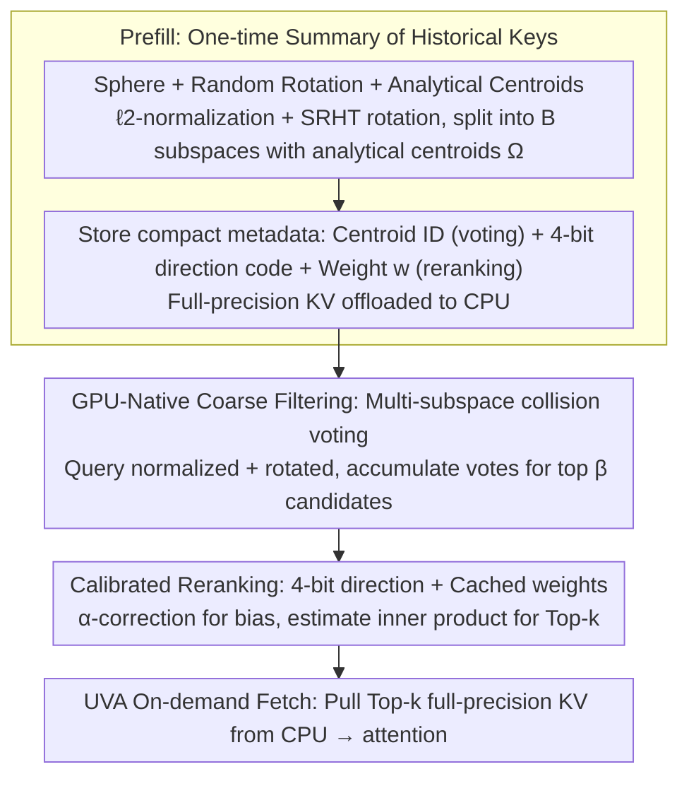

# ParisKV: Fast and Drift-Robust KV-Cache Retrieval for Long-Context LLMs

**Conference**: ICML 2026  
**arXiv**: [2602.07721](https://arxiv.org/abs/2602.07721)  
**Code**: https://github.com/amy-77/ParisKV/tree/main  
**Area**: LLM Efficiency / Long-Context Inference / KV-Cache Retrieval  
**Keywords**: KV-Cache Retrieval, Long-Context, Drift-Robust, GPU-Native, UVA Offloading

## TL;DR
ParisKV achieves fast Top-$k$ KV-cache retrieval by mapping keys/queries onto a unit hypersphere through normalization and random orthogonal rotation, replacing centroids learned from prefill with "data-independent analytical centroids." By stacking a GPU-native "collision voting + 4-bit quantized reranking" two-stage retrieval pipeline with UVA-based on-demand KV fetching, it reduces decoding latency by 17–44$\times$ compared to MagicPIG/PQCache on million-token contexts, while matching or exceeding full attention precision in 7 out of 9 long-generation tasks.

## Background & Motivation

**Background**: Long-context LLM inference is memory-bound; every decoding step must read the entire history of KV pairs, with bandwidth requirements growing linearly with context length. The main mitigation strategy is sparse or selective attention. Among these, *KV-cache retrieval* (retaining all KV pairs and dynamically selecting Top-$k$ at each step) is more suitable for open-ended long generation than *KV-cache dropping* (permanent deletion), as it avoids collapses caused by erroneously discarding early tokens. Representative methods include Quest, MagicPIG, PQCache, and RetrievalAttention.

**Limitations of Prior Work**: Existing retrieval methods generally fail in "long generation + large context" scenarios due to three pain points: (C1) **Speed–quality tradeoff**: Coarse clustering or low-bit quantization sacrifices recall for speed; reclaiming precision requires a larger retrieval budget, which negates the benefits of sparsity. (C2) **Decoding drift**: Centroids are learned by clustering historical keys during the prefill phase. As generation progresses and new keys accumulate, these prefill-only centroids increasingly mismatch the true key distribution, causing recall to collapse during long decoding (Fig. 1(a) shows PQCache recall plummeting on AIME; Fig. 1(b) visualizes the widening gap between prefill centroids and true centroids). (C3) **CPU-side retrieval bottleneck**: When KV pairs are offloaded to the CPU, traditional approaches use CPU-based search followed by CPU $\to$ GPU copying, which is bogged down by CPU orchestration and memory copies, while the GPU only sees centroids or low-bit codes with approximation errors.

**Key Challenge**: Centroids learned from data inevitably drift; to avoid drift, centroids must be "data-independent." However, data-independent hashing or grids suffer from uneven buckets and failed collision statistics when the original key distribution is anisotropic.

**Goal**: (1) Maintain stable Top-$k$ recall under decoding drift; (2) Keep retrieval decisions entirely on the GPU to avoid CPU orchestration; (3) Keep end-to-end latency close to GPU-native levels even when KV pairs are offloaded to the CPU.

**Key Insight**: The authors observe that if keys/queries are first $\ell_2$-normalized to map them onto a unit hypersphere and then subjected to a shared random orthogonal rotation (which preserves inner products and spreads information uniformly across dimensions), the subspace directions become approximately isotropic. In this state, a fixed set of centroids based on sign patterns, such as $\{\pm 1/\sqrt{m}\}^m$, can approximately cover all directions on the sphere uniformly. *Any newly generated key will be close to at least one of these centroids.* This fundamentally solves the drift problem: the centroids themselves are data-independent and never change.

**Core Idea**: Use "hypersphere + random rotation + analytical centroids" instead of "prefill-learned clustering centroids" for KV-cache Top-$k$ retrieval. This is paired with a GPU-native two-stage pipeline consisting of collision voting and 4-bit quantized reranking, along with UVA-based on-demand KV fetching, achieving drift-robustness, low latency, and million-token scalability.

## Method

### Overall Architecture

ParisKV is an algorithm-system co-design addressing the drift and speed issues of Top-$k$ KV retrieval during long decoding. The core transformation is replacing "learned" centroids with "calculated" ones. During the prefill stage, it generates a one-time summary of all historical keys: vectors are normalized and rotated to the hypersphere, then partitioned into $B$ subspaces. For each subspace, it stores an analytical centroid ID (for voting) and a 4-bit quantized direction code $\text{code}_{i,b}$ with a scalar weight $w_{i,b}$ (for reranking). Full-precision KV pairs are asynchronously offloaded to the CPU, while the GPU retains only compact metadata $\{(\text{centroid\_id}_{i,b}, \text{code}_{i,b}, w_{i,b})\}$. During the decoding stage, for each generated query, the GPU performs subspace collision voting using centroid IDs to filter a $\beta$ proportion of candidates. Final Top-$k$ selection uses 4-bit codes to estimate inner products, and the kernel then uses UVA to pull only the required $k$ full-precision KV pairs from the CPU for attention, bypassing explicit memory copies and CPU-side scheduling.

The KV cache on the GPU is organized into four contiguous regions: Sink (early high-attention tokens), Retrieval (offloaded and indexed historical tokens), Local (recent tokens kept on GPU), and Update Buffer (temporary cache for newly generated tokens). Dense attention runs only on the Sink + Local regions, while the Retrieval region uses sparse Top-$k$ attention. Whenever the update buffer fills with $m$ tokens, a sliding window move occurs: old local tokens are asynchronously evicted to the retrieval region (GPU $\to$ CPU copy) and new metadata is encoded on the GPU.

### Key Designs

**1. Sphere + Random Rotation + Analytical Centroids: Eliminating Drift at the Root**

This step addresses pain point C2 (centroid staleness). If centroids are learned from prefill keys, they inevitably mismatch the distribution as more keys are generated. ParisKV first applies $\ell_2$-normalization $\hat{\mathbf{k}}_i = \mathbf{k}_i / \|\mathbf{k}_i\|_2$ to project vectors onto the unit hypersphere, then applies a shared orthogonal matrix $\mathbf{R}$ (implemented via SRHT for efficiency and inner product preservation) to get $\tilde{\mathbf{k}}_i = \mathbf{R}\hat{\mathbf{k}}_i$. This spreads information and makes subspace directions approximately isotropic. The $D$ dimensions are split into $B$ subspaces of $m=D/B$ dimensions, and each subspace uses the analytical centroid set $\Omega = \{\pm 1/\sqrt{m}\}^m$. These $2^m$ points are vertices of an $m$-dimensional hypercube projected onto the sphere, uniformly covering all $2^m$ orthants; thus, any new key is close to at least one centroid. Finally, polar decomposition $\tilde{\mathbf{k}}_{i,b} = r_{i,b}\mathbf{u}_{i,b}$ separates the direction $\mathbf{u}_{i,b}$ (for voting) and radius $r_{i,b}$ (for reranking). Since $\Omega$ is fixed and data-independent, the centroids never expire. Proposition 4.1 proves that after Haar random rotation, the subspace energy $z_b = r_b^2 \sim \mathrm{Beta}(m/2, (D-m)/2)$ and squared direction coordinates $(u_b)_j^2 \sim \mathrm{Beta}(1/2, (m-1)/2)$, which guides the design of quantization levels.

**2. GPU-Native Coarse Filtering: Multi-Subspace Collision Voting**

Coarse filtering must cheaply reduce $n_t$ candidates to $\beta n_t$ without full sorting. The query undergoes the same normalization, rotation, and splitting. In each subspace $b$, the inner product $\tilde{\mathbf{q}}_b^\top \mathbf{c}$ between $\tilde{\mathbf{q}}_b$ and $2^m$ centroids is computed, and only the top $\rho$ proportion of centroids contributes "non-zero votes." Any key assigned to one of these centroids in a subspace gains 1 vote. Votes are accumulated across $B$ subspaces to form an integer score, and the top $\beta$ proportion (typically 5%–10%) are selected as candidates. This process involves only bit-level matching and integer addition. The authors use a custom `bucket_topk` CUDA kernel to perform bucket selection on small integers alongside a parallel collision kernel. Multi-subspace voting is cheaper and more robust than sorting query-centroid inner products; for example, $\beta=5$–$10\%$ can reduce the candidate pool to less than one-tenth of the original KV size with almost no recall loss, leveraging GPU integer operation speed and parallel atomic addition.

**3. Calibrated Reranking: 4-bit Quantized Direction + Cached Weights**

Reranking aims to accurately estimate $\langle \mathbf{k}_i, \mathbf{q} \rangle$ without accessing full-precision keys on the CPU. ParisKV quantizes each subspace direction into 4 bits (1-bit sign + 3-bit magnitude) $\mathbf{v}_{i,b}$ and defines an alignment factor $\alpha_{i,b} = \langle \mathbf{v}_{i,b}, \mathbf{u}_{i,b} \rangle$. Since quantization typically compresses these values, the estimation $\langle \mathbf{u}_{i,b}, \tilde{\mathbf{q}}_b \rangle \approx \langle \mathbf{v}_{i,b}, \tilde{\mathbf{q}}_b \rangle / \alpha_{i,b}$ corrects the systematic underestimation. All "key-only" factors are pre-computed as $w_{i,b} = \|\mathbf{k}_i\|_2 \cdot r_{i,b} / \alpha_{i,b}$ during prefill. During decoding, the inner product estimation simplifies to a weighted sum $\widehat{\langle \mathbf{k}_i, \mathbf{q} \rangle} = \|\mathbf{q}\|_2 \sum_{b=1}^{B} w_{i,b} \langle \mathbf{v}_{i,b}, \tilde{\mathbf{q}}_b \rangle$, handled by a fused CUDA kernel. This addresses both C1 (tradeoff) and C3 (CPU bottleneck): 4-bit quantization reduces metadata size to $\sim$1/32, while $\alpha_{i,b}$ correction and $w_{i,b}$ caching ensure high recall. Only the final $k$ selected keys are fetched via UVA for full-precision attention.

### Training Strategy

ParisKV is a **purely inference-time method** that requires no training or fine-tuning and can be applied to any pre-trained Transformer LLM. All centroids and quantization levels are pre-calculated offline based on Beta priors. The rotation matrix $\mathbf{R}$ is constructed via SRHT. At the system level, it provides four custom CUDA kernels: `bucket_topk`, parallel collision, fused reranking (gather+unpack+score), and a UVA-based fetch kernel.

## Key Experimental Results

Models: Qwen-3-4B/8B, DeepSeek-R1-Llama-8B, Qwen3-4B-Thinking-2507; Datasets: Long-generation reasoning (MATH500 / GPQA-Diamond / AIME25) and long-context understanding (LongBench-V2, RULER). Comparisons: PQCache, MagicPIG (with Quest, ShadowKV, FreeKV, etc., in the appendix). ParisKV uses $K=100$.

### Main Results: Long-Generation Reasoning (Accuracy)

| Model | Task | Full Attn | PQCache | MagicPIG | ParisKV | vs PQCache |
|------|------|-----------|---------|----------|---------|-----------|
| Qwen-3-4B | GPQA-Diamond (pass@1) | 64.14 | 38.38 | 32.32 | **72.22** | +33.84 |
| Qwen-3-4B | MATH500 (pass@1) | 88.60 | 58.80 | 46.40 | **92.80** | +34.00 |
| Qwen-3-4B | AIME25 (pass@8) | 86.67 | 3.33 | 6.67 | **80.00** | +76.67 |
| DS-R1-Llama-8B | AIME25 (pass@8) | 50.00 | 13.30 | 13.30 | **53.30** | +40.00 |
| Qwen-3-8B | MATH500 (pass@1) | 87.40 | 69.21 | 45.80 | **93.00** | +23.79 |

ParisKV meets or exceeds full attention accuracy in 7 out of 9 settings. On AIME25, where PQCache/MagicPIG collapse (pass@8 < 17), ParisKV recovers to 53–80.

### Main Results: Million-Token Decoding Efficiency

| Context | Full Attn | PQCache | MagicPIG | ParisKV | Speedup |
|--------|-----------|---------|----------|---------|--------|
| 128K (bs=1) | runnable | – | – | 24.32 ms/step | 2.1–2.8$\times$ throughput vs full |
| 256K (bs≥2) | **OOM** | – | – | scales to bs=5 | – |
| 384K (bs=1) | **OOM** | – | – | runnable | – |
| 1024K (bs=1, Llama3.1-8B) | OOM | 2179 ms/step | 830 ms/step | **49 ms/step** | **44.4$\times$ / 16.9$\times$** |

Within the runnable range of full attention, ParisKV provides 2.1–2.8$\times$ throughput. At 1M tokens, it is 44$\times$ and 17$\times$ faster than PQCache and MagicPIG, respectively.

### Ablation Study

| Configuration | Coarse Recall@100 | End-to-end Recall@100 | Description |
|------|----------------|------------------|------|
| Baseline (No normalize/rotate, prefill centroids) | 6% | 36.5% | PQCache style |
| + normalize + rotate + analytical centroids (N+R+T) | **16.1%** | **64.3%** | Full ParisKV design |

### Key Findings

- **Root of drift robustness is data-independence**: The N+R+T design increases end-to-end Recall@100 from 36.5% to 64.3%, which is why ParisKV recovers ~30+ pass@1 points on AIME over PQCache.
- **Long generation is harder than long input**: In long inputs, drift has less time to accumulate. However, in long-generation tasks like AIME25 (thousands of tokens), drift compounds, causing PQCache collapse.
- **TPOT scales well with batch size**: On Qwen3-8B 128K, TPOT is 24.32 ms/token (bs=1) and improves to 7.37 ms/token (bs=8).
- **C2 is the critical bottleneck**: Ablations confirm that centroid stability affects recall far more than the precision of the quantization itself.

## Highlights & Insights

- **Elegance of "data-independent centroids"**: Decoding drift is a fundamental flaw in learning-based retrieval. Mapping to a sphere and using symmetric analytical centroids removes the requirement that centroids must fit the data, making indices "future-proof."
- **Collision voting over sorting**: Replacing expensive sorting with bit-matching and integer addition exploits GPU architectural strengths (fast atomic adds, poor sorting performance).
- **Calibrated $\alpha$ + cached weights $w_{i,b}$**: This solves the conflict between low-bit estimation and high-fidelity inner products, allowing inner product estimation to collapse into a simple加权 accumulation.
- **UVA instead of explicit memcpy**: In CPU offloading architectures, UVA allows GPU kernels to fetch KV pairs from CPU memory on-demand via page-fault semantics, bypassing the CPU scheduling stack.

## Limitations & Future Work

- **Choice of $m$**: There is a tradeoff between $m$ (centroid count $2^m$) and retrieval cost. Small $m$ leads to unstable collision statistics.
- **SRHT overhead in short context**: The one-time normalization and rotation are overhead for short texts (below ~32K).
- **Analytical centroid isotropy assumption**: While SRHT "whitens" the distribution, some LLM heads remain structurally sparse (e.g., attention sinks). The efficiency of uniform coverage for these heads is not addressed.
- **Purely inference-time method**: While convenient, it lacks the potentially higher precision of training-time sparse mechanisms like NSA/MoBA.
- **Potential improvements**: Tuning $\rho$ and $\beta$ adaptively per layer/head; using lattice or Gosset encoding to improve codebook coverage; and head-specific rotations.

## Related Work & Insights

- **vs PQCache**: Both use retrieval and CPU offloading. PQCache uses product quantization with learned codebooks; ParisKV uses analytical centroids and spherical transforms to solve decoding drift.
- **vs MagicPIG**: MagicPIG uses LSH for Top-$k$. While LSH is data-independent, it is sensitive to the original anisotropic key distribution. ParisKV "rounds" the distribution first, giving it higher recall for the same budget.
- **vs Quest**: Quest is GPU-native page-level retrieval but lacks a CPU offloading solution, limiting context size. ParisKV combines GPU-native execution with UVA offloading.
- **vs RetrievalAttention**: ParisKV addresses the system-level bottlenecks that RetrievalAttention misses at the million-token scale through UVA and custom kernels.

## Rating
- Novelty: ⭐⭐⭐⭐⭐ Decoupling centroids from data using spherical mapping and orthogonal rotation is an elegant and rare solution to decoding drift.
- Experimental Thoroughness: ⭐⭐⭐⭐⭐ covers 3 model families, 9+ settings, 64K–1M tokens, and multiple strong baselines with both accuracy and system metrics.
- Writing Quality: ⭐⭐⭐⭐ Clear challenges (C1/C2/C3) and visualization of drift, though some critical kernel details are moved to the appendix.
- Value: ⭐⭐⭐⭐⭐ Enabling 8B models to handle 1M token decoding on a single card with TPOT in milliseconds is a significant engineering breakthrough for RAG and agents.

<!-- RELATED:START -->

## Related Papers

- [\[ACL 2026\] BRIEF-Pro: Universal Context Compression with Short-to-Long Synthesis for Fast and Accurate Multi-Hop Reasoning](../../ACL2026/information_retrieval/brief-pro_universal_context_compression_with_short-to-long_synthesis_for_fast_an.md)
- [\[ICML 2026\] HGMem: Hypergraph-based Working Memory to Improve Multi-step RAG for Long-Context Complex Relational Modeling](hgmem_hypergraph-based_working_memory_to_improve_multi-step_rag_for_long-context.md)
- [\[ICLR 2026\] Beyond RAG vs. Long-Context: Learning Distraction-Aware Retrieval for Efficient Knowledge Grounding](../../ICLR2026/information_retrieval/beyond_rag_vs_long-context_learning_distraction-aware_retrieval_for_efficient_kn.md)
- [\[ACL 2025\] Hierarchical Document Refinement for Long-context Retrieval-augmented Generation](../../ACL2025/information_retrieval/hierarchical_document_refinement_for_long-context_retrieval-augmented_generation.md)
- [\[ICLR 2026\] Q-RAG: Long Context Multi-Step Retrieval via Value-Based Embedder Training](../../ICLR2026/information_retrieval/q_rag_long_context_multi_step_retrieval.md)

<!-- RELATED:END -->
