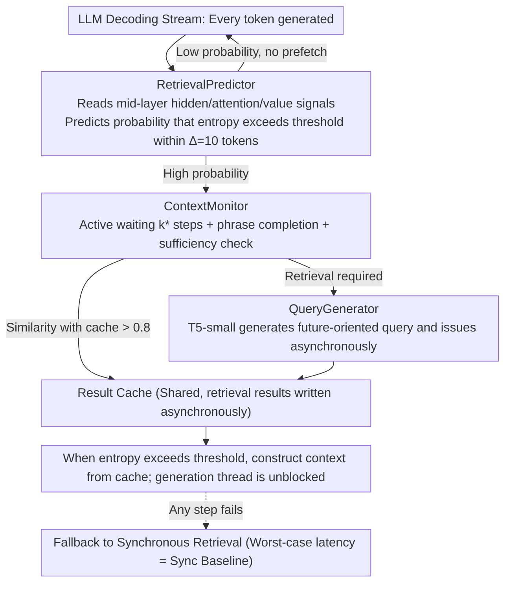

# Predictive Prefetching for Retrieval-Augmented Generation

**Conference**: ICML2026  
**arXiv**: [2605.17989](https://arxiv.org/abs/2605.17989)  
**Code**: To be confirmed  
**Area**: Information Retrieval  
**Keywords**: RAG, Asynchronous Retrieval, Predictive Prefetching, LLM Serving, Latency Optimization

## TL;DR
By learning "semantic precursors appearing 8–16 tokens before uncertainty" from transformer hidden states and attention patterns, this paper introduces a trio consisting of RetrievalPredictor + ContextMonitor + QueryGenerator. This transforms RAG retrieval from a synchronous blocking process into predictive asynchronous prefetching. On benchmarks such as HotpotQA, it reduces end-to-end latency by 43.5% and Time to First Token (TTFT) by 62.4%, while maintaining answer quality within 1% of synchronous RAG.

## Background & Motivation

**Background**: RAG has become the mainstream solution for injecting real-time/factual knowledge into LLMs and suppressing hallucinations. However, in production deployments, the retrieval process itself becomes a latency bottleneck—a single external API retrieval takes 100–500 ms, and complex multi-hop queries may trigger hundreds of retrievals, leading to a poor user experience.

**Limitations of Prior Work**: Current RAG retrieval is **synchronous and blocking**; once entropy exceeds a threshold to trigger retrieval, token generation pauses entirely to wait for the result. A few asynchronous methods (e.g., TeleRAG's fixed time windows, PipeRAG using stale tokens as queries) merely "hide retrieval behind generation using heuristic schedules." However, they all assume "stable information needs" during generation. This assumption is fragile in real-world scenarios involving multiple domains, cross-topic shifts, or dynamic entity references, where prefetched documents might be irrelevant to the actual need, thereby adding noise.

**Key Challenge**: A structural conflict exists between high factual precision and low latency. In synchronous architectures, achieving quality requires tolerating high latency from multi-round retrieval, whereas reducing latency necessitates sacrificing completeness by cutting retrieval depth. Although asynchronous architectures can "hide latency," they fail to correct the mismatch between prefetched content and the actual information need.

**Goal**: This paper decomposes this contradiction into three independent sub-problems: (1) **When** should retrieval be triggered for prefetching? (2) Is the accumulated context at this moment **sufficient** to support an effective query? (3) **What to retrieve** to actually match the information needs on the generation path?

**Key Insight**: The authors observe that retrieval needs do not appear out of nowhere; they are pre-encoded by "semantic precursors" (entropy trajectory features, attention allocation patterns, value representation dynamics) within the generation dynamics. These signals begin to appear 8–16 tokens before uncertainty actually explodes. Furthermore, these signals can encode not just "when it is needed" but also "what is needed."

**Core Idea**: A lightweight predictor reads hidden/attention/value signals from the transformer’s middle layers to **predict** when future tokens will trigger high entropy. A context monitor then decides **how many steps to wait** before issuing the query. Finally, a T5-small generates a query "oriented toward future information needs" rather than just "restating current context." This allows retrieval and generation to be truly concurrent while ensuring prefetched content aligns with the generation path.

## Method

### Overall Architecture

The system addresses the "generation stalls caused by synchronous retrieval" bottleneck by moving retrieval decisions ahead of the actual uncertainty explosion and offloading prefetching to a parallel thread. The input remains the LLM decoding stream and the output remains the LLM-generated token sequence, but a "Predict-Prefetch-Cache" pipeline is inserted: for each generated token, the RetrievalPredictor first estimates the probability $\hat p_t$ that entropy will exceed the threshold within the next $\Delta=10$ tokens. If the probability is high, the ContextMonitor decides how many steps to wait, whether to reuse the cache, or whether a phrase has been completed. When retrieval is necessary, the QueryGenerator asynchronously issues a future-oriented query. Results are stored in a shared Result Cache. The generation thread is never blocked; when entropy truly exceeds the threshold, context is constructed directly from the cache. The entire stack adds approximately 62M parameters (2-layer transformer predictor ~2M + three MLP heads <0.3M + T5-small 60M) to an 8B backbone. The components are jointly pre-trained with a unified multi-task loss and online-adapted using a policy gradient with action-specific feedback. If any step fails, the system automatically falls back to synchronous retrieval, capping the worst-case latency at the synchronous baseline.

### Key Designs

**1. RetrievalPredictor: Using internal transformer signals to move decisions ahead of entropy spikes**

Pure entropy thresholds are reactive—one only knows to retrieve once entropy has already risen, which is too late. The key observation is that retrieval needs are pre-encoded in "semantic precursors" within generation dynamics, appearing 8–16 tokens before uncertainty spikes (Pearson correlation of 0.42 at a 10-token offset). Thus, for each token $t$, the predictor concatenates the hidden states $\mathbf{H}_t$, attention matrices $\mathbf{A}_t$, and value vectors $\mathbf{V}_t$ from a 16-token sliding window. These pass through a 2-layer transformer encoder to obtain $\mathbf{z}_t \in \mathbb{R}^{512}$, which is combined with output distribution statistics $\mathbf{o}_t$ (entropy, top-k margin). A sigmoid head calculates:
$$\hat p_t = \sigma(\mathbf{W}_p \cdot [\mathbf{z}_t;\mathbf{o}_t] + b_p)$$
This represents the probability that entropy $\mathcal{H}_\tau$ will first exceed threshold $\theta$ within future tokens $\tau \in [t+1, t+\Delta]$. Signals are intentionally extracted from middle layers (30–45% depth, e.g., layers 10–14 of Llama-3.1-8B) because interpretability studies suggest these layers capture high-level semantic abstractions while retaining uncertainty signals, whereas the final layers overfit the output distribution. Structurally advancing the decision window is the prerequisite for asynchronous prefetching. The AUROC of 0.81 compared to 0.66 for current entropy alone validates that these precursors are indeed learnable.

**2. ContextMonitor: Active waiting to improve query accuracy and deduplication**

Issuing a query immediately upon trigger often results in partial phrases (e.g., "The main cause of the"), leading to poor query quality. The monitor therefore does not trigger immediately but uses three lightweight heads for active waiting. Phase 1 uses a T5-based ContextScore to pick the optimal delay $k^\*$ from $k\in\{0,...,5\}$: $k^\* = \arg\max_k \mathrm{ContextScore}(\mathbf{c}_{t+k})$. At $t+k^\*$, Phase 2 uses a SufficiencyClassifier to calculate the maximum cosine similarity between the current context’s Contriever embedding $\mathbf{e}_c$ and cached documents $\mathbf{e}_d$: $\sigma(\mathbf{W}_{\text{suff}} \cdot [\mathbf{e}_c; \max_d \cos(\mathbf{e}_c, \mathbf{e}_d)] + b_{\text{suff}})$. If $>0.8$, the cache is reused and no new retrieval is issued. Simultaneously, if the ClarityScore $\sigma(\mathbf{W}_{\text{clarity}} \cdot \mathbf{h}_c + b_{\text{clarity}})$ is $<0.7$, the monitor waits up to 2 additional tokens to complete phrases like "The main cause of the 2008 financial crisis." Waiting these 3–4 tokens helps disambiguate information needs and provides a window for self-correction, reducing false positives. In experiments, this increased the Query Relevance Score (QRS) for factual queries from 0.65 to 0.86 (+23%) and avoided 21% of redundant retrievals, making active delay a net benefit.

**3. QueryGenerator + Multi-task Joint Training + Online Contextual-Bandit Adaptation**

The flaw in PipeRAG’s use of stale tokens is that "past tokens cannot express future information needs." This work uses a fine-tuned T5-small to infer the upcoming question from accumulated context: $\mathbf{q} = \mathrm{T5}(\mathbf{c}_{t+k^\*})$. When confidence is high, it generates narrow, focused queries; when low, it generates broader exploratory queries. Quality exceeds both raw context queries and 8B LLM direct generation (QRS 0.79 vs 0.74). The components are jointly pre-trained with a unified multi-task loss:
$$\mathcal{L} = \alpha\mathcal{L}_{\text{pred}} + \beta\mathcal{L}_{\text{timing}} + \gamma\mathcal{L}_{\text{suff}} + \delta\mathcal{L}_{\text{clarity}} + \epsilon\mathcal{L}_{\text{query}}$$
Labels are generated automatically by performing "retrieval vs. no-retrieval" paired generation for every candidate position, using utility $s = \mathrm{EM}_{\text{with}} - \mathrm{EM}_{\text{without}}$ to determine positive/negative samples. After deployment, online adaptation is performed by modeling four actions (Generate, Reuse, Accumulate, Fetch) as a gated cascade, optimized via policy gradient:
$$\nabla_\phi J = \mathbb{E}_{s\sim\rho}[\nabla_\phi \log \pi_\phi(a|s) \cdot R(s,a)]$$
Rewards are specific to each action (Successful non-retrieval +0.5, Successful cache reuse +1.0, Valid retrieval +1.0, Unnecessary retrieval −0.5, Late retrieval −2.0). A contextual bandit is used instead of long-range RL because each action has an immediate, clearly attributable feedback. This structure is stable and converges within 2000 queries (AUROC 0.760 → 0.809, with 70% of gains achieved in the first 500 queries).

## Key Experimental Results

### Main Results

Evaluated using Llama-3.1-8B on four QA benchmarks (HotpotQA, 2WikiMultiHopQA, NQ, TriviaQA) against 9 baselines sharing a Wikipedia corpus + FAISS IVF + Contriever (125ms median retrieval latency).

| Method | HotpotQA EM/F1 | NQ EM/F1 | TTFT (ms) | E2E (s) | Ret/1K | Efficiency↑ |
| :--- | :--- | :--- | :--- | :--- | :--- | :--- |
| Sync-RAG | 69.2 / 75.1 | 73.4 / 79.1 | 287 | 9.2 | 86.0 | 8.2 |
| Self-RAG | 67.8 / 73.6 | 72.1 / 77.8 | 234 | 7.8 | 72.0 | 9.4 |
| FLARE | 65.9 / 72.1 | 70.2 / 75.8 | 206 | 6.8 | 71.0 | 10.6 |
| PipeRAG | 66.8 / 72.9 | 70.1 / 75.8 | 118 | 5.6 | 66.8 | 13.0 |
| **Ours** | **68.7 / 75.1** | **72.5 / 78.7** | **108** | **5.2** | **59.0** | **14.4** |
| Oracle | 70.3 / 76.2 | 74.2 / 80.1 | 45 | 3.1 | 48.0 | 24.6 |

**Conclusion**: Compared to Sync-RAG, TTFT is reduced by 62.4% (287→108 ms), E2E latency by 43.5% (9.2→5.2 s), and retrieval frequency per 1K tokens by 31.4% (86→59). HotpotQA EM is only 0.5% lower than Sync-RAG but significantly exceeds other asynchronous/adaptive methods. For code completion (RepoBench-P), TTFT dropped by 52% and E2E by 32%, with EM actually 0.6% higher than Repoformer. Tail latency is also robust: P95 is 33% lower than Sync-RAG, and the P99 of the "prediction-miss" subset (14.0s) remains lower than the P95 of Sync-RAG (15.2s).

### Ablation Study (HotpotQA)

| Configuration | EM | F1 | TTFT | E2E | Description |
| :--- | :--- | :--- | :--- | :--- | :--- |
| Full System | 68.7 | 75.1 | 108ms | 5.2s | Complete system |
| w/o Async architecture | 68.4 | 74.8 | 287ms | 7.8s | Removing async increases TTFT 2.7× |
| w/o Retrieval Predictor | 65.1 | 71.3 | 118ms | 5.8s | Falling back to entropy threshold drops EM by 3.6% |
| w/o Online learning | 66.2 | 72.5 | 112ms | 5.5s | Pre-training only drops EM by 2.5% |
| w/o T5 query generator | 67.1 | 73.8 | 108ms | 5.4s | Using raw context drops EM by 1.6% |
| w/o Adaptive waiting | 66.8 | 73.5 | 108ms | 5.6s | Removing ContextScore drops EM by 1.9% |
| w/o Sufficiency check | 67.8 | 74.4 | 108ms | 5.4s | No cache reuse drops EM by 0.9% |

### Key Findings
- **Asynchronous architecture is the primary source of latency gains** (TTFT increased 2.7× without it), while **RetrievalPredictor is the primary source of quality gains** (removing it caused the largest EM drop of 3.6%)—indicating that "prediction" and "asynchrony" are complementary benefit curves.
- The QRS of fine-tuned T5-small (0.79) is higher than that of the 8B LLM direct generation (0.74). It achieves 96% of the quality with only 22% of the latency of T5-large, showing that fine-tuning on narrow tasks outweighs parameter scaling.
- False positives account for 38.7% of triggers, but 72% of these are reused within the next 50 tokens. Only 28% are truly wasted, resulting in a net latency overhead of about 8% (already accounted for in the 43.5% total gain).
- Gains scale with model size: Llama-70B AUROC increases to 0.83. For 1B models (where per-token time is ~10ms), the lead time only covers ~87ms, making them better suited for local low-latency retrieval. The same threshold set ($\theta=2.5, \Delta=10$) yielded 61.5–63.4% TTFT improvements across 6 model families, demonstrating strong transferability.

## Highlights & Insights
- **The observation that "semantic precursors precede entropy spikes by 8–16 tokens" is the core insight**. Instead of training a more accurate entropy estimator, the authors use mid-layer internal signals to predict future needs, structurally advancing the retrieval decision window. this "using internal representation to replace external signals" approach could be applied to other speculative systems like speculative decoding, KV cache pre-warming, or tool calling.
- **The gated 4-action contextual bandit with attributable rewards is ingenious**: Each action’s reward only updates its corresponding component, avoiding the instability of long-range credit assignment in RL. It converges within 2000 queries.
- **ContextMonitor’s "active waiting" breaks the reactive paradigm of default RAG**: Waiting 3–4 tokens to complete a phrase might seem to sacrifice latency, but it increases query quality by 23%, avoids 21% of redundant retrievals, and allows for self-correction. "Active delay" becomes a net benefit—a trade-off often overlooked in streaming inference.
- The fallback to synchronous RAG ensures that "worst-case latency = sync baseline," capping the downside risk of the predictor and making the system production-ready.

## Limitations & Future Work
- **Dependency on internal states**: The method cannot be deployed on closed-source API models (e.g., GPT-4, Claude). A logit-only variant drops AUROC to 0.66, losing most gains.
- **Reliance on Oracle labels from HotpotQA/NQ**: Although the authors argue the predictor learns transformer computational properties rather than memorization (e.g., precision saturates after 10K traces, zero-shot 2WikiMultiHopQA retains 78% accuracy), OOD tasks still require online adaptation to gain 5–9 AUROC points.
- **Wasted retrievals**: 28% of the 38.7% false positives are entirely wasted (~8% overhead). Compressing this is a direct point for improvement.
- **Privacy**: Predictive prefetching may keep sensitive query patterns in cache longer, requiring more aggressive cache eviction policies in privacy-sensitive scenarios.
- **Bridge Questions**: 81% of the 0.5% EM gap on HotpotQA comes from bridge-type questions where the second hop depends on the first hop's result. This remains a challenge for prediction and might require multi-step beam or delayed second-hop prediction.

## Related Work & Insights
- **vs FLARE / Self-RAG / DRAGIN**: These are "reactive synchronous retrieval" methods that trigger based on current entropy/signals and block generation. Ours **advances** the decision timing by 8–16 tokens and executes asynchronously, reducing TTFT by 50%+.
- **vs TeleRAG**: TeleRAG uses a fixed lookahead window regardless of actual need. Ours uses the learned probability $\hat p_t$ to decide dynamically, avoiding ineffective prefetching.
- **vs PipeRAG**: PipeRAG is also asynchronous but uses stale tokens as queries, leading to mismatch during topic shifts. Ours uses T5-small to generate future-oriented queries, achieving 1.9% higher EM and higher efficiency (14.4 vs 13.0).
- **vs vLLM / System-level RAG optimization**: System optimizations (FAISS, KV cache) shorten "single retrieval latency." Ours **hides the latency**. These are orthogonal and can be stacked.

## Rating
- Novelty: ⭐⭐⭐⭐ "Predictive asynchronous prefetching" is a complete first for RAG. The 8–16 token precursor observation is solid, though individual components are existing modules.
- Experimental Thoroughness: ⭐⭐⭐⭐⭐ 6 benchmarks + 9 baselines + 6 model families + tail latency + failure analysis + sensitivity sweeps.
- Writing Quality: ⭐⭐⭐⭐ Clear structure, well-defined formulas, and quantitative explanations of trade-offs. Some sections (like contextual bandit derivation) are brief, necessitating the appendix.
- Value: ⭐⭐⭐⭐⭐ RAG latency is the primary bottleneck for production. A 43.5% E2E reduction for a 0.5% EM cost is highly efficient and ready for deployment.

<!-- RELATED:START -->

## Related Papers

- [\[ACL 2026\] Feedback Adaptation for Retrieval-Augmented Generation](../../ACL2026/information_retrieval/feedback_adaptation_for_retrieval-augmented_generation.md)
- [\[ACL 2026\] Disco-RAG: Discourse-Aware Retrieval-Augmented Generation](../../ACL2026/information_retrieval/disco-rag_discourse-aware_retrieval-augmented_generation.md)
- [\[ICLR 2026\] Counterfactual Reasoning for Retrieval-Augmented Generation](../../ICLR2026/information_retrieval/counterfactual_reasoning_for_retrieval-augmented_generation.md)
- [\[ICML 2026\] LazyAttention: Efficient Retrieval-Augmented Generation with Deferred Positional Encoding](lazyattention_efficient_retrieval-augmented_generation_with_deferred_positional_.md)
- [\[ICML 2026\] Hierarchical Abstract Tree for Cross-Document Retrieval-Augmented Generation](hierarchical_abstract_tree_for_cross-document_retrieval-augmented_generation.md)

<!-- RELATED:END -->
