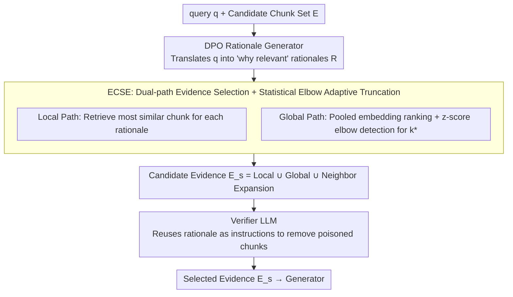

# Ranking-Free RAG: Replacing Re-Ranking with Selection in RAG for Sensitive Domains

**Conference**: ICML 2026  
**arXiv**: [2505.16014](https://arxiv.org/abs/2505.16014)  
**Code**: https://github.com/YashSaxena21/METEORA  
**Area**: Information Retrieval / RAG / Interpretability / Adversarial Robustness  
**Keywords**: RAG, Evidence Selection, DPO, Adaptive Threshold, Corpus Poisoning Defense  

## TL;DR
This paper proposes METEORA, a framework comprising a "Rationale Generator trained with DPO + Statistical Elbow Detection + Same-framework Verifier." It completely replaces the uninterpretable, top-$k$-dependent re-rankers in RAG. On six sensitive domain datasets, it simultaneously achieves higher recall, an 80% reduction in evidence volume, and a 4.4× improvement in adversarial robustness.

## Background & Motivation

**Background**: Current RAG systems are deployed at scale in high-risk fields such as law, finance, and healthcare. Mainstream practices involve using dense retrievers like Cross-Encoder, SBERT, or Contriever to calculate query–chunk similarity, followed by an arbitrarily determined top-$k$ truncation for the generator. LLM-based rankers like RankRAG and Self-RAG use large models to replace smaller re-rankers for scoring.

**Limitations of Prior Work**: First, similarity scores are a black box, unable to explain "why this chunk was chosen over another," which fails regulatory requirements in scenarios like contract review or privacy Q&A. Second, $k$ is a "magic number"—simple queries include too much noise, while complex ones lack sufficient evidence. Third, corpus poisoning attacks (Zou et al., 2025) can insert semantically similar but factually incorrect chunks into knowledge bases, against which similarity-based ranking has no defense mechanism.

**Key Challenge**: Interpretability, adversarial robustness, and computational efficiency are traditionally viewed as mutually exclusive. Adding interpretability modules requires calculating rationales, and adding defense requires an extra verifier layer, both of which typically sacrifice efficiency. However, the authors observe that if the selection decision itself is "based on explicit reasoning," the explanation, verification, and adaptive truncation can share the same rationale.

**Goal**: To build a unified framework that outputs "which chunks to select," "why they were selected," and "which are poisoned" without additional manual annotation, while maintaining smaller evidence volume than traditional top-$k$ approaches.

**Key Insight**: Traditional re-rankers calculate similarity directly between query and chunk. The authors insert a layer where the LLM first generates several rationales, which are then used to select chunks. This replaces uninterpretable similarity scores with human-readable, auditable natural language that can be reused as verifier input.

**Core Idea**: Use DPO to train the LLM as a "rationale generator," use statistical elbow detection to adaptively determine selection count, and finally use the same rationale to feed a Verifier for poisoning detection. Interpretability, robustness, and efficiency are achieved simultaneously via a single set of rationales.

## Method

### Overall Architecture
METEORA aims to remove the uninterpretable top-$k$ re-ranker from RAG and replace it with a unified framework that clarifies selection logic and filters poisoning. Formally, it learns $f_\theta(q, E) \to (R, E_s)$, where a query $q$ and a set of retrieved candidate chunks $E$ are input to produce a set of rationales $R = \{r_1, \dots, r_k\}$ and a subset of selected evidence $E_s \subset E$. The entire pipeline links three stages via rationales: an LLM trained with DPO translates the query into explanations of "why it is relevant," ECSE uses these rationales to select evidence and adaptively decide the count, and a Verifier uses the same rationales as instructions to discard poisoned chunks—eliminating the magic number $k$ entirely.

### Key Designs

**1. DPO-Driven Rationale Generator: Using "Selection Accuracy" as Preference Signal**

Similarity scores are black boxes. To avoid the non-scalable nature of manual rationale annotation, the authors automatically construct preference pairs from existing QA data. For each $(q, e^*)$, the LLM generates multiple rationales. Those leading to the correct evidence $e^*$ are labeled $r_w$, while those leading to incorrect evidence are labeled $r_l$. The model is trained using the standard DPO loss:
$$\mathcal{L}_{DPO} = -\mathbb{E}\big[\log \sigma(\beta \log \frac{\pi_\theta(r_w | q, e)}{\pi_{\text{ref}}(r_w | q, e)} - \beta \log \frac{\pi_\theta(r_l | q, e)}{\pi_{\text{ref}}(r_l | q, e)})\big]$$
During training, it is conditioned on $\pi_\theta(r | q, e^*)$, which relaxes to $\pi_\theta(r | q)$ at inference. This equates "rationale quality" to "selection accuracy," bypassing the annotation ceiling and providing more stability than RLHF reward models. Furthermore, the fine-grained ability to distinguish evidence learned by DPO makes it harder for poisoned chunks to coincidentally match a rationale, bolstering adversarial robustness.

**2. ECSE: Dual-Path Evidence Selection + Statistical Elbow Adaptive Truncation**

Top-$k$ yields disparate results across query difficulties. ECSE eliminates this hyperparameter through parallel selection paths and statistical truncation. The **Local path** identifies the most similar chunk for each rationale $r_i$: $E_v = \{\arg\max_{e_j \in E} \mathcal{S}(r_i, e_j) \mid r_i \in \mathcal{R}\}$. Cases where multiple rationales converge on the same chunk signal high evidence validity. The **Global path** calculates a pooled embedding $\bar{r} = \frac{1}{|\mathcal{R}|} \sum \text{SBERT}(r_i)$, ranks all chunks by similarity to $\bar{r}$ as a sequence $\{s_1, \dots, s_n\}$, and applies elbow detection. Using the first-order difference $\Delta_i = s_i - s_{i+1}$ normalized by z-score $z_i = (\Delta_i - \mu_\Delta)/\sigma_\Delta$, the first significant deviation from the mean identifies the truncation point $k^*$. If the first-order difference is insignificant, second-order differences $\nabla^2_i = \Delta_{i+1} - \Delta_i$ are checked for maximum curvature. The final $E_s = E_v \cup E_g \cup E_w$, where $E_w$ includes optional neighbor expansion to mitigate fragmentation.

**3. Verifier LLM: Reusing Rationales for Poisoning Filtration**

Perplexity-based defenses are largely ineffective against high-quality LLM-generated poisoning (F1 scores only 0.06–0.15 in experiments). METEORA reuses the same Llama-3.1-8b-instruct, treating rationales as "flagging instructions." It evaluates each chunk against three criteria: factual violation (contradicting established facts), logical contradiction with verified evidence, and instruction violation (failing to meet retrieval criteria implied by the rationale). It follows a conservative principle: chunks are assumed valid unless flagged with >90% confidence. Since rationales are query-aligned, they effectively verify if a chunk truly satisfies the retrieval intent. In experiments, 87% of poisoning hits were "instruction violations," suggesting attackers manipulate "how to search" rather than "what the facts are."

### Loss & Training
Only the rationale generator requires training using the DPO loss described above. ECSE and the Verifier are zero-shot modules used at inference. Preference data is automatically generated from QA annotations, requiring no manual rationale writing. The Verifier shares the same Llama-3.1-8b-instruct weights as the rationale generator to maintain consistency.

## Key Experimental Results

### Main Results

Compared against six traditional re-rankers and two LLM re-rankers across six datasets (QASPER, Contract-NLI, FinQA, PrivacyQA, CUAD, MAUD). For fairness, baseline $k$ values were set to the average $k$ adaptively selected by METEORA. METEORA leads significantly in average recall:

| Method | Avg R | Avg P | MAUD R (350k token contract) | CUAD R | PrivacyQA R |
|------|-------|-------|--------------------------|--------|-------------|
| SBERT (E5-Large) | 0.80 | 0.18 | 0.44 | 0.77 | 0.78 |
| Cross-Encoder (BGE) | 0.82 | 0.18 | 0.51 | 0.78 | 0.85 |
| RankRAG (8b) | 0.68 | 0.13 | 0.22 | 0.60 | 0.86 |
| **METEORA (Ours)** | **0.93** | **0.19** | **0.72** | **0.93** | **0.98** |
| METEORA w/o Expansion | 0.89 | **0.23** | 0.66 | 0.90 | 0.96 |

The advantage grows with document length and complexity: recall in MAUD jumped from 0.51 to 0.72 (+41%). While similarity methods slightly led in FinQA (short documents), METEORA still selected 80% less evidence. Its total latency (2.91s) was lower than SBERT (4.04s) and RankRAG (4.61s) due to slashing input tokens from 36–40k to 12k. Generation accuracy improved by 33.34%.

### Ablation Study

| Configuration | Avg R | Avg P | Description |
|------|---------|---------|------|
| METEORA (full) | 0.93 | 0.19 | Full framework |
| w/o DPO | 0.88 | 0.18 | Un-tuned generator; MAUD recall drops from 0.72 to 0.65 |
| w/o Verifier | 0.94 | 0.17 | Slight recall gain on clean data; collapses under attack |
| w/o Expansion | 0.89 | **0.23** | Precision-recall trade-off; neighbor expansion aids recall |
| Perplexity defense (Adversarial) | F1 ≈ 0.10 | — | Virtually no defense |
| **METEORA (Adversarial)** | **F1 ≈ 0.43** | — | 4.4× improvement; 87% hits via instruction-violation |

### Key Findings
- **DPO Gains vs. Complexity**: Gains are strongly correlated with dataset complexity: +23.7% recall in MAUD versus +2.1% in FinQA. DPO effectively learns to map high-level concepts to specific clauses.
- **Poisoning Nature**: 87% of poisoning was flagged as "instruction violation." Attackers tend to manipulate retrieval logic rather than blatant factual contradiction.
- **Context Expansion**: Highly effective for MAUD (+7% recall) but negligible for well-structured ContractNLI, suggesting benefits depend on chunk fragmentation rather than document length.
- **Human Evaluation**: Annotators rated rationale clarity at 3.64/5 and poisoning judgment accuracy at 86%, confirming the rationales provide reproducible decision paths.

## Highlights & Insights
- **Unity of the "Interpretability/Robustness/Efficiency" Triangle**: Contrary to the view that these goals conflict, using a shared rationale as an intermediate representation allows all three to be achieved simultaneously, even reducing latency compared to SBERT.
- **Statistical Elbow Detection over top-$k$**: Using z-score normalized differences to identify similarity cliffs is a generalizable approach for any task requiring adaptive thresholds.
- **Preference Construction Pattern**: By equating rationale quality with downstream selection accuracy, the authors bypass the need for human-written rationales, creating a paradigm applicable to Tool-RAG or Code-RAG.

## Limitations & Future Work
- The DPO training uses "natural incorrect evidence" rather than adversarial samples for $r_l$, creating a distribution gap handled by the Verifier. Future work could explore adversarial DPO.
- The framework relies on an 8B model for three tasks (rationale, verification, generation), which may be costly for local industrial deployment. Distilling the generator into smaller models is a future direction.
- The conservative verification strategy might miss low-confidence poisoning; multi-model voting or dynamic thresholds could be introduced.
- Context expansion is currently a fixed window; an adaptive window based on semantic boundaries could further optimize the precision-recall trade-off.

## Related Work & Insights
- **vs RAG2 / RADIO**: These use rationales only to train retrievers, inheriting top-$k$ and black-box issues. METEORA uses rationales for selection and verification, enabling end-to-end auditability.
- **vs RankRAG**: RankRAG relies on black-box scoring and is limited by context length. METEORA is length-invariant and interpretable.
- **vs Self-RAG**: Self-RAG requires fine-tuning the generation model. METEORA only tunes the rationale generator, maintaining better compatibility with existing LLM stacks.
- **vs Perplexity-based defense**: Perplexity assumes poisoning is out-of-distribution, which fails against LLM-generated attacks. METEORA verifies semantic intent alignment, which is more robust.

<!-- RELATED:START -->

## Related Papers

- [\[ACL 2025\] SetR: Shifting from Ranking to Set Selection for Retrieval Augmented Generation](../../ACL2025/information_retrieval/setr_set_selection_rag.md)
- [\[ICLR 2026\] Efficient Discriminative Joint Encoders for Large Scale Vision-Language Re-ranking](../../ICLR2026/information_retrieval/efficient_discriminative_joint_encoders_for_large_scale_vision-language_rerankin.md)
- [\[ICML 2026\] BlitzRank: Principled Zero-shot Ranking Agents with Tournament Graphs](blitzrank_principled_zero-shot_ranking_agents_with_tournament_graphs.md)
- [\[ICML 2026\] Less Is More: Elevating RAG via Performance-Driven Context Compression](less_is_more_elevating_rag_via_performance-driven_context_compression.md)
- [\[NeurIPS 2025\] SeCon-RAG: A Two-Stage Semantic Filtering and Conflict-Free Framework for Trustworthy RAG](../../NeurIPS2025/information_retrieval/secon-rag_a_two-stage_semantic_filtering_and_conflict-free_framework_for_trustwo.md)

<!-- RELATED:END -->
