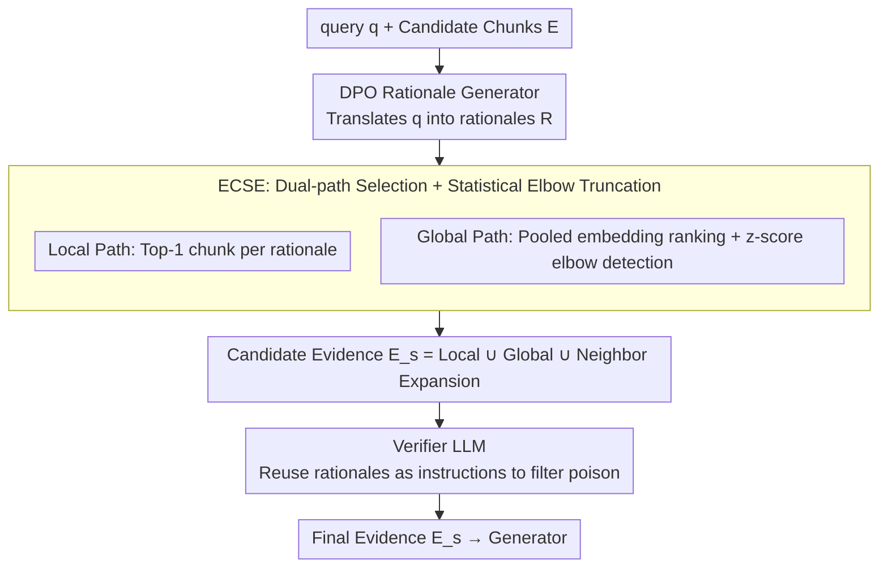

# Ranking-Free RAG: Replacing Re-Ranking with Selection in RAG for Sensitive Domains

**Conference**: ICML 2026  
**arXiv**: [2505.16014](https://arxiv.org/abs/2505.16014)  
**Code**: https://github.com/YashSaxena21/METEORA  
**Area**: Information Retrieval / RAG / Interpretability / Adversarial Robustness  
**Keywords**: RAG, Evidence Selection, DPO, Adaptive Thresholding, Corpus Poisoning Defense

## TL;DR
This paper introduces METEORA, a trio consisting of a DPO-trained rationale generator, statistical elbow detection, and a shared-framework Verifier. It replaces the uninterpretable, top-$k$-dependent re-ranker in RAG, achieving higher recall, an 80% reduction in evidence volume, and a 4.4× improvement in adversarial robustness across six sensitive domain datasets.

## Background & Motivation

**Background**: Current RAG systems are widely deployed in high-risk sectors like law, finance, and healthcare. Mainstream practices utilize dense retrievers (e.g., Cross-Encoder, SBERT, Contriever) to calculate query–chunk similarity, followed by a fixed top-$k$ truncation for the generator. LLM-based rankers like RankRAG and Self-RAG replace smaller rerankers with large models for scoring.

**Limitations of Prior Work**: First, similarity scores are black boxes, failing to explain "why this chunk was selected over another," which is unacceptable for regulation in contract review or privacy QA. Second, $k$ is a magic number—selecting too many for simple questions introduces noise, while selecting too few for complex questions loses evidence. Third, corpus poisoning attacks (Zou et al., 2025) can inject semantically similar but factually incorrect chunks, against which similarity-based ranking lacks defense.

**Key Challenge**: Interpretability, adversarial robustness, and computational efficiency are traditionally viewed as conflicting goals. Adding interpretability modules requires calculating rationales, and adding defense requires another verifier layer, both of which seemingly sacrifice efficiency. However, the authors observe that if the selection decision itself is based on explicit reasoning, then explanation, verification, and adaptive truncation can share the same rationale.

**Goal**: To build a unified framework that outputs "which chunks to select," "why they are selected," and "which are poisonous" without additional annotations, while reducing evidence volume compared to traditional top-$k$.

**Key Insight**: Traditional rerankers directly compute similarity between query and chunk. The authors insert a layer where the LLM first generates several rationales, which then select chunks. This replaces uninterpretable scores with human-readable, auditable natural language that can be reused as Verifier input.

**Core Idea**: Utilize DPO to train the LLM as a "rationale generator," use statistical elbow detection to adaptively determine the number of selections, and use the same rationale to feed a Verifier for detecting poisoning. Interpretability, robustness, and efficiency are achieved simultaneously via a single set of rationales.

## Method

### Overall Architecture
METEORA replaces the uninterpretable top-$k$ re-ranker in RAG with a unified framework that clarifies selection logic and identifies poisoning. Formally, it learns $f_\theta(q, E) \to (R, E_s)$, taking query $q$ and retrieved candidate chunks $E$ to output a rationale set $R = \{r_1, \dots, r_k\}$ and a selected evidence subset $E_s \subset E$. The pipeline links three stages using rationales: a DPO-trained LLM translates the query into explanations, ECSE performs rationale-based selection and adaptive truncation, and the Verifier uses the same rationales as instructions to filter poisoned chunks—eliminating the need for a magic number $k$.

### Key Designs

**1. DPO-driven Rationale Generator: Evidence Selection Accuracy as a Preference Signal**

Similarity scores are black boxes, but manual rationale annotation is unscalable. The authors automatically construct preference pairs from existing QA data: for each $(q, e^*)$, the LLM generates multiple rationales. Rationales leading to the correct evidence $e^*$ are labeled $r_w$ (winning), and those leading to incorrect evidence are labeled $r_l$ (losing). The model is trained using the standard DPO loss:
$$\mathcal{L}_{DPO} = -\mathbb{E}\big[\log \sigma(\beta \log \frac{\pi_\theta(r_w | q, e)}{\pi_{\text{ref}}(r_w | q, e)} - \beta \log \frac{\pi_\theta(r_l | q, e)}{\pi_{\text{ref}}(r_l | q, e)})\big]$$
By equation "rationale quality" with "selection accuracy," this avoids manual annotation and is more stable than RLHF. The ability to distinguish fine-grained evidence makes it harder for poisoned chunks to coincidentally match a rationale, bolstering robustness.

**2. ECSE: Dual-path Evidence Selection + Statistical Elbow Detection**

The effectiveness of top-$k$ varies across queries; short documents in FinQA and 350k-token contracts in MAUD should not share the same $k$. ECSE eliminates this hyperparameter via dual-path selection and statistical truncation. The **Local path** finds the most similar chunk for each rationale $r_i$: $E_v = \{\arg\max_{e_j \in E} \mathcal{S}(r_i, e_j) \mid r_i \in \mathcal{R}\}$. Consensus among rationales signals high validity. The **Global path** calculates a pooled embedding $\bar{r} = \frac{1}{|\mathcal{R}|} \sum \text{SBERT}(r_i)$ and ranks chunks into a similarity sequence $\{s_1, \dots, s_n\}$. It then performs elbow detection: the first-order difference $\Delta_i = s_i - s_{i+1}$ is normalized via z-score $z_i = (\Delta_i - \mu_\Delta)/\sigma_\Delta$. The first significant deviation from the mean marks the truncation point $k^*$. If first-order differences are insignificant, it resorts to second-order differences $\nabla^2_i$. Finally, $\mathbf{E_s} = E_v \cup E_g \cup E_w$, where $E_w$ includes optional neighbor expands to mitigate chunk fragmentation.

**3. Verifier LLM: Reusing Rationales for Poison Filtering**

Perplexity-based defenses are ineffective against high-quality LLM-generated poison (F1 only 0.06–0.15) because attackers focus on "factually incorrect but semantically fluent" content. METEORA reuses the Llama-3.1-8b-instruct model, treating rationales as "flagging instructions." Each chunk is checked for factual violations, logical contradictions with verified evidence, and instruction violations (failure to meet rationale criteria). It follows a conservative principle: it marks chunks as poisonous only with >90% confidence. Since rationales are query-aligned, they effectively check if a chunk truly satisfies the retrieval intent; 87% of poison hits in experiments were "instruction violations."

### Loss & Training
Only the rationale generator requires training using the DPO loss. ECSE and the Verifier are training-free inference modules. Preference data is automatically derived from existing QA annotations without human-written rationales.

## Key Experimental Results

### Main Results

Compared across 6 datasets (QASPER, Contract-NLI, FinQA, PrivacyQA, CUAD, MAUD), METEORA significantly leads in average recall (baseline $k$ set to METEORA's adaptive average):

| Method | Avg R | Avg P | MAUD R (350k tokens) | CUAD R | PrivacyQA R |
|------|-------|-------|--------------------------|--------|-------------|
| SBERT (E5-Large) | 0.80 | 0.18 | 0.44 | 0.77 | 0.78 |
| Cross-Encoder (BGE) | 0.82 | 0.18 | 0.51 | 0.78 | 0.85 |
| RankRAG (8b) | 0.68 | 0.13 | 0.22 | 0.60 | 0.86 |
| METEORA | **0.93** | **0.19** | **0.72** | **0.93** | **0.98** |
| METEORA w/o Expansion | 0.89 | **0.23** | 0.66 | 0.90 | 0.96 |

The advantage grows as documents become longer and more complex: MAUD recall jumped from 0.51 to 0.72 (+41%). Latency for METEORA is 2.91s, faster than SBERT (4.04s) and RankRAG (4.61s), as input tokens were reduced from 36–40k to 12k. Generation accuracy increased by 33.34%.

### Ablation Study

| Configuration | Avg Recall | Avg Precision | Note |
|------|---------|---------|------|
| METEORA (full) | 0.93 | 0.19 | Complete framework |
| w/o DPO | 0.88 | 0.18 | Using untrained rationale generator |
| w/o Verifier | 0.94 | 0.17 | Recall rises, precision falls on clean data; fails on adversarial |
| w/o Expansion | 0.89 | **0.23** | Precision-Recall trade-off |
| Perplexity defense | F1 ≈ 0.10 | — | Minimal defense against poison |
| **METEORA (Adversarial)** | **F1 ≈ 0.43** | — | 4.4× improvement |

### Key Findings
- **DPO gains correlate with complexity**: MAUD (+23.7% recall) vs. FinQA (+2.1%). DPO specifically improves mapping high-level concepts to specific clauses in long documents.
- **Poison detection**: 87% of poison was flagged as an "instruction violation," confirming that attackers manipulate retrieval intent rather than objective facts.
- **Context Expansion**: Highly effective for MAUD and PrivacyQA, but less so for well-structured datasets like ContractNLI, indicating benefits depend on chunk fragmentation.
- **Human Eval**: Rationale clarity scored 3.64/5, and poison judgment reached 86% accuracy, proving the rationales are functionally interpretable.

## Highlights & Insights
- **Unified Trifecta**: METEORA proves that interpretability, robustness, and efficiency can be achieved simultaneously by using rationales as a shared intermediate representation.
- **Statistical Elbow instead of magic $k$**: Using z-score normalized differences to identify similarity cliffs is a generalizable approach for any task requiring adaptive thresholds.
- **Preference Construction Paradigm**: Equating "rationale quality" with "downstream accuracy" bypasses the manual annotation bottleneck and is transferable to Tool-RAG or Code-RAG.

## Limitations & Future Work
- **Distribution Gap**: DPO negative samples $r_l$ are natural errors rather than adversarial ones; future work could explore adversarial DPO.
- **Deployment Cost**: Relying on an 8B model for three tasks may be costly; distilling the rationale generator into smaller models is a natural extension.
- **Conservative Verifier**: The "high confidence only" strategy might miss low-confidence poison; multi-model voting could be introduced.
- **Fixed Expansion**: Replacing the fixed neighbor expand with an adaptive window based on semantic boundaries could refine the Precision-Recall balance.

## Related Work & Insights
- **vs RAG2 / RADIO**: These use rationales only for retriever training, inheriting the limitations of top-$k$; METEORA uses them end-to-end for selection and verification.
- **vs RankRAG**: METEORA replaces black-box scoring with explicit reasoning, making it more effective for long documents where RankRAG fails due to context limits.
- **vs Perplexity-based defense**: Perplexity fails against high-quality LLM poison; METEORA's intent-consistency check is far more robust.

<!-- RELATED:START -->

## Related Papers

- [\[ACL 2025\] SetR: Shifting from Ranking to Set Selection for Retrieval Augmented Generation](../../ACL2025/information_retrieval/setr_set_selection_rag.md)
- [\[NeurIPS 2025\] SeCon-RAG: A Two-Stage Semantic Filtering and Conflict-Free Framework for Trustworthy RAG](../../NeurIPS2025/information_retrieval/secon-rag_a_two-stage_semantic_filtering_and_conflict-free_framework_for_trustwo.md)
- [\[ICML 2026\] BlitzRank: Principled Zero-shot Ranking Agents with Tournament Graphs](blitzrank_principled_zero-shot_ranking_agents_with_tournament_graphs.md)
- [\[ICML 2026\] Less Is More: Elevating RAG via Performance-Driven Context Compression](less_is_more_elevating_rag_via_performance-driven_context_compression.md)
- [\[ACL 2025\] Re-ranking Using Large Language Models for Mitigating Exposure to Harmful Content on Social Media Platforms](../../ACL2025/information_retrieval/llm_reranking_harmful_content.md)

<!-- RELATED:END -->
