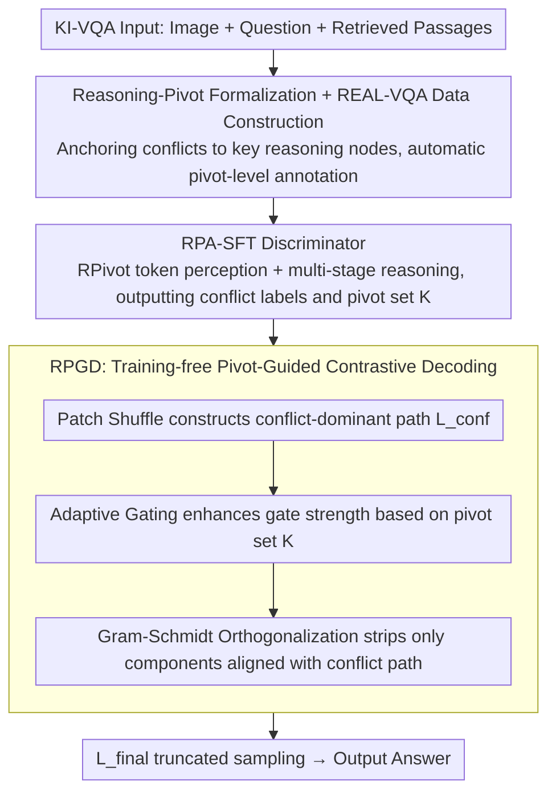

# REAL: Resolving Knowledge Conflicts in Knowledge-Intensive Visual Question Answering via Reasoning-Pivot Alignment

**Conference**: ICML2026  
**arXiv**: [2602.14065](https://arxiv.org/abs/2602.14065)  
**Code**: To be confirmed  
**Area**: Information Retrieval  
**Keywords**: Knowledge Conflict, KI-VQA, Reasoning-Pivot, Contrastive Decoding, Multimodal RAG

## TL;DR
This paper proposes the REAL framework, which redefines knowledge conflicts in KI-VQA using "Reasoning-Pivots" (atomic nodes/edges in a reasoning chain that must rely on external evidence for completion). By training a pivot-aware conflict discriminator via RPA-SFT and a training-free contrastive decoding strategy via RPGD, it achieves improvements of +3.8%, +1.6%, and +3.6% on E-VQA, InfoSeek, and A-OKVQA, respectively.

## Background & Motivation

**Background**: Knowledge-Intensive VQA (KI-VQA) has become a mainstream configuration for MLLMs and Multimodal RAG—supplementing the deficiencies of visual and parametric memory by retrieving external passages from sources like Wikipedia. Existing works primarily focus on retrieval precision, rerankers, and knowledge structure organization.

**Limitations of Prior Work**: Open-domain retrieval inevitably introduces noise and contradictory evidence, leading to "knowledge conflicts" (e.g., the same artist being identified as both Italian and Spanish). However, existing conflict-handling paradigms have two major drawbacks: (1) **Brittle conflict detection**: Semantic matching rules based on entities or keywords are fragile and cannot adapt to the vast external knowledge and complex evidence interactions in KI-VQA; (2) **Lack of internal model constraints**: Existing methods rely on external knowledge reorganization or contrastive prompt interventions, but the diverse presentation of the same type of conflict in KI-VQA leads to inconsistent resolution behavior and unpredictable reasoning results.

**Key Challenge**: Traditional definitions of "entity mismatch = conflict" ignore the sequential and conditional nature of the KI-VQA reasoning chain. In multi-hop reasoning $\{e_{img} \xrightarrow{p_1} e_2 \xrightarrow{p_2} \cdots \xrightarrow{p_n} e_n\}$, intermediate nodes $e_2,\dots,e_n$ are inherently different from the initial visual entity $e_{img}$. Furthermore, identical property types (e.g., location/nationality) can appear at different stages of the reasoning chain, causing keyword matching to misjudge them as equivalent.

**Goal**: (1) Re-formalize what constitutes a "true conflict"; (2) Use a unified signal to simultaneously train a discriminator and guide decoding to resolve conflicts in a closed loop.

**Key Insight**: Decompose KI-VQA into discrete reasoning chains and determine contradictions only at factual points bound to "Reasoning-Pivots." Differences in entities or keywords outside these pivots are treated as benign noise.

**Core Idea**: First, use Reasoning-Pivot extraction to constrain "conflict detection" to key nodes in the reasoning chain, then allow the same pivot signal to both drive SFT training and guide logit-level contrastive decoding.

## Method

### Overall Architecture
REAL aims to solve the problem of "what counts as a real conflict" in KI-VQA by narrowing the determination to key nodes of the reasoning chain and allowing this determination signal to persist through training and decoding. The entire pipeline uses the same Reasoning-Pivot semantic entities to connect three components: first, automatically constructing the REAL-VQA dataset with pivot-level annotations using Wikipedia + GPT-4o (4,149 training / 629 test, each sample paired with 5 ground-truth passages); second, training a "pivot-extraction-then-conflict-judgment" discriminator via RPA-SFT; and finally, using training-free RPGD to strip conflict directions identified by the discriminator from the logits during decoding. These three form a "data → discriminator → decoding" closed loop, avoiding signal mismatch between modules.

### Key Designs

**1. Reasoning-Pivot Formalization and REAL-VQA Data Construction: Anchoring Conflicts to Key Reasoning Nodes**

Traditional definitions where "entity/keyword mismatch = conflict" lead to frequent misjudgments in multi-hop reasoning—intermediate nodes in $e_1 \xrightarrow{p_1} e_2 \xrightarrow{p_2} y$ are supposed to differ from the initial visual entity, and the same property types (location/nationality) repeat at different stages. REAL collects all indispensable nodes and edges on the chain into a pivot set $\mathcal{P}=\{e_1,p_1,e_2,p_2,y\}$, and strictly defines conflicts as "logically mutually exclusive assertions for the same pivot" $\mathcal{K}_{conflict}=\{u\in\mathcal{P}\mid\exists a_i,a_j\in\mathcal{I}_u,\ a_i\wedge a_j\rightarrow\bot\}$. This classifies entity differences outside pivots as benign noise. Data construction follows three principles: high multi-hop complexity (maximizing pivot breadth), common-property aggregation (increasing pivot density), and knowledge-deficit induction (filtering samples solvable by vision alone). Conflicts are generated via a rewrite-based strategy: replacing the ground-truth pivot $p_{gt}$ with $p_{neg}$ and having GPT-4o rewrite the segment within the real Wikipedia context of $p_{neg}$, ensuring the text is factually self-consistent but precisely contradicts visual evidence. Finally, quality is ensured via vote-of-confidence filtering (accumulated score $\geq 80$ over 10 GPT-4o runs) and manual verification.

**2. RPA-SFT: Converting Conflict Judgment into Explicit Logic Verification via Dual Mechanisms**

If SFT is performed using only binary conflict labels, the model easily learns dataset shortcuts (artifacts) and fails cross-domain. RPA-SFT therefore splits judgment into two overlapping mechanisms. The first is token-level pivot perception: adding special `<RPivot>` / `</RPivot>` tokens to the vocabulary and explicitly wrapping every pivot in the input and target during preprocessing, making them stable semantic anchors in the embedding space. The second is multi-stage reasoning training: structuring the target output into three steps—extracting question pivots, using them to guide passage pivot extraction, and finally outputting binary conflict labels based on logical consistency within the same pivot set. The loss remains standard SFT next-token cross-entropy, but the target sequence embeds the "extract pivot then judge conflict" structure, forcing the model to decide based on "assertion comparison on the same pivot" rather than memorizing surface patterns.

**3. RPGD: Training-free Pivot-Guided Contrastive Decoding**

With the pivot set $\mathcal{K}$ output by the discriminator, inference can suppress conflict directions without collateral damage to normal tokens. RPGD follows a three-stage pipeline. Step one, Patch Shuffle randomly permutes visual patch embeddings to construct a "conflict-dominant" path $L_{conf}=M(x,\text{Shuffle}(v))$, which destroys object-level topology but retains part-level features and original distribution amplitude, forcing the model to rely on contradictory text when visual verification is lacking. Step two, adaptive gating initializes a gate matrix $\alpha\in\mathbb{R}^{B\times V}$ with a global baseline $\varepsilon$, then enhances gate strength only for vocabulary indices corresponding to pivots $\mathcal{K}$ via $\alpha_{b,v}\leftarrow\varepsilon+\beta\cdot\sigma(\kappa L_{conf}(b,v))$ ($\sigma$ prevents saturation, $\beta$ controls intensity). Step three, Gram-Schmidt Orthogonalization calculates the projection coefficient $c=\langle L_{std},L_{conf}\rangle/(\|L_{conf}\|_2^2+\delta)$ to get the projection component $L_{proj}=c\cdot L_{conf}$. The final logit is $L_{final}=L_{std}-\alpha\odot L_{proj}$, followed by cutoff $\tau$ truncated sampling. Unlike direct logit subtraction, which damages shared reasonable structures, this strictly strips only components geometrically aligned with the conflict path.

### Loss & Training
RPA-SFT uses a standard SFT objective with a target sequence structure: "`<RPivot>`-wrapped question pivots → passage pivots → binary conflict label." The number of retrieved documents $k=5$, aligned with baselines like EchoSight/ReflectiVA. Training was conducted on 8 H20 GPUs. RPGD is entirely training-free; hyperparameters $\varepsilon, \beta, \kappa, \tau, \delta$ are provided in the appendix.

## Key Experimental Results

### Main Results
KI-VQA accuracy main results (comparison with SOTAs, bold denotes best):

| Model | Method | InfoSeek (All) | E-VQA (All) | Gain vs. Prev. SOTA |
|------|------|--------------|------------|------------|
| Qwen3-VL-8B | REAL (Ours) | **44.1** | **41.4** | +1.6 / +3.8 |
| InternVL3.5-8B | REAL (Ours) | 43.8 | 39.2 | Leading at same scale |
| InternVL3-8B | VLM-PRF | 42.5 | 39.2 | Prev. SOTA |
| LLaMA3.1-8B | ReflectiVA | 40.2 | 35.5 | — |
| LLaVA-1.5-7B | EchoSight | 26.8 | 28.5 | — |

A-OKVQA: REAL (LLaVA-1.5-7B) achieved MC=80.3 / DA=68.3, outperforming QACap (Claude 3.5) at 76.7 / 66.3, proving transferability to commonsense reasoning.

### Ablation Study
Conflict Discrimination (MCC / F1, key cross-domain results):

| Model | Method | REAL-VQA MCC | E-VQA MCC | ScienceQA MCC | MMKC MCC |
|------|------|--------------|-----------|---------------|----------|
| Qwen3-VL-8B | Zero-shot | 19.0 | 85.4 | 64.5 | 23.4 |
| Qwen3-VL-8B | Few-shot CoT | 19.4 | 86.9 | 67.4 | 42.4 |
| Qwen3-VL-8B | Standard SFT | 89.4 | 82.6 | 87.0 | 38.2 |
| Qwen3-VL-8B | RPA-SFT (Ours) | **98.1** | **93.4** | **87.9** | **52.9** |

RPGD Component Ablation (Qwen3-VL-8B on E-VQA, Single-Hop / All):

| Patch Shuffle | Adaptive Gating | Gram-Schmidt | Single-Hop | All |
|---------------|-----------------|--------------|-----------|-----|
| ✗ | ✗ | ✗ | 42.4 | 38.1 |
| ✗ | ✓ | ✓ | 43.9 | 39.2 |
| ✓ | ✗ | ✓ | 44.1 | 39.5 |
| ✓ | ✓ | ✗ | 43.5 | 38.9 |
| ✓ | ✓ | ✓ | **45.5** | **41.4** |

### Key Findings
- **RPA-SFT outperforms standard SFT by +14.7 MCC on the entirely unseen MMKC dataset**, indicating that pivot-level supervision brings true generalization rather than over-fitting REAL-VQA. Table 4 further shows RPA-SFT improves Reasoning Pivot F1 / Conflict Pivot F1 by +17.8 / +28.3 (Qwen3-VL-8B) over Few-shot.
- **The three RPGD components are indispensable**: Removing Patch Shuffle drops performance by 2.2/1.6, removing Adaptive Gating drops 1.9/1.4, and removing Gram-Schmidt drops 2.5/2.0. Pivot-guided signals provide a +3.8 / +5.1 gain over Uniform/Random (Table 6).
- **Cross-model transferability**: RPGD consistently brings +3-7 point improvements across LLaVA-1.5-7B / InternVL3.5-8B / Qwen3-VL-2B/8B, serving as a plug-in without additional training.

## Highlights & Insights
- **Paradigm Shift in Conflict Definition**: Replacing "entity/keyword mismatch" with "logical mutual exclusion on the same reasoning pivot" solves misjudgments caused by inherent entity differences in multi-hop reasoning and repeated attribute types. This reframe is more fundamental than any architectural innovation.
- **End-to-End Signal Reuse**: The pivot is the same semantic entity used in data construction (rewrite anchor), SFT targets (special tokens + multi-stage output), and decoding (gate index set). This avoids signal mismatch between modules.
- **Patch Shuffle is smarter than mask/noise**: Retaining distribution amplitude while destroying topological structure constructs a "visible but un-assemblable" state that forces out conflict signals more effectively than hard masking without introducing distribution shifts.
- **Gram-Schmidt Projection + Adaptive Gating** provides a clean mathematical framework: stripping only logit components "geometrically aligned with the conflict path," with suppression intensity smoothly controlled by sigmoid to avoid the over-penalty issues common in contrastive decoding.

## Limitations & Future Work
- **Dependency on GPT-4o for data construction**: The REAL-VQA training set consists of only 4,149 entries, and pivot annotation quality depends on GPT-4o's multi-hop reasoning capabilities.
- **Pivot extraction assumes explicit, enumerable reasoning chains**: For open-domain QA requiring commonsense/implicit reasoning, the pivot set might collapse into a single point or an empty set, causing RPGD to degrade to ordinary contrastive decoding.
- **Coverage limited to context-memory conflicts**: Intra-memory conflicts (internal contradictions in parametric memory) and pure image-text modal conflicts are not explicitly modeled within the framework.
- **Scale and retrieval depth**: Scalability to greater retrieval depths ($k\geq 20$) and larger models (70B+) is not yet verified. RPGD requires two forward passes, doubling inference overhead.

## Related Work & Insights
- **vs. ReflectiVA / VLM-PRF**: While others rely on external feedback or pseudo-relevance reranking for retrieval post-processing, REAL shifts the effort to internal pivot discrimination and decoding, allowing gains without changing the retriever.
- **vs. NoteMR / mKG-RAG**: Unlike works using structured notes or knowledge graphs, REAL performs discrete determinations of "which factual point has a conflict." REAL's advantage lies in multi-hop reasoning (avoiding noise from global graph indexing).
- **vs. Traditional Contrastive Decoding (e.g., CD / DoLa)**: Traditional methods use global contrastive prompts or inter-layer contrasts. REAL precisely projects the contrastive direction onto pivot tokens and uses Gram-Schmidt orthogonalization to avoid collateral damage.

## Rating
- Novelty: ⭐⭐⭐⭐⭐ The formalization of Reasoning-Pivot redefines the KI-VQA conflict problem, representing a conceptual innovation rather than engineering stacking.
- Experimental Thoroughness: ⭐⭐⭐⭐ Covers 4 discrimination datasets + 3 KI-VQA benchmarks + 4 model scales with complete ablations; however, scaling experiments for 70B+ models and longer retrieval depths are missing.
- Writing Quality: ⭐⭐⭐⭐ Formal definitions in Section 3 are clear, and the method section is well-supported by equations and algorithms.
- Value: ⭐⭐⭐⭐⭐ Directly applicable to any multimodal system relying on external knowledge; RPGD is training-free and plug-and-play.

<!-- RELATED:START -->

## Related Papers

- [\[CVPR 2026\] CC-VQA: Conflict- and Correlation-Aware Method for Mitigating Knowledge Conflict in Knowledge-Based Visual Question Answering](../../CVPR2026/information_retrieval/cc-vqa_conflict-_and_correlation-aware_method_for_mitigating_knowledge_conflict_.md)
- [\[ICLR 2026\] RefTool: Reference-Guided Tool Creation for Knowledge-Intensive Reasoning](../../ICLR2026/information_retrieval/reftool_reference-guided_tool_creation_for_knowledge-intensive_reasoning.md)
- [\[ACL 2026\] CounterRefine: Answer-Conditioned Counterevidence Retrieval for Inference-Time Knowledge Repair in Factual Question Answering](../../ACL2026/information_retrieval/counterrefine_answer-conditioned_counterevidence_retrieval_for_inference-time_kn.md)
- [\[ACL 2026\] VisRet: Visualization Improves Knowledge-Intensive Text-to-Image Retrieval](../../ACL2026/information_retrieval/visret_visualization_improves_knowledge-intensive_text-to-image_retrieval.md)
- [\[AAAI 2026\] SR-KI: Scalable and Real-Time Knowledge Integration into LLMs via Supervised Attention](../../AAAI2026/information_retrieval/sr-ki_scalable_and_real-time_knowledge_integration_into_llms_via_supervised_atte.md)

<!-- RELATED:END -->
