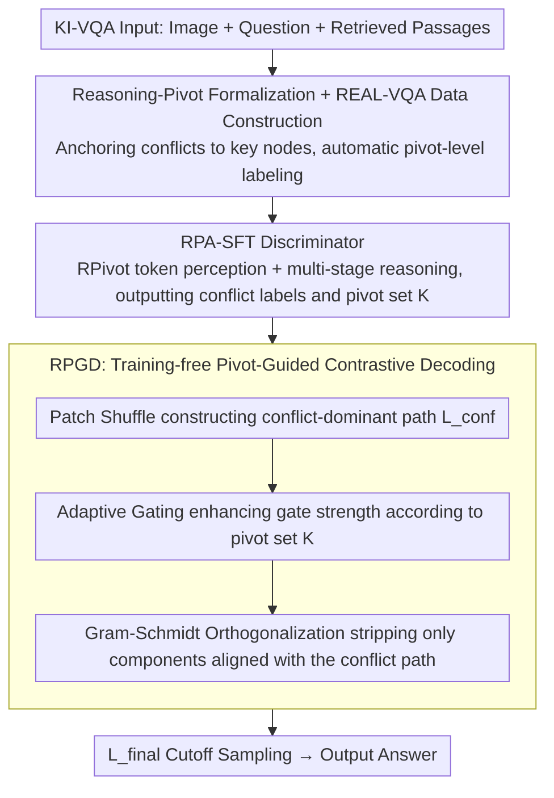

# REAL: Resolving Knowledge Conflicts in Knowledge-Intensive Visual Question Answering via Reasoning-Pivot Alignment

**Conference**: ICML2026  
**arXiv**: [2602.14065](https://arxiv.org/abs/2602.14065)  
**Code**: TBD  
**Area**: Information Retrieval  
**Keywords**: Knowledge Conflict, KI-VQA, Reasoning-Pivot, Contrastive Decoding, Multimodal RAG

## TL;DR
This paper proposes the REAL framework, which redefines knowledge conflicts in KI-VQA using "Reasoning-Pivots" (atomic nodes/edges in a reasoning chain that must rely on external evidence for completion). By training a pivot-aware conflict discriminator via RPA-SFT and a training-free contrastive decoding strategy via RPGD, it achieves improvements of +3.8%, +1.6%, and +3.6% on E-VQA, InfoSeek, and A-OKVQA, respectively.

## Background & Motivation

**Background**: Knowledge-Intensive VQA (KI-VQA) has become a mainstream configuration for MLLMs and multimodal RAG—compensating for the limitations of visual and parametric memory by retrieving external passages from sources like Wikipedia. Existing work primarily focuses on retrieval precision, rerankers, and knowledge structural organization.

**Limitations of Prior Work**: Open-domain retrieval inevitably introduces noise and contradictory evidence, creating "knowledge conflicts" (e.g., the same artist being cited as both Italian and Spanish). Current conflict-handling paradigms suffer from two major flaws: (1) **Fragile conflict detection**—semantic matching rules based on entities/keywords are brittle and cannot adapt to the massive external knowledge and complex evidence interactions in KI-VQA; (2) **Lack of intra-model conflict constraints**—existing methods rely on external knowledge reorganization or contrastive prompt interventions, but the diverse manifestations of the same conflict type in KI-VQA lead to inconsistent behaviors and unpredictable reasoning results.

**Key Challenge**: The traditional definition of "entity mismatch = conflict" ignores the sequential and conditional nature of the KI-VQA reasoning chain. In multi-hop reasoning $\{e_{img} \xrightarrow{p_1} e_2 \xrightarrow{p_2} \cdots \xrightarrow{p_n} e_n\}$, intermediate nodes $e_2, \ldots, e_n$ are naturally intended to differ from the initial visual entity $e_{img}$. Furthermore, the same property type (e.g., location/nationality) can appear at different stages of the reasoning chain, causing keyword matching to incorrectly judge them as equivalent.

**Goal**: (1) Re-formalize what constitutes a "true conflict"; (2) Use a unified signal to simultaneously train a discriminator and guide decoding to resolve conflicts in a closed loop.

**Key Insight**: Deconstruct KI-VQA into discrete reasoning chains and determine contradictions only at factual points bound to "Reasoning-Pivots." Entity or keyword differences outside these pivots are treated as benign noise.

**Core Idea**: First, use Reasoning-Pivot extraction to constrain "conflict detection" to key nodes in the reasoning chain, then allow the same pivot signal to both drive SFT training and guide logit-level contrastive decoding.

## Method

### Overall Architecture
REAL aims to resolve "what counts as a true conflict" in KI-VQA by narrowing the judgment down to critical nodes in the reasoning chain and propagating this judgment signal through both training and decoding. The pipeline uses a single Reasoning-Pivot semantic entity to link three components: first, the REAL-VQA dataset with pivot-level labels is automatically constructed using Wikipedia and GPT-4o (4,149 training / 629 testing samples, with 5 ground-truth passages per sample); then, an RPA-SFT discriminator is trained for "pivot extraction followed by conflict judgment"; finally, the training-free RPGD strips conflict directions identified by the discriminator from the logits during decoding. This forms a "data → discriminator → decoding" closed loop, avoiding signal misalignment between modules.

### Key Designs

**1. Reasoning-Pivot Formalization and REAL-VQA Data Construction: Anchoring conflicts to key nodes in reasoning chains**

Traditional "entity/keyword mismatch = conflict" definitions lead to frequent misjudgments in multi-hop reasoning—intermediate nodes in $e_1 \xrightarrow{p_1} e_2 \xrightarrow{p_2} y$ are supposed to differ from the initial visual entity, and the same property types (location/nationality) repeat across different stages. REAL collects all indispensable nodes and edges into a pivot set $\mathcal{P}=\{e_1,p_1,e_2,p_2,y\}$ and strictly defines conflicts as "logically mutually exclusive assertions targeting the same pivot" $\mathcal{K}_{conflict}=\{u\in\mathcal{P}\mid\exists a_i,a_j\in\mathcal{I}_u,\ a_i\wedge a_j\rightarrow\bot\}$. This classifies entity differences or positional information outside the pivots as benign noise. To force the model to handle such conflicts, construction follows three principles: high multi-hop complexity (maximizing pivot breadth), common-property aggregation (increasing pivot density), and knowledge-deficit induction (filtering samples solvable by image alone). Conflicts are generated via a rewrite-based strategy: replacing a ground-truth pivot $p_{gt}$ with $p_{neg}$, then using GPT-4o to rewrite the passage within the context of $p_{neg}$ so that the text is internally factually consistent but precisely contradicts the visual evidence. Finally, a vote-of-confidence filter (GPT-4o score sum $\geq 80$ over 10 trials, with single trials $\geq 6$) and manual verification ensure quality.

**2. RPA-SFT: Transform conflict discrimination into explicit logical verification via dual mechanisms**

Training SFT solely on binary conflict labels often causes models to learn dataset shortcuts/artifacts, leading to failure in cross-domain scenarios. RPA-SFT decomposes discrimination into two overlapping mechanisms. The first is token-level pivot perception: introducing special tokens `<RPivot>` / `</RPivot>` into the vocabulary and explicitly wrapping every pivot in the input and target during preprocessing, making them stable semantic anchors in the embedding space. The second is multi-stage reasoning training: structuring the target output into three steps—extracting question pivots, using them to guide passage pivot extraction, and finally outputting a binary conflict label based on the logical consistency of assertions within the same pivot set. The loss remains standard next-token cross-entropy, but the structured target forces the model to decide based on "assertion comparison on the same pivot" rather than memorizing surface patterns.

**3. RPGD: Training-free pivot-guided contrastive decoding**

Given the pivot set $\mathcal{K}$ from the discriminator, the model can suppress only the conflict direction during inference without harming normal tokens. RPGD is a three-stage pipeline. Step one, Patch Shuffle, constructs a "conflict-dominant" path $L_{conf}=M(x,\text{Shuffle}(v))$ by randomly shuffling visual patch embeddings. This destroys object-level topology but retains part-level features and original distribution magnitudes, forcing the model to rely on contradictory text when visual verification is absent. Step two, adaptive gating, initializes a gate matrix $\alpha\in\mathbb{R}^{B\times V}$ with a global baseline $\varepsilon$, then boosts the gate strength only for vocabulary indices corresponding to the pivots $\mathcal{K}$ via $\alpha_{b,v}\leftarrow\varepsilon+\beta\cdot\sigma(\kappa L_{conf}(b,v))$ (where $\sigma$ prevents saturation and $\beta$ controls magnitude). Step three, Gram-Schmidt orthogonalization, calculates the projection coefficient $c=\langle L_{std},L_{conf}\rangle/(\|L_{conf}\|_2^2+\delta)$ to obtain $L_{proj}=c\cdot L_{conf}$. The final logit is $L_{final}=L_{std}-\alpha\odot L_{proj}$, followed by cutoff $\tau$ sampling. Unlike direct logit subtraction, which might damage shared reasonable structures, this method strictly peels off only components geometrically aligned with the conflict path.

### Loss & Training
RPA-SFT utilizes the standard SFT objective. The target sequence structure follows: "`<RPivot>`-wrapped question pivots → passage pivots → binary conflict label." The number of retrieved documents is set to $k=5$, aligned with baselines like EchoSight/ReflectiVA. Training was conducted on 8 H20 GPUs. RPGD is entirely training-free; hyperparameters $\varepsilon, \beta, \kappa, \tau, \delta$ are detailed in the appendix.

## Key Experimental Results

### Main Results
KI-VQA accuracy main results (comparison with SOTA, bold indicates best):

| Model | Method | InfoSeek (All) | E-VQA (All) | Rel. to Prev. SOTA |
|-------|--------|----------------|-------------|--------------------|
| Qwen3-VL-8B | REAL (Ours) | **44.1** | **41.4** | +1.6 / +3.8 |
| InternVL3.5-8B | REAL (Ours) | 43.8 | 39.2 | Lead in same scale |
| InternVL3-8B | VLM-PRF | 42.5 | 39.2 | Prev. SOTA |
| LLaMA3.1-8B | ReflectiVA | 40.2 | 35.5 | — |
| LLaVA-1.5-7B | EchoSight | 26.8 | 28.5 | — |

A-OKVQA: REAL (LLaVA-1.5-7B) achieved MC=80.3 / DA=68.3, outperforming QACap (Claude 3.5) at 76.7 / 66.3, demonstrating transferability to commonsense reasoning.

### Ablation Study
Conflict Discrimination (MCC / F1, key cross-domain results):

| Model | Method | REAL-VQA MCC | E-VQA MCC | ScienceQA MCC | MMKC MCC |
|-------|--------|--------------|-----------|---------------|----------|
| Qwen3-VL-8B | Zero-shot | 19.0 | 85.4 | 64.5 | 23.4 |
| Qwen3-VL-8B | Few-shot CoT | 19.4 | 86.9 | 67.4 | 42.4 |
| Qwen3-VL-8B | Standard SFT | 89.4 | 82.6 | 87.0 | 38.2 |
| Qwen3-VL-8B | RPA-SFT (Ours) | **98.1** | **93.4** | **87.9** | **52.9** |

Ablation of RPGD components (Qwen3-VL-8B on E-VQA, Single-Hop / All):

| Patch Shuffle | Adaptive Gating | Gram-Schmidt | Single-Hop | All |
|---------------|-----------------|--------------|-----------|-----|
| ✗ | ✗ | ✗ | 42.4 | 38.1 |
| ✗ | ✓ | ✓ | 43.9 | 39.2 |
| ✓ | ✗ | ✓ | 44.1 | 39.5 |
| ✓ | ✓ | ✗ | 43.5 | 38.9 |
| ✓ | ✓ | ✓ | **45.5** | **41.4** |

### Key Findings
- **RPA-SFT outperforms standard SFT by +14.7 MCC on the completely unseen MMKC dataset**, indicating that pivot-level supervision brings true generalization rather than overfitting to REAL-VQA.
- **Each of the three RPGD components is indispensable**: removing Patch Shuffle drops performance by 2.2/1.6, removing Adaptive Gating drops it by 1.9/1.4, and removing Gram-Schmidt drops it by 2.5/2.0.
- **Cross-model transferability**: RPGD consistently provides +3~7 point gains across LLaVA-1.5-7B, InternVL3.5-8B, and Qwen3-VL-2B/8B as a plug-and-play module without additional training.

## Highlights & Insights
- **Paradigm Shift in Conflict Definition**: Replacing "entity/keyword mismatch" with "logical mutual exclusivity on the same reasoning pivot" solves misjudgments caused by natural entity differences in multi-hop reasoning.
- **End-to-End Signal Reuse**: The pivot serves as the same semantic entity in data construction (rewrite anchor), SFT targets (special tokens + multi-stage output), and decoding (gate index set), ensuring signal alignment across modules.
- **Patch Shuffle over Masking/Noise**: Destroying topology while retaining distribution magnitudes creates a "visible but uninterpretable" state that induces conflict signals more effectively than hard masking without introducing distribution shifts.
- **Mathematical Framework**: Gram-Schmidt projection + adaptive gating ensures that only logit components geometrically aligned with the conflict path are stripped, avoiding the over-penalty common in contrastive decoding.

## Limitations & Future Work
- **Dependency on GPT-4o for Data**: The REAL-VQA training set is relatively small (4,149 samples), and labeling quality depends on GPT-4o’s multi-hop reasoning capabilities.
- **Explicit Reasoning Chain Assumption**: For open-ended QA requiring implicit/commonsense reasoning without clear multi-hop chains, the pivot set may collapse or become empty.
- **Context-Memory Conflicts Only**: Intra-memory conflicts (internal parametric memory contradictions) and pure image-text conflicts are not yet explicitly modeled.
- **Inference Overhead**: RPGD requires two forward passes (standard + shuffle), doubling the inference cost.

## Related Work & Insights
- **vs ReflectiVA / VLM-PRF**: While those rely on external feedback or reranking, REAL internalizes the work via pivot discrimination and decoding, allowing gains without altering the retriever.
- **vs NoteMR / mKG-RAG**: Unlike structural organization methods, REAL focuses on discrete "factual point" contradiction detection, proving advantageous for multi-hop reasoning by avoiding noise in global knowledge indices.
- **vs Traditional Contrastive Decoding (e.g., CD / DoLa)**: Traditional methods use global prompts or layers; REAL precisely projects the contrastive direction onto pivot tokens, serving as a refined version of CD for RAG scenarios.

## Rating
- Novelty: ⭐⭐⭐⭐⭐ The formalization of Reasoning-Pivot is a conceptual innovation that redefines KI-VQA conflict issues.
- Experimental Thoroughness: ⭐⭐⭐⭐ Covers 4 discrimination datasets + 3 KI-VQA benchmarks + 4 model scales; however, lacks extreme-scale (70B+) testing.
- Writing Quality: ⭐⭐⭐⭐ Clear formal definitions in Section 3; the methodology is well-complemented by formulas and algorithms.
- Value: ⭐⭐⭐⭐⭐ Directly applicable to any multimodal system relying on external knowledge; RPGD is plug-and-play.

<!-- RELATED:START -->

<!-- RELATED:END -->

## Related Papers

- [\[CVPR 2026\] CC-VQA: Conflict- and Correlation-Aware Method for Mitigating Knowledge Conflict in Knowledge-Based Visual Question Answering](../../CVPR2026/information_retrieval/cc-vqa_conflict-_and_correlation-aware_method_for_mitigating_knowledge_conflict_.md)
- [\[ICLR 2026\] RefTool: Reference-Guided Tool Creation for Knowledge-Intensive Reasoning](../../ICLR2026/information_retrieval/reftool_reference-guided_tool_creation_for_knowledge-intensive_reasoning.md)
- [\[ACL 2026\] CounterRefine: Answer-Conditioned Counterevidence Retrieval for Inference-Time Knowledge Repair in Factual Question Answering](../../ACL2026/information_retrieval/counterrefine_answer-conditioned_counterevidence_retrieval_for_inference-time_kn.md)
- [\[ACL 2026\] VisRet: Visualization Improves Knowledge-Intensive Text-to-Image Retrieval](../../ACL2026/information_retrieval/visret_visualization_improves_knowledge-intensive_text-to-image_retrieval.md)
- [\[ACL 2026\] ChatR1: Reinforcement Learning for Conversational Reasoning and Retrieval Augmented Question Answering](../../ACL2026/information_retrieval/chatr1_reinforcement_learning_for_conversational_reasoning_and_retrieval_augment.md)

<!-- RELATED:END -->
