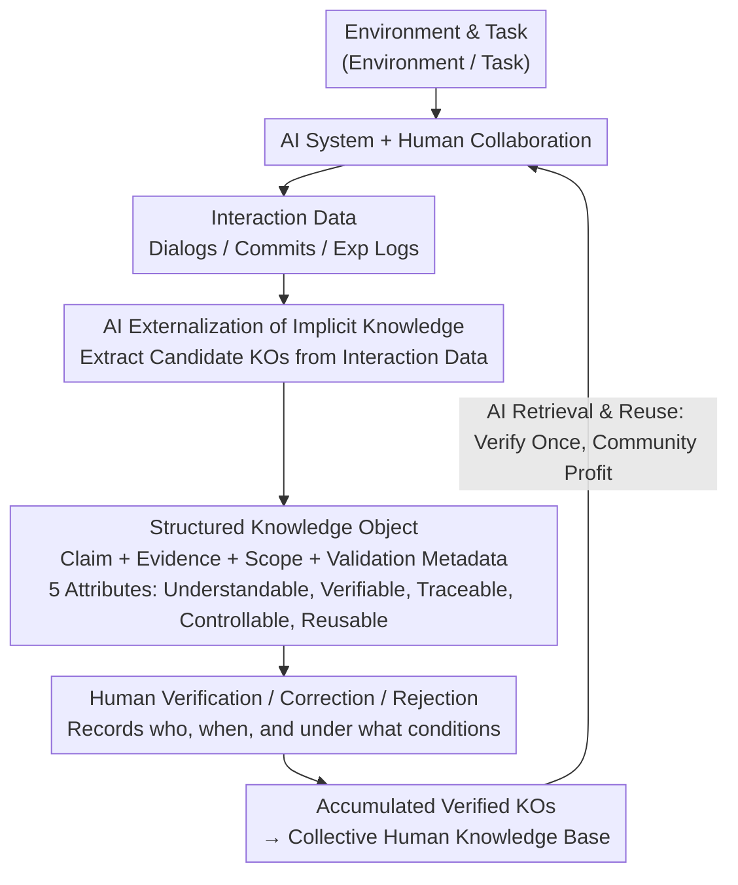

# Position: Reliable AI Needs to Externalize Implicit Knowledge: A Human-AI Collaboration Perspective

**Conference**: ICML 2026 (Position Paper)  
**arXiv**: [2605.02010](https://arxiv.org/abs/2605.02010)  
**Code**: None (Position paper, no open-source implementation)  
**Area**: AI Reliability / Human-AI Collaboration / Knowledge Management  
**Keywords**: Implicit Knowledge, Knowledge Objects, Human-in-the-Loop, Verification Economics, RLHF Alternative

## TL;DR
This ICML position paper argues that current AI reliability methods (RAG / Self-consistency / RLHF / Agent Memory) only verify explicit knowledge, whereas AI's true power stems from "implicit knowledge"—the $80-95\%$ of information in training data not formally recorded by humans. The authors propose Knowledge Objects (KOs) as an infrastructure to externalize AI's implicit reasoning into structured products that are human-checkable, verifiable, and endorsable, allowing the cost of a single human verification to yield long-term compounding benefits for a community.

## Background & Motivation

**Background**: LLMs have made rapid progress in knowledge-intensive tasks—$75\%$ of ChatGPT dialogues are knowledge work (Chatterji 2025), Copilot generates millions of code suggestions daily, and RCTs show AI collaboration brings a $20-40\%$ productivity boost. However, these systems still fail at scale: professional legal AI fluctuates with hallucinations in $17-34\%$ of queries (Magesh 2025), $28.6\%$ of citations in GPT-4 medical reviews are fabricated, and general LLMs exhibit error rates of $58-88\%$ on verifiable legal issues.

**Limitations of Prior Work**: The authors identify that four mainstream reliability approaches share a fatal flaw: **(1) RAG** can only verify "what the document says," not "how the AI reasons"; **(2) Internal verification (Self-Consistency, Uncertainty, LLM-as-Judge)** uses AI to evaluate AI, leading to consistent replication of systemic errors (true hit rate of $65\%$ for $99\%$ confidence intervals); **(3) Training-based methods (SFT/RLHF/DPO)** stuff knowledge into a parametric black box, making it untraceable and uncorrectable, with sycophancy remaining at $78.5\%$ after alignment; **(4) Agent Memory (MemGPT/Reflexion/MemoryBank)** stores data without verification states, leading to the cumulative pollution of erroneous information.

**Key Challenge**: AI learns two layers of knowledge—**Explicit Knowledge** (papers, documents, databases, accounting for $5-20\%$), which can be cited and checked; and **Implicit Knowledge** (reasoning patterns, debugging heuristics, domain intuition, accounting for $80-95\%$), which is embedded in conversation logs, commit histories, and experiment logs. Implicit knowledge has never been formally extracted by humans because "recording cost > perceived benefit." LLMs learn both indiscriminately, acquiring both expert judgment and systemic bias—yet only explicit knowledge is currently verifiable.

**Goal**: To establish an infrastructure that allows AI to "externalize" its learned implicit knowledge into products that humans can check, correct, and cumulatively verify, transforming the hidden cost of "re-evaluating AI output every time" into a compounding model of "verify once, reuse forever."

**Key Insight**: Borrowing from Nonaka’s Organizational Knowledge Theory (1994) and Polanyi’s Tacit Knowledge Theory (1966), the authors posit that implicit knowledge is not "unrecordable" but rather has a "marginal recording cost > perceived marginal utility." If AI can automatically extract implicit patterns into structured candidates, humans only need to perform "lightweight verification," flipping verification economics from "do it every time" to "do it once for continuous benefit."

**Core Idea**: Establish Knowledge Objects (KOs) as the "hub" for human-AI collaboration—AI externalizes implicit knowledge into structured products (claim + evidence + scope + validation metadata), while humans verify, correct, and endorse them, with verification statuses persisted and retrieved as first-class citizens.

## Method

### Overall Architecture
The paper is not a methodological study but proposes a **conceptual framework + five attributes + a call to action**. The core architecture is the "KO-Hub" collaboration paradigm: Environment → Task → (AI System + Human) Collaboration → Generation of Interaction Data → AI Externalizes Candidate KOs from interaction data → Human Verification/Correction/Rejection → Verified KOs enter the Collective Human Knowledge pool → Subsequent tasks can retrieve these verified KOs. This closed loop transforms human verification from a one-off, ephemeral judgment into a cumulative, searchable asset.

### Key Designs

1.  **Formal Definition and Five Attributes of Knowledge Objects**:
    *   **Function**: Solidify implicit knowledge into objects that humans can "view, verify, and endorse," rather than inaccessible representations embedded in parameters.
    *   **Mechanism**: Definition 4.1 stipulates that a KO must include four elements: (i) knowledge claim or procedure, (ii) supporting evidence or reasoning, (iii) explicit scope and limitations, and (iv) validation metadata (recording who, when, and under what conditions it was verified). Based on this, five essential attributes are proposed: **Understandable** (readable for domain experts, not embeddings), **Verifiable** (records verification status, not a one-time judgment), **Traceable** (traceability of endorsement, source, and modifications), **Controllable** (human-editable, annotatable, or rejectable), and **Reusable** (one verification usable by subsequent users). The first three address the core issues of "invisible / unverifiable / untraceable," while the last two allow for the amortization of verification costs.
    *   **Design Motivation**: In contrast to RAG which only addresses "explicit citation," and Agent Memory which only addresses "persistent storage without state," KOs treat "human verification status" as a first-class citizen attribute.

2.  **Verification Economics Inversion**:
    *   **Function**: Convert the total implicit cost of "every user independently evaluating AI output" into a compounding model where "one expert verifies and $N$ subsequent users benefit."
    *   **Mechanism**: Polanyi suggested implicit knowledge is "unspoken" because extraction costs exceed immediate benefits; KOs use AI to automatically externalize structured candidates, shifting the "extraction" cost from humans to AI. Humans then perform "low-cost verification," such as confirming, scoring, or adding scope tags. Verification evolves from an "ephemeral private judgment" to a "persistent public asset." The authors draw an analogy with Wikipedia's hierarchy: $99.9\%$ of articles use community consensus, while $0.1\%$ (Featured Articles) undergo rigorous review. The KO system is similarly tiered—high-risk knowledge requires expert verification, while common patterns are clearly labeled as "unvalidated."
    *   **Design Motivation**: To counter concerns that "verification will become a bottleneck," the authors argue that non-verification is the greatest hidden cost; the total time currently spent by users independently evaluating LLM outputs is significantly higher than a "verify once, reuse many" model. The status quo is what remains unscalable.

3.  **Complementary Positioning of KOs and Existing Methods**:
    *   **Function**: Differentiate KOs from Knowledge Graphs, Wikis, and Agent Memory to avoid misunderstanding them as redundant.
    *   **Mechanism**: Table 1 systematically compares four existing methods' impact on "implicit knowledge": RAG = Untouched (reasoning remains unverified in-model), Self-Verification = Unexposed (produces only confidence without external reference), Training = Absorbed (black-box parameters, invisible and untraceable), and Agent Memory = Unstructured (persistent but without verification state). KO is the **only** design that transforms implicit knowledge into externally inspectable products. The authors also discuss KO forms in agentic scenarios—Voyager’s executable skill library and Agent Workflow Memory’s reusable workflows are early prototypes of "procedural KOs."
    *   **Design Motivation**: The authors emphasize that KOs do not replace existing KM systems but fill the missing layer of "AI-generated yet human-verifiable" data. Traditional wikis manage "what humans have written," while KOs manage "what AI has learned but humans haven't verified."

### Loss & Training
As a position paper, there is no training objective. Instead, Section 6 provides an "Action List" for four stakeholders: ML Researchers develop automatic extraction algorithms and evaluation frameworks; System Builders implement the five-attribute infrastructure, UIs, and APIs; Organizations manage governance (who verifies what) and incentive schemes; and the Research Community shares benchmarks and interoperability standards.

## Key Experimental Results
This is an ICML position paper with no empirical experiments; the following organize the core arguments.

### Main Results: Quantification of Failure Modes (Cited Literature)

| Failure Mode | Quantitative Data | Source |
| :--- | :--- | :--- |
| Legal AI Hallucination after RAG | $17-34\%$ of queries | Magesh 2025 |
| General LLM Legal Error Rate | $58-88\%$ | Dahl 2024 |
| GPT-4 Medical Review Fake Citations | $28.6\%$ | Chelli 2024 |
| Residual Sycophancy after Alignment| $78.5\%$ | Sharma 2024 |
| Prompt Format Accuracy Variation | Up to $76$ percentage points | Sclar 2024 |
| Hit Rate of $99\%$ Confidence Intervals | $65\%$ | Geng 2024 |

### Coverage of Implicit Knowledge

| Method | Explicit Knowledge | Implicit Knowledge | KO Capability |
| :--- | :--- | :--- | :--- |
| RAG | ✅ Cited Documents | ❌ Invisible Reasoning | ✅ Externalize Reasoning as KO |
| Self-Verification | △ Consistency Checks | ❌ Confidence Only | ✅ KO as External Reference |
| Training (SFT/RLHF/DPO) | △ Parameters | ❌ Black-box / Untraceable | ✅ KO as Explicit Artifact |
| Agent Memory | ✅ Stores Facts | △ No Verification State | ✅ KO with Validation Metadata |

### Key Findings
*   **Implicit knowledge constitutes $80-95\%$ of organizational knowledge** (Dalkir 2017) and is the core source of LLM capabilities, yet it is the least verifiable part—stronger models are better at learning implicit bad patterns (Lin 2022, McKenzie 2023).
*   **The rebuttal of five opposing viewpoints** (KGs solve this / existing systems will naturally add validation / humans are the bottleneck / AI can self-verify / structure reduces usability) is the most informative part, demonstrating the distinctiveness of KOs.
*   **Core Reframe**: Reliability is not an AI algorithmic problem but an infrastructure problem; without a vehicle for "cumulative human verification," any algorithmic improvement is merely a local optimization.

## Highlights & Insights
*   **"Verification Economics" Perspective**: Reframes AI reliability from a "training-time algorithmic issue" to an "inference-time infrastructure issue," treating LLMs as "organizational members" within a KM system.
*   **Implicit vs. Explicit Knowledge Reframe**: Uses Polanyi’s 1966 theory to explain why RAG is insufficient and reverses the economic logic of "why it wasn't recorded" to "how to let AI help record it."
*   **Agent Skill = Procedural KO**: Maps Voyager’s code skill library and Agent Workflow Memory to procedural KOs, making the framework particularly relevant for the agentic AI era where validated skills become "organizational building blocks."
*   **Pre-emptive Rebuttals**: Section 5's five-point rebuttal shows a strong grasp of domain consensus, which is more persuasive than a pure manifesto.

## Limitations & Future Work
*   The paper does not provide specific KO schemas, extraction algorithms, or UI designs, leaving a gap between the "proposal" and "implementable system."
*   "Scaling human verification" lacks details on handling expert conflicts, decaying knowledge, or malicious verification poisoning.
*   The authors argue KOs are a "human-AI hub" but do not quantify the loss of *not* building KOs, lacking an economic model for support.
*   The boundary with recent alignment lines like LLM-as-Judge, Constitutional AI, or Process Reward Models (which also externalize reasoning) could be more clearly defined.
*   The risk of "verification inflation" (low-quality verification) requires a reputation mechanism (e.g., PageRank for verifiers) that is not discussed.

## Related Work & Insights
*   **vs RAG (Lewis 2020)**: RAG only links "external explicit documents"; KOs solidify the reasoning itself into a verifiable artifact, serving as an orthogonal supplement.
*   **vs Constitutional AI / RLHF**: These methods push preferences into parameters. KOs keep preferences/verification external, traceable, and editable—transparency vs. training efficiency.
*   **vs Agent Memory (MemGPT/Reflexion/A-MEM)**: Memory systems optimize AI retrieval; KOs optimize human verification. Adding validation to Memory is a "patch," whereas it is a "first-class citizen" in KOs.
*   **vs Wikipedia / Stack Overflow**: These are explicit knowledge platforms; KO is the conceptual blueprint for an "AI implicit knowledge community platform," leveraging tiered verification and voting mechanisms.
*   **vs Process Reward Model (PRM)**: PRMs use models to evaluate steps; they can be combined with KOs, where PRMs provide initial confidence and KOs provide the human-endorsed ground truth.

## Rating
*   **Novelty**: ⭐⭐⭐⭐ Introduces organizational KM theory to AI reliability; the KO concept is clean, though KGs/Wikis provide conceptual prototypes.
*   **Experimental Thoroughness**: ⭐⭐ Position paper without experiments; all quantitative evidence is synthesized from existing literature.
*   **Writing Quality**: ⭐⭐⭐⭐⭐ Extremely clear logical chain (Status Quo → Pain Points → Existing Methods Fail → Why → KO → Rebuttals → Action).
*   **Value**: ⭐⭐⭐⭐ Provides a new vocabulary (KO) and organizational framework for the community; potential to catalyze new infrastructure, though implementation remains a significant task.

<!-- RELATED:START -->

## Related Papers

- [\[NeurIPS 2025\] MITRA: An AI Assistant for Knowledge Retrieval in Physics Collaborations](../../NeurIPS2025/information_retrieval/mitra_an_ai_assistant_for_knowledge_retrieval_in_physics_collaborations.md)
- [\[ACL 2026\] Retrieval-Augmented Tutoring for Algorithm Tracing and Problem-Solving in AI Education](../../ACL2026/information_retrieval/retrieval-augmented_tutoring_for_algorithm_tracing_and_problem-solving_in_ai_edu.md)
- [\[ACL 2025\] PersonaBench: Evaluating AI Models on Understanding Personal Information through Accessing (Synthetic) Private User Data](../../ACL2025/information_retrieval/personabench_evaluating_ai_models_on_understanding_personal_information_through_.md)
- [\[ICML 2026\] CARE: Class-Adaptive Expert Consensus for Reliable Learning with Long-Tailed Noisy Labels](care_class-adaptive_expert_consensus_for_reliable_learning_with_long-tailed_nois.md)
- [\[ICML 2026\] REAL: Resolving Knowledge Conflicts in Knowledge-Intensive Visual Question Answering via Reasoning-Pivot Alignment](real_resolving_knowledge_conflicts_in_knowledge-intensive_visual_question_answer.md)

<!-- RELATED:END -->
