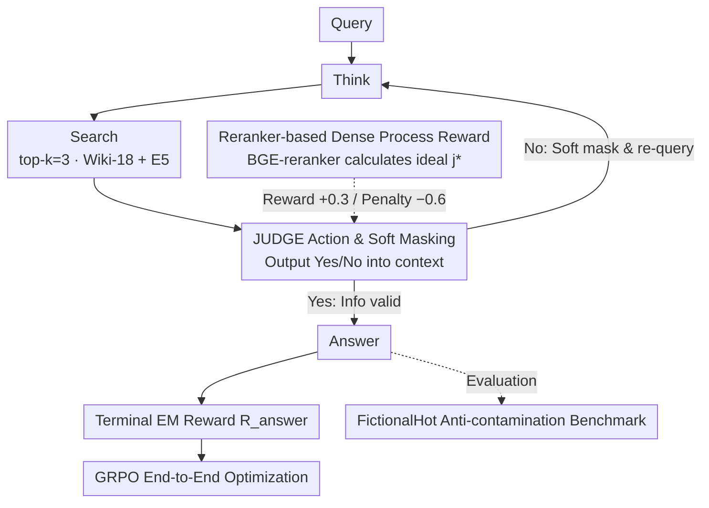

# ReSeek: A Self-Correcting Framework for Search Agents with Instructive Rewards

**Conference**: ICML 2026  
**arXiv**: [2510.00568](https://arxiv.org/abs/2510.00568)  
**Code**: https://github.com/TencentBAC/ReSeek (Available)  
**Area**: Information Retrieval / Search Agent / Reinforcement Learning  
**Keywords**: Search Agent, Self-Correction, JUDGE action, Process Reward, Data Contamination Evaluation

## TL;DR
ReSeek adds a JUDGE action to RL-trained search agents and utilizes a BGE-reranker to compute "ideal judgments" as process rewards. This enables agents to softly "mask" invalid information and re-query after retrieval. It also introduces FictionalHot, an anti-contamination benchmark based on fictional entities. ReSeek achieves an average EM of 0.377 on Qwen2.5-7B, a +3.1 improvement over ZeroSearch.

## Background & Motivation

**Background**: LLM search agents (Search-R1, ZeroSearch, DeepResearcher, WebThinker, etc.) utilize RL training to let LLMs learn multi-step "think-search-reason" cycles, significantly surpassing single-step RAG in knowledge-intensive tasks. The standard approach models the task as an MDP and optimizes policies using RL algorithms like GRPO or PPO.

**Limitations of Prior Work**: **(1) Sparse reward signals**—most methods only provide an EM reward for "answer correctness" at the final step (Search-R1, ZeroSearch), with no feedback for intermediate steps, causing credit assignment difficulties; **(2) Lack of self-correction mechanisms**—if early search queries are poor, the agent tends to follow a dead end and generate incorrect answers; **(3) Evaluation contamination**—mainstream benchmarks (NQ, TriviaQA, HotpotQA) appear extensively in LLM pre-training corpora, meaning high scores may reflect memory rather than reasoning.

**Key Challenge**: RL agents require dense, instructive intermediate feedback to learn how to evaluate if a clue is useful or if a query change is needed. Traditionally, this requires expensive manual annotation or a specialized Process Reward Model (PRM). Providing reliable process rewards without additional training costs remains an open problem.

**Goal**: Enable search agents to "self-evaluate" retrieved information mid-episode, allowing them to re-plan if info is useless rather than forcing an answer. Simultaneously, provide a clean, uncontaminated evaluation environment.

**Key Insight**: Humans naturally "pause after reading each search result, judge its utility, and decide whether to change keywords." This judgment action can be computed using a reranker model (bge-reranker-large) to calculate the "semantic similarity between observations and ground truth" as an objective reference. The agent is rewarded for correct judgments and penalized for incorrect ones. Since the reranker is pre-trained, no additional training is required.

**Core Idea**: Explicitly model "self-judgment" as an agent action (`<judge>Yes/No</judge>`) and use the reranker to calculate "ideal judgments" as process rewards to supervise this capability. Construct a completely fictional FictionalHot dataset to force agents to rely on retrieval rather than memory.

## Method

### Overall Architecture
The agent uses a GRPO-optimized LLM policy $\pi_\theta$. The action space includes a `<judge>` action in addition to standard `<search>` and `<answer>` actions. In each round: the agent thinks → decides whether to search → executes a mandatory judge after searching → decides the next step (re-search or answer) based on the judge result. Rewards consist of: (1) Terminal EM reward $R_{\text{answer}}$, and (2) Process reward $R_{\text{judge}}$ based on the BGE-reranker's "ideal judgment." This pipeline is trained on 169k NQ + HotpotQA samples, deployed on Qwen2.5-3B/7B-Instruct, using Wiki-18 + E5 embeddings for retrieval.

### Key Designs

1.  **JUDGE Action and Soft Masking Mechanism**:
    *   **Function**: Provides the agent with meta-cognitive abilities to evaluate newly retrieved results, transforming the reasoning chain from static linearity into a dynamic self-correcting loop.
    *   **Mechanism**: After each `<search>`, the agent must output `<judge>Yes</judge>` or `<judge>No</judge>`, which is appended to the context: $\mathcal{C}_t = \tau_{t-1} \oplus a_t \oplus o_t \oplus j_t$. "No" does not physically delete the observation but acts as a "soft mask"—marking the information as irrelevant. The policy notes this rejection and tends to re-query. The observation remains in the context to prevent repeating failed paths. Strict if-then rules are enforced via prompt: "If judge=No, you must search again."
    *   **Design Motivation**: Physical deletion can lead to repeated errors. Soft masking prevents error propagation while retaining meta-information about failed attempts. Making judgment an internal action allows the policy to learn when to re-evaluate end-to-end.

2.  **Reranker-based Dense Process Rewards**:
    *   **Function**: Converts sparse EM signals into dense feedback for every step, specifically rewarding the agent's judgment of observation utility.
    *   **Mechanism**: Define "ideal judgment" $j^*_t$: if BGE-reranker similarity between observation $o_t$ and ground truth $gt > 0.7$, then $j^*_t = \text{Yes}$, else No. Process reward $R_{\text{judge}}$ is given based on consistency with $j^*_t$: **+0.3** for correct judgment (Yes=Yes or No=No). An asymmetric penalty is applied for errors: **-0.6** for "Incorrectly accepting useless info" and **-0.3** for "Incorrectly discarding useful info." Final target $R(\tau) = \sum_t \gamma^{t-1} r_t$, optimized via GRPO.
    *   **Design Motivation**: Rerankers are lightweight, stable, and avoid new biases compared to LLM-as-a-judge. Asymmetric penalties reflect that accepting useless info derails the entire trajectory (high cost), while discarding useful info only wastes a query (low cost).

3.  **FictionalHot Anti-contamination Benchmark**:
    *   **Function**: Strips away "pseudo-high scores" from LLM memory to test true reasoning and retrieval capabilities.
    *   **Mechanism**: Randomly samples 10% (5,116) from 6 mainstream QA datasets as seeds. Uses GPT-5 to rewrite real entities (e.g., Taylor Swift) into fictional ones (e.g., Lila Starling) while preserving reasoning structure. Wikipedia-style documents are generated for these fictional entities with new facts as ground truths. These are inserted into the 2018 Wikipedia corpus. Memory-based methods drop significantly on this benchmark.
    *   **Design Motivation**: Fragmentation in prior evaluation settings hides true capability differences. FictionalHot provides a standardized, reproducible, and anti-contamination testbed for the search agent community.

### Loss & Training
*   **RL Algorithm**: GRPO is the default, using the same unified NQ+HotpotQA training set as Search-R1 (169,615 pairs).
*   **Hyperparameters**: Retrieval top-k=3, max 4 turns, 16×H20 GPUs, E5 embedding + Wiki-18.
*   **Reward Parameters**: Reranker threshold 0.7, $R_{\text{match}} = +0.3$, $R_{\text{mismatch}}^{\text{accept-wrong}} = -0.6$, $R_{\text{mismatch}}^{\text{reject-right}} = -0.3$.
*   **Structured Prompt**: Enforces the workflow: `<think>` → `<search>` → `<judge>` → Conditional Branch → `<answer>`.

## Key Experimental Results

### Main Results

| Method (Qwen2.5-7B-Instruct) | NQ | TriviaQA | PopQA | HotpotQA | 2Wiki | Musique | Bamboogle | FictionalHot | Avg |
|---|---|---|---|---|---|---|---|---|---|
| Direct Inference | 0.134 | 0.408 | 0.140 | 0.183 | 0.250 | 0.031 | 0.120 | 0.001 | 0.158 |
| CoT | 0.048 | 0.185 | 0.054 | 0.092 | 0.111 | 0.022 | 0.232 | 0.001 | 0.093 |
| RAG | 0.349 | 0.585 | 0.392 | 0.299 | 0.235 | 0.058 | 0.208 | 0.012 | 0.267 |
| Search-o1 | 0.151 | 0.443 | 0.131 | 0.187 | 0.176 | 0.058 | 0.296 | 0.020 | 0.183 |
| Search-R1 | 0.393 | 0.610 | 0.397 | 0.370 | 0.414 | 0.146 | 0.368 | 0.034 | 0.342 |
| ZeroSearch | 0.436 | 0.652 | 0.488 | 0.346 | 0.352 | 0.184 | 0.278 | 0.031 | 0.346 |
| **ReSeek** | **0.469** | 0.640 | **0.501** | **0.389** | 0.382 | **0.185** | **0.392** | **0.061** | **0.377** |

### Ablation Study

| Component (Qwen2.5-7B) | Avg EM | Gain | Note |
|---|---|---|---|
| $R_{\text{answer}}$ only (=Search-R1) | 0.288 | baseline | Terminal EM reward only |
| + judge Action (rule only) | 0.297 | +3.1% | Judge action + mandatory prompt only |
| + $R_{\text{judge}}$ (full ReSeek) | **0.312** | **+8.3%** | Adding reranker process rewards |
| Reranker Type: None | 0.259 | - | No reranker |
| Regex-based | 0.301 | - | Keyword match heuristic |
| Qwen-Reranker | 0.311 | - | Swapped with Qwen reranker |
| BGE-Reranker (ReSeek) | **0.312** | - | Default selection |

### Key Findings
-   **Gains are higher for multi-hop tasks**: ReSeek shows significant improvements (+5-12%) on HotpotQA, Bamboogle, and Musique. On single-hop tasks (TriviaQA), it occasionally lags behind ZeroSearch, confirming self-correction's primary value in long reasoning chains.
-   **FictionalHot reveals the memory gap**: Direct Inference drops to nearly 0; ReSeek leads but only reaches 0.061. This validates that FictionalHot measures reasoning rather than memory.
-   **Turn Budget Analysis**: Other baselines saturate after 2 turns. ReSeek continues to improve up to 4 turns, indicating extra budget is effectively used for re-querying.
-   **Asymmetric Penalty Is Effective**: Empirical results show "Incorrect Acceptance (-0.6) > Incorrect Rejection (-0.3)" performs better—learning to prefer more searches over blind answering.
-   **Reranker vs RL Decoupling**: Pure Reranker intervention provides +1.2, but adding RL training provides an additional +2.3. This shows RL teaches the agent how to **properly use** its judgment within context.

## Highlights & Insights
-   **Pre-trained Reranker as PRM**: Instead of training a separate PRM, using bge-reranker-large as an "ideal judgment" reference is plug-and-play and avoids new biases.
-   **JUDGE as an Internal Action**: Unlike ReAct's free-form thought, ReSeek treats judgment as a typed action within the policy. This "explicit meta-cognitive action" is a reusable paradigm for agentic LLMs.
-   **Asymmetric Reward Design**: Penalizing incorrect acceptance more heavily matches the real-world cost asymmetry of reasoning tasks.
-   **FictionalHot Methodology**: The "LLM rewriting + synthetic Wiki" pipeline is a constructive contribution toward addressing data contamination.
-   **"Soft Masking" over "Hard Deletion"**: Maintaining rejected observations as memory of "explored failed paths" prevents agents from repeatedly attempting the same incorrect queries.

## Limitations & Future Work
-   Dependencies on Ground Truth during training; however, the agent learns to judge during inference without needing the reranker or GT.
-   Validation is limited to QA benchmarks; generalization to open-ended tasks like report writing remains untested.
-   The quality of FictionalHot depends on GPT-5; future iterations may need human sanity checks to ensure no new biases are introduced in the rewriting process.
-   The training data is restricted to NQ + HotpotQA; transferability to highly disparate domains requires further investigation.

## Related Work & Insights
-   **vs Search-R1 (Jin 2025)**: Search-R1 uses sparse EM rewards. ReSeek adds judge actions and process rewards, leading to a +3.5 EM gain over the baseline.
-   **vs ReAct (Yao 2022)**: ReAct uses free-form thoughts; ReSeek uses typed actions with RL supervision, making it more structured and trainable.
-   **vs AgentPRM (Xi 2026)**: AgentPRM trains a separate PRM. ReSeek uses a pre-trained reranker to eliminate training costs, and embeds judgment as an internal action.
-   **vs Reflexion**: While Reflexion corrects after a full trajectory, ReSeek provides mid-episode correction via re-querying.

## Rating
-   Novelty: ⭐⭐⭐⭐
-   Experimental Thoroughness: ⭐⭐⭐⭐⭐
-   Writing Quality: ⭐⭐⭐⭐
-   Value: ⭐⭐⭐⭐⭐

<!-- RELATED:START -->

## Related Papers

- [\[ACL 2026\] Multi-Faceted Self-Consistent Preference Alignment for Query Rewriting in Conversational Search](../../ACL2026/information_retrieval/multi-faceted_self-consistent_preference_alignment_for_query_rewriting_in_conver.md)
- [\[ACL 2026\] Enhancing LLM-based Search Agents via Contribution Weighted Group Relative Policy Optimization](../../ACL2026/information_retrieval/enhancing_llm-based_search_agents_via_contribution_weighted_group_relative_polic.md)
- [\[ACL 2025\] SGIC: A Self-Guided Iterative Calibration Framework for RAG](../../ACL2025/information_retrieval/sgic_a_self-guided_iterative_calibration_framework_for_rag.md)
- [\[CVPR 2025\] GENIUS: A Generative Framework for Universal Multimodal Search](../../CVPR2025/information_retrieval/genius_a_generative_framework_for_universal_multimodal_search.md)
- [\[ACL 2026\] Rerank Before You Reason: Analyzing Reranking Tradeoffs through Effective Token Cost in Deep Search Agents](../../ACL2026/information_retrieval/rerank_before_you_reason_analyzing_reranking_tradeoffs_through_effective_token_c.md)

<!-- RELATED:END -->
