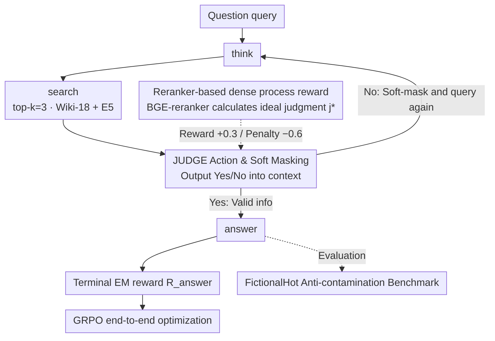

# ReSeek: A Self-Correcting Framework for Search Agents with Instructive Rewards

**Conference**: ICML 2026  
**arXiv**: [2510.00568](https://arxiv.org/abs/2510.00568)  
**Code**: https://github.com/TencentBAC/ReSeek (Available)  
**Area**: Information Retrieval / Search Agent / Reinforcement Learning  
**Keywords**: Search Agent, Self-correction, JUDGE action, Process rewards, Data contamination evaluation

## TL;DR
ReSeek adds a JUDGE action to RL-trained search agents and utilizes BGE-reranker to calculate "ideal judgments" as process rewards. This enables agents to "soft-mask" invalid information and re-query after each retrieval. It also proposes FictionalHot, an anti-contamination benchmark based on fictional entities, achieving an average EM of 0.377 on Qwen2.5-7B, outperforming ZeroSearch by +3.1.

## Background & Motivation

**Background**: LLM search agents (Search-R1, ZeroSearch, DeepResearcher, WebThinker, etc.) use RL training to allow LLMs to learn multi-step "think-search-reasoning" loops, significantly surpassing single-step RAG in knowledge-intensive tasks. The mainstream approach models the task as an MDP and uses RL algorithms like GRPO/PPO to optimize the policy.

**Limitations of Prior Work**: **(1) Sparse reward signals**—most methods only provide an EM reward for "answer correctness" at the final step (Search-R1, ZeroSearch), with no feedback for intermediate steps, leading to credit assignment difficulties; **(2) Lack of self-correction mechanism**—if an early search query is poor (e.g., "creator of Saddle Rash" only returns a show description but no birthdate), the agent persists on this dead-end path and generates an incorrect answer; **(3) Evaluation contamination**—mainstream benchmarks (NQ, TriviaQA, HotpotQA) appear extensively in LLM pre-training corpora, meaning high scores may reflect memory rather than true reasoning.

**Key Challenge**: RL agents require dense, instructive intermediate feedback to learn "how to evaluate if this clue is useful and whether to change the query." Traditionally, this feedback requires expensive manual annotation or specially trained Process Reward Models (PRMs). Providing reliable process rewards without additional training costs remains an open problem.

**Goal**: Enable search agents to "self-assess" retrieved information mid-episode, allowing them to re-plan if the information is useless rather than forcing an answer. Simultaneously, provide a clean, uncontaminated evaluation platform.

**Key Insight**: Humans naturally "pause after reading each search result, judge its utility, and decide whether to change keywords" during web research. This judgment can be simulated using a reranker model (bge-reranker-large) to calculate the "semantic similarity between the observation and the ground truth" as an objective reference—rewarding the agent for correct judgments and punishing it for incorrect ones. Since the reranker is pre-trained, no additional training is required.

**Core Idea**: Explicitly define "self-judgment" as an agent action (<judge>Yes/No</judge>), using a reranker to compute the "ideal judgment" as a process reward for dense supervision. Furthermore, construct a fully synthetic FictionalHot dataset to force agents to rely on retrieval instead of memory.

## Method

### Overall Architecture
The agent uses an LLM policy $\pi_\theta$ optimized by GRPO, with the action space including a `<judge>` action alongside standard `<search>` and `<answer>` actions. In each round: the agent thinks → decides whether to search → executes a mandatory judge after search → decides the next step based on the judge result (re-search or answer). The reward consists of two parts: (1) Terminal EM reward $R_{\text{answer}}$, and (2) Process reward $R_{\text{judge}}$ based on the "ideal judgment" calculated by BGE-reranker. The pipeline is trained on 169k NQ + HotpotQA samples, deployed on Qwen2.5-3B/7B-Instruct, with Wiki-18 + E5 embeddings as retrieval corpora.

### Key Designs

1.  **JUDGE Action & Soft Masking Mechanisms**:
    *   **Function**: Provides the agent with metacognitive capabilities to "evaluate whether the retrieved results are useful," transforming the reasoning chain from static linearity into a dynamic self-correcting loop.
    *   **Mechanism**: After each `<search>`, the agent is forced to output `<judge>Yes</judge>` or `<judge>No</judge>`. This label $j_t$ is directly appended to the context: $\mathcal{C}_t = \tau_{t-1} \oplus a_t \oplus o_t \oplus j_t$. The next action is sampled based on this labeled context. "No" does not physically delete the observation but acts as a "soft mask"—tagging the irrelevant info so the policy "notices the rejection" and tends to change the query. The observation remains in the context to provide reflection on "what has already been tried." Prompting uses strict if-then rules (Table 1): "If judge=No, you must search again and cannot answer directly." This creates structured trajectories even on un-tuned LLMs, providing a clean start for RL.
    *   **Design Motivation**: Physical deletion can lead to repeating the same error. Soft masking prevents error propagation while preserving metadata of failed paths. Embedding judge as an internal action allows the policy to learn "when to re-evaluate" end-to-end.

2.  **Reranker-based Dense Process Rewards**:
    *   **Function**: Converts sparse EM signals into dense feedback for every step, specifically rewarding the agent for correctly judging the utility of an observation.
    *   **Mechanism**: Define the "ideal judgment" $j^*_t$: if BGE-reranker calculates a semantic similarity between observation $o_t$ and ground truth gt $> 0.7$, then $j^*_t = \text{Yes}$, otherwise No (the 0.7 threshold was validated via grid search). When the agent executes a judge action, $R_{\text{judge}}$ is given based on consistency with $j^*_t$: **Reward** of +0.3 for consistency (both True Positive and True Negative); **Asymmetric Penalty** for errors—penalty of -0.6 for "wrongly accepting useless info" (double weight) and -0.3 for "wrongly discarding useful info." The full training objective is $R(\tau) = \sum_t \gamma^{t-1} r_t$, where $r_{t<T} = R_{\text{judge}}$ and $r_{T} = R_{\text{answer}} = \text{EM}(A_p, A_g)$, optimized via GRPO.
    *   **Design Motivation**: Why reranker instead of LLM-as-judge? Rerankers are lightweight, stable, and avoid introducing new biases. Why asymmetric penalty? Accepting useless info derails the entire trajectory (high cost), while discarding useful info merely wastes one query (lower cost).

3.  **FictionalHot Anti-contamination Benchmark**:
    *   **Function**: Removes "pseudo-high scores" caused by LLM memory to test true retrieval and reasoning.
    *   **Mechanism**: Randomly samples 10% (5,116) as seeds from 6 mainstream QA datasets (NQ, TriviaQA, etc.) and uses GPT-5 for rewriting—replacing real entities (e.g., Taylor Swift) with fictional ones (Lila Starling) while maintaining reasoning structure. GPT-5 also generates Wiki-style supporting documents with new fictional facts (e.g., album released in 2007) as new ground truths. These are inserted into a 2018 Wikipedia corpus to form a closed-world test bed. Memory-based methods collapse on FictionalHot (Direct Inference near 0.001).
    *   **Design Motivation**: Table 2 compares 7 prior works and finds inconsistent corpora, test sets, and metrics. FictionalHot provides a standardized, reproducible, and anti-contamination benchmark for the community.

### Loss & Training
*   **RL Algorithm**: GRPO used as default, with the same unified NQ+HotpotQA training set as Search-R1 (169,615 pairs).
*   **Hyperparameters**: retrieval top-k=3, max 4 turns, 16×H20 GPU, E5 embedding + Wiki-18.
*   **Reward Parameters**: Reranker threshold 0.7, $R_{\text{match}} = +0.3$, $R_{\text{mismatch}}^{\text{accept-wrong}} = -0.6$, $R_{\text{mismatch}}^{\text{reject-right}} = -0.3$.
*   **Structured Prompt**: Enforces the flow of `<think>` → `<search>` → `<judge>` → conditional branch → `<answer>` to ensure trajectory parseability.

## Key Experimental Results

### Main Results

| Method (Qwen2.5-7B-Instruct) | NQ | TriviaQA | PopQA | HotpotQA | 2Wiki | Musique | Bamboogle | FictionalHot | Avg |
|---|---|---|---|---|---|---|---|---|---|
| Direct Inference | 0.134 | 0.408 | 0.140 | 0.183 | 0.250 | 0.031 | 0.120 | 0.001 | 0.158 |
| CoT | 0.048 | 0.185 | 0.054 | 0.092 | 0.111 | 0.022 | 0.232 | 0.001 | 0.093 |
| RAG | 0.349 | 0.585 | 0.392 | 0.299 | 0.235 | 0.058 | 0.208 | 0.012 | 0.267 |
| Search-o1 | 0.151 | 0.443 | 0.131 | 0.187 | 0.176 | 0.058 | 0.296 | 0.020 | 0.183 |
| Search-R1 | 0.393 | 0.610 | 0.397 | 0.370 | 0.414 | 0.146 | 0.368 | 0.034 | 0.342 |
| ZeroSearch | 0.436 | 0.652 | 0.488 | 0.346 | 0.352 | 0.184 | 0.278 | 0.031 | 0.346 |
| **Ours (ReSeek)** | **0.469** | 0.640 | **0.501** | **0.389** | 0.382 | **0.185** | **0.392** | **0.061** | **0.377** |

### Ablation Study

| Component (Qwen2.5-7B) | Avg EM | Gain | Description |
|---|---|---|---|
| $R_{\text{answer}}$ only (=Search-R1) | 0.288 | baseline | Only terminal EM reward |
| + judge Action (rule only) | 0.297 | +3.1% | Only judge action + forced prompt |
| + $R_{\text{judge}}$ (full ReSeek) | **0.312** | **+8.3%** | Includes reranker process reward |
| Reranker Type: None | 0.259 | - | No reranker at all |
| Regex-based | 0.301 | - | Keyword matching heuristic |
| Qwen-Reranker | 0.311 | - | Replaced with Qwen reranker |
| BGE-Reranker (Ours) | **0.312** | - | Default choice |

| Reranker-only vs RL-trained (Qwen2.5-7B) | Avg EM |
|---|---|
| Search-R1 baseline | 0.342 |
| + Reranker-only intervention (no RL) | 0.354 (+1.2) |
| + Prompt-only judge (no RL) | 0.349 (+0.7) |
| **Ours (GRPO full)** | **0.377 (+3.5)** |

### Key Findings
*   **Greater gains on multi-hop tasks**: ReSeek shows significant improvements (+5-12%) on tasks like HotpotQA, Bamboogle, and Musique requiring 2-3 hops, while occasionally lagging behind ZeroSearch on single-hop tasks (TriviaQA), confirming that self-correction's value lies in long reasoning chains.
*   **FictionalHot reveals true performance**: Direct Inference drops to near 0, and the best method (ReSeek) reaches only 0.061; while 7B vs 3B shows a large gap on TriviaQA (0.408 vs 0.288), they are nearly identical on FictionalHot (0.061 vs 0.059), proving it measures reasoning over memory.
*   **Turn budget analysis**: Baselines saturate around 3-4 turns; ReSeek improves monotonically up to 4 turns, indicating extra budget is utilized for effective re-querying rather than being wasted.
*   **Asymmetric penalty is critical**: Empirical results show "wrongly accepting (-0.6) > wrongly discarding (-0.3)" yields better results—the agent learns to "prefer more search over blind guessing."
*   **Decoupled verification**: Reranker-only intervention provides +1.2, but adding RL training provides an additional +2.3. This shows RL does not just amplify the reranker signal but teaches the agent to **use judgments appropriately** within the context.

## Highlights & Insights
*   **Pre-trained Reranker as PRM**: Replacing a specifically trained PRM with an off-the-shelf bge-reranker-large as an "ideal judgment" reference is cost-effective and stable. This approach generalizes to any RL task where intermediate steps can be assessed by a pre-trained discriminator.
*   **JUDGE as Internal Action**: Unlike ReAct's "Thought → Action → Observation" loop, ReSeek integrates judgment into the policy. The agent learns when to pause and evaluate end-to-end, a reusable paradigm for agentic LLM design.
*   **Asymmetric Reward Design**: Applying different weights to "accept-wrong" vs "reject-right" errors acknowledges the real-world cost asymmetry of search tasks.
*   **FictionalHot Methodology**: The "LLM rewriting + synthetic Wiki entry" pipeline is a constructive contribution to addressing data contamination that can be replicated in other sub-domains.
*   **"Soft Masking" vs "Hard Deletion"**: Keeping judge=No observations in the context as records of "explored failures" avoids the agent repeating the same mistakes.

## Limitations & Future Work
*   Training utilizes ground truth for "ideal judgment," but agents lack ground truth during deployment. While agents learn to judge, the robustness of the 0.7 threshold across domains remains undiscussed.
*   Evaluation is restricted to QA benchmarks; the generalization of judgment capabilities to open-ended tasks (e.g., report writing) is not tested.
*   FictionalHot's quality depends on GPT-5's performance; long-term manual sanity checks may be needed.
*   Training is limited to NQ + HotpotQA; domain transferability across diverse corpora is unexplored.
*   Minor differences between BGE and Qwen rerankers suggest the reranker itself is not the bottleneck; the learning of the judgment action is the core factor.

## Related Work & Insights
*   **vs Search-R1 (Jin 2025)**: Search-R1 uses sparse EM rewards with GRPO, making it prone to early errors. ReSeek adds judge actions and process rewards, yielding a +3.5 EM improvement under the same baseline.
*   **vs ReAct (Yao 2022)**: ReAct uses free-form thoughts; ReSeek uses typed actions with RL-supervised judgment for better trainability.
*   **vs AgentPRM (Xi 2026)**: AgentPRM trains a separate PRM; ReSeek uses a reranker to eliminate training costs and embeds judgment as an internal action.
*   **vs Reflexion**: These methods reflect post-hoc; ReSeek corrects mid-trajectory (intra-episode), enabling faster response.

## Rating
*   Novelty: ⭐⭐⭐⭐
*   Experimental Thoroughness: ⭐⭐⭐⭐⭐
*   Writing Quality: ⭐⭐⭐⭐
*   Value: ⭐⭐⭐⭐⭐

<!-- RELATED:START -->

## Related Papers

- [\[ACL 2026\] Multi-Faceted Self-Consistent Preference Alignment for Query Rewriting in Conversational Search](../../ACL2026/information_retrieval/multi-faceted_self-consistent_preference_alignment_for_query_rewriting_in_conver.md)
- [\[ACL 2025\] SGIC: A Self-Guided Iterative Calibration Framework for RAG](../../ACL2025/information_retrieval/sgic_a_self-guided_iterative_calibration_framework_for_rag.md)
- [\[ACL 2026\] Enhancing LLM-based Search Agents via Contribution Weighted Group Relative Policy Optimization](../../ACL2026/information_retrieval/enhancing_llm-based_search_agents_via_contribution_weighted_group_relative_polic.md)
- [\[ICML 2026\] Self-Augmenting Retrieval for Diffusion Language Models](self-augmenting_retrieval_for_diffusion_language_models.md)
- [\[ICLR 2026\] HiPRAG: Hierarchical Process Rewards for Efficient Agentic Retrieval Augmented Generation](../../ICLR2026/information_retrieval/hiprag_hierarchical_process_rewards_for_efficient_agentic_retrieval_augmented_ge.md)

<!-- RELATED:END -->
