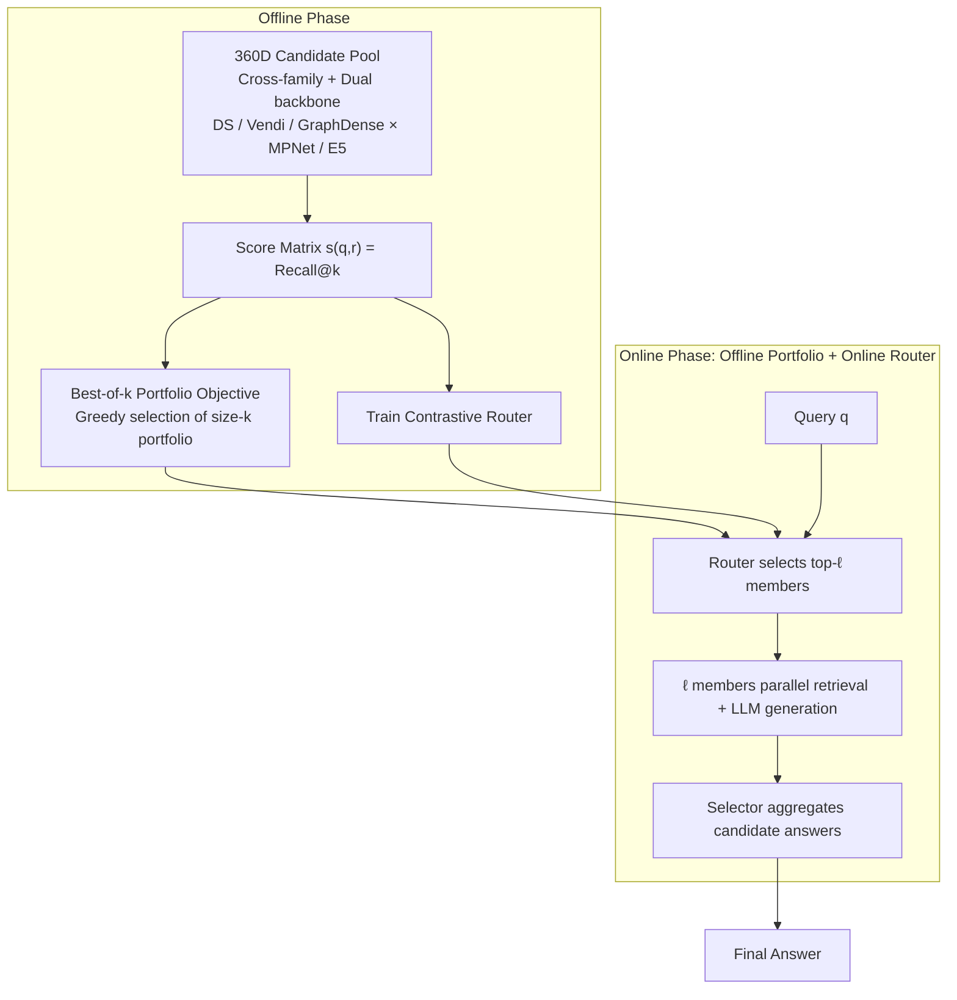

# Retriever Portfolios: A Principled Approach to Adaptive RAG

**Conference**: ICML 2026  
**arXiv**: [2605.31176](https://arxiv.org/abs/2605.31176)  
**Code**: None  
**Area**: Information Retrieval / Adaptive RAG  
**Keywords**: Retrieval-Augmented Generation, Retriever Ensemble, Submodular Optimization, Query Routing, best-of-k

## TL;DR
This paper reformulates the "which retriever to choose" problem in RAG as a best-of-$k$ combinatorial optimization problem. By greedily selecting a complementary size-$k$ portfolio from 360 candidates offline and training a lightweight contrastive router to dispatch queries to the top-$\ell$ members online, this approach outperforms both single-retriever baselines and inference-time tuning methods (like Vendi-RAG) across four QA benchmarks, while significantly reducing token and latency costs.

## Background & Motivation

**Background**: Mainstream RAG systems typically adopt a "single retriever + fixed hyperparameters" paradigm, following a one-size-fits-all approach from early DPR and FiD to Self-RAG (Lewis 2020; Karpukhin 2020; Shuster 2021).

**Limitations of Prior Work**: The distribution of QA queries is highly heterogeneous—some are single-hop factoids (lexical match suffices), others are multi-hop reasoning tasks (requiring diverse multi-document aggregation), and some involve domain-specific terminology. Substantial evidence suggests that no fixed retriever is optimal for all queries (Karpukhin 2020; Jeong 2024; Kalra 2025a). Even for the same parameterized retriever, the optimal hyperparameters drift per query (Rezaei & Dieng 2025).

**Key Challenge**: Existing adaptive solutions either follow a "few preset strategies + classifier" route (Adaptive-RAG selects between "no retrieval / single-step / multi-step") or a "per-query online hyperparameter search" route (Vendi-RAG iteratively executes retrieve-generate-judge to tune the diversity parameter $s$). The former lacks expressiveness, while the latter suffers from explosive inference costs and serial execution.

**Goal**: To select a small, complementary subset from a **large** pool of retriever candidates that covers different regions of the query distribution in expectation, without performing per-query online searches.

**Key Insight**: Treat each retriever as a "candidate algorithm" in an algorithm selection problem and each query as a "problem instance." Thus, the RAG retriever selection problem becomes a data-driven solution portfolio problem (Drygala 2025) or a catalogue problem (Kleinberg 2004). Within this framework, the objective function $F(S)=\mathbb{E}_{q}[\max_{r\in S} s(q,r)]$ is naturally non-negative, monotonic, and submodular, allowing a classical greedy algorithm to achieve a $(1-1/e)$ approximation.

**Core Idea**: Replace the average performance objective with a best-of-$k$ portfolio objective, select the portfolio via offline greedy selection, and use an online contrastive router to amortize the "adaptation" cost into the offline phase.

## Method

### Overall Architecture

The pipeline consists of two stages:

**Offline Phase**: All candidate retrievers are evaluated on a training query set to obtain a score matrix $s(q,r)\in[0,1]$ (using Recall@$k$ as $s$ in the paper). Algorithm 1 then greedily selects $k$ retrievers to form portfolio $S$. Simultaneously, a contrastive router is trained using retrieval supervision.

**Online Phase**: For a given query $\mathbf{q}$, the router encodes it and computes similarity with $k$ "retriever embeddings," selecting the top-$\ell$ portfolio members to perform retrieval and LLM generation **in parallel**. Finally, a selector aggregates candidate answers. Crucially, $\ell \le k$ are small **fixed** constants, ensuring predictable latency and parallelizable calls.

### Key Designs

**1. Best-of-$k$ Portfolio Objective: Reframing retriever selection as a provable combinatorial optimization problem**

Previous methods like Adaptive-RAG or Vendi-RAG relied on heuristics without formalizing the coverage of heterogeneous query distributions. This work defines the score for a portfolio $S\subseteq\mathcal{R}$ as $\mathrm{score}(q,S)=\max_{r\in S} s(q,r)$, with the overall objective $F(S)=\mathbb{E}_{q\sim\mathcal{D}}[\max_{r\in S} s(q,r)]$. The $\max$ operator naturally rewards members that cover different query subgroups—redundant retrievers with similar behavior contribute little to the maximum, forcing the portfolio to be complementary. Algorithm 1 runs greedy selection on $N$ sampled queries: in each step, it adds the retriever $r$ that maximizes the marginal gain $\frac{1}{N}\sum_{q\in Q}\max(0,s(q,r)-V[q])$, where $V[q]$ tracks the current best score for query $q$. Each step costs $\mathcal{O}(|\mathcal{R}|N)$. Since $F$ is non-negative, monotonic, and submodular, the greedy approach provides a $(1-1/e)$ approximation. Theorem 3.1 further specifies the sample complexity: with $N=\mathcal{O}((k\log|\mathcal{R}|+\log(1/\delta))/\epsilon^2)$ queries, $F(S)\ge (1-1/e)\mathrm{OPT}-\epsilon$ holds with probability $1-\delta$. The logarithmic dependence on $|\mathcal{R}|$ allows the system to scale to hundreds of candidates.

**2. 360D Heterogeneous Candidate Pool: Providing diverse targets for the $\max$ operator**

The benefit of the portfolio approach depends on the complementarity of candidates. A pool containing only variations of the same algorithm would offer no gain over a single retriever. Thus, the pool is constructed from three families across two embedding backbones (MPNet and E5). **DiscountedSimilarity (DS)** greedily selects $n=4$ chunks from FAISS top-1000 candidates with $(\gamma, r)$ controlling similarity penalties (141 configurations per backbone). **Vendi** balances relevance and intra-set diversity using parameter $s\in[0,1]$, yielding 21 configurations. **GraphDense** performs BFS expansion on an "entity-chunk bipartite graph" followed by reranking, yielding 36 configurations. The total pool size $|\mathcal{R}|=360$. Score tables are precomputed by caching candidate sets for both backbones, making the $360\times|Q|$ evaluation feasible offline. Empirical results show that a size-5 portfolio often includes diverse members like GraphDense/E5, varied Vendi/E5 configs, and GraphDense/MPNet (Table 2).

**3. Offline Portfolio + Online Contrastive Router: Amortizing adaptive costs**

To avoid the serial online search of Vendi-RAG ("retrieve → generate → LLM judge → tune $s$ → re-retrieve"), this work compresses retriever selection into a single lightweight forward pass. The router takes the query text and cached MPNet/E5 embeddings, processes them through a frozen Flan-T5-Large encoder, and fuses them with backbone-specific embeddings to output similarity scores for portfolio members. The training follows a multi-positive contrastive loss (Chen et al. 2024), treating retrievers that achieve the highest Recall@$k$ for a given query as positives. At inference, top-$\ell$ members ($\ell \in \{2,3\}$) are selected for parallel execution. Costs scale linearly with $\ell$ and are independent of $k$, allowing configurations like $(k=4, \ell=2)$ to maintain high accuracy with predictable service costs (Figure 4).

### Loss & Training

- **Offline Portfolio**: Evaluation uses Recall@$k$ (calculated using ground-truth supporting documents). Algorithm 1 is run on a union training set of queries from four benchmarks, typically with $k=4$ or $5$.
- **Router**: Multi-positive contrastive loss. Positives are retrievers with the maximum Recall@$k$ for the query.
- **Answer Model**: Gemma-3-27B-It and Llama-3.1-70B-Instruct. Fixed prompt templates are used to ensure fair comparison.

## Key Experimental Results

### Main Results

End-to-end Exact Match (EM) across four benchmarks (extracted from Table 3, best in bold):

| Method | HotpotQA (Gemma) | MusiQue (Gemma) | 2Wiki (Gemma) | HotpotQA (Llama) | MusiQue (Llama) | 2Wiki (Llama) |
| :--- | :---: | :---: | :---: | :---: | :---: | :---: |
| No retrieval | 0.326 | 0.061 | 0.226 | 0.348 | 0.059 | 0.192 |
| NN retrieval (MPNet) | 0.395 | 0.129 | 0.241 | 0.476 | 0.139 | 0.292 |
| Best DS retriever | 0.513 | 0.139 | 0.354 | 0.435 | 0.109 | 0.244 |
| Best Vendi retriever | 0.511 | 0.143 | 0.356 | 0.433 | 0.112 | 0.245 |
| Vendi-RAG ($T=20$) | 0.285 | 0.131 | 0.256 | 0.483 | 0.206 | 0.290 |
| **All-pool portfolio** $(k{=}4,\ell{=}2)$ | 0.552 | 0.173 | 0.405 | **0.590** | 0.182 | 0.414 |
| **All-pool portfolio** $(k{=}4,\ell{=}3)$ | **0.558** | **0.195** | **0.414** | 0.583 | **0.209** | **0.419** |

For retrieval-only metrics (Figure 3), a size-5 learned portfolio achieves 0.594 Support Recall / 0.500 F1, while the "top-5 by average score" baseline only reaches 0.492 / 0.432.

### Ablation Study

| Configuration | Key Metric | Observation |
| :--- | :--- | :--- |
| Top-$k$ by avg score | Recall 0.492 @ $k=5$ | Selecting by average score leads to redundancy (GraphDense/E5 dominates); lacks complementarity. |
| Single retriever × 4$k$ docs | F1 drops 0.32 → 0.11 | Increasing chunk count for a single retriever hurts F1 due to noise injection. |
| Portfolio $k=2$ | Outperforms single $\times$ 20 docs | Gains come from retriever complementarity, not context length. |
| Vendi-only portfolio | Lower EM vs all-pool | Restricting to one family reduces the value of the portfolio. |
| Routing budget $\ell=2 \to 3$ | Higher EM on MusiQue/2Wiki | $\ell$ acts as a cost-accuracy knob; $\ell=2$ suffices for simpler TriviaQA. |

### Key Findings

- **Complementarity > Average Score**: The 2nd and 3rd members of the portfolio are often not the highest-scoring retrievers on average, but those that succeed where others fail.
- **More Chunks $\neq$ Complementarity**: Doubling the returned chunks for a single retriever cannot replace a portfolio; while Recall increases, F1 drops significantly, indicating that extra chunks are noise rather than signal.
- **Offline Portfolios Outperform Vendi-RAG**: In controlled comparisons within the same search space, the fixed portfolio matches or exceeds Vendi-RAG's EM with fewer tokens and lower latency.
- **Cross-dataset Generalization**: A union-trained portfolio outperforms individual best retrievers on all four datasets, suggesting that retriever complementarity learned from a diverse query set is transferable.

## Highlights & Insights

- **Framing RAG as a Solution Portfolio Problem**: Recognizing $\max_{r\in S}s(q,r)$ as a coverage function allows the application of classical results like submodularity and $(1-1/e)$ approximation.
- **Offline Amortization = Parallel Inference**: Unlike inference-time tuning (Vendi-RAG, Self-RAG), the portfolio approach uses online routing + parallel execution, avoiding serial dependencies.
- **Router Objective Design**: Using the retriever that achieves the highest Recall@$k$ as the contrastive positive effectively converts retriever selection into a standard contrastive embedding learning problem.
- **Algorithm-Agnostic Paradigm**: Any retriever (sparse, graph, generative) can be included in $\mathcal{R}$. Future extensions to BM25 or LLM-as-retriever are straightforward.

## Limitations & Future Work

- **Dependence on Ground-Truth Support**: $s(q,r)$ calculation (Recall@k) requires labeled supporting documents. Proxies for unlabeled production queries (e.g., LLM judges) remain unexplored.
- **Unweighted Cost Objective**: The objective function limits quantity $|S|\le k$ but doesn't account for varying costs between retriever types (dense vs. graph).
- **Distribution Shift Robustness**: The router was trained on academic QA datasets; its performance on significant domain shifts (e.g., medical or legal) is not yet verified.
- **Comparison with Joint LLM Training**: It remains to be seen how the portfolio advantage holds up against schemes where retriever embeddings and LLMs are fine-tuned jointly.

## Related Work & Insights

- **vs. Adaptive-RAG (Jeong 2024)**: Adaptive-RAG uses a coarse classifier for three manual strategies; this work optimizes over 360 fine-grained configurations with theoretical guarantees.
- **vs. Vendi-RAG (Rezaei & Dieng 2025)**: Vendi-RAG tunes diversity online through serial iterations; this work compresses that search space into a fixed offline portfolio for lower cost.
- **vs. MoR (Kalra 2025b)**: MoR performs score-level fusion on a given set; this work solves the selection of that set.
- **vs. RouterDC (Chen 2024)**: While RouterDC routes expert LLMs using dual contrastive learning, this work applies similar routing logic to retrievers while contributing a separate portfolio selection theory.

## Rating
- Novelty: ⭐⭐⭐⭐ Reformulates retriever selection as a provable best-of-k portfolio problem.
- Experimental Thoroughness: ⭐⭐⭐⭐ Extensive benchmarks and candidates, though lacks production-scale unlabeled query tests.
- Writing Quality: ⭐⭐⭐⭐ Clear motivation, theoretical grounding, and structure.
- Value: ⭐⭐⭐⭐ Highly practical for industrial deployment due to parallelizability and token efficiency.

<!-- RELATED:START -->

- **DPR**: Dense Passage Retrieval for Open-Domain Question Answering (Karpukhin et al., 2020)
- **Vendi-RAG**: On-the-fly Adaptation of Retrieved Content Diversity (Rezaei & Dieng, 2025)
- **Adaptive-RAG**: Learning to Adapt Retrieval-Augmented Generation (Jeong et al., 2024)

<!-- RELATED:END -->

## Related Papers

- [\[ICML 2026\] BlitzRank: Principled Zero-shot Ranking Agents with Tournament Graphs](blitzrank_principled_zero-shot_ranking_agents_with_tournament_graphs.md)
- [\[AAAI 2026\] REAP: Enhancing RAG with Recursive Evaluation and Adaptive Planning for Multi-Hop Question Answering](../../AAAI2026/information_retrieval/reap_enhancing_rag_with_recursive_evaluation_and_adaptive_planning_for_multi-hop.md)
- [\[ACL 2026\] CORAL: Adaptive Retrieval Loop for Culturally-Aligned Multilingual RAG](../../ACL2026/information_retrieval/coral_adaptive_retrieval_loop_for_culturally-aligned_multilingual_rag.md)
- [\[ICLR 2026\] Revela: Dense Retriever Learning via Language Modeling](../../ICLR2026/information_retrieval/revela_dense_retriever_learning_via_language_modeling.md)
- [\[AAAI 2026\] RRRA: Resampling and Reranking through a Retriever Adapter](../../AAAI2026/information_retrieval/rrra_resampling_and_reranking_through_a_retriever_adapter.md)

<!-- RELATED:END -->
