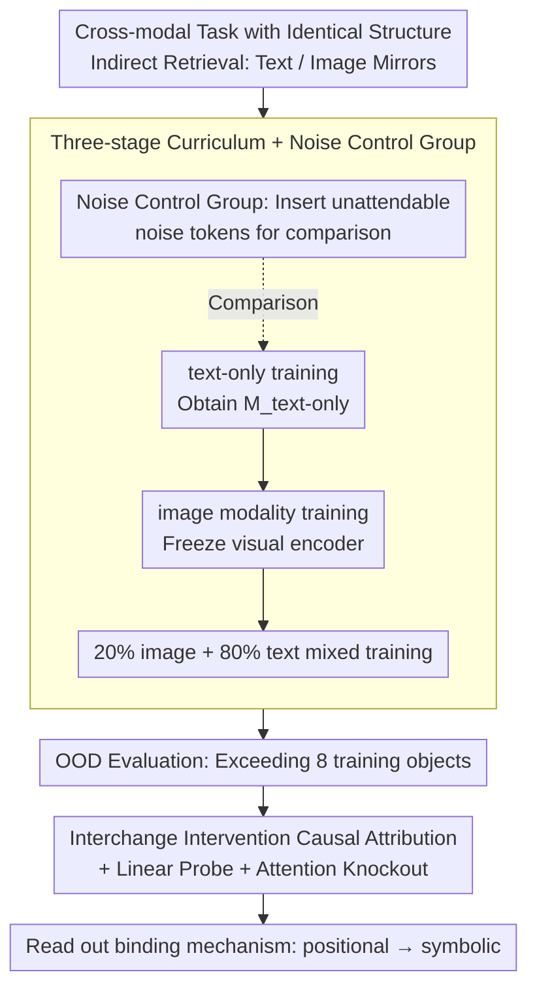

# Seeing to Generalize: How Visual Data Corrects Binding Shortcuts

**Conference**: ICML 2026  
**arXiv**: [2602.15183](https://arxiv.org/abs/2602.15183)  
**Code**: None (No public repository declared)  
**Area**: Multimodal VLM / Mechanistic Interpretability / Long-context Information Retrieval  
**Keywords**: Cross-modal training, binding mechanism, symbolic vs positional, OOD generalization, long-context retrieval

## TL;DR
This paper replicates the anomalous phenomenon where "VLMs outperform their base LLMs on pure text tasks" using a controlled synthetic retrieval task involving "color-shape-item". Mechanistic interpretability demonstrates that visual training shifts the model's variable binding strategy from "positional shortcuts" to "symbolic matching". This shift is preserved after reverting to pure text, improving OOD retrieval accuracy from 37.2% to 69.5%. Consistent increases in the "symbolic/positional ratio" are also observed in the real Qwen2/2.5/3 families.

## Background & Motivation

**Background**: VLMs are typically viewed as "adding eyes to an LLM," primarily evaluated on visual tasks like VQA and image captioning. However, researchers have reported an unexpected observation: Qwen3-VL-8B reaches 76.0% on pure text long-context retrieval, while the base Qwen3-8B achieves only 62.6%. Why does a VLM outperform an LLM on text-only tasks unrelated to images?

**Limitations of Prior Work**: Previous work either attributed this to "more training data" or dismissed it as noise. There is a lack of research capable of replicating and explaining this phenomenon mechanically in a controlled environment. To answer why VLMs are stronger, confounding factors like scale, data volume, and training steps must be isolated.

**Key Challenge**: Long-context retrieval tasks can "theoretically" be learned via text-only training. However, empirical text-only training learns fragile "position-dependent shortcuts"—perfect within in-distribution lengths but failing beyond the training context. "Text-only training" and "position-shortcut-based text-only training" are indistinguishable in-distribution.

**Goal**: (1) Replicate the VLM > LLM phenomenon in controlled small Transformers; (2) Use mechanistic interpretability to identify which internal computations are altered; (3) Verify that these changes exist in real large-scale VLMs.

**Key Insight**: The spatial position of a "red triangle" in an image is arbitrary (translation invariance), meaning positional shortcuts naturally fail in the visual modality. This forces the model toward symbolic matching (symbolic binding), which is more robust than "positional counting" when transferred back to text for long contexts.

## Method

### Overall Architecture
To answer which internal computational path visual training alters, the authors created mirrored text and image versions of the same variable binding task, making "modality" the only controlled variable. The task is Indirect Retrieval: given three sets (color, shape, item), the model reads a context (sequences of pairs or rendered images), then an association ("the triangle is item_a"), and finally asks "which item corresponds to red." The model must use color to locate the shape, then shape to locate the item—a two-hop binding. The process follows a three-stage curriculum: text-only training → image modality training → mixed text-image training, followed by reading the internal binding mechanisms under OOD settings.

### Key Designs

**1. Cross-modal task with identical structure: Modality as the sole variable**

To eliminate confounding factors like "seeing more tokens," the cleanest approach is to make both modalities structurally 1:1 mirrored with identical training objectives. The authors unified the prompt as $\mathbf{x}=[\mathbf{X}_{\text{context}}, \texttt{[CTX\_END]}, \mathbf{X}_{\text{associations}}, \texttt{[QUE]}, \mathbf{x}_{\text{query}}]$, where the text context is $\mathbf{X}_{\text{context}}^{\text{text}}=[a_1,e_1,\dots,a_N,e_N]$, and the image version replaces this with patch tokens from a frozen visual encoder $\mathbf{X}_{\text{context}}^{\text{image}}=[\texttt{}_1,\dots,\texttt{}_N]$. The associations remain text. The only difference is the modality of the context. Any behavioral or mechanistic difference can thus be causally attributed to the modality. The intuition is that translation invariance in images forces the model toward symbolic matching.

**2. Three-stage curriculum + Noise control: Isolating "positional range expansion"**

Image patch sequences are usually long (e.g., 196 tokens). Comparing image-text directly to text-only makes it difficult to distinguish if gains come from "vision" or simply "seeing longer position indices." Consequently, the authors trained $\mathcal{M}_{\text{image-text}}$ through a three-stage process and established $\mathcal{M}_{\text{noise-text}}$ and $\mathcal{M}_{\text{noise-image-text}}$ control groups. In the noise group, unattendable noise tokens were inserted into the text context, allowing the text-only model to experience longer position indices without attending to them. Results showed that noise only increased OOD accuracy from 37.2% to 57.5%, far below the 69.5% of image-text, proving vision provides a qualitative gain independent of "positional range."

**3. Interchange Intervention Causal Attribution + Linear Probe + Attention Knockout: Reading the binding mechanism**

Accuracy only reveals that VLMs are better; identifying the "why" requires probing internal computations. Following Gur-Arieh et al. 2025, the authors categorized binding mechanisms into positional, symbolic, and reflexive, and used interchange interventions for causal attribution. By constructing original-counterfactual input pairs where positional and symbolic strategies yield different answers, they patched counterfactual activations into the original run to see which layer flipped the prediction. This localized whether a layer's dominant mechanism was positional or symbolic. They also used attention knockout to map key paths and linear probes to measure the decodability of attributes on each token. This method was extended to real large models to quantify mechanistic differences via the symbolic/positional ratio.

### Loss & Training
The controlled Transformers were trained using standard next-token CE loss. The three stages were: text-only → image-only (with frozen visual encoders like ResNet-152, ViT-B/16, or DINOv3) → 20% image + 80% text mixed training to obtain $\mathcal{M}_{\text{image-text}}$. OOD evaluation expanded the attribute set to 216 colors × 216 shapes × 32 items and pushed the number of objects beyond the training limit (8).

## Key Experimental Results

### Main Results
Average OOD accuracy for controlled Transformers on text-modality Indirect Retrieval (context exceeding training limit of 8):

| Model | Avg. OOD Accuracy |
|------|---------------|
| $\mathcal{M}_{\text{text-only}}$ | 37.2% |
| $\mathcal{M}_{\text{noise-text}}$ | 57.5% |
| $\mathcal{M}_{\text{image-text}}$ | **69.5%** |
| $\mathcal{M}_{\text{noise-image-text}}$ | **83.6%** |

Symbolic/positional ratio in dominant binding layers of the real Qwen family (higher means more symbolic):

| Model | Peak Layer | Sym./Pos. Ratio | $\Delta$ vs LLM |
|------|------------|-----------------|------------------|
| Qwen 2 | 22 | 1.383 | — |
| Qwen 2-VL | 22 | 1.499 | +0.116 |
| Qwen 2.5 | 22 | 1.218 | — |
| Qwen 2.5-VL | 22 | 1.282 | +0.064 |
| Qwen 3 | 28 | 1.819 | — |
| **Qwen 3-VL** | 28 | **2.463** | **+0.644** |

### Ablation Study

| Intervention | Effect | Conclusion |
|------|------|------|
| Add noise without images | OOD 57.5% (vs 37.2%) | Noise is helpful, but insufficient |
| Add images without noise | OOD 69.5% | Images provide "qualitative" change |
| Add both noise and images | OOD 83.6% | Two effects are complementary |
| Switch between ResNet/ViT/DINOv3 | Mechanism switch occurs in all | Phenomenon is decoupled from encoder type |

### Key Findings
- After visual training, the final layer of the model shifts from being almost purely positional to predominantly symbolic. This shift persists after re-introducing text, suggesting that once a binding strategy is learned, it does not easily revert.
- Noise can moderately promote symbolic binding (consistent with the hypothesis that natural language irregularities act as noise), but it only raises the binding ratio slightly. Vision provides a strong constraint where positional strategies are unfeasible, creating a qualitative rather than quantitative difference.
- In real Qwen models, the Sym/Pos ratio is systematically higher in VL versions than in base versions. The increase in Qwen 3-VL (+0.644) correlates with its significant behavioral advantage in long-context retrieval.
- All three visual encoders induced the switch, indicating that "translation invariance" is the cause, while the specific architecture is merely a carrier.

## Highlights & Insights
- This study aligns mechanistic interpretability, controlled synthesis, and real large-scale model verification, making its evidence more robust than single-faceted studies.
- The perspective that translation invariance serves as a prior that reshapes the LLM binding strategy provides a specific mechanistic explanation for why multimodal training benefits text tasks, beyond vague "additional regularization."
- It suggests a method of "behavioral rewriting" distinct from prompt engineering: internal computational paths can be shifted by introducing different modal alignment objectives without changing the architecture.

## Limitations & Future Work
- Controlled experiments were limited to the Indirect Retrieval task; whether conclusions extend to other "position-sensitive" tasks like reasoning or coding remains to be verified.
- Qwen family verifications did not control for training datasets or steps, so effects other than binding shifts might be present.
- The authors only identified positional, symbolic, and reflexive binding; more granular hybrid strategies (e.g., specific heads being symbolic) remain an open question.
- No strategy was shown to "artificially" induce the symbolic switch in pure text without images, which would be more engineering-accessible.

## Related Work & Insights
- **vs. Dai et al. 2024b / Ratzlaff et al. 2025**: While they report behavioral LLM gains from VLMs in math and commonsense, this work explains such gains through binding mechanism changes.
- **vs. Gur-Arieh et al. 2025**: This study adopts their positional/symbolic/reflexive taxonomy and interchange intervention methods but is the first to link modality changes to mechanism shifts.
- **vs. Feng & Steinhardt 2024 Capitals task**: The task paradigm is similar, but this work introduces the image modality as a "mechanistic tool."

## Rating
- Novelty: ⭐⭐⭐⭐⭐ First mechanistic explanation for why VLMs outperform LLMs.
- Experimental Thoroughness: ⭐⭐⭐⭐ Quadruple verification (encoders, noise, real models), though task variety is limited.
- Writing Quality: ⭐⭐⭐⭐⭐ Clear conceptual progression from problem to replication to explanation.
- Value: ⭐⭐⭐⭐ Inspiring for multimodal design and mechanistic interpretability methodologies.

<!-- RELATED:START -->

## Related Papers

- [\[NeurIPS 2025\] How Should We Evaluate Data Deletion in Graph-Based ANN Indexes?](../../NeurIPS2025/information_retrieval/how_should_we_evaluate_data_deletion_in_graph-based_ann_indexes.md)
- [\[ICML 2026\] How can embedding models bind concepts?](how_can_embedding_models_bind_concepts.md)
- [\[ACL 2026\] How Retrieved Context Shapes Internal Representations in RAG](../../ACL2026/information_retrieval/how_retrieved_context_shapes_internal_representations_in_rag.md)
- [\[ACL 2026\] Domain-Specific Data Generation Framework for RAG Adaptation](../../ACL2026/information_retrieval/domain-specific_data_generation_framework_for_rag_adaptation.md)
- [\[ICML 2026\] REAL: Resolving Knowledge Conflicts in Knowledge-Intensive Visual Question Answering via Reasoning-Pivot Alignment](real_resolving_knowledge_conflicts_in_knowledge-intensive_visual_question_answer.md)

<!-- RELATED:END -->
