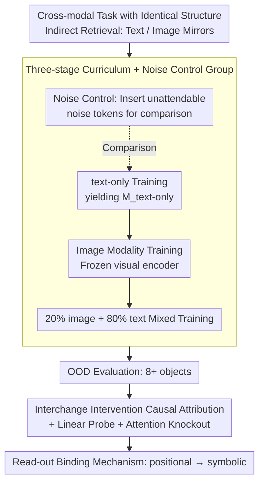

# Seeing to Generalize: How Visual Data Corrects Binding Shortcuts

**Conference**: ICML 2026  
**arXiv**: [2602.15183](https://arxiv.org/abs/2602.15183)  
**Code**: None (No public repository declared)  
**Area**: Multimodal VLM / Mechanistic Interpretability / Long-context Information Retrieval  
**Keywords**: Cross-modal training, binding mechanism, symbolic vs positional, OOD generalization, long-context retrieval

## TL;DR
This paper replicates the anomalous phenomenon of "VLMs outperforming their base LLMs on pure text tasks" using a controlled synthetic "color-shape-item" retrieval task. Mechanistic interpretability proves that image training shifts the model's variable binding strategy from "positional shortcuts" to "symbolic matching." This shift is retained upon returning to text-only inputs, increasing OOD retrieval accuracy from 37.2% to 69.5%. A consistent "symbolic/positional ratio increase" is observed across the real Qwen2/2.5/3 families.

## Background & Motivation

**Background**: VLMs are typically viewed as "giving an LLM an eye," primarily evaluated on visual tasks like VQA and image captioning. However, researchers have reported surprises: Qwen3-VL-8B achieves 76.0% on pure text long-context retrieval, while the base model Qwen3-8B only reaches 62.6%. Since text tasks are independent of images, why is the VLM stronger?

**Limitations of Prior Work**: Previous work either attributed this to "larger training datasets" or dismissed it as noise. There is a lack of research that replicates and mechanically explains this phenomenon in a controlled environment. To answer "why VLMs are stronger," confounding factors such as scale, data volume, and training steps must be stripped away.

**Key Challenge**: Pure text retrieval tasks can "theoretically" be learned through text training alone. However, empirical evidence shows that text-only training learns fragile "positional dependency shortcuts"—perfect within the in-distribution length but collapsing beyond the training context length. "Text-only training" and "positional shortcut-based text-only training" are indistinguishable within the distribution.

**Goal**: (1) Replicate the VLM > LLM phenomenon on a controlled small Transformer; (2) Use mechanistic interpretability to identify which internal computation has been altered; (3) Verify that this change also exists in real large-scale VLMs.

**Key Insight**: The spatial position of a "red triangle" in an image is arbitrary (translation invariance), meaning positional shortcuts naturally fail in the visual modality. This forces the model toward symbolic matching (symbolic binding), which is more robust than "position counting" when transferred back to long-context text.

## Method

### Overall Architecture
To answer "how image training alters internal computation paths," the authors created mirrored text and image versions of the same variable binding task, making "modality" the only controlled variable. The task is Indirect Retrieval: given three sets—attribute (color), entity (shape), and item (item_a / item_b ...)—the model reads a context (sequence of color-shape pairs or rendered images), then an association ("the triangle is item_a"), and finally answers "which item corresponds to red." The model must first locate the shape using color, then locate the item using the shape (a two-hop binding). The process follows a three-stage curriculum: text-only training → image modality training → mixed text-image training. Internal binding mechanisms are analyzed in OOD settings exceeding the number of training objects.

### Key Designs

**1. Cross-modal Mirror Task: Modality as the Sole Variable**

To exclude confounding factors such as "VLMs being stronger due to seeing more tokens," the only clean method is to mirror the structures of the two modalities 1:1 with identical training objectives. The prompt is unified as $\mathbf{x}=[\mathbf{X}_{\text{context}}, \texttt{[CTX\_END]}, \mathbf{X}_{\text{associations}}, \texttt{[QUE]}, \mathbf{x}_{\text{query}}]$. The text context is $\mathbf{X}_{\text{context}}^{\text{text}}=[a_1,e_1,\dots,a_N,e_N]$, while the image version uses a sequence of patch tokens from a frozen visual encoder $\mathbf{X}_{\text{context}}^{\text{image}}=[\texttt{}_1,\dots,\texttt{}_N]$. Associations remain text. The only difference is whether the context is text or image. Any behavioral or mechanistic difference can be causally attributed to the modality itself. The key intuition: the arbitrary spatial location of objects in images (translation invariance) makes positional shortcuts unfeasible, forcing the model toward symbolic matching.

**2. Three-stage Curriculum + Noise Control: Decoupling "Position Range Expansion" Interference**

Image patch sequences are usually long (e.g., 196 tokens). Comparing image-text and text-only directly makes it unclear whether gains come from "vision" or "longer position indices." Thus, besides the main path $\mathcal{M}_{\text{image-text}}$ (standard text-only training on a 12-layer Transformer up to 8 objects, then frozen vision training, then mixing), the authors trained two control groups: $\mathcal{M}_{\text{noise-text}}$ and $\mathcal{M}_{\text{noise-image-text}}$. In these, unattendable noise tokens are inserted into text contexts so the text-only model sees longer position indices but cannot attend to noise. Noise only improved OOD accuracy from 37.2% to 57.5%, far below the 69.5% of image-text, proving vision provides a qualitative gain independent of "positional range."

**3. Interchange Intervention + Linear Probe + Attention Knockout: Reading the Binding Mechanism**

Behavioral metrics (accuracy) only indicate "VLM is better"; internal computation must be probed to explain "why." Following Gur-Arieh et al. 2025, the authors classify binding mechanisms into positional, symbolic, and reflexive. Interchange intervention is used for causal attribution: constructing original-counterfactual input pairs where "positional" and "symbolic" strategies yield different answers, then patching counterfactual activations into the original run to see which layer's prediction flips. This attributes the dominant mechanism of that layer. Attention knockout identifies key pathways, and linear probes measure the decodability of attributes on each token. This method transitions seamlessly to real large models, using the symbolic/positional ratio to quantify mechanistic differences.

### Loss & Training
The controlled Transformer is trained using standard next-token CE loss. The curriculum sequence is text-only → image-only (frozen visual encoder: ResNet-152, ViT-B/16, or DINOv3) → 20% image + 80% text mixed training to obtain $\mathcal{M}_{\text{image-text}}$. OOD evaluation expands the attribute sets to 216 colors × 216 shapes × 32 items and pushes the number of objects beyond the training limit (8).

## Key Experimental Results

### Main Results
Average OOD accuracy of controlled Transformers on text-modality Indirect Retrieval (context exceeding training limit of 8):

| Model | Avg. OOD Accuracy |
|------|---------------|
| $\mathcal{M}_{\text{text-only}}$ | 37.2% |
| $\mathcal{M}_{\text{noise-text}}$ | 57.5% |
| $\mathcal{M}_{\text{image-text}}$ | **69.5%** |
| $\mathcal{M}_{\text{noise-image-text}}$ | **83.6%** |

Symbolic / Positional ratio in dominant binding layers of the real Qwen family (higher is more symbolic):

| Model | Peak Layer | Sym./Pos. Ratio | $\Delta$ vs LLM |
|------|------------|-----------------|------------------|
| Qwen 2 | 22 | 1.383 | — |
| Qwen 2-VL | 22 | 1.499 | +0.116 |
| Qwen 2.5 | 22 | 1.218 | — |
| Qwen 2.5-VL | 22 | 1.282 | +0.064 |
| Qwen 3 | 28 | 1.819 | — |
| **Qwen 3-VL** | 28 | **2.463** | **+0.644** |

### Ablation Study

| Intervention | Effect | Conclusion |
|------|------|------|
| Noise only, no image | OOD 57.5% (vs 37.2%) | Noise helps, but is insufficient |
| Image only, no noise | OOD 69.5% | Vision provides "qualitative change" |
| Noise and image combined | OOD 83.6% | Effects are complementary |
| Switch between ResNet/ViT/DINOv3 | Mechanism shift persists | Phenomenon decoupled from encoder type |

### Key Findings
- After visual training, the model's final layers shift from almost purely positional to predominantly symbolic. This shift is maintained after re-introducing text, suggesting binding strategies do not easily regress once learned.
- Noise moderately promotes symbolic binding (consistent with the hypothesis that natural language irregularities act as noise), but only slightly increases the ratio. Vision provides a strong constraint where "positional strategies are simply unfeasible."
- In real Qwen models, the Symbolic/Positional ratio is systematically higher in VL versions than in base versions. The increase for Qwen 3-VL (+0.644) aligns perfectly with its behavioral advantage in long-context retrieval.
- All three visual encoders (ResNet-152, ViT-B/16, self-supervised DINOv3) trigger the shift, proving that the commonality of "translation invariance" is the cause.

## Highlights & Insights
- This study aligns mechanistic interpretability, controlled synthesis, and real large-scale model validation. Evidence from these three stages is more convincing than any single evidence source.
- The idea that "translation invariance is a prior that backwardly reshapes the LLM's binding strategy" provides a specific mechanical explanation for why multimodal training benefits text-only tasks, moving beyond vague "extra regularization" claims.
- It suggests a form of "behavioral rewriting" distinct from prompt engineering: by introducing different modal alignment objectives, one can change the domestic computational path the model uses to solve problems without changing the architecture.

## Limitations & Future Work
- Controlled experiments only utilized one type of task (Indirect Retrieval); whether conclusions extend to reasoning or code remains to be verified.
- The Qwen family validation did not control for training datasets or steps, so other effects might be mixed into the VLM > LLM gain.
- Only three categories of binding (positional, symbolic, reflexive) were identified; finer mixed strategies remain an open question.
- No "manual" induction strategy for symbolic shifts in text-only settings was shown; a text-equivalent induction strategy would be highly practical for engineering.

## Related Work & Insights
- **vs Dai et al. 2024b / Ratzlaff et al. 2025**: They reported behavioral gains for VLMs in math and commonsense; this paper explains such gains through binding mechanism changes.
- **vs Gur-Arieh et al. 2025**: The authors adopt their binding taxonomy and interchange intervention but are the first to link modality changes to mechanism shifts.
- **vs Capitals task by Feng & Steinhardt 2024**: Similar task paradigm, but this paper introduces image modality as a "mechanistic tool."

## Rating
- Novelty: ⭐⭐⭐⭐⭐ Proposes the first mechanically verifiable causal mechanism for "VLM > LLM."
- Experimental Thoroughness: ⭐⭐⭐⭐ Quadruple validation (3 encoders + noise control + large models), though task variety is limited.
- Writing Quality: ⭐⭐⭐⭐⭐ Clear conceptual progression from problem to replication to explanation to generalization.
- Value: ⭐⭐⭐⭐ Informative for both multimodal training design and mechanistic interpretability methodology.

<!-- RELATED:START -->

## Related Papers

- [\[NeurIPS 2025\] How Should We Evaluate Data Deletion in Graph-Based ANN Indexes?](../../NeurIPS2025/information_retrieval/how_should_we_evaluate_data_deletion_in_graph-based_ann_indexes.md)
- [\[ICML 2026\] How can embedding models bind concepts?](how_can_embedding_models_bind_concepts.md)
- [\[ACL 2026\] How Retrieved Context Shapes Internal Representations in RAG](../../ACL2026/information_retrieval/how_retrieved_context_shapes_internal_representations_in_rag.md)
- [\[ICML 2026\] REAL: Resolving Knowledge Conflicts in Knowledge-Intensive Visual Question Answering via Reasoning-Pivot Alignment](real_resolving_knowledge_conflicts_in_knowledge-intensive_visual_question_answer.md)
- [\[ACL 2026\] Domain-Specific Data Generation Framework for RAG Adaptation](../../ACL2026/information_retrieval/domain-specific_data_generation_framework_for_rag_adaptation.md)

<!-- RELATED:END -->
