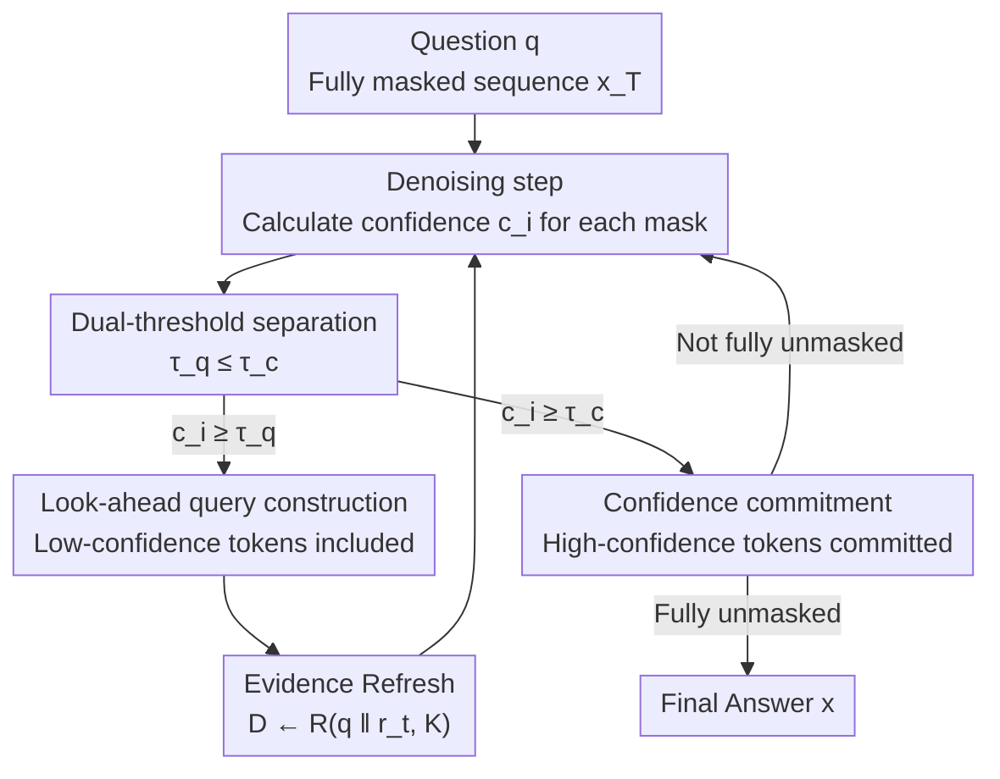

# Self-Augmenting Retrieval for Diffusion Language Models

**Conference**: ICML2026  
**arXiv**: [2606.06474](https://arxiv.org/abs/2606.06474)  
**Code**: https://github.com/pauljngr/SARDI  
**Area**: Information Retrieval / RAG / Diffusion Language Models  
**Keywords**: Diffusion Language Models, Dynamic Retrieval, Multi-hop QA, Parallel Decoding, Training-free  

## TL;DR
By leveraging "tentative predictions" provided simultaneously for all positions during the denoising process of Diffusion Language Models as look-ahead signals, the authors propose SARDI: a training-free and retriever-agnostic dynamic RAG framework. SARDI re-retrieves evidence using uncommitted tokens at each denoising step, outperforming both diffusion and autoregressive training-free retrieval baselines on 5 multi-hop QA benchmarks while achieving up to 8x higher throughput.

## Background & Motivation

**Background**: Retrieval-Augmented Generation (RAG) has become the mainstream paradigm for connecting large models to external knowledge. However, almost all current RAG systems are built on autoregressive (AR) token-by-token decoding: retrieval can only construct queries based on the "committed left-side prefix," and generation latency is linearly tied to the output length. Diffusion Language Models (DLM, e.g., DREAM-7B, LLaDA) provide an alternative—starting from a fully masked sequence and **denoising all positions in parallel** at each step, with a tunable number of iterations during inference.

**Limitations of Prior Work**: In multi-hop QA, evidence required for subsequent reasoning steps depends on "bridge entities" not explicitly named in the original question. For example, for the question "In which city is the museum exhibiting the Mona Lisa located?", a static retriever cannot retrieve the second-hop evidence "The Louvre is located in Paris" without first identifying the bridge entity "Louvre." Existing RAG methods for diffusion models are all single-shot, where evidence is fixed once; conversely, AR look-ahead retrieval (like FLARE) generates tentative sentences from left to right, where an early error can cascade, leading to hallucinatory queries and irrelevant documents.

**Key Challenge**: Retrieval requires "seeing future entities as early as possible," while generation requires "waiting until sufficient certainty is reached before commitment." These two tasks have vastly different error tolerances: committing a wrong token directly pollutes the output, but retrieval is fairly robust to noisy queries. Autoregressive models force these two tasks onto a single left-to-right chain, making them impossible to decouple.

**Goal**: To decouple "confidence for retrieval" from "confidence for commitment" within a non-autoregressive decoder, allowing speculative future tokens to guide retrieval even before they are stable enough to be committed to the output.

**Key Insight**: The authors observe that the diffusion denoising trajectory $\{x_t\}_{t=0}^T$ holds tentative predictions for every position at each step, and bridge entities **surface early** in these intermediate states. Furthermore, once generation is grounded by retrieved strong evidence, many output tokens are directly copied or paraphrased from the context. Given evidence $D$, adjacent tokens become approximately conditionally independent, which happens to make parallel decoding safer.

**Core Idea**: Condition the retrieval on intermediate diffusion states. Each denoising step uses a partially denoised sequence to construct queries and refresh evidence. By setting the "retrieval threshold $\tau_q$" significantly lower than the "commitment threshold $\tau_c$," low-confidence tokens are fed to the retriever first, while only high-confidence tokens are committed to the output.

## Method

### Overall Architecture
SARDI (Self-Augmenting Retrieval for Diffusion) interleaves retrieval with denoising. Given a question $q$, it aims to produce the final answer sequence $x$. The process starts from a fully masked sequence $x_T$ and iterates toward $x_0$. At each step, the denoiser provides a prediction and confidence $c_i = \max_{v\in V} p_\theta(v\mid x_t, q, D_t)$ for each masked position. This confidence independently determines two things: whether to include the token in a retrieval query and whether to commit it to the output. New retrieved evidence completely replaces the old context for the next denoising step. This process is training-free, retriever-agnostic, and plug-and-play for any discrete diffusion model capable of generating reasoning traces.

### Key Designs

**1. Retrieval/Commitment Dual-Threshold Separation: Speculative Tokens for Retrieval**

This is the core design of SARDI, addressing the contradiction between "early look-ahead for retrieval" and "late commitment for generation." Two thresholds are assigned to the confidence $c_i$ of each position: a query threshold $\tau_q$ and a commitment threshold $\tau_c$, with the constraint $\tau_q \le \tau_c$. A position is included in the retrieval query if $c_i \ge \tau_q$ but only committed to the output if $c_i \ge \tau_c$. Since $\tau_q$ can be much lower than $\tau_c$, tentative tokens that are not yet stable enough for the final answer can expose bridge entities to the retriever early. This is safe because retrieval is naturally robust to query noise, whereas output pollution is irreversible. Unlike FLARE (AR), SARDI's tentative tokens are predicted **in parallel for all positions**, preventing single early errors from cascading into hallucinatory queries.

**2. Look-ahead Query Construction: Dynamic Queries via Partially Denoised Sequences**

As denoising progresses, the forming answer reveals intermediate entities (names, dates, relations) absent from the question. SARDI feeds these to the retriever as early as possible by constructing a proxy sequence $\tilde{x}_t$: committed positions retain their tokens; uncommitted positions with $c_i \ge \tau_q$ use their argmax predictions; others remain as masks.

$$\tilde{x}_i^t = \begin{cases} x_i^t, & x_i^t \neq [\text{MASK}] \\ \arg\max_v p_\theta(v\mid x_t,q,D_t), & c_i \ge \tau_q \\ [\text{MASK}], & \text{otherwise} \end{cases}$$

The sequence $\tilde{x}_t$ is detokenized into $r_t$ (discarding remaining masks) and concatenated with the question to form the query $s_t = q \,\Vert\, r_t$. The fixed $q$ acts as an anchor when predictions are noisy, while the evolving $r_t$ gradually specializes the retrieval.

**3. Evidence Refresh: Step-wise Context Replacement**

Using $s_t$, SARDI retrieves $K$ new documents $D_{t-1} \leftarrow R(s_t, K)$ at each step. These **completely replace** the old context to condition the next denoising step. While BM25 is used in experiments for efficiency, the framework is retriever-agnostic. This ensures evidence is continuously updated as the answer takes shape.

**4. Confidence-Driven Unmasking: A "Simple-to-Complex" Retrieval Curriculum**

Since SARDI refreshes evidence each step, the **order** of token commitment shapes subsequent retrieval. The authors use threshold-based unmasking: all positions with confidence exceeding $\tau_c$ are revealed simultaneously $U_t = \{i \mid x_i^t=[\text{MASK}] \wedge c_i \ge \tau_c\}$. If no position exceeds $\tau_c$, the single most confident position is forced to unmask to ensure progress. This naturally creates a curriculum where high-confidence tokens (often groundable by current evidence) guide the next retrieval, while uncertain fragments wait for more refined evidence.

### Loss & Training
SARDI is training-free and lacks a learnable retrieval controller. Training is only used to "induce the model to generate reasoning traces." Since off-the-shelf instruction-tuned diffusion models (e.g., DREAM-7B) rarely produce reasoning traces in RAG settings, the authors perform lightweight supervised fine-tuning (SFT) using Chain-of-Thought traces synthesized by GPT-4o-mini. For fair comparison, the same SFT is applied to the AR baseline (Qwen2.5-7B).

## Key Experimental Results

### Main Results
Evaluation across 5 multi-hop QA benchmarks (2WikiMultiHopQA, HotpotQA, CofCA, MuSiQue, SynthWorlds-RM) using Exact Match (EM $\times$ 100). Latency measured as wall-clock seconds/sample on a single B200 GPU.

| Method | 2Wiki EM | Hotpot EM | CofCA EM | MuSiQue EM | 2Wiki Latency |
|------|-----------|-----------|-----------|------------|---------------|
| DLM w/ RET@STATIC ($\tau_c$=0.9) | 43.7 | 39.9 | 43.4 | 11.1 | 0.46 |
| AR w/ RET@1 (Strongest AR training-free) | 58.8 | 47.4 | 41.2 | 19.8 | 1.26 |
| ReAct (agentic) | 42.7 | 40.1 | 42.9 | 20.9 | 2.15 |
| **DLM w/ SARDI ($\tau_c$=0.9)** | **57.8** | **48.5** | **45.3** | **20.5** | **0.39** |
| **DLM w/ SARDI ($\tau_c$=0.95)** | **59.1** | **48.7** | 44.9 | 20.6 | 0.56 |
| AR (Search-R1, req. RL training) | 52.4 | 50.3 | 44.4 | 26.4 | 3.36 |

SARDI significantly improves over static diffusion retrieval across all benchmarks and matches or beats all training-free AR baselines with much lower latency. By adjusting $\tau_c$, it occupies a superior quality-latency Pareto frontier, being up to 8x faster than AR iterative retrieval.

### Ablation Study

| Configuration / Analysis | Key Metric | Explanation |
|------|------------|-------------|
| $\tau_q$ scan | EM peaks at $\tau_q \approx 0$ | More aggressive look-ahead is better; speculative tokens are useful. |
| Early doc recall (at 25% gen) | +19 pts recall | SARDI significantly outperforms AR; strong evidence arrives earlier. |
| Alternative Retriever (E5-base-v2) | Still beats best AR | Retriever-agnostic; gain is not due to lexical matching alone. |
| Question type split (2Wiki) | Composition/Inference +28.7 / +23.5 | Gains are concentrated in multi-hop reasoning tasks. |

### Key Findings
- **Aggressive Look-ahead is Beneficial**: Lower $\tau_q$ (more speculative tokens in queries) yields higher EM, supporting the hypothesis that low-confidence tokens are useful look-ahead signals.
- **RAG Grounding Promotes Parallel decoding**: The authors use Conditional Mutual Information (CMI) to measure token dependencies. With gold documents, CMI for entity pairs is only 0.060 (highly parallelizable), but it rises to 0.588 (nearly 10x) when documents are removed. Grounding effectively decouples entity spans.

## Highlights & Insights
- **Decoupling "retrieval confidence" and "commitment confidence"** is the primary innovation. It exploits the unique structure of non-AR decoders—where all positions hold tentative predictions simultaneously—to allow tokens to "pull" evidence before they are finalized.
- **Using the diffusion trajectory as a look-ahead signal**, rather than just for acceleration, is a novel re-utilization of the DLM structure.
- **CMI analysis** quantifies why RAG makes parallel decoding safer: grounding forces tokens to be "copied" from context, making adjacent tokens approximately conditionally independent.
- **Single-knob tradeoff**: $\tau_c$ controls both parallelism and retrieval frequency, allowing a simple accuracy-throughput sweep for deployment.

## Limitations & Future Work
- **Dependency on reasoning traces**: SARDI requires the model to generate intermediate entities. Currently, this requires lightweight SFT, though this capacity may emerge naturally as DLMs scale.
- **Retrieval cost per step**: While BM25 is cheap, full evidence replacement at every step might incur higher costs with dense retrievers.
- **Gap vs. RL search agents**: On the most complex benchmarks (e.g., MuSiQue), RL-trained agents (Search-R1) still lead, suggesting that learned query generation remains superior for difficult cases.

## Related Work & Insights
- **vs. FLARE (Jiang et al., 2023)**: FLARE generates a tentative next sentence; if it contains low-confidence tokens, it retrieves and regenerates. However, its tentative sentences are AR-generated, meaning single early errors lead to cascading hallucinations. SARDI predicts all positions in parallel, preventing this.
- **vs. Existing Diffusion RAG**: Prior works use single-shot retrieval; SARDI is the first to refresh evidence dynamically across the entire denoising trajectory.
- **vs. Search-R1 (Jin et al., 2025)**: Search-R1 uses RL to learn explicit search queries. SARDI is training-free and plug-and-play, representing a complementary design point.

## Rating
- Novelty: ⭐⭐⭐⭐⭐ Decoupling via dual thresholds uniquely targets non-AR structures.
- Experimental Thoroughness: ⭐⭐⭐⭐ Extensive benchmarks and mechanism analysis.
- Writing Quality: ⭐⭐⭐⭐⭐ Clear motivation and hypothesis validation.
- Value: ⭐⭐⭐⭐ High practical utility due to being training-free and faster than AR.

<!-- RELATED:START -->

## Related Papers

- [\[ICLR 2026\] Query-Level Uncertainty in Large Language Models](../../ICLR2026/information_retrieval/query-level_uncertainty_in_large_language_models.md)
- [\[ICML 2026\] ReSeek: A Self-Correcting Framework for Search Agents with Instructive Rewards](reseek_a_self-correcting_framework_for_search_agents_with_instructive_rewards.md)
- [\[ICLR 2026\] AtlasKV: Augmenting LLMs with Billion-Scale Knowledge Graphs in 20GB VRAM](../../ICLR2026/information_retrieval/atlaskv_augmenting_llms_with_billion-scale_knowledge_graphs_in_20gb_vram.md)
- [\[AAAI 2026\] Do Retrieval Augmented Language Models Know When They Don't Know?](../../AAAI2026/information_retrieval/do_retrieval_augmented_language_models_know_when_they_dont_know.md)
- [\[ACL 2025\] RARE: Retrieval-Augmented Reasoning Enhancement for Large Language Models](../../ACL2025/information_retrieval/rare_retrieval_augmented_reasoning.md)

<!-- RELATED:END -->
