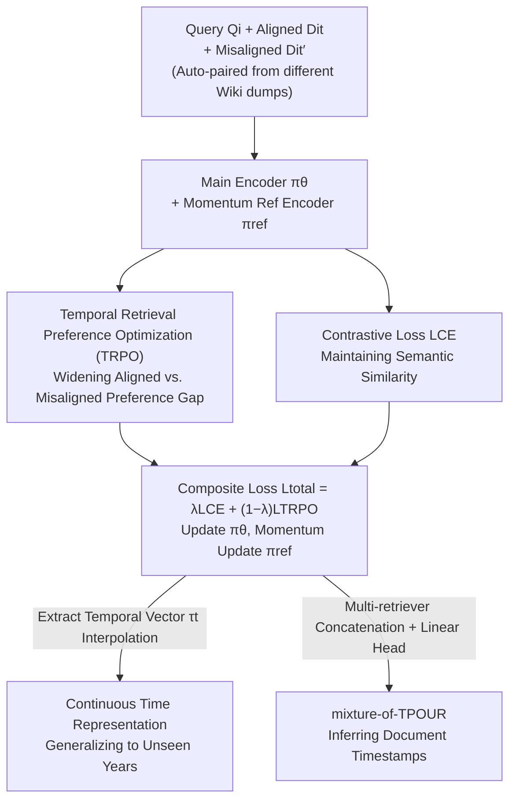

# Temporal Preference Optimization for Unsupervised Retrieval

**Conference**: ICML 2026  
**arXiv**: [2606.17664](https://arxiv.org/abs/2606.17664)  
**Code**: https://github.com/agwaBom/TPOUR  
**Area**: Information Retrieval / Temporal Retrieval  
**Keywords**: Unsupervised Dense Retrieval, Temporal Alignment, Preference Optimization, Temporal Vectors, Contrastive Learning

## TL;DR
This paper proposes TPOUR, which transplants DPO-style preference learning to the **temporal dimension** of retrieval. This enables unsupervised dense retrievers to prioritize "temporally aligned" documents among semantically similar but misaligned versions, while achieving zero-shot generalization to unseen years using temporal vector interpolation.

## Background & Motivation

**Background**: Unsupervised dense retrievers (e.g., Contriever) learn semantic similarity from massive unlabeled documents via contrastive learning. They are highly scalable and serve as the backbone for large-scale retrieval and RAG.

**Limitations of Prior Work**: These retrievers **only optimize semantic similarity while completely ignoring time**. When a document collection spans multiple years, for a query like "Who was the president in 2019?", the retriever ranks "president" documents from 2018–2025 highly. While semantically relevant, only the 2019 document is correct. Empirical tests on mixed-timestamp collections show that Contriever achieves an nDCG@5 of only 29.30 on 2018 queries, significantly hindered by temporally misaligned documents.

**Key Challenge**: To capture temporal relevance, supervised methods (with explicit timestamp labels) are effective but require an impractical scale of query-document pairs with temporal labels. Unsupervised methods are scalable but limited to semantic matching. **A contradiction exists between scalability and temporal awareness**. Furthermore, temporal signals in queries are often **implicit** ("this year", "current president") without explicit timestamps, making them harder to process.

**Goal**: Without any explicit timestamp labels, enable unsupervised retrievers to: (1) prioritize temporally aligned documents in mixed-timestamp collections; (2) interpret implicit temporal queries within the training timeframe; (3) generalize to unseen intermediate or future years.

**Key Insight**: The authors observe that Wikipedia dumps collected in different years naturally provide "temporal preference signals." Versions of the same document in 2018 and 2021 dumps form a preference pair for "which better fits the target year" **without manual annotation**.

**Core Idea**: DPO (Direct Preference Optimization) is reinterpreted from "aligning generation policies" to "aligning temporal preferences in retrieval." By replacing log-likelihood in DPO with embedding similarity, the retriever is trained to prefer temporally aligned documents (preferred) over misaligned ones (less preferred), termed TRPO (Temporal Retrieval Preference Optimization).

## Method

### Overall Architecture

TPOUR overlays a temporal preference objective onto the MoCo contrastive learning framework. During training, each sample is a triplet: query $Q_i$, temporally aligned document $D_i^{t}$ (preferred), and temporally misaligned document $D_i^{t'}$ (less preferred). The main encoder $\pi_\theta$ and the momentum reference encoder $\pi_{\text{ref}}$ encode these inputs, with the reference encoder maintaining a negative sample queue. The overall loss consists of two parts: the contrastive loss $\mathcal{L}_{\text{CE}}$ maintains semantic similarity, while the TRPO loss $\mathcal{L}_{\text{TRPO}}$ widens the preference gap between "aligned vs. misaligned." $\pi_\theta$ is updated via the composite loss, and $\pi_{\text{ref}}$ is slowly updated from $\pi_\theta$ using momentum. Once trained, the retriever functions as a general retriever, can switch to any year via temporal vector interpolation, and can infer document timestamps.

### Key Designs

**1. TRPO: Moving Preference Optimization to the Temporal Dimension**

This is the core contribution. DPO was originally designed for aligning generative models, where the objective function compares the ratio of log-likelihoods of the policy model for preferred/less-preferred answers (Eq. 2). TRPO brings this mechanism to retrieval by replacing "log-likelihood" with "query-document embedding similarity." Let $S_\theta(y_i^w)=S(\pi_\theta(Q_i),\pi_\theta(D_i^{t}))$ be the similarity between the query and the aligned document (preferred), and $S_\theta(y_i^l)=S(\pi_\theta(Q_i),\pi_\theta(D_i^{t'}))$ for the misaligned one (less preferred). The reference model provides the corresponding $S_{\text{ref}}$. The TRPO loss is:

$$\mathcal{L}_{\text{TRPO}}=-\log\sigma\Big(\beta\big[\,S_\theta(y_i^w)-S_\theta(y_i^l)-\big(S_{\text{ref}}(y_i^w)-S_{\text{ref}}(y_i^l)\big)\big]\Big)$$

It forces the current model to create a larger similarity gap between "aligned - misaligned" than the reference model, injecting temporal preference beyond semantics. The clever part is that **supervision for preference pairs comes entirely from unlabeled corpora**—different snapshots of the same document across years naturally form pairs, requiring no manual timestamp labels. This distinguishes it from "supervised temporal retrieval."

**2. Joint Training: Contrastive Loss + TRPO**

Using only TRPO might sacrifice basic semantic retrieval capabilities for temporal preference. TPOUR retains a MoCo-style contrastive loss $\mathcal{L}_{\text{CE}}$ (Eq. 3), which pulls queries closer to aligned documents and pushes away negative samples from the queue (both misaligned and aligned documents enter the queue as negatives). The total loss balances both with a scalar $\lambda$:

$$\mathcal{L}_{\text{total}}=\lambda\mathcal{L}_{\text{CE}}+(1-\lambda)\mathcal{L}_{\text{TRPO}},\quad \lambda\in[0,1]$$

A larger $\lambda$ favors semantics, while a smaller $\lambda$ favors time. Thus, TPOUR **maintains semantic similarity while learning temporal relevance**, even when queries or documents lack explicit temporal terms. An ablation "Temporal Contrastive" is also used—treating aligned documents as positives and misaligned as negatives for contrastive learning—to verify if "preference-based optimization" is more effective than "hard positive/negative contrast."

**3. Temporal Vector Interpolation: Zero-Retraining Generalization to Unseen Years**

Training separate retrievers for every year is discrete and cannot cover continuous time. This work adopts "temporal vectors," as proposed by Nylund et al. for generative models, and validates their effectiveness for encoder retrievers. Given base weights $\theta_{\text{base}}$ and weights $\theta_t$ fine-tuned on year $t$, the temporal vector is the difference $\tau_t=\theta_t-\theta_{\text{base}}$, capturing the direction of "drift from base to year $t$." To obtain a retriever for an intermediate year $t_{\text{mid}}$, one performs linear interpolation between two endpoint temporal vectors:

$$\theta^{t_{\text{mid}}}=\theta_{\text{base}}+(1-\alpha)\tau_{t_{\text{start}}}+\alpha\tau_{t_{\text{end}}},\quad t_{\text{start}}\le t_{\text{mid}}\le t_{\text{end}}$$

For example, interpolating between 2018 and 2021 temporal vectors directly serves 2019 and 2020 queries **without retraining**. Extrapolation also generalizes to future time, turning the "temporal dimension" into a continuous tunable knob.

**4. mixture-of-TPOUR: Inferring Document Timestamps**

Temporal awareness is bidirectional: one can retrieve by time or infer which year a document belongs to. The authors model timestamp inference as a classification task using a set of frozen retrievers $\{\pi_\theta^{t_1},\dots,\pi_\theta^{t_n}\}$ specialized for different years. These temporal-aware embeddings are **concatenated** and fed into a shared trainable linear classification head to predict the year. The baseline uses a single retriever trained over the entire period, matching the parameter count with multiple linear layers. Results show mixture-of-TPOUR significantly improves timestamp prediction, suggesting specialized retrievers encode distinct temporal information.

### Loss & Training

Training corpora consist of English Wikipedia dumps from various times: annual corpora use December dumps of 2018 and 2021 (for SituatedQA), while monthly corpora use January and December dumps of 2023 (for RealTimeQA). To prevent data leakage, content used as gold documents in evaluation sets is filtered. The reference encoder is updated via momentum: $\theta_{\text{ref}}\leftarrow m\,\theta_{\text{ref}}+(1-m)\,\theta$, where $m$ is the momentum coefficient.

## Key Experimental Results

### Main Results

Evaluated on mixed-timestamp document sets from SituatedQA (Annual) and RealTimeQA (Monthly), using nDCG@5 / @10 (N@k) as metrics. TPOUR Contriever outperforms both unsupervised and supervised baselines on explicit/implicit queries and trained/intermediate years. The table shows N@5 for explicit temporal queries (2019/2020 are **unseen intermediate years** obtained via interpolation):

| Retriever | Params | 2018 | 2019 (Interp.) | 2020 (Interp.) | 2021 |
|-----------|--------|------|----------------|----------------|------|
| Contriever (Unsupervised) | 110M | 29.30 | 29.67 | 31.25 | 37.85 |
| DPR (Supervised) | 110M | 28.67 | 27.58 | 27.91 | 32.76 |
| Temporal Contrastive | 110M | 35.00 | 29.03 | 29.21 | 35.97 |
| TimeR4 (Temporal-aware) | 113M | 33.65 | 27.62 | 31.09 | 31.33 |
| Qwen3-Embedding-8B | 8B | 30.45 | 32.77 | 36.31 | 35.17 |
| **TPOUR Contriever (2018)** | 110M | **43.93** | — | — | — |

Compared to the 8B Qwen3-Embedding, TPOUR Contriever is **72.7× smaller** yet gains +4.04 (+12.15%) on explicit query avg. nDCG@5 and +4.98 (+15.21%) on implicit queries. Notably, TPOUR maintains strong performance for 2019/2020/June without retraining.

### Ablation Study

| Configuration | Key Meaning | Conclusion |
|---------------|-------------|------------|
| Full TPOUR (CE + TRPO) | Complete model | Optimal temporal retrieval |
| Temporal Contrastive (CE + hard pos/neg) | Replaces TRPO with contrast | Weaker than preference-based TRPO, validating "preference optimization" value |
| Temporal Vector Interpolation (2019/2020) | Zero-retraining for intermediate years | Interpolation approaches specialized training performance (Tab. 4 / Fig. 3-4) |
| mixture-of-TPOUR vs Single Retriever | Timestamp prediction | mixture is significantly better under matched parameters |

### Key Findings
- **Preference-based beats hard contrastive**: Modeling temporal alignment as a DPO-style preference (TRPO) is more effective than standard contrastive learning (Temporal Contrastive), indicating that "relative preference difference" is better suited for injecting temporal signals than "absolute positive/negative."
- **Small temporal-aware models beat large models**: 110M TPOUR Contriever surpasses 8B general embeddings in temporal retrieval, proving "temporal alignment" is more critical than "model scale" in time-sensitive scenarios.
- **Temporal vectors work for encoders**: Originally proposed for generative models, temporal vector interpolation works for encoder-based retrievers and supports extrapolation to the future.
- **Insights from BEIR**: On general retrieval benchmarks (BEIR), TPOUR reveals that "dataset publication year aligns with optimal retrieval performance," suggesting temporal modeling aids general retrieval tasks.

## Highlights & Insights
- **Cross-domain transfer of DPO**: DPO, an RLHF tool for aligning generation, is transferred to "temporal preference in retrieval." Replacing log-likelihood with embedding similarity—a "preference dimension reinterpretation"—could be applied to other retrieval/ranking tasks requiring relative order.
- **Smart use of unlabeled signals**: Using Wikipedia dumps from different years creates preference pairs naturally, solving the "data labeling" bottleneck and ensuring scalability.
- **One training, three capabilities**: The framework enables temporal retrieval, continuous time generalization, and timestamp inference. The geometric view of "temporal vectors as directions" is elegant.

## Limitations & Future Work
- **Dependency on multi-year corpora**: The method requires multiple snapshots of the same corpus (e.g., Wiki dumps). It is difficult to construct pairs for document sets without historical versions.
- **Granularity constraints**: Interpolation/extrapolation quality depends on the selected endpoint years and their interval; precision may decrease if the temporal span is too wide.
- **Dataset construction bias**: SituatedQA/RealTimeQA did not originally contain the redundant documents with multiple timestamps required for retrieval. The authors created a gold set via Contriever retrieval + filtering. Although bias tests were performed (Tab. 1), this automated process might still introduce artifacts.
- **Binding implicit time to training**: Interpreting "this year" as the training year is reasonable for static collections but less so for real-time updates where "current" drifts; this requires continuous updating of temporal vectors.

## Related Work & Insights
- **vs. Contriever / DPR**: These only optimize semantic similarity. In mixed-timestamp sets, they fail to distinguish temporally misaligned documents; TPOUR injects temporal preference while maintaining semantics.
- **vs. TimeR4 / Supervised Temporal Retrieval**: These rely on explicit temporal labels or knowledge graphs, which are hard to scale; TPOUR is fully unsupervised and uses multi-year dumps.
- **vs. Original Temporal Vectors (Nylund et al.)**: While the original work targeted generative LMs, this paper validates that temporal vectors are interpolatable/extrapolatable for encoder-based retrievers.
- **vs. Temporal Contrastive (Ablation)**: Using TRPO preference optimization outperforms treating alignment only as contrastive positives/negatives, highlighting the advantage of relative preference modeling.

## Rating
- Novelty: ⭐⭐⭐⭐⭐ Reinterprets DPO for the temporal dimension of retrieval and achieves zero-label supervision via multi-year dumps.
- Experimental Thoroughness: ⭐⭐⭐⭐ Covers various time scales, explicit/implicit queries, and interpolation/extrapolation, though the evaluation set is semi-automatically constructed.
- Writing Quality: ⭐⭐⭐⭐ Clear motivation and methodology; complete mathematical formulation.
- Value: ⭐⭐⭐⭐ Small models beating large models through temporal awareness has high practical value for time-sensitive RAG/retrieval.

<!-- RELATED:START -->

## Related Papers

- [\[ACL 2026\] ChunQiuTR: Time-Keyed Temporal Retrieval in Classical Chinese Annals](../../ACL2026/information_retrieval/chunqiutr_time-keyed_temporal_retrieval_in_classical_chinese_annals.md)
- [\[ICML 2026\] Linguistic Nepotism: Trading-off Quality for Language Preference in Multilingual RAG](linguistic_nepotism_trading-off_quality_for_language_preference_in_multilingual_.md)
- [\[CVPR 2025\] Preserving Clusters in Prompt Learning for Unsupervised Domain Adaptation](../../CVPR2025/information_retrieval/preserving_clusters_in_prompt_learning_for_unsupervised_domain_adaptation.md)
- [\[ACL 2026\] Conjecture and Inquiry: Quantifying Software Performance Requirements via Interactive Retrieval-Augmented Preference Elicitation](../../ACL2026/information_retrieval/conjecture_and_inquiry_quantifying_software_performance_requirements_via_interac.md)
- [\[ACL 2026\] Context Attribution with Multi-Armed Bandit Optimization](../../ACL2026/information_retrieval/context_attribution_with_multi-armed_bandit_optimization.md)

<!-- RELATED:END -->
