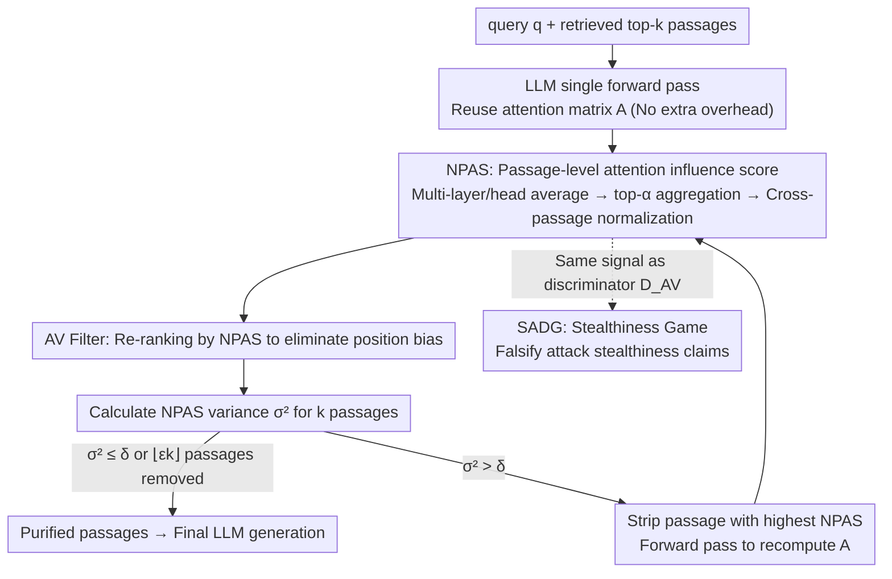

# Through the Stealth Lens: Attention-Aware Defenses Against Poisoning in RAG

**Conference**: ICML 2026  
**arXiv**: [2506.04390](https://arxiv.org/abs/2506.04390)  
**Code**: https://github.com/sarthak-choudhary/Stealthy_Attacks_Against_RAG (Yes)  
**Area**: Information Retrieval / RAG Security / Retrieval Poisoning Defense  
**Keywords**: RAG Poisoning, Attention Analysis, Stealthy Game, Poisoning Detection, Adaptive Attacks

## TL;DR
This paper demonstrates that while existing RAG poisoning attacks can manipulate LLM outputs with few malicious passages, they are **not truly stealthy**. Successful low-budget attacks inevitably cause the model to concentrate excessive attention on malicious segments. The authors introduce Normalized Passage Attention Score (NPAS) and an AV Filter based on its variance to screen out abnormal passages. Under a setting of 4 datasets × 5 LLMs × 5 attacks, this defense improves RACC by up to 20% compared to Certified Robust RAG.

## Background & Motivation

**Background**: RAG compensates for the outdated knowledge and hallucinations of LLMs by prepending the top-$k$ retrieved passages into the prompt. It has become the cornerstone for systems such as Google AI Overview, Bing, and Perplexity. However, the knowledge base serves as an open attack surface; attackers can manipulate generation by injecting a few carefully crafted "malicious passages" into sources like Wikipedia or social media. Work such as PoisonedRAG has shown that corrupting just 1 out of 10 passages allows an attacker to control GPT-4's output.

**Limitations of Prior Work**: Existing defenses fall into two categories: **passage-isolated** filtering (e.g., perplexity, vigilant prompting, or reranking), which is largely ineffective against semantically fluent LLM-generated poisoning; and Certified Robust RAG (Xiang et al., 2024), which uses isolate-then-aggregate to provide an empirical upper bound but suffers from significant clean accuracy degradation (ACC drops ~20% vs. Vanilla). Both lack the utilization of the critical internal signal: "malicious passages are dominating the generation."

**Key Challenge**: Under a low corruption budget of $\epsilon < 0.5$, for a few malicious passages to override the majority of benign passages, they **must** exert a significantly higher influence on LLM inference than benign ones—this requirement is inherently inconsistent with "stealthiness." Yet, prior attacks have not formalized stealthiness metrics, nor has anyone systematically detected it using internal model signals.

**Goal**: (i) Formalize the "stealthiness" metric for RAG poisoning to falsify existing stealthiness claims; (ii) Design a lightweight, plug-and-play detection and filtering defense that does not require extra forward passes; (iii) Explore the robustness lower bound of this signal through adaptive attacks.

**Key Insight**: During Transformer inference, **attention weights serve as an available proxy signal reflecting token influence** (Vig & Belinkov 2019). If an attack successfully induces a target answer $s'$, the generated tokens of $s'$ must allocate substantial attention to malicious tokens containing or implying $s'$, leading to a high-variance anomaly in passage-level aggregation where "a few passages hijack excessive attention."

**Core Idea**: Treat the Normalized Passage Attention Score (NPAS) of each passage as a "proxy for its influence on the response." Use the **variance of NPAS among $k$ passages** as a statistical signature of poisoning and employ an AV Filter that iteratively strips the highest-scoring passages.

## Method

### Overall Architecture
The paper addresses a stealth game in the RAG generation phase (Step II): a low-budget poisoning attack must cause a few malicious passages to suppress benign ones, inevitably leaving a trace of "excessive attention hijacking" inside the LLM. This trace is converted into a quantifiable detection signal. Given a query $q$, retrieved top-$k$ passages $z^{(k)}$, $\text{LLM}_\theta$, corruption budget $\epsilon$, and variance threshold $\delta$, the LLM first performs a normal forward pass. The attention matrices (reused without extra computation) across layers and heads are averaged into a single matrix $A \in \mathbb{R}^{l \times T}$ ($l$ response tokens, $T$ input tokens) and aggregated into passage-level NPAS. If the NPAS variance exceeds $\delta$, the highest-scoring passage is stripped and the process is repeated until the variance falls below the threshold or $\lfloor \epsilon k \rfloor$ passages are removed. The purified set $\tilde z$ is then fed back to the LLM for final generation. The same NPAS signal acts as the discriminator $\mathcal{D}_{\text{AV}}$ in the SADG game, unifying detection and stealthiness measurement.

### Key Designs

**1. SADG: Formalizing "Stealthiness" as a Falsifiable Cryptographic Definition**

Previous papers evaluated stealthiness subjectively (e.g., "can a human detect it"), which cannot be quantified or falsified. The SADG (Stealth Attack Distinguishability Game) upgrades this to an adversarial game: an arbiter samples $q$ and constructs a benign set $z^{(k)}_{\text{benign}}$ and a corrupted set $z^{(k)}_{\text{corrupt}}$. These are **shuffled** and sent to a defender. The defender's advantage is defined as $\mathsf{Adv} = |\Pr[\text{win}] - 1/2|$. An attack is $(\tau\text{-stealthy})$ only if $\mathsf{Adv} \le \tau$ for all PPT defenders; ideal stealth corresponds to $\tau = 0$. This definition allows using any detector to establish the upper bound of an attack's stealthiness.

**2. NPAS: Passage-level Influence Proxy**

Directly analyzing token-level attention is too noisy and lacks cross-passage comparability. NPAS (Normalized Passage Attention Score) provides an influence score from "passage $\to$ response" that is length-invariant and transferable. It averages attention across decoding layers and heads to get $A$, then calculates a raw score for passage $z_t$ by summing attention weights of its top-$\alpha$ attended tokens ($\alpha \in \{5, 10, \infty\}$) in $A$: $\mathsf{Score}_\alpha(z_t, A) = \sum_i \sum_{x_j \in \text{Top}_\alpha(z_t)} A[i,j]$. Finally, it is normalized across passages: $\mathsf{NormScore}_\alpha(z_t) = \mathsf{Score}_\alpha(z_t) / \sum_{i=1}^k \mathsf{Score}_\alpha(z_i)$. Using top-$\alpha$ captures "Heavy Hitters" (often keywords containing the target answer) while masking length differences. Benign passages show near-uniform attention (with slight recency bias), while poisoned ones hijack attention, creating a right-skewed distribution. Thus, the **variance of NPAS among $k$ passages** is a natural and robust discriminant.

**3. AV Filter: Iterative Stripping + Re-ranking for Position Bias**

Without knowing which passage is malicious, the AV Filter (Attention-Variance Filter) screens suspect passages within a budget of $\lfloor \epsilon k \rfloor$ removals. It first re-ranks passages by NPAS to eliminate recency bias (where passages closer to the generation position naturally attract more attention; re-ranking makes true anomalies more prominent, addressing biases observed by Liu et al. 2023). It then enters a loop: calculate NPAS variance $\sigma^2$; if $\sigma^2 \le \delta$, terminate; otherwise, remove $\arg\max \mathsf{NormScore}$, re-run the forward pass to compute a new $A$ and NPAS, and repeat until the budget is hit. Iterative removal is used instead of a single-pass scoring because a malicious passage might hijack 30% of attention while the next highest might still hold 15%; the "second highest" could mask the variance in a single pass. The threshold $\delta = 26.2$ is estimated using mean + 1·std on the clean set of RQA + Llama-2, **prioritizing low false negatives** (as mis-deleting a few benign passages has minimal impact on the final answer). The process requires no training and reuses the LLM’s own attention, resulting in near-zero inference overhead.

### Loss & Training
Ours is a **pure inference-time defense** and requires no LLM training. The threshold $\delta$ is estimated once on a single dataset (RQA + Llama-2) and directly transferred to 4 datasets and 5 models. $\alpha \in \{5, 10, \infty\}$ is a hyperparameter. When closed-source models such as GPT-4o do not expose attention, an open-source Mistral-7B is used as a **proxy model** to compute NPAS; the SADG advantage remains significant in this black-box setting. For adaptive attacks, a GCG-style optimization (similar to jailbreaking) is used to minimize the NPAS gap between malicious and benign passages.

## Key Experimental Results

### Main Results
Evaluation on 4 datasets (RQA, RQA-MC, NQ, HotpotQA) × 5 LLMs (Llama2-7B-Chat / Mistral-7B-Instruct / Llama-3.1-8B / Deepseek-R1-Distill-Qwen-7B / GPT-4o) × 5 attacks (Poison, MA, Paradox, CorruptRAG, PIA), $k=10, \epsilon=0.1$, averaged over 5 seeds.

| Setting | Metric | Vanilla | Keyword (CR-RAG) | Decoding (CR-RAG) | AV Filter (Ours $\alpha=10$) |
|------|------|---------|------------------|-------------------|------------------------------|
| Mistral-7B / RQA-MC / Clean ACC | ↑ | 81.0 | 58.0 | 57.0 | **74.0** |
| Llama2-C / RQA-MC / Clean ACC | ↑ | 79.0 | 56.0 | 44.0 | **75.0** |
| Mistral-7B / RQA-MC / PIA | RACC↑ / ASR↓ | 59.6 / 31.0 | 57.0 / 7.0 | 55.0 / 5.0 | **77.2 / 6.0** |
| Llama2-C / RQA-MC / PIA | RACC↑ / ASR↓ | 33.4 / 63.0 | 54.0 / 6.0 | 38.0 / 12.0 | **(↑ ~20% vs baseline)** |
| Avg SADG Win Rate (CIR) | ↑ | — | — | — | **0.78** |

Key Findings: AV Filter maintains **clean RAG utility** with minimal drops (average drop $\le 5\%$ vs. Vanilla), whereas Keyword/Decoding (isolate-then-aggregate) drops by 15-20%. Simultaneously, RACC is up to 20% higher than baselines under PIA/Poison attacks.

### Ablation Study

| Configuration | Key Finding | Description |
|------|---------|------|
| $\alpha = 5 / 10 / \infty$ | Similar performance, $\alpha=10$ is slightly better | The number of top-$\alpha$ tokens should match "Heavy Hitters" in malicious passages. |
| No re-ranking vs. Re-ranking | False deletions of positions 9-10 increase without re-ranking | Confirms recency bias is a real issue; re-ranking is a necessary engineering step. |
| Single NPAS vs. Iterative AV Filter | Iterative is significantly more stable for multiple poisoned passages ($\epsilon=0.2$) | Single-pass scoring can be masked by the second-highest passage. |
| White-box vs. Black-box (GPT-4o + Mistral proxy) | SADG advantage drops from 0.78 → ~0.65 but remains > 0.5 | Attention signals retain discriminative power on proxy models. |
| Adaptive Attack vs. AV Filter | ASR up to 35% after optimization (Still < Vanilla < Certified bound) | Requires $\sim 10^3\times$ baseline inference time + knowledge of benign passages, unrealistic in practice. |

### Key Findings
- **NPAS is near-uniform on clean sets but spikes to 30%+ for poisoned passages** (Fig 2a), causing a clear right-shift in the variance distribution (Fig 2b). This is the fundamental reason AV Filter works.
- The threshold $\delta$ estimated once on RQA + Llama-2 transfers to other datasets/models, showing the scale consistency of NPAS due to normalization.
- **Black-box applicability**: Even for models like GPT-4o, using Mistral-7B as a sidecar to compute NPAS allows the AV Filter to function.
- Honest assessment of adaptive attacks: While they can recover ASR to 35%, they require 1000x inference time and knowledge of benign passages, serving as an exploration of the stealthy upper bound rather than a practical threat.

## Highlights & Insights
- **Upgrading "stealthiness" from intuition to a cryptographic game**: SADG allows any attack's stealthiness claim to be falsified by any detector. Any future claim of a "stealthy RAG attack" should report the $\mathsf{Adv}_{\text{SADG}}$.
- **Attention as a free defense signal**: Reusing attention from the forward pass requires no training and no extra forward passes (except for re-computation during iterative deletion). It is plug-and-play for any open-source RAG stack.
- **Honest presentation of adaptive attacks**: Unlike many papers that hide weaknesses, this work quantifies the impracticality ($10^3\times$ time cost) of adaptive attacks, clearly defining the boundaries of the arms race.

## Limitations & Future Work
- **Reliance on benign-majority + redundancy assumption**: Assumption 3.2 requires at least 2 benign passages to support the correct answer. If the knowledge base is sparse or the retriever fails, the defense is compromised. Attacks not aiming for specific token outputs (e.g., style poisoning, privacy leaks) are not covered.
- **$\epsilon < 0.5$ information-theoretic constraint**: The authors state that cases with majority corruption are theoretically unsolvable, the same boundary as Certified Robust RAG.
- **Success of adaptive attacks (35% ASR)**: NPAS is not an ultimate signal. Attackers with access to the proxy model can use jailbreak optimization to explicitly suppress malicious NPAS. Potential directions include attention rollout or multi-signal ensembles using hidden states.
- The threshold $\delta$ depends on the existence of a "clean set," which may require recalibration in deployments with significant domain drift.

## Related Work & Insights
- **vs. Certified Robust RAG (Xiang et al., 2024)**: They isolate every passage for independent generation and then aggregate. This provides an empirical bound but drops clean ACC by ~20%. Ours performs **joint attention analysis** of the passage set, maintaining clean ACC while raising RACC by 20%.
- **vs. Perplexity Filter (Jain et al., 2023)**: Perplexity is a passage-isolated score and is ineffective against fluent poisoning. NPAS is a "passage-response joint score" that captures fluent but highly influential malicious segments.
- **vs. Vigilant Prompting (Pan et al., 2023)**: Based on content truthfulness, limited by the model's knowledge. Ours shifts to internal signals, independent of content truth, focusing on "excessive influence."
- **vs. Attention Rollout (Abnar et al., 2020)**: More complex attribution, but the authors chose simple layer/head averaging for stability and deployment ease—an engineering trade-off.

## Rating
- Novelty: ⭐⭐⭐⭐ SADG formalization and using attention variance as a poisoning signature are systematic firsts, though NPAS is a natural extension of attention attribution.
- Experimental Thoroughness: ⭐⭐⭐⭐⭐ 4 datasets x 5 LLMs x 5 attacks + white/black-box + adaptive attacks, covering all bases and honestly presenting weaknesses.
- Writing Quality: ⭐⭐⭐⭐ Clear assumptions, SADG definition, and Algorithm 1. Minor issue: notation density and the "Heavy Hitter" concept are only explained later in the experiments.
- Value: ⭐⭐⭐⭐⭐ Plug-and-play, zero training, works for both white and black-box settings; highly relevant for production-grade RAG systems.

<!-- RELATED:START -->

## Related Papers

- [\[ACL 2026\] Disco-RAG: Discourse-Aware Retrieval-Augmented Generation](../../ACL2026/information_retrieval/disco-rag_discourse-aware_retrieval-augmented_generation.md)
- [\[ACL 2026\] VideoStir: Understanding Long Videos via Spatio-Temporally Structured and Intent-Aware RAG](../../ACL2026/information_retrieval/videostir_understanding_long_videos_via_spatio-temporally_structured_and_intent-.md)
- [\[ICLR 2026\] Bayesian Attention Mechanism: A Probabilistic Framework for Positional Encoding and Context Length Extrapolation](../../ICLR2026/information_retrieval/bayesian_attention_mechanism_a_probabilistic_framework_for_positional_encoding_a.md)
- [\[AAAI 2026\] SR-KI: Scalable and Real-Time Knowledge Integration into LLMs via Supervised Attention](../../AAAI2026/information_retrieval/sr-ki_scalable_and_real-time_knowledge_integration_into_llms_via_supervised_atte.md)
- [\[AAAI 2026\] RRRA: Resampling and Reranking through a Retriever Adapter](../../AAAI2026/information_retrieval/rrra_resampling_and_reranking_through_a_retriever_adapter.md)

<!-- RELATED:END -->
