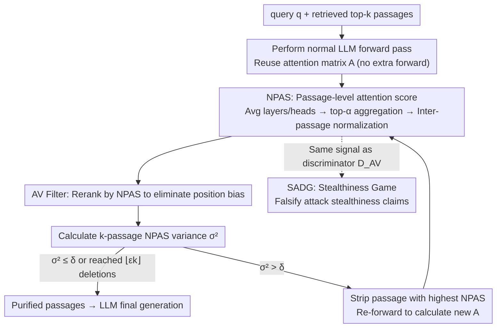

# Through the Stealth Lens: Attention-Aware Defenses Against Poisoning in RAG

**Conference**: ICML 2026  
**arXiv**: [2506.04390](https://arxiv.org/abs/2506.04390)  
**Code**: https://github.com/sarthak-choudhary/Stealthy_Attacks_Against_RAG (Available)  
**Area**: Information Retrieval / RAG Security / Retrieval Poisoning Defense  
**Keywords**: RAG Poisoning, Attention Analysis, Stealth Game, Poisoning Detection, Adaptive Attacks

## TL;DR
This paper points out that while existing RAG poisoning attacks can manipulate LLM outputs using a small number of malicious passages, they are **not truly stealthy**. Successful low-budget attacks inevitably cause the model to focus excessive attention on malicious passages. Consequently, the authors filter out anomalous passages using a Normalized Passage Attention Score (NPAS) and a variance-based AV Filter. Across a setup of 4 datasets × 5 LLMs × 5 attacks, it improves RACC by up to 20% compared to Certified Robust RAG.

## Background & Motivation

**Background**: RAG compensates for outdated knowledge and hallucinations in LLMs by prepending the top-$k$ passages from an external knowledge base to the prompt. It has become the backbone of systems like Google AI Overview, Bing, and Perplexity. However, the knowledge base itself is an open attack surface; attackers can have malicious passages retrieved and used to manipulate generation by placing carefully constructed content on Wikipedia, web pages, or social media. Works like PoisonedRAG demonstrate that corrupting just 1 out of 10 passages allows GPT-4 to output a specified answer.

**Limitations of Prior Work**: Existing defenses are mainly divided into two categories: (1) **passage-isolated** filtering like perplexity, vigilant prompting, or reranking, which are largely ineffective against semantically fluent LLM-generated poisoning; (2) Certified Robust RAG (Xiang et al., 2024), which provides an empirical upper bound using isolate-then-aggregate but incurs a high cost in clean accuracy (ACC drops ~20% compared to Vanilla). A common deficiency is the failure to utilize the key internal signal: "malicious passages are dominating the generation."

**Key Challenge**: Under low corruption budgets ($\epsilon < 0.5$), for an attacker to make a few passages override many benign ones, they **must** cause these passages to have a significantly higher influence on LLM reasoning than benign passages—this is inherently contradictory to "stealth." However, no previous attack has formalized "stealthiness," nor has anyone systematically detected it using internal model signals.

**Goal**: (i) Formally define a "stealthiness" metric for RAG poisoning to falsify stealthiness claims of existing attacks; (ii) design a lightweight, plug-and-play detection and filtering defense that does not rely on extra forward passes; (iii) explore the robust lower bound of this signal through adaptive attacks.

**Key Insight**: During Transformer inference, **attention weights serve as a free proxy signal reflecting token influence** (Vig & Belinkov 2019). If an attack successfully induces a target answer $s'$, the generated tokens for $s'$ must allocate substantial attention to malicious tokens containing or implying $s'$, manifesting as a high-variance anomaly at the passage-level aggregation where "a few passages seize excessive attention."

**Core Idea**: Treat the Normalized Passage Attention Score (NPAS) for each passage as a "proxy for passage influence on the response." Use the **variance of NPAS across $k$ passages** as a statistical signature of being "poisoned," and defend using an AV Filter that iteratively strips the highest-scoring passages.

## Method

### Overall Architecture
The paper addresses a stealthiness game during the RAG generation phase (Step II): low-budget poisoning attacks must leave a trace of "a few passages seizing excessive attention" within the LLM to override benign passages. This trace is converted into a quantifiable detection signal. Specifically, given a query $q$, retrieved top-$k$ passages $z^{(k)}$, LLM $\text{LLM}_\theta$, corruption budget $\epsilon$, and variance threshold $\delta$, a normal LLM forward pass is performed first. The resulting attention matrix is reused (no extra compute), averaging multi-layer multi-head attention into a single matrix $A \in \mathbb{R}^{l \times T}$ ($l$ response tokens, $T$ input tokens), which is then aggregated into passage-level NPAS. If the NPAS variance exceeds the threshold, the passage with the highest score is stripped and the process is repeated until the variance falls below the threshold or $\lfloor \epsilon k \rfloor$ passages have been removed. The purified set $\tilde z$ is then fed back to the LLM for final generation. The same NPAS serves as the "discriminator" $\mathcal{D}_{\text{AV}}$ in the SADG game, unifying detection and stealthiness measurement on a single signal.

### Key Designs

**1. SADG: Making "Stealthiness" a Falsifiable Cryptographic-Style Definition**

Previous papers discussed stealthiness using subjective criteria like "whether a human can spot malicious passages," which is neither falsifiable nor quantifiable. SADG (Stealth Attack Distinguishability Game) upgrades this to an adversarial game: an arbiter samples $q$ and constructs a benign set $z^{(k)}_{\text{benign}}$ and a corrupted set $z^{(k)}_{\text{corrupt}}$. These are **randomly shuffled** and sent to the defender to guess which was poisoned. The defender's advantage is defined as $\mathsf{Adv} = |\Pr[\text{win}] - 1/2|$. An attack is $\tau$-stealthy only if $\mathsf{Adv} \le \tau$ for all PPT defenders. Ideal stealth corresponds to $\tau = 0$. This definition is crucial because any detector can be used to test the upper bound of an attack's stealthiness—all conclusions like "existing attacks are not stealthy" are built on this game.

**2. NPAS: Passage-Level Influence Proxy**

Raw token-level attention is too noisy and difficult to compare across passages. Therefore, an influence score from "passage $\to$ response" is needed that is invariant to passage length and transferable across queries/models. NPAS (Normalized Passage Attention Score) averages $A$ across layers and heads, then takes the sum of attention in $A$ for the top-$\alpha$ attended tokens ($\alpha \in \{5, 10, \infty\}$) in passage $z_t$ as the raw score: $\mathsf{Score}_\alpha(z_t, A) = \sum_i \sum_{x_j \in \text{Top}_\alpha(z_t)} A[i,j]$. Finally, it is normalized across passages: $\mathsf{NormScore}_\alpha(z_t) = \mathsf{Score}_\alpha(z_t) / \sum_{i=1}^k \mathsf{Score}_\alpha(z_i)$. Using top-$\alpha$ captures "Heavy Hitters" (keywords containing the target answer) while masking passage length differences. Cross-passage normalization makes thresholds transferable. Benign passages have nearly uniform attention (with slight recency bias), while poisoned passages seize attention, forming a right-skewed distribution. Thus, the **variance of NPAS among $k$ passages** is a natural and robust metric.

**3. AV Filter: Iterative Stripping + Reranking to Avoid Position Bias**

Without knowing which passage is malicious, the AV Filter (Attention-Variance Filter) screens suspicious passages within a budget of at most $\lfloor \epsilon k \rfloor$ deletions. It first reranks passages by NPAS to eliminate recency bias (passages closer to the generation position naturally attract more attention; reranking makes true anomalies more prominent, addressing position biases observed by Liu et al. 2023 / Guo & Vosoughi 2024). It then enters a while loop: calculate NPAS variance $\sigma^2$; if $\sigma^2 \le \delta$, terminate early; otherwise, delete the passage with $\arg\max \mathsf{NormScore}$ and recalculate $A$ and NPAS. Iterative deletion is preferred over a single-pass scoring because when a malicious passage takes 30% attention, the next might still have 15%; a single pass might be masked by "second-largest" passages. The threshold $\delta = 26.2$ was estimated on the clean set of RQA + Llama-2 using mean+1·std, **prioritizing low false negatives** (mis-deleting benign passages has minimal impact on the final answer). The process requires no training and reuses the LLM's own attention, resulting in nearly zero inference cost.

### Loss & Training
This is a **purely inference-time defense** requiring no LLM training. The threshold $\delta$ was estimated once (RQA + Llama-2) and transferred to 4 datasets × 5 models. $\alpha \in \{5,10,\infty\}$ is a hyperparameter. For closed-source models like GPT-4o that do not expose attention, the authors use an open-source Mistral-7B as an **auxiliary model** to calculate NPAS; the SADG advantage remains significant in the black-box setting. The adaptive attack uses GCG-style optimization to minimize the "gap between malicious and benign passage NPAS."

## Key Experimental Results

### Main Results
Evaluation on 4 datasets (RQA, RQA-MC, NQ, HotpotQA) × 5 LLMs (Llama2-7B-Chat / Mistral-7B-Instruct / Llama-3.1-8B / Deepseek-R1-Distill-Qwen-7B / GPT-4o) × 5 attacks (Poison, MA, Paradox, CorruptRAG, PIA), $k=10$, $\epsilon=0.1$, average of 5 seeds.

| Setting | Metric | Vanilla | Keyword (CR-RAG) | Decoding (CR-RAG) | AV Filter (Ours $\alpha=10$) |
|------|------|---------|------------------|-------------------|------------------------------|
| Mistral-7B / RQA-MC / Clean ACC | ↑ | 81.0 | 58.0 | 57.0 | **74.0** |
| Llama2-C / RQA-MC / Clean ACC | ↑ | 79.0 | 56.0 | 44.0 | **75.0** |
| Mistral-7B / RQA-MC / PIA | RACC↑ / ASR↓ | 59.6 / 31.0 | 57.0 / 7.0 | 55.0 / 5.0 | **77.2 / 6.0** |
| Llama2-C / RQA-MC / PIA | RACC↑ / ASR↓ | 33.4 / 63.0 | 54.0 / 6.0 | 38.0 / 12.0 | **(↑ ~20% vs baseline)** |
| Avg SADG Win Rate (CIR) | ↑ | — | — | — | **0.78** |

Key Conclusion: AV Filter **preserves RAG clean utility** (dropping ≤ 5% compared to Vanilla), whereas isolate-then-aggregate methods like Keyword/Decoding drop 15-20%. Meanwhile, RACC under PIA/Poison attacks is up to 20% higher than baselines.

### Ablation Study

| Configuration | Key Finding | Description |
|------|---------|------|
| $\alpha = 5 / 10 / \infty$ | Performance is similar across all; $\alpha=10$ slightly better | top-$\alpha$ must match the number of Heavy Hitters; too small misses signals, too large is diluted by noise |
| No Rerank vs Rerank (by NPAS) | Without reranking, recency bias increases false deletion for positions 9-10 | Confirms position bias is a real issue; reranking is a necessary engineering step |
| Single NPAS vs Iterative AV Filter | Iterative is significantly more robust for multiple poisoning ($\epsilon=0.2$) | Single pass scoring is masked by the second-largest passage |
| White-box vs Black-box (GPT-4o + Mistral aux) | SADG advantage drops from 0.78 → ~0.65 in black-box, still > 0.5 | Attention signals retain distinguishability on auxiliary models |
| Adaptive Attack vs AV Filter | ASR reaches up to 35% (still < Vanilla < Certified bound) | Requires $\sim 10^3\times$ baseline inference time + known benign passages; unrealistic in practice |

### Key Findings
- **NPAS is nearly uniform on clean sets, but a single poisoned passage rises to 30%+** (Fig 2a), showing a clear rightward shift in variance distribution (Fig 2b). This is the fundamental reason AV Filter works reliably.
- The threshold $\delta$ estimated once on RQA + Llama-2 transfers to all settings, indicating that cross-setting scale consistency is maintained via normalization.
- **Black-box availability** is a significant engineering value: AV Filter works even for GPT-4o by using Mistral-7B as a sidecar for NPAS calculations.
- Adaptive attacks can recover ASR to 35%, but the authors honestly note these require 1000x inference time and known benign passages, serving as an upper-bound exploration rather than a practical threat.

## Highlights & Insights
- **Upgrading "Stealthiness" from intuition to a cryptographic game**: SADG allows the stealthiness claims of any attack to be falsified by any detector. This is the most important theoretical contribution—future "stealthy" RAG attacks must report $\mathsf{Adv}_{\text{SADG}}$.
- **Attention as a free defense signal**: Reuses internal LLM attention without training or extra forward passes (excluding iterative re-computation). It is plug-and-play and virtually zero-cost for open-source RAG stacks.
- **Honest presentation of adaptive attacks**: Unlike many defense papers, this one explicitly quantifies the practical infeasibility of adaptive attacks ($10^3\times$ time + known benign sets), clearly defining the boundaries of the arms race.
- Transferable tricks: (i) The top-$\alpha$ aggregation + cross-sample normalization paradigm can be applied to passage attribution or reranking; (ii) "variance as an anomaly signature + iterative deletion" can be reused in multi-source fusion (e.g., multi-modal alignment, multi-agent voting).

## Limitations & Future Work
- **Dependence on benign-majority + redundancy assumptions**: Assumption 3.2 requires at least 2 benign passages to support the correct answer; it fails if coverage or recall is poor. Attacks not aimed at specific token output (e.g., style poisoning, privacy leaks) are not covered (Assumption 3.4).
- **Information-theoretic constraint of $\epsilon < 0.5$**: The authors state that cases with majority corruption are theoretically unsolvable, same as the Certified Robust RAG boundary.
- **Adaptive attacks still reach 35% ASR**: Indicates NPAS is not the ultimate signal. Attackers with access to auxiliary models could use jailbreak optimization to suppress malicious NPAS. Subsequent directions: attention rollout or multi-signal ensembles using hidden states.
- Threshold $\delta$ depends on the existence of a clean set and may require recalibration for large domain shifts.

## Related Work & Insights
- **vs Certified Robust RAG (Xiang et al., 2024) — Keyword / Decoding**: They isolate passages for independent generation and aggregate, providing an empirical bound but dropping ~20% clean ACC. Ours analyzes **joint attention of passage sets**, maintains clean ACC, and achieves 20% higher RACC.
- **vs Perplexity Filter (Jain et al., 2023)**: Perplexity is an isolated score, ineffective against fluent poisoning. NPAS is a "joint passage-response score" capturing highly influential but fluent malicious segments.
- **vs Vigilant Prompting (Pan et al., 2023) / Misinformation Detection (Hong et al., 2023)**: These rely on content-based truthfulness, limited by world knowledge coverage. Ours turns to internal signals, independent of content truth, focusing on "excessive influence."
- **vs Attention Rollout (Abnar et al., 2020)**: A more complex attribution method; the authors chose simple layer/head averaging for stability and deployment ease—an engineering trade-off.
- **vs PoisonedRAG (Zou et al., 2024), etc.**: This work uses the "high-influence trace" left by these attacks to defend and falsifies their stealthiness claims under SADG.

## Rating
- Novelty: ⭐⭐⭐⭐ SADG formalization + using attention variance as a signature are novel, though NPAS is a natural extension of attention attribution.
- Experimental Thoroughness: ⭐⭐⭐⭐⭐ 4 datasets × 5 LLMs × 5 attacks + black/white box + adaptive attacks + SOTA ensemble.
- Writing Quality: ⭐⭐⭐⭐ Assumptions and SADG definitions are clear; Algorithm 1 is reproducible. Minor issue: symbols are dense, and the Heavy Hitter concept is explained late.
- Value: ⭐⭐⭐⭐⭐ Plug-and-play, no training, black/white box compatible. Significant engineering relevance for production RAG systems.

<!-- RELATED:START -->

## Related Papers

- [\[ACL 2026\] Disco-RAG: Discourse-Aware Retrieval-Augmented Generation](../../ACL2026/information_retrieval/disco-rag_discourse-aware_retrieval-augmented_generation.md)
- [\[ICML 2026\] LARE: Low-Attention Region Encoding for Text–Image Retrieval](lare_low-attention_region_encoding_for_text-image_retrieval.md)
- [\[ACL 2026\] VideoStir: Understanding Long Videos via Spatio-Temporally Structured and Intent-Aware RAG](../../ACL2026/information_retrieval/videostir_understanding_long_videos_via_spatio-temporally_structured_and_intent-.md)
- [\[ICLR 2026\] Bayesian Attention Mechanism: A Probabilistic Framework for Positional Encoding and Context Length Extrapolation](../../ICLR2026/information_retrieval/bayesian_attention_mechanism_a_probabilistic_framework_for_positional_encoding_a.md)
- [\[ICLR 2026\] Beyond RAG vs. Long-Context: Learning Distraction-Aware Retrieval for Efficient Knowledge Grounding](../../ICLR2026/information_retrieval/beyond_rag_vs_long-context_learning_distraction-aware_retrieval_for_efficient_kn.md)

<!-- RELATED:END -->
