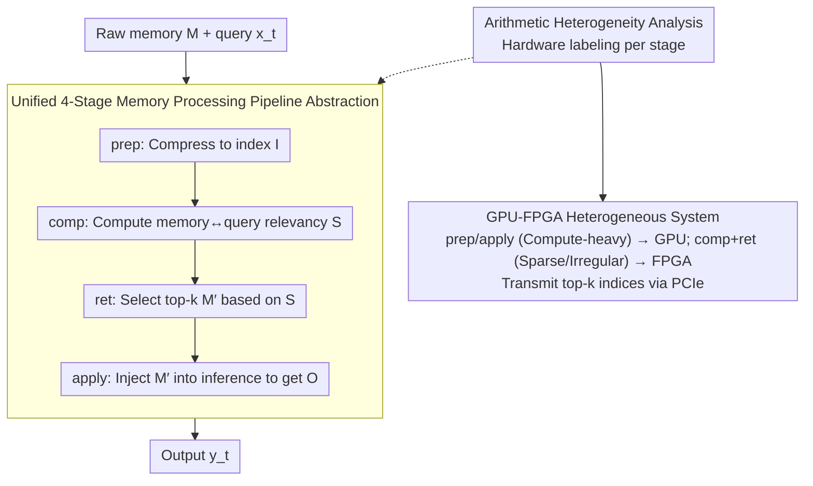

# Understand and Accelerate Memory Processing Pipeline for Large Language Model Inference

**Conference**: ICML 2026  
**arXiv**: [2603.29002](https://arxiv.org/abs/2603.29002)  
**Code**: https://github.com/OswaldHe/HeteroLLM (Available)  
**Area**: Information Retrieval / LLM Inference Acceleration / Heterogeneous Systems  
**Keywords**: Long Context, Sparse Attention, RAG, Memory Processing Pipeline, GPU-FPGA  

## TL;DR
This paper unifies optimizations for modern long-context LLM inference—such as sparse attention, RAG, and compressed context memory—into a four-stage "Prepare Memory → Compute Relevancy → Retrieval → Apply to Inference" memory processing pipeline. It quantitatively demonstrates that this pipeline accounts for 22%-97% of total latency and exhibits highly heterogeneous computational characteristics across stages. Based on these insights, a GPU-FPGA heterogeneous system is proposed: compute-intensive/regular operations remain on the GPU, while memory-intensive/sparse/irregular operations are offloaded to the FPGA. Evaluated on MI210 + Alveo U55C, the system achieves up to 2.2× end-to-end acceleration and a 4.7× reduction in energy consumption.

## Background & Motivation

**Background**: Supporting 128k-1M tokens has become standard for modern LLMs (e.g., storing KV cache for 1M tokens in GPT-OSS-120B requires 69GB of GPU memory). Various long-context optimization schemes have emerged: sparse attention (DeepSeek Attention, SeerAttention-R, LServe), RAG (DRAGIN, FLARE, two-stage RAG), compressed context memory (Titans, HMT, MemAgent), and TTT (LaCT).

**Limitations of Prior Work**: (1) Existing literature treats these methods as isolated techniques, lacking a unified abstraction, which hinders cross-method system reuse. (2) There is a lack of systematic profiling regarding the actual overhead of these "memory optimizations" within end-to-end latency and where the bottlenecks lie. (3) Memory access patterns, arithmetic intensities, and data dependencies vary significantly across methods, yet all are defaulted to GPUs, resulting in GPUs being over-utilized for dense regular computation but severely under-utilized for sparse/irregular operations.

**Key Challenge**: LLM computation is evolving from "GEMM-dominant" to a "hybrid of GEMM and sparse/irregular/memory-intensive operations," but the underlying hardware (pure GPU) remains optimized for the former. The mismatch between algorithmic characteristics and hardware structure is intensifying.

**Goal**: (i) To provide a unified abstraction that frames all long-context optimizations as a single pipeline; (ii) To systematically quantify the latency contribution and heterogeneity of arithmetic intensity for each stage; (iii) To design a GPU-FPGA heterogeneous system to validate the potential for tailored acceleration.

**Key Insight**: LLM inference is decomposed into "memory generation $g(\cdot)$ + memory processing $f(\cdot,\cdot)$" (Def 3.1), with a focus on $f$. All $f$ functions are reframed as a four-stage pipeline with consistent input/output schemas per stage, allowing for independent optimization and hardware mapping.

**Core Idea**: Replace multiple end-to-end GPU implementations of individual optimization methods with a "unified four-stage pipeline + heterogeneous hardware mapping based on arithmetic intensity." This compresses algorithmic diversity into four-stage configurations and leverages GPUs and FPGAs for their respective strengths.

## Method

### Overall Architecture
The objective is to address the fragmentation and hardware mismatch of various "memory optimizations" in long-context LLM inference. The approach involves two steps: first, formalizing the LLM generative model as $L(g, f, \{x_i\}_{i<t}, x_t)=y_t$, where $M_{<t}=g(\{x_i\}_{i<t})$ is the generated memory and $O_{<t}=f(M_{<t}, x_t)$ is the intermediate output of the memory processor. Second, all long-context optimizations are reframed as implementations of $f$ following a mandatory four-stage pipeline: $\text{prep}(M_{<t})=I_{<t}$ (compressing raw memory into a searchable index), $\text{comp}(I_{<t}, x_t)=S$ (calculating relevancy scores between memory and query), $\text{ret}(M_{<t}, S)=M'_{<t}$ (selecting top-$k$ or threshold-based memory), and $\text{apply}(M'_{<t}, x_t)=O_{<t}$ (injecting selected memory into inference). On top of this abstraction, a heterogeneous platform comprising an AMD MI210 GPU + Alveo U55C FPGA + PCIe is built, mapping each stage to the appropriate hardware based on arithmetic intensity.

### Key Designs

**1. Unified 4-Stage Pipeline Abstraction: Compressing Algorithmic Diversity into Configurations**
Prior literature treats sparse attention, RAG, Titans/HMT, MemAgent, and TTT as isolated. This paper deconstructs them using the four-stage schema (Table 1). For example, in DeepSeek Attention, `prep` involves linear projection + RoPE, `comp` is multi-head dot product, `ret` is top-$k$, and `apply` is fine-grained sparse attention. MemAgent skips `comp`, with `prep` as decoding-based summarization and `apply` as model prefilling. TTT's `prep` is backpropagation while `comp` is loss calculation. Unified schemas allow kernels like top-$k$ or BM25 to be reused across methods and enable the system to bypass unnecessary stages without overhead.

**2. Computational Heterogeneity Analysis: Labeling Stages by Arithmetic Intensity**
The calculations across the four stages vary significantly. Quantitative characterization is performed along two dimensions: arithmetic intensity (FLOPs/byte) and memory access patterns (regular vs. irregular) (Table 2). In sparse attention, `prep` (linear proj, 10-100 FLOPs/byte, regular) and `apply` (fine-grained sparse attention, 10-100 FLOPs/byte, regular) are compute-bound. Conversely, `comp` (skinny matrix-vector, 1-10 FLOPs/byte) and `ret` (top-$k$, ~1 FLOPs/byte, irregular with cross-memory dependencies) are memory-bound. RAG's `comp` (BM25) is particularly irregular. GPUs excel at regular dense computation but achieve <30% peak HBM bandwidth utilization on irregular memory-bound operations, whereas FPGAs offer a ~5× SRAM bandwidth advantage via customizable microarchitectures.

**3. GPU-FPGA Heterogeneous System + Streaming Dataflow Kernel**
Stages are dispatched based on deployment types: General Setup (sparse attention + RAG) keeps `prep` + `apply` on the GPU and offloads fused `comp` + `ret` kernels to the FPGA, transmitting only top-$k$ indices via PCIe. Synthesized Memory (MemAgent) follows prefill-decode disaggregation, running decoding on the FPGA and prefilling on the GPU. Memory as Context (Titans/HMT) stores all memory embeddings on the FPGA, returning retrieved memory to the GPU via PCIe. The FPGA utilizes a three-level SRAM hierarchy (BRAM 21.8 TB/s + URAM 10.4 TB/s + HBM 460 GB/s), prioritizing key vectors in faster BRAM based on token ID, with overflow to URAM/HBM. A streaming dataflow fuses the dot-product engine and top-$k$ retriever to avoid GPU kernel launch overhead and unnecessary off-chip access.

### Mechanism
This is a pure inference system work with no training loss. Baseline evaluations include: DeepSeek Attention (vLLM + DeepSeek V3.2 Exp), SeerAttention-R (Qwen3-8B + TileLang), LServe (Llama 3.1-8B), RAG (Llama-2-7B/3.1-8B + Wikipedia), Titans/HMT, MemAgent (Qwen2.5-7B), and LaCT/TTT. The FPGA is implemented using Vitis HLS 2024.2 + Vivado 2024.2 with P2P DMA.

## Key Experimental Results

### Main Results

Acceleration for Memory Processing and End-to-End (Baseline: Single GPU):

| Method | Memory Proc Gain | End-to-End Gain | Energy Saving |
|------|--------------|------------|----------|
| DeepSeek Attention | 1.3-2.2× | 1.1-1.2× | 1.61× geomean |
| SeerAttention-R (Top-$k$) | 1.8-2.2× | up to 1.49× | 1.11× |
| SeerAttention-R (Threshold) | 2.6-4.9× | - | 1.14× |
| LServe | 1.2-5.6× | up to 1.49× | 1.43× |
| DRAGIN (RAG) | 5.2-7.7× | up to 2.2× | 1.10× |
| FLARE (RAG) | 5.1-6.6× | - | 1.14× |
| FS-RAG | 5.1-6.6× | - | 1.21× |
| Two-stage RAG | 1.1-2.1× | 1.47-1.84× | 1.07× |
| MemAgent | - | 1.8× | **4.66×** |
| Titans/HMT (Memory-as-Context) | 3.1-4.0× | 1.3-1.6× | 1.65× |

Latency Profiling: At 1M tokens, sparse attention accounts for 22%-81% of latency. RAG with 20M documents takes 40%-61%. MemAgent's `prep` stage can account for **97%** of step latency, proving memory processing is the primary bottleneck.

### Ablation Study

| Configuration | Observations |
|----------|---------|
| Batch Size Sweep (BS=1 → 32) | Sparse attention gain increases from 1.07× to 1.32-1.83×. |
| RAG Batch Sweep | DRAGIN gain increases from 1.14× to 1.92× as BM25 is non-shareable. |
| Memory-as-Context Batch | Gain decreases (1.48→1.15×) as linear proj utilization increases on GPU. |
| MemAgent BS=8/32 | Gain drops to 0.49/0.13×; system falls back to GPU-only mode. |
| FPGA On-chip SRAM | Achieves ~5× higher effective bandwidth than GPU SRAM. |
| PCIe Overhead | ~3 orders of magnitude lower than end-to-end latency; negligible. |

### Key Findings
- **MemAgent achieves 4.66× energy savings**: Prefill-decode disaggregation maps memory-intensive decoding to FPGA and compute-intensive prefilling to GPU, hitting hardware sweet spots.
- **Latency proportion is non-monotonic with sequence length**: In two-stage RAG, the reranker saturates after 500K documents; for sparse attention, the bottleneck only becomes dominant (22-81%) at 1M tokens.
- **MemAgent slows down at BS > 4**: Highlights FPGA's weakness in dense decoding (lower weight reuse than GPU); system addresses this via BS-aware dynamic scheduling.
- **Architecture over Process**: Using an older, cheaper U55C FPGA still yields significant gains, showing benefits stem from hardware-algorithm alignment rather than process node advantages.

## Highlights & Insights
- **Methodological value of the "4-Stage Pipeline"**: Compresses 8+ long-context optimizations into one schema, allowing new algorithms to be integrated as stage configurations.
- **Actionable framing via Arithmetic Intensity**: Provides clear criteria for hardware mapping, moving beyond vague "FPGA vs. GPU" debates.
- **Negligible PCIe Overhead**: Proves that GPU-FPGA collaboration does not strictly require tight-coupling (NVLink/CXL) for significant gains.
- **BS-aware Dynamic Scheduling**: The MemAgent fallback mechanism demonstrates that hardware acceleration should be managed based on workload conditions.
- **Dataflow + 3-level SRAM Hierarchy**: Mapping hardware hierarchy to algorithmic access patterns (prioritizing recent tokens) is an elegant design pattern.

## Limitations & Future Work
- Evaluation is limited to single GPU-FPGA nodes; scalability in MoE or tensor-parallel scenarios is unverified.
- Manual FPGA kernel writing is currently required; design automation for new methods is a future priority.
- Compute-dominant methods like TTT/LaCT do not benefit from FPGA offloading, indicating specific applicability boundaries.
- Lack of comparison with dedicated LLM ASICs (e.g., Groq, SambaNova) makes the cost-performance relative position unclear.

## Related Work & Insights
- **Vs. Isolated Algorithms (e.g., DeepSeek Attention)**: This is a meta-level framework for unified acceleration rather than a new algorithm.
- **Vs. Prefill-decode Disaggregation**: MemAgent deployment adapts this paradigm specifically for the memory processing pipeline.
- **Vs. FlashAttention**: FlashAttention optimizes the attention operator; this work optimizes the surrounding memory pipeline. They are orthogonal and stackable.
- **Inspiration**: The "memory processing" perspective can be extended to multi-modal and agentic LLMs.

## Rating
- Novelty: ⭐⭐⭐⭐
- Experimental Thoroughness: ⭐⭐⭐⭐⭐
- Writing Quality: ⭐⭐⭐⭐
- Value: ⭐⭐⭐⭐⭐

<!-- RELATED:START -->

## Related Papers

- [\[ICLR 2026\] TokMem: One-Token Procedural Memory for Large Language Models](../../ICLR2026/information_retrieval/tokmem_one-token_procedural_memory_for_large_language_models.md)
- [\[ECCV 2024\] Towards Open-Ended Visual Recognition with Large Language Model](../../ECCV2024/information_retrieval/towards_open-ended_visual_recognition_with_large_language_models.md)
- [\[ICLR 2026\] Your Language Model Secretly Contains Personality Subnetworks](../../ICLR2026/information_retrieval/your_language_model_secretly_contains_personality_subnetworks.md)
- [\[ACL 2025\] SafeRAG: Benchmarking Security in Retrieval-Augmented Generation of Large Language Model](../../ACL2025/information_retrieval/saferag_benchmarking_security_in_retrieval-augmented_generation_of_large_languag.md)
- [\[ICML 2026\] Understanding LoRA as Knowledge Memory: An Empirical Analysis](understanding_lora_as_knowledge_memory_an_empirical_analysis.md)

<!-- RELATED:END -->
