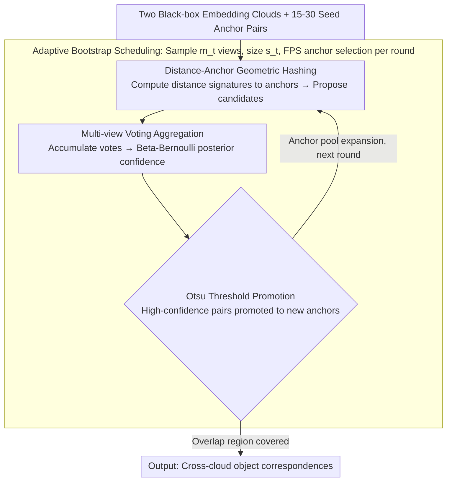

# Vector Linking based on Cross-Model Local Isometric Consistency

**Conference**: ICML 2026  
**arXiv**: [2605.31100](https://arxiv.org/abs/2605.31100)  
**Code**: https://github.com/DBgroup-Edinburgh/VecLinking  
**Area**: Information Retrieval / Vector Databases / Embedding Alignment  
**Keywords**: Vector Linking, Local Geometric Consistency, Embedding Alignment, Multi-view Hashing, Bootstrapping

## TL;DR
This paper introduces the problem of vector linking—discovering object correspondences between embedding clouds produced by two different encoders under black-box constraints. The core observation is that independently trained contrastive learning encoders maintain local isometric consistency (similarity preserved up to a scaling factor) over short distances. Based on this, a multi-view geometric hashing bootstrap framework is proposed, requiring only 15-30 seed pairs to recover 79-90% of overlapping objects.

## Background & Motivation

**Background**: Embedding models evolve rapidly, and in practice, multiple systems often employ different fine-tuned encoders. Existing vector indices containing the same objects have incomparable representations, making cross-index retrieval, deduplication, and clustering difficult.

**Limitations of Prior Work**: Traditional embedding alignment methods assume global isomorphism and rely on global linear/OT transformations. However, vector linking faces partial unknown overlaps—where non-overlapping regions are not simple outliers but are structured and potentially large. Global alignment in non-overlapping regions deteriorates correspondences in the overlapping segments while trying to improve the fit.

**Key Challenge**: Black-box constraints (access only to static vectors, no model parameters/gradients/training data) combined with partial unknown overlaps make a single global transformation unreliable.

**Goal**: Recover large-scale vector correspondences from a tiny seed set (15-30 pairs) under black-box constraints.

**Key Insight**: Independently trained contrastive encoders maintain a strong correlation at short distances (Pearson > 0.8), which degrades rapidly at long distances. This suggests that local neighborhoods are more stable than global permutations.

**Core Idea**: Replace original distances with "signatures of distances to anchors"—this relative distance pattern maintains similarity (up to scaling) across models within local neighborhoods. Model-specific distortions are filtered through multi-view voting aggregation.

## Method

### Overall Architecture

GEH (Geometric Embedding Hashing) addresses the following: given two embedding clouds from black-box encoders and only 15-30 pairs of known correspondences (seed anchors), how to pair vectors pointing to the same object across clouds. It decomposes this into an iterative bootstrapping loop: each round samples several "small views" from the current anchor pool; each view maps all vectors to an independent hash space defined by anchors to propose candidate pairings. Evidence from these pairings is aggregated across views, and the most reliable new correspondences—determined by posterior confidence—are promoted to anchors for the next round, iteratively expanding the seed set to cover the entire overlap region.

### Key Designs

**1. Distance-Anchor Geometric Hashing: Use relative distance signatures instead of incomparable absolute coordinates**

The fundamental obstacle to vector linking is that coordinate systems of independently trained encoders are incomparable, and absolute distances carry individual scale distortions. GEH overcomes this by assigning each vector a "distance signature to anchors": given a set of paired anchors $\mathcal{A}=\{(a_1,a'_1),\ldots,(a_k,a'_k)\}$, the signature of vector $u$ is its distance vector to all anchors $\mathbf{r}_{\mathcal{A}}(u):=(\text{dist}(u,a_1),\ldots,\text{dist}(u,a_k))$. Cross-model pairing is measured by scale-invariant similarity after normalization: $\text{sim}_{\mathcal{A}}(u,v):=\langle\widehat{\mathbf{r}}_{\mathcal{A}}(u),\widehat{\mathbf{r}}'_{\mathcal{A}}(v)\rangle$. The cross-model comparability of this signature is supported by the Local Isometric Theory (Theorem 1): two locally optimal contrastive encoders maintain proportional distances at short ranges, i.e., $\|f_1(x)-f_1(y)\|=\kappa\cdot\|f_2(x)-f_2(y)\|+\mathcal{O}(d_{\mathcal{M}}(x,y)^2)$, with scaling factor $\kappa=\sqrt{\lambda_1/\lambda_2}$. Since similarity is normalized and insensitive to $\kappa$, the signature captures relative geometry ("who is closer to whom") in local neighborhoods, bypassing absolute distances and global isomorphism assumptions.

**2. Multi-view Voting Aggregation: Rely on statistical stability rather than thresholds to distinguish true links from noise**

Candidate pairings in a single view can be contaminated by model-specific distortions, and the distance threshold $\delta_{\mathcal{M}}$ where local consistency holds is difficult to pre-determine. Instead of tuning thresholds, GEH observes how many views repeatedly propose a pairing. The accumulated supporting votes for candidate pair $(u,v)$ is $\nu_{(u,v),t}:=\sum_{r,k}Y_{r,k}(u,v)$. True correspondences are proposed whenever they fall into views containing locally correlated anchors, resulting in concentrated votes (median ~48 votes in Fig 2), whereas false collisions from distortions lack consistent support and decay exponentially. Feeding votes into a Beta-Bernoulli conjugate posterior $\theta_{(u,v)}\mid\mathcal{Y}\sim\text{Beta}(1+\nu_{(u,v),t},\,1+N_{\leq t}-\nu_{(u,v),t})$ allows for automatically learning a confidence score for each pair without manual thresholds.

**3. Adaptive Bootstrap Scheduling: Dynamic resampling as anchors grow to balance locality and coverage**

The 15 seed pairs cannot cover the global space, and excessively large single views violate the local isometry premise due to distant anchors. Thus, view size and quantity must be adjusted dynamically. GEH samples $m_t:=\lceil m_0(1+c\log g_t)\rceil$ views in round $t$, each of size $s_t:=\lceil\rho_0|\mathcal{L}_{t-1}|/\text{sf}_t\rceil$. As the anchor pool grows, the number of views increases while individual view size decreases, maintaining locality within views while recovering global coverage through quantity. Anchors within views are selected via Greedy Farthest Point Sampling (FPS) to ensure diversity. The promotion threshold $\tau_t$ is adaptively determined from the vote distribution using the Otsu method.

## Key Experimental Results

### Main Results

| Model Pairs | Dataset | Prec/Rec/F1 (%) | Second best method | Gain |
|-------------|---------|-----------------|---------------------|------|
| Mistral-OpenAI | FiQA | **82.1/95.6/88.3** | Proc 52.5/11.8/19.3 | +68.9% F1 |
| GTE-OpenAI | ArguAna | **77.1/84.5/80.7** | Proc 30.8/4.8/8.4 | +71.8% F1 |
| Qwen-KaLM | FiQA | **79.8/79.9/79.8** | Proc 20.6/1.3/2.4 | +58.0% F1 |

(Overlap $\alpha=0.3$, 15 seed pairs)

### Ablation Study (SciDocs, Mistral vs OpenAI, $\alpha=0.15$, 15 seeds)

| Config | Prec (%) | Rec (%) | F1 (%) | Description |
|--------|----------|---------|--------|-------------|
| Full GEH | 62.1±1.1 | 81.7±0.7 | 70.5±0.6 | Baseline |
| w/o Kernel | 61.0±8.3 | 52.9±35.0 | 51.0±33.3 | Long-distance instability |
| w/o FPS Sampling | - | - | - | Random sampling drop |
| w/o Post. Aggregation | - | - | - | Fixed threshold failure |

### Key Findings
- **Ultra-low seed effectiveness**: Performance with 15 pairs is comparable to 30 pairs; all baselines require 30-50 pairs.
- **Large-scale scalability**: Achieved 93.8% precision and 68.9% recall on FEVER (5.4M texts) in 3328s using a single A100.
- **Cross-encoder robustness**: Testing across 5 model pairs and 6 datasets shows that multi-view voting is the core of stability.

## Highlights & Insights
- **Local Isometric Theory**: Theorem 1 rigorously proves that contrastive encoders maintain local distance proportions, breaking the assumption that black-box embedding alignment requires global isomorphism.
- **Statistical Design of Multi-view Voting**: The Beta-Bernoulli conjugate requires no parameter tuning, and the Otsu adaptive threshold is entirely data-driven. The separation of signal from noise (median 48 vs exponential decay) is a core insight.
- **Transferable Hashing Ideology**: Distance-anchor signatures are not limited to text embeddings and can be applied to any vector set; the multi-view voting framework is applicable to any model pairs with local consistency.

## Limitations & Future Work
- **Assumption Limitations**: Local positive sampling and isotropy assumptions may not hold for strong data augmentation or specific domains; second-order Taylor expansion errors might be significant in high dimensions.
- **Parameter Sensitivity**: Hyperparameters for view scheduling like $s_t, m_0, c$ were not fully analyzed.
- **Improvements**: Extending the theory to weak contrastive encoders; meta-learning for adaptive $s_t$ scheduling; offline-online hybrid strategies for large-scale deployment.

## Related Work & Insights
- **vs Traditional Point Set Registration (RANSAC/ICP/Geometric Hashing)**: The latter target 3D rigid bodies in low-dimensional space; this work handles high-dimensional heteroscedastic model distortion and partial overlap.
- **vs Global Alignment (Procrustes/OT)**: This work is local-first and requires no global isomorphism; multi-view voting is more robust against partial overlap destruction than global fitting.
- **Inspiration**: Alignment problems require a "problem-specific" geometric perspective rather than universal optimization.

## Rating
- **Novelty**: ⭐⭐⭐⭐⭐ First to formalize the vector linking problem; theoretical proof of local isometry in contrastive encoders; unprecedented black-box multi-view bootstrap framework.
- **Experimental Thoroughness**: ⭐⭐⭐⭐⭐ 6 BEIR datasets × 5 model pairs × 9 configurations + 5.4M large-scale test + complete ablation.
- **Writing Quality**: ⭐⭐⭐⭐ Clear theory and comprehensive experiments; powerful visualizations; limited discussion on constraints.
- **Value**: ⭐⭐⭐⭐⭐ Solves a core challenge in cross-model vector database integration.

<!-- RELATED:START -->

## Related Papers

- [\[ICML 2026\] HGMem: Hypergraph-based Working Memory to Improve Multi-step RAG for Long-Context Complex Relational Modeling](hgmem_hypergraph-based_working_memory_to_improve_multi-step_rag_for_long-context.md)
- [\[ICML 2026\] ReSeek: A Self-Correcting Framework for Search Agents with Instructive Rewards](reseek_a_self-correcting_framework_for_search_agents_with_instructive_rewards.md)
- [\[ICML 2026\] Graph-R1: Towards Agentic GraphRAG Framework via End-to-end Reinforcement Learning](graph-r1_towards_agentic_graphrag_framework_via_end-to-end_reinforcement_learnin.md)
- [\[ICML 2026\] ParisKV: Fast and Drift-Robust KV-Cache Retrieval for Long-Context LLMs](pariskv_fast_and_drift-robust_kv-cache_retrieval_for_long-context_llms.md)
- [\[ICML 2026\] ML-Embed: Inclusive and Efficient Embeddings for a Multilingual World](ml-embed_inclusive_and_efficient_embeddings_for_a_multilingual_world.md)

<!-- RELATED:END -->
