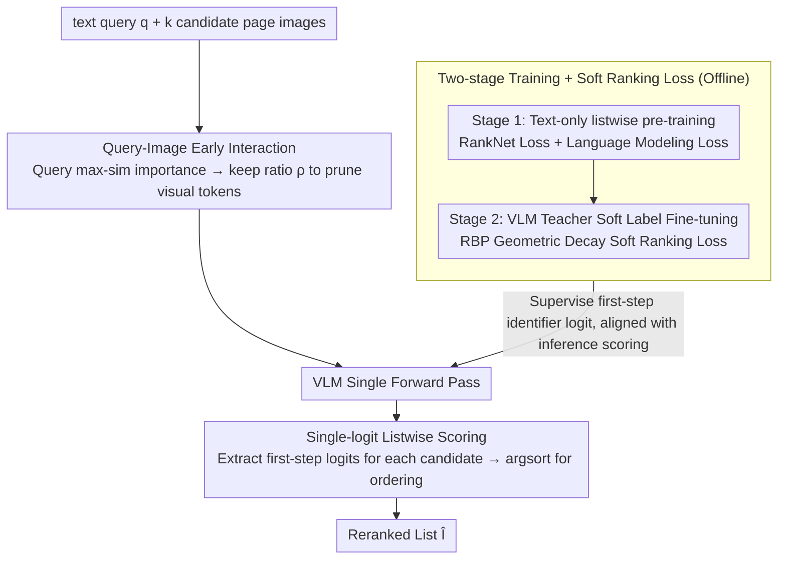

# Very Efficient Listwise Multimodal Reranking for Long Documents

**Conference**: ICML 2026  
**arXiv**: [2605.11864](https://arxiv.org/abs/2605.11864)  
**Code**: <https://github.com/dukesun99/ZipRerank>  
**Area**: Information Retrieval / Multimodal RAG / Efficient Inference  
**Keywords**: listwise reranking, VLM, visual token pruning, single-step decoding, teacher distillation

## TL;DR
ZipRerank simultaneously addresses the two major bottlenecks of VLM listwise reranking—"excessive visual token sequence length" and "token-by-token output of rankings via autoregressive decoding"—by utilizing query-aware token pruning and single-logit scoring. It reduces LLM inference latency by an order of magnitude on MMDocIR while matching or exceeding the current SOTA, MM-R5.

## Background & Motivation
**Background**: Vision-centric long document retrieval (M-RAG, Document VQA) typically adopts a "retrieval + reranking" two-stage architecture. The first stage (DSE, ColPali, etc.) performs large-scale similarity retrieval, while the second-stage reranker further refines the top-$k$ candidate pages. Listwise rerankers process all candidates at once and are theoretically more efficient than pointwise ones. The latest MM-R5 achieved SOTA on MMDocIR by introducing CoT reasoning.

**Limitations of Prior Work**: The practicality of methods like MM-R5 is hindered by two latency bottlenecks: (i) Prefill length explosion: Each candidate page is a high-resolution image contributing hundreds to thousands of visual tokens, with input sequences easily exceeding 10,000 for $k=10$ candidates; (ii) Autoregressive decoding: The output length of CoT + ranking grows linearly with $k$, and sequence dependencies cannot be bypassed even with KV caching. Consequently, MM-R5 takes 3.82s per reranking, making it difficult to deploy in real-time M-RAG.

**Key Challenge**: The tension between "accuracy (requiring long context + reasoning chains)" and "latency (requiring shortened sequences + single-step results)." Pruning visual tokens risks losing critical evidence, while removing CoT risks losing ranking capability.

**Goal**: (i) Decompose latency into prefill and decode components and optimize them separately; (ii) Design a single-step listwise scoring mechanism to eliminate autoregression; (iii) Introduce query-aware visual pruning to mitigate prefill explosion; (iv) Learn robust listwise behavior even under weak supervision (where VQA provides only one positive example).

**Key Insight**: The authors noted an interesting two-stage strategy—one can first learn "general listwise behavior" on large-scale text-only reranking data, and then perform soft supervision on multimodal data using a strong VLM teacher, decoupling "learning ranking" from "learning multimodality." Simultaneously, they observed that generating a full ranking sequence is unnecessary during inference; only the first-step logit of candidate identifiers (A, B, C...) is needed for ordering.

**Core Idea**: Training employs a "two-stage (text-only listwise pre-training + multimodal fine-tuning with VLM teacher soft labels)" approach. Inference utilizes "query-aware visual pruning + single-logit scoring," compressing listwise multimodal reranking into a single forward pass.

## Method

### Overall Architecture
ZipRerank aims to solve the slowness of VLM listwise reranking: given a text query $\bm{q}$ and $k$ candidate page images $\bm{I}=(I_1,\dots,I_k)$ from the first stage, it outputs a reranked list $\hat{\bm{I}}=(I_{\pi(1)},\dots,I_{\pi(k)})$. It models the latency source as $F(n,u)\approx L(c_{\text{att}}dn^2+c_{\text{ffn}}d^2n)+uLdn\cdot c_{\text{dec}}$—where prefill grows quadratically with visual token count $n$ and decode grows linearly with generation length $u$. It tackles each term: in inference, query-aware pruning reduces $n$ and single-logit scoring sets $u=1$; in training, it injects ranking capability via two stages (text-only listwise pre-training + multimodal fine-tuning with VLM teacher soft labels), enabling the model to assign comparable scores to single-token identifiers (A, B, ...) even under weak supervision.

### Key Designs

**1. Two-stage Training + Soft Ranking Loss: Decoupling "General Ranking" and "Visual Alignment"**

Multimodal document retrieval data inherently contains only one positive example (the VQA annotation). Directly applying hard listwise supervision leads to overfitting teacher noise. Thus, the authors split learning into two parts. Stage 1 involves full supervision on text-only reranking corpora (passages rendered as page-like images) using RankNet loss $\mathcal{L}_{\text{ranknet}}=\sum_{r_i<r_j}w_{i,j}\log(1+\exp(s_j-s_i))$ (with weights $w_{i,j}=1/(r_i+r_j)$) alongside language modeling loss $\mathcal{L}_{\text{LM}}$ to establish general listwise capability. Stage 2 uses multimodal VQA-style data where GPT-5 acts as a teacher to produce full rankings. Since the teacher may be noisy, instead of hard labels, a soft ranking loss $\mathcal{L}_{\text{softrank}}=-\sum_i q_i\log p_i$ is introduced. The target distribution $q_{\pi(k)}=\gamma^k/\sum_{\ell=0}^{m-1}\gamma^\ell$ uses geometric decay based on Rank-Biased Precision ($\gamma\in(0,1)$ controls tolerance for lower ranks). This target anchors the true positive while assigning descending weights to plausible candidates, aligning with the RBP assumption that "users browse from top to bottom," making it robust to teacher noise. Both stages directly supervise the first-step identifier logits to align with the inference scoring protocol.

**2. Query-Image Early Interaction: Pruning Irrelevant Visual Tokens via Query Semantics**

Many patches in long document pages are blank, decorative, or irrelevant chart regions that consume $O(n^2)$ attention computation. ZipRerank filters image tokens before they enter the attention mechanism. It first runs the LLM on the "prompt prefix up to the first image token" to extract $N_q$ hidden states $\bm{H}_q\in\mathbb{R}^{N_q\times D}$ corresponding to the query. For each candidate image $i$, it calculates max-sim importance $a_{i,j}=\max_{1\le t\le N_q}\cos(\bm{h}_t,\bm{v}_{i,j})$ for its pre-computed visual tokens $\bm{V}_i$. It keeps the top-$\mathrm{round}(\rho N_i)$ tokens based on a keep ratio $\rho$, resulting in pruned tokens $\tilde{\bm{V}}_i$. This reduces prefill complexity from $O(n^2)$ to $O((\rho n)^2)$. Original RoPE positional encodings are retained after pruning, and prefix computation is reused via KV cache, making query hidden state extraction almost zero-cost. Max-sim is used instead of mean-pooling to preserve sparse critical patches (e.g., specific numbers or key phrases) related to any single query token. Theoretical analysis in the appendix further proves that when the tail mass $\varepsilon$ of pruned tokens in the original attention is small, the change in attention output is bounded by $O(\varepsilon)$, ensuring pruning safety.

**3. Single-logit Listwise Scoring: One Forward Pass + Argsort Replacing Autoregressive Decoding**

Autoregressive rerankers must re-attend to the long context at each step, and KV caching cannot prevent the step count from growing linearly with $k$, making decoding the second latency bottleneck. ZipRerank collapses this into a single step: during training, the model is taught to treat the first token of the target ranking as the scoring key, using RankNet/Softrank to supervise logits $s_i$ for each candidate identifier token $t_i$ at this step. During inference, a single forward pass yields the first-step logit vector $\bm{z}\in\mathbb{R}^{|\mathcal{V}|}$, and the order is determined by $\pi=\mathrm{argsort}_{\downarrow}(z_{t_1},\dots,z_{t_k})$, completely eliminating decoding latency. This is effective because listwise ranking is essentially about relative preference; the single logit already carries information about a candidate's relative position among all candidates, provided the training objective is aligned. This idea, validated for text by Gangi Reddy 2024 et al., is extended here to VLM listwise reranking for the first time.

### Loss & Training
The total losses for the two stages are $\mathcal{L}_{\text{stage1}}=\mathcal{L}_{\text{LM}}+\lambda_1\mathcal{L}_{\text{ranknet}}$ and $\mathcal{L}_{\text{stage2}}=\mathcal{L}_{\text{LM}}+\lambda_2\mathcal{L}_{\text{softrank}}$, respectively. During inference, $u=1$ and $n$ is controlled by the keep ratio $\rho$, allowing for a smooth trade-off between accuracy and latency by adjusting $\rho$.

## Key Experimental Results

### Main Results
On page-level retrieval tasks across 9 domains in MMDocIR, using DSE-wiki-ss as the first-stage retriever to rerank top candidates, Recall@1/3/5 and LLM latency (seconds/query) were recorded:

| Method | Macro R@3 | Micro R@3 | Latency (s) |
| :--- | :--- | :--- | :--- |
| DSE-wiki-ss (Retriever) | 69.5 | 70.2 | – |
| UniME (Listwise) | 70.9 | 71.4 | 0.24 |
| LamRA (Listwise) | 77.6 | 77.8 | 0.53 |
| MM-R5 (CoT) | 79.1 | 79.0 | 3.82 |
| GPT-5-mini | 88.0 | 88.3 | 23.38 |
| **Ours (ZipRerank)** | **84.8** | **84.5** | **0.36** |
| ZipRerank-50% (Aggressive Pruning) | 83.4 | 83.4 | 0.30 |

Ours outperforms MM-R5 across the board while reducing latency from 3.82s to 0.36s (approx. $10.6\times$ speedup). It also narrows the R@3 gap with GPT-5-mini from ~9 points to ~3.2 points while being $65\times$ faster.

### Ablation Study

| Configuration | Key Metrics | Note |
| :--- | :--- | :--- |
| Full ZipRerank | Optimal | Two-stage training + Soft ranking + Token pruning + Single-logit scoring |
| w/o Stage 1 Text Pre-training | Significant drop | Lacks general listwise ability; difficult to learn ranking from weak multimodal supervision |
| w/o Soft-Ranking (using hard labels) | Drop | Teacher noise propagates directly, leading to overfitting suboptimal rankings |
| w/o Query-Aware Pruning (Full tokens) | Latency spikes ~3-5× | Marginal accuracy gain, proving pruned tokens are mostly redundant |
| w/o Single-Token Decoding (Autoregressive) | Latency doubles | Minimal accuracy change; single-logit scoring is highly cost-effective |
| Different keep ratio $\rho\in\{0.3, 0.5, 0.7, 1.0\}$ | Smooth trade-off | $\rho=0.5$ is Pareto optimal on MMDocIR |

### Key Findings
- Single-logit scoring has almost no negative impact on accuracy but offers massive latency benefits, indicating that listwise ranking information is indeed concentrated in the first-step logit. This aligns with the intuition that reasoning chains provide optimization directions, while the final rank is a 1-token decision.
- Query-aware token pruning is the other major time-saving lever. $\rho=0.5$ shows almost no drop in accuracy while cutting prefill complexity by nearly three-quarters. Visible drops only begin at 30%, suggesting that 50-70% of visual tokens in MMDocIR page images are redundant.
- Robustness gains from soft ranking loss are most evident in domains with small data or high teacher noise, proving that "listwise doesn't have to be hard rank; soft supervision is better for knowledge distillation."
- ZipRerank generally outperforms MM-R5 by about 5 points across domains but is weaker in "News," likely due to highly similar candidates (same topic, different pages), suggesting future work on domain-adaptive pruning thresholds.

## Highlights & Insights
- Decomposing latency into $F(n,u)\approx L(c_{\text{att}}dn^2+c_{\text{ffn}}d^2n)+uLdn\cdot c_{\text{dec}}$ in Section 3 as motivation is a rare example of explaining "why it is slow" via a single formula. Subsequent designs address each term: $n$ via pruning and $u$ via single-logit scoring, turning the "accuracy-latency" trade-off into two tunable hyperparameters.
- The combination of "text-then-multimodal" two-stage training and "teacher soft labels + geometric decay target" is an elegant paradigm for learning ranking behavior under the constraints of weak multimodal supervision but abundant text resources.
- Max-sim visual pruning can be interpreted as a "tight upper bound for smooth attention pooling." The authors provide an $O(\varepsilon)$ bound for attention output perturbation—a type of "engineering optimization with a theoretical sanity check" rarely seen in efficient VLM literature.

## Limitations & Future Work
- Single-logit scoring is naturally limited by the token vocabulary: when $k$ is large (candidates > alphabet size), the identifier set must be expanded, potentially causing conflicts with the tokenizer; the paper does not discuss $k>26$.
- Query-aware pruning poses higher risks for "visually dense" domains (e.g., academic figures, dense text PDFs). Ours was validated primarily on general MMDocIR and lacks a domain-adaptive $\rho$ strategy.
- Stage 2 relies on GPT-5 teachers for listwise soft labels; distillation costs and teacher availability are engineering hurdles. If the teacher's ranking capability is limited, the "upper bound" of the soft target is capped.
- No end-to-end comparison was made with recent hybrid retrievers (e.g., multi-vector ColPali + token reduction) for full-stack retrieval + reranking.
- Evaluation was limited to the MMDocIR benchmark; the performance in truly long-form (hundreds of pages) or cross-document scenarios remains unverified.

## Related Work & Insights
- **vs MM-R5 (Xu et al. 2025)**: MM-R5 uses CoT to reach SOTA, but the dual bottlenecks of autoregression and long context result in 3.82s latency. ZipRerank uses single-logit + token pruning to solve both, proving that "the benefits of reasoning chains can be distilled into the first-step logit," eliminating the need for runtime CoT.
- **vs FIRST / RankZephyr (Gangi Reddy 2024)**: Single-logit scoring was previously validated on text-only listwise reranking. ZipRerank extends this to multimodality and addresses the multimodal-specific issue of visual token pruning.
- **vs Light-ColPali / token reduction**: These works optimize the first-stage retriever's multi-vector search. ZipRerank complementarily optimizes the second-stage reranking; both can be combined for a more efficient full-stack system.
- **Insights**: (i) The "latency decomposition → term-by-term optimization" methodology is broadly applicable; (ii) "Teacher soft labels + geometric decay targets" is a universal template for distilling ranking behavior; (iii) "Query-aware visual token pruning" could become a standard preprocessing step for all query-conditioned VLM tasks.

## Rating
- Novelty: ⭐⭐⭐⭐ Single-logit scoring and max-sim pruning are not new individually, but their combination for multimodal listwise reranking, paired with two-stage distillation, constitutes a systematic innovation.
- Experimental Thoroughness: ⭐⭐⭐⭐ 9 domains × 3 Recall metrics × multiple baselines + keep ratio sweeps + training ablation. Comprehensive comparison, though limited to a single (albeit large) benchmark.
- Writing Quality: ⭐⭐⭐⭐⭐ Driven by a latency decomposition formula that guides the motivation and is answered in subsequent sections. Each component includes a theoretical sanity check (attention perturbation bounds).
- Value: ⭐⭐⭐⭐⭐ Reduces latency by an order of magnitude for MMDocIR/M-RAG without loss of accuracy. Directly applicable to production RAG systems with open-source code.

<!-- RELATED:START -->

## Related Papers

- [\[NeurIPS 2025\] AcuRank: Uncertainty-Aware Adaptive Computation for Listwise Reranking](../../NeurIPS2025/information_retrieval/acurank_uncertainty-aware_adaptive_computation_for_listwise_reranking.md)
- [\[ICML 2026\] ML-Embed: Inclusive and Efficient Embeddings for a Multilingual World](ml-embed_inclusive_and_efficient_embeddings_for_a_multilingual_world.md)
- [\[ICML 2026\] LazyAttention: Efficient Retrieval-Augmented Generation with Deferred Positional Encoding](lazyattention_efficient_retrieval-augmented_generation_with_deferred_positional_.md)
- [\[ICML 2026\] ParisKV: Fast and Drift-Robust KV-Cache Retrieval for Long-Context LLMs](pariskv_fast_and_drift-robust_kv-cache_retrieval_for_long-context_llms.md)
- [\[ICML 2026\] CARE: Class-Adaptive Expert Consensus for Reliable Learning with Long-Tailed Noisy Labels](care_class-adaptive_expert_consensus_for_reliable_learning_with_long-tailed_nois.md)

<!-- RELATED:END -->
