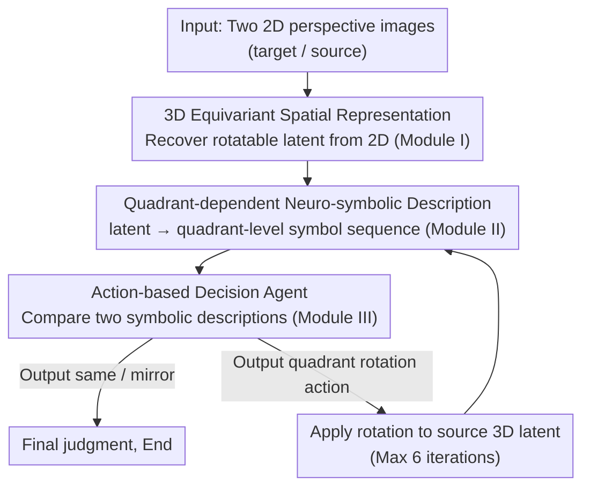

# A Deep Learning Model of Mental Rotation Informed by Interactive VR Experiments

**Conference**: ICML 2026  
**arXiv**: [2512.13517](https://arxiv.org/abs/2512.13517)  
**Code**: https://github.com/rkhz/menrot  
**Area**: Robotics / Spatial Reasoning / Cognitive Modeling  
**Keywords**: mental rotation, VR interaction, equivariant representations, neuro-symbolic models, spatial reasoning  

## TL;DR
This paper constrains model design using VR interactive experiments and proposes a mental rotation model composed of a 3D equivariant spatial encoder, a neuro-symbolic object encoder, and an MLP for action decision-making. The model replicates human mental rotation behavior in terms of accuracy, number of actions, and partial response time trends.

## Background & Motivation
**Background**: Mental rotation is a classic task in cognitive science for studying spatial representation. It involves showing participants two 3D Shepard-Metzler block shapes from different perspectives and asking them to judge whether they are the same or mirror-image objects. Classical results show that human response times typically increase linearly with the angular difference, a phenomenon long interpreted as the brain continuously rotating an internal representation in the "mind's eye."

**Limitations of Prior Work**: Modern vision models can achieve high accuracy on many 3D tasks, but few models simultaneously explain "how to judge" and "why response times and action counts resemble those of humans." Models focused solely on classification may achieve correct answers through "shortcuts" entirely different from human processes, failing as mechanistic models of mental rotation.

**Key Challenge**: Human behavior supports two seemingly conflicting views. On one hand, response times and neuro/psychophysical evidence suggest rotatable internal spatial representations. On the other hand, VR experiments show that humans typically perform only a few discrete, large-magnitude actions, suggesting that decisions might rely on abstract symbols or quadrant-level object descriptions.

**Goal**: The authors aim to construct a neural-network-based, executable mechanistic model of mental rotation that not only achieves human-level accuracy but also replicates the action patterns and certain response time patterns observed in VR experiments.

**Key Insight**: New VR experiments were conducted where participants could occasionally use a joystick to rotate the object on the right, allowing observation of their actual chosen rotation actions. The experiments found that humans usually perform approximately 1 "ballistic" large action and make a judgment once the object is placed within the quadrant range of the target, directly inspiring the "quadrant-dependent symbolic representation" hypothesis.

**Core Idea**: Use a spatial equivariant representation for the "ability to rotate," a symbolic object description to determine "how to rotate and when to judge," and a small decision agent to loop between the two.

## Method

### Overall Architecture
The methodology is supported by both experimental and modeling components. The experimental design utilizes a VR mental rotation task where 19 participants viewed Shepard-Metzler shapes composed of 10 adjacent cubes with 3 turns. Relative angles around the Y-axis were $0^\circ, 60^\circ, 120^\circ, 180^\circ$. In the No-Action condition, participants performed only mental rotation; in the Action condition, they could use a joystick to rotate the right-hand object. To avoid continuous visual feedback, the object disappeared during rotation, showing only an angular ring.

The VR behavior yielded two key observations. First, in the Action condition, humans performed an average of only 1.05 rotation actions, with each action averaging approximately $73.1^\circ$, indicating they do not continuously scan the angular space at a fixed speed. Second, after the final action, the right-hand object typically fell within the range of $[-45^\circ, +45^\circ]$ relative to the target, after which judgment was made quickly, suggesting a need only for coarse quadrant-level alignment.

The model stacks three modules based on these findings. Module I is a convolutional autoencoder styled after an Equivariant Neural Renderer, recovering a spatial latent from a single 2D image that can be manipulated by 3D rotation matrices. Module II is a Vision Symbolic Model that transforms the spatial latent into a serialized symbolic description of the Shepard-Metzler shape using a ViT encoder and an autoregressive Transformer decoder. Module III is an MLP decision-maker entering two symbolic descriptions and outputting either a "same / mirror" judgment or a required quadrant rotation action. If an action is output, it is applied to the 3D latent of the source, which is then re-encoded and re-evaluated until a match/mismatch judgment is reached or a 6-action limit is exceeded.

### Key Designs

**1. 3D Equivariant Spatial Representation: Making internal objects "rotatable"**

A prerequisite for mental rotation is an internal representation that can be manipulated by geometric transformations, rather than direct pixel classification—the latter easily learns shortcuts on training objects but fails on new shapes. Module I utilizes a convolutional autoencoder from Equivariant Neural Renderer: during training, it takes pairs of images of the same object in different poses, encodes one perspective into a latent, applies a 3D rotation matrix to transform the latent to the other pose, and decodes it to reconstruct the target view. For reconstruction to succeed, the latent must be equivariant to $SO(3)$ rotations—rotating the object corresponds to a predictable rotation operation in the latent space. Thus, the model can "rotate the object in the mind" by applying 3D rotation matrices directly to the internal latent without any 3D supervision.

**2. Quadrant-dependent Neuro-symbolic Object Description: Compressing continuous angles into discrete quadrant symbols**

VR experiments show that humans do not seek precise angular alignment but rather place objects into nearby "quadrants" before judging. This inspired the authors to divide the 360° view into 4 quadrants. In each quadrant, the shape is described by 9 directional transitions starting from the cube closest to the observer (each transition being one of up, down, forward, backward, left, or right). Consequently, the same object yields 4 structured but distinct symbolic sequences across the 4 quadrants. Module II (Vision Symbolic Model) uses a ViT encoder + autoregressive Transformer decoder to learn to predict these symbolic sequences from the 3D latent. This discrete, compositional quadrant symbol layer provides the abstract structure for subsequent action selection—comparison and decision-making occur at the quadrant level without needing precise alignment.

**3. Action-based Decision Agent: Deciding "rotate again or conclude" in symbolic space**

Module III is a small MLP that takes two symbolic descriptions (concatenated logits) as input and outputs one of five categories: same, mirror, clockwise one quadrant, counter-clockwise one quadrant, or two quadrants. During training, it learns these relational classifications without executing rotations. During inference, if a rotation action is output, it is applied to the source 3D latent, followed by symbolic re-encoding and a return to the decision agent. This recursive loop runs for a maximum of 6 steps. This "handful of discrete actions + anytime judgment" loop allows the model to retain the ability to rotate in the latent space while replicating the human behavior of making judgments after approximately one large action, rather than using an invariant classifier to skip the process entirely.

### Loss & Training
The three modules are trained independently. Module I is trained for equivariant reconstruction on 50,000 pairs of Shepard-Metzler images. Module II, with the EqNR encoder frozen, uses perspective data with a fixed $25^\circ$ elevation and varying azimuth to map 3D latents to symbolic sequences, using 201,600 image-symbolic description pairs. Module III is trained on 38,400 mental rotation relationship tasks. Testing is performed using unseen Shepard-Metzler objects, balancing match/mismatch conditions and four angular differences.

## Key Experimental Results

### Main Results

| Dataset / Setting | Metric | Ours | Human / Control | Conclusion |
|--------|------|------|----------|------|
| VR No-Action | Total Accuracy | N/A | 91.14% | Humans reliably complete the task via pure mental rotation |
| VR Action | Total Accuracy | N/A | 95.33% | Accuracy increases slightly with manipulation, revealing strategies |
| Held-out Shepard-Metzler | Total Accuracy | 96.13% | Human Action 95.33% | The model achieves near-human overall performance |
| Match / Mismatch | Accuracy | 96.39% / 95.87% | Human match 96.13%, mismatch 94.53% | The model does not bias towards a specific judgment type |
| Action Behavior | Avg. Action Pattern | Predominantly 0 at $0^\circ$, 1 at others | Human avg. 1.05 actions, single action mean $73.1^\circ$ | The model replicates the "few discrete actions" phenomenon |
| RT Trends | Explanatory Range | Explains growth from $0^\circ$ to $120^\circ$ | Human RT increases with angle in both conditions | Model fails to fully explain RT differences between $120^\circ$ and $180^\circ$ |

### Ablation Study

| Configuration | Key Metric | Description |
|------|---------|------|
| Siamese ResNet / ViT baseline | ~50% on test objects | Perfect on training objects, fails on new objects and 32% depth rotations |
| w/o Module I (Equivariance) | VSM cannot reliably encode symbols | Predicting symbols directly from 2D pixels is insufficient for the task |
| w/o Module II (Symbols) | 90.71% with ViT; 38.46% removing VSM | Symbolic modules, especially structured encoders, are critical for action-based solving |
| w/o actions, direct same/mirror | 97.03% | High accuracy, but fails to explain why humans perform rotation actions |
| 1-layer MLP + actions | 96.05% | Small decision-maker still completes the task and retains human-like action patterns |
| 1-layer MLP only same/mirror | 86.23% | Action-based decomposition offers more computational advantage than pure feedforward classification at low capacity |

### Key Findings
- VR experiments strongly support a discrete "jump" strategy: participants do not continuously observe the rotation but perform one or two large actions to move the object to roughly the same quadrant before judging.
- Accuracy alone is not sufficient evidence. A zero-action MLP classifier reaches 97.03% but bypasses the human-like process; thus, the joint matching of accuracy, action patterns, and RT trends is prioritized.
- Equivariant spatial representations and symbolic representations play distinct roles. The former allows geometric transformations of internal objects, while the latter enables compositional comparison and action selection.

## Highlights & Insights
- The most compelling aspect is the use of VR action data to constrain model architecture. Rather than building a deep model and explaining behavior post-hoc, the authors observed how humans rotate and embedded the "few large actions" and "quadrant-level symbols" into the model's hypotheses.
- The ablation study distinguishes "solving the task" from "solving the task like a human." A direct classifier may yield higher accuracy but ignores the action process, serving as a reminder that in cognitive modeling and embodied AI, process matching is often more important than final classification scores.
- The hybrid architecture provides insights for machine learning. Many vision models are fragile regarding pose changes and spatial reasoning; this work suggests that explicit equivariant latents and symbolic relationship readouts can serve as structural priors rather than relying solely on scale-induced emergence.

## Limitations & Future Work
- The model only handles Shepard-Metzler shapes and fixed Y-axis in-depth rotations, leaving a gap before reaching open-world 3D object manipulation.
- Latent rotation in Module I uses explicit 3D rotation matrices; a full biologically plausible mechanism is not yet provided.
- The model only partially explains response times, failing specifically to account for human RT differences between $120^\circ$ and $180^\circ$ conditions.
- Current symbolic descriptions are researcher-designed; whether humans use the same cube-transition encoding remains an open question.
- The VR experiment sample size is small (19 participants, with 4 excluded), requiring larger samples and more interactive conditions for verification.

## Related Work & Insights
- **vs. Shepard & Metzler**: Classical experiments used RT to infer continuous mental rotation; this work adds VR manipulation as new procedural evidence, supporting a mixed discrete+continuous mechanism.
- **vs. Pure Siamese Visual Classifiers**: Siamese ResNet/ViT can memorize training objects but are nearly random on unseen 3D objects; the equivariant spatial latent is better suited for cross-perspective generalization.
- **vs. 3D Shape Perception Models**: While some models predict human similarity judgments, they rarely generate sequential actions. This model explicitly models action selection, making it a better process model.
- **vs. Spatial Transformers / Equivariant Models**: Traditional geometric models focus on transformable representations; this paper adds symbolic descriptions and an agentic loop, turning geometric operations into interpretable cognitive strategies.

## Rating
- Novelty: ⭐⭐⭐⭐☆ Using VR interaction data to constrain a neuro-symbolic mental rotation model is a fresh approach.
- Experimental Thoroughness: ⭐⭐⭐⭐☆ Includes human experiments, held-out testing, and systematic ablations, though task variety is limited.
- Writing Quality: ⭐⭐⭐⭐☆ Clear methodology and strong links between phenomena and design; some details are scattered in appendices.
- Value: ⭐⭐⭐⭐☆ Insightful for spatial reasoning, cognitive modeling, and internal simulation in robotics, particularly in promoting "process-interpretable" evaluation.

<!-- RELATED:START -->

## Related Papers

- [\[ICML 2026\] Position: Zeroth-Order Optimization in Deep Learning Is Underexplored, Not Underpowered](position_zeroth-order_optimization_in_deep_learning_is_underexplored_not_underpo.md)
- [\[ACL 2026\] Experiments or Outcomes? Probing Scientific Feasibility in Large Language Models](../../ACL2026/interpretability/experiments_or_outcomes_probing_scientific_feasibility_in_large_language_models.md)
- [\[ICLR 2026\] PolySHAP: Extending KernelSHAP with Interaction-Informed Polynomial Regression](../../ICLR2026/interpretability/polyshap_extending_kernelshap_with_interaction-informed_polynomial_regression.md)
- [\[NeurIPS 2025\] LLM World Models Are Mental: Output Layer Evidence of Brittle World Model Use in LLM Mechanical Reasoning](../../NeurIPS2025/interpretability/llm_world_models_are_mental_output_layer_evidence_of_brittle_world_model_use_in_.md)
- [\[ICLR 2026\] Joint Distribution–Informed Shapley Values for Sparse Counterfactual Explanations](../../ICLR2026/interpretability/joint_distributioninformed_shapley_values_for_sparse_counterfactual_explanations.md)

<!-- RELATED:END -->
