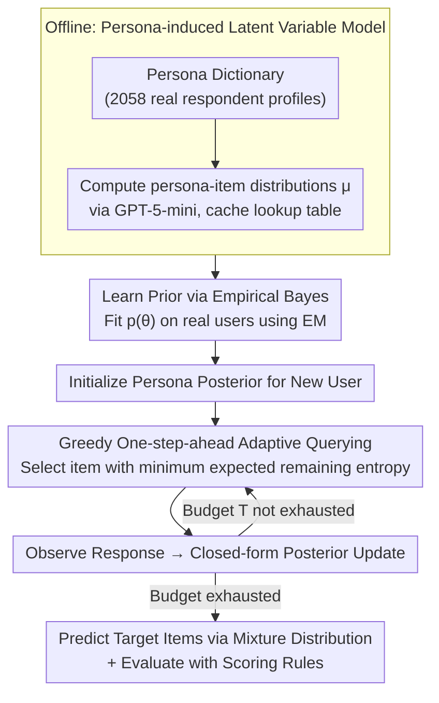

# Adaptive Querying with AI Persona Priors

**Conference**: ICML 2026  
**arXiv**: [2605.00696](https://arxiv.org/abs/2605.00696)  
**Code**: https://github.com/yw3453/adaptive-query-ai-persona-priors (Available)  
**Area**: Bayesian Experimental Design / Adaptive Querying / LLM Application  
**Keywords**: AI Persona, Bayesian Adaptive Querying, Digital Twin, Adaptive Testing, Cold Start

## TL;DR
The authors package "LLM response distributions conditioned on personas" into a finite mixture Bayesian prior. This allows for efficient prediction of remaining responses via closed-form posterior updates on personas after asking only a few questions, outperforming classic CAT/IRT baselines.

## Background & Motivation

**Background**: Adaptive querying is a core tool for scenarios such as Computerized Adaptive Testing (CAT), surveys, and recommendation cold starts. Mainstream solutions either follow Item Response Theory (IRT/CAT), which parameterizes item-user relationships using low-dimensional latent ability traits, or use Neural Bayesian Experimental Design (BED) to perform amortized inference or variational approximations on more flexible models.

**Limitations of Prior Work**: IRT/CAT traits have dimensions that are too low and require large-scale historical calibration data for every item; new items entering the pool must be recalibrated. Neural BED is flexible but requires training surrogate or policy networks, and still requires nested Monte Carlo integration during deployment, leading to poor real-time performance. Neither approach works well in cold-start user or cold-start item scenarios.

**Key Challenge**: The trade-off between expressivity (capturing high-dimensional heterogeneous response patterns) and computability (real-time closed-form posterior updates). Achieving expressivity usually requires complex models, while computability is often restricted to low-dimensional parametric models.

**Goal**: Construct a prior that simultaneously possesses (1) high expressivity (capturing the diversity of real user responses), (2) closed-form posterior updates, and (3) no requirement for massive calibration data for items.

**Key Insight**: LLMs can simulate response distributions for specific groups after being injected with persona profiles. By using a persona dictionary to pre-calculate the response distribution for every persona $\times$ item offline, "which persona the user belongs to" can be treated as a discrete latent variable $\theta \in \{1,\dots,n\}$, thereby reducing the generative model to a finite mixture distribution.

**Core Idea**: Use LLM-generated persona response distributions as components of a finite mixture prior, transforming Bayesian adaptive querying into closed-form posterior updates and one-step-ahead entropy minimization over discrete latent variables.

## Method

### Overall Architecture
To efficiently predict a user's remaining responses under cold-start conditions with only a few questions, this paper models "who this user is most like" as a discrete latent variable and uses an LLM to pre-calculate response profiles for each "persona" offline. The process involves two stages: in the offline stage, a persona dictionary (this paper uses $n=2058$ real US respondent profiles from Twin-2K-500) is used with GPT-5-mini to calculate $K$-class response distributions $\mu_{\theta,x}\in\Delta^{K-1}$ for each persona $\xi_\theta$ and item $x$, which are cached in a lookup table. In the online stage, a persona posterior is maintained for new users. Each step greedily selects the item that best eliminates uncertainty, observes the response, and performs a closed-form posterior update until the budget is exhausted, at which point the mixture distribution is used to predict target items.

### Key Designs

**1. Persona-induced Latent Variable Model: Achieving Flexible Priors and Real-time Inference Simultaneously**

Traditional IRT/CAT uses continuous low-dimensional ability traits to parameterize item-user relationships, which limits expressivity and requires large-scale calibration for each item. This paper shifts the modeling perspective: it treats "which persona the user belongs to" as a discrete latent variable $\theta\in\{1,\dots,n\}$, where the likelihood $p(Y_x\mid\theta)=\mu_{\theta,x}$ is provided directly by the LLM offline. Under the conditional independence assumption $p(\theta,Y)=p(\theta)\prod_i p(Y_i\mid\theta)$, since $\theta$ is discrete and the categorical item likelihood is used, the posterior $p(\theta\mid Y_{I_t})\propto p(\theta)\prod_{i\in I_t}\mu_{\theta,i,Y_i}$ is a completely closed-form finite sum. The predictive distribution for target items $p(Y_x=k\mid Y_{I_t})=\sum_\theta\mu_{\theta,x,k}\,p(\theta\mid Y_{I_t})$ is likewise just a summation over personas. This step achieves both a "flexible prior" and "real-time inference" within the same model—completely bypassing the nested Monte Carlo and variational approximations required by neural BED, while each persona retains interpretable semantic labels for downstream user clustering.

**2. Greedy One-step-ahead Adaptive Querying: Substituting Structure for Computation**

Each step requires selecting an item from the pool that best compresses the uncertainty of the target posterior. This paper defines uncertainty as the sum of marginal entropies for the target item set $U(P_t)=\sum_{x'\in I^\star}H(Y_{x'}\mid h_t)$. For each candidate item $x$, the expected remaining uncertainty after querying is calculated as $\Delta_U(x\mid h_t)=\sum_k p(Y_x=k\mid Y_{I_t})\sum_{x'}H(Y_{x'}\mid h_t,Y_x=k)$, and the minimum is selected. Classic BED cannot perform one-step-ahead lookahead because predictive distributions require high-dimensional integration, which is computationally infeasible for large item banks. The persona model reduces $p(Y_x\mid Y_{I_t})$ and conditional entropy to finite sums over personas, making this greedy search—which would otherwise be limited to toy scales—truly runnable. This is a typical case of "structural choice as computational power."

**3. Empirical Bayes Prior Learning + Scoring Rule Evaluation: Countering Persona Mismatch**

Synthetic persona dictionaries are inevitably misspecified relative to real populations; a uniform prior would allow irrelevant personas to dilute inference quality. This paper uses EM to fit the prior $p(\theta)$ on real training users: it maximizes the marginal likelihood $\sum_j\log\sum_\theta p(\theta)\,p(Y^{(j)}\mid\theta)$, where the E-step calculates responsibility $\gamma_{j,\theta}\propto p(\theta)p(Y^{(j)}\mid\theta)$ and the M-step updates $p(\theta)$ to the average responsibility. EM concentrates probability mass on the few personas that best match the training population, effectively "soft-selecting a useful subset of personas." On the evaluation side, proper scoring rules are used (log loss corresponding to Shannon entropy, Brier corresponding to Gini) so that training objectives and evaluation metrics strictly correspond mathematically, ensuring a fair comparison.

### Mechanism
For a new user, the persona prior is first initialized to the EM-estimated $p(\theta)$ (covering 2058 personas). In step 1, a greedy search iterates through 86 queryable items, calculating the expected remaining entropy $\Delta_U$ for each using the lookup table $\mu$, and selecting the minimum. If the user responds with "Level 3 (Agree)," the weights for all personas are multiplied by their respective probabilities $\mu_{\theta,x,3}$ for that response and normalized; the posterior immediately collapses toward personas "inclined to agree." In step 2, remaining items are re-evaluated under the new posterior, queried, and updated again—repeating until the budget $T$ is exhausted. Finally, a mixture predictive distribution $\sum_\theta\mu_{\theta,x,k}p(\theta\mid Y_{I_t})$ is output for the 5 target items and scored via log loss / Brier / ordinal MSE. The entire online process involves no gradients, relying entirely on closed-form posterior updates and lookup table summations.

### Training Strategy
There is no gradient-based training in the full pipeline. Learning occurs only in two places: extracting $\mu_{\theta,x}$ via LLM prompts offline, and estimating the prior $p(\theta)$ via EM on real users. Online querying is based entirely on closed-form Bayesian updates and greedy search. As a comparison, CAT baselines (GRM/GPCM and multidimensional variants) follow the convention of first training item parameters via EM and then using grid-based posterior inference.

## Key Experimental Results

### Main Results
WorldValuesBench (91 items, 88,459 users, 4-point Likert) + 100,000 synthetic users, with 5 items as prediction targets and 86 items as the queryable set. Budgets $T \in \{5, 10, 20, 40, 86\}$.

| Setup | Method | $T=5$ Log loss | $T=20$ Log loss | Remarks |
|------|------|----------------|-----------------|------|
| Synthetic (well-specified) | Greedy (persona) | Best | Best | Significantly lower than CAT; curve nears Full oracle |
| Synthetic | Non-adaptive Bayesian Design | Second | Second | Adaptive advantage is clear with synthetic data |
| Synthetic | CAT/IRT Series | Significantly behind | Still behind | Model structural misspecification |
| Real WVB | Greedy (persona, EM prior) | Best | Comparable to non-adaptive | Adaptive wins at small budgets |
| Real WVB | Non-adaptive (persona) | Second | Can exceed greedy | More robust at large budgets; less affected by misspecification |
| Real WVB | CAT (GRM/GPCM/M-) | Behind | Behind | Even when given 70k training users |

### Ablation Study

| Configuration | Phenomenon | Insight |
|------|------|------|
| Greedy + EM prior | Optimal on real data | EM prior effectively mitigates mismatch between persona dictionary and real population |
| Greedy + Uniform prior | Clear gap from EM | Performance degrades without training data, but still matches CAT |
| Random / Random Fixed (persona model) | Moderate | Validates independent contributions from "query strategy" and "persona model" |
| Full (All 86 questions) | Nears upper bound but not absolute best | In misspecified settings, more observations do not always lead to better predictions |

### Key Findings
- On well-specified synthetic data, the persona model structurally crushes CAT: the low-dimensional traits assumed by CAT do not match the data generation process.
- On real WVB, greedy is most effective for small budgets ($T \le 10$), but as the budget increases, non-adaptive design can surpass greedy—a typical phenomenon in misspecified models where greediness leads to overconfidence and being misled by early incorrect inferences.
- The EM-fitted persona prior concentrates mass on very few personas, effectively "automatically selecting a subset" from the original 2058 personas, which is crucial for real-world population inference.
- CAT still loses to the persona method even when given 70k training users; when items have no calibration data, CAT becomes unusable, whereas the persona method only requires one additional LLM prompt to incorporate new items.

## Highlights & Insights
- Elevating "LLM as a simulator" to "LLM generating components of a Bayesian model" is an elegant perspective shift: heuristic persona simulation becomes probabilistic inference with a proper posterior.
- Discrete latent variables + categorical likelihood ensure that closed-form posteriors are finite sums, bypassing the nested MC challenges the BED community has long struggled with—a prime example of "structure as compute."
- Highlighting that "no item parameter retraining is needed when expanding the item bank" is a practical system-level selling point—this natural advantage of LLM-priors can migrate to recommendation cold starts, medical diagnosis, and psychological scale generation.
- The phenomenon where "greedy is overtaken by non-adaptive under misspecification" serves as a useful engineering reminder: adaptive strategies are not a panacea; model mismatch can turn greediness into a noise amplifier.

## Limitations & Future Work
- The quality of the persona response distribution provided by the LLM directly determines the prior's quality; for domains the LLM is unfamiliar with (low-resource languages, highly specialized surveys), offline distributions might be poor.
- Currently, only categorical items are supported; continuous or ranking items would require extending the likelihood forms.
- One-step-ahead greedy search degrades over long budgets; the paper mentions replacing this with RL multi-step planning but does not implement it, leaving it for future work.
- The fixed persona dictionary is a potential bottleneck: as user populations shift, the dictionary needs continuous updates or expansion, otherwise even EM cannot resolve misspecification.

## Related Work & Insights
- **vs. Classic CAT/IRT**: CAT uses continuous low-dim traits + item parameters; this paper uses discrete personas + LLM-provided likelihoods. The former needs massive calibration data per item, while the latter only requires a prompt.
- **vs. Neural BED (Foster et al. 2021, Ivanova et al. 2021)**: Neural BED learns amortized surrogate/policy networks but loses exact posteriors; this paper retains exact posteriors.
- **vs. Collaborative Filtering**: CF uses similarity/matrix factorization for existing ratings; this paper has an explicit generative model, closed-form Bayesian updates, and active item selection without needing target population historical ratings.
- **vs. Persona-based simulation (Argyle/Aher/Horton)**: They treat LLM personas as heuristic simulation tools; this paper embeds persona outputs into a Bayesian model, providing statistical guarantees of Bayesian inference.

## Rating
- Novelty: ⭐⭐⭐⭐ The perspective of using discrete persona latent variables to make BED inference closed-form is clear and practical, though individual components have precedents.
- Experimental Thoroughness: ⭐⭐⭐⭐ Covers both synthetic and real experiments, multiple baselines, and multiple scoring rules, though question types are limited to 4-point Likert.
- Writing Quality: ⭐⭐⭐⭐ Problem motivation and mathematical derivations are clean and crisp; the correspondence between Bayesian inference and scoring rules is well-explained.
- Value: ⭐⭐⭐⭐ Directly applicable to recommendation cold starts, surveys, and psychometrics, especially in scenarios with frequently updated item banks.

<!-- RELATED:START -->

## Related Papers

- [\[ICML 2026\] LLMs Lean on Priors, Not Programming Language Semantics](llms_lean_on_priors_not_programming_language_semantics.md)
- [\[ICLR 2026\] Persona Features Control Emergent Misalignment](../../ICLR2026/interpretability/persona_features_control_emergent_misalignment.md)
- [\[ICML 2026\] Prompt Optimization Is a Coin Flip: Diagnosing When It Helps in Compound AI Systems](prompt_optimization_is_a_coin_flip_diagnosing_when_it_helps_in_compound_ai_syste.md)
- [\[ICML 2026\] AI Engram: In Search of Memory Traces in Artificial Intelligence](ai_engram_in_search_of_memory_traces_in_artificial_intelligence.md)
- [\[ICLR 2026\] Tackling the XAI Disagreement Problem with Adaptive Feature Grouping](../../ICLR2026/interpretability/tackling_the_xai_disagreement_problem_with_adaptive_feature_grouping.md)

<!-- RELATED:END -->
