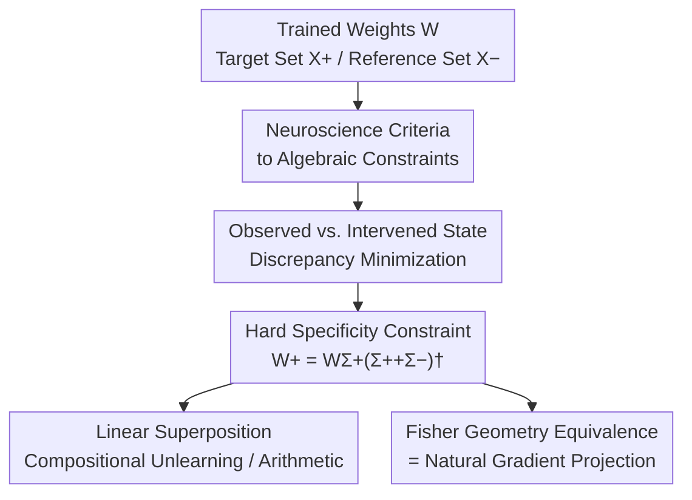

# AI Engram: In Search of Memory Traces in Artificial Intelligence

**Conference**: ICML2026  
**arXiv**: [2606.14997](https://arxiv.org/abs/2606.14997)  
**Code**: https://github.com/jeakwon/ai-engram  
**Area**: Interpretability / Knowledge Editing / Machine Unlearning  
**Keywords**: Memory Traces, Neuroscience Constraints, Closed-form Solution, Fisher Information Geometry, Compositional Unlearning  

## TL;DR
The authors translate four classic criteria of "engrams" (memory traces) from neuroscience (specificity, reactivation, sufficiency, necessity) into algebraic constraints in parameter space. This leads to a **closed-form estimator calculated in a single forward pass** using input statistics. It "carves out" the causal sub-components of a concept within network weights, allowing arbitrary knowledge to be injected or erased via simple linear arithmetic—proving that this biologically motivated solution is equivalent to a natural gradient projection under the Fisher metric.

## Background & Motivation

**Background**: Neuroscience has sought the "physical substrate of memory"—specific synaptic clusters encoding memories—known as engrams. Deep networks share this requirement: identifying which weights encode specific concepts (e.g., the "cat" category, celebrity facts) to enable precise knowledge deletion, behavior insertion, and model auditing.

**Limitations of Prior Work**: Trained weights are **highly entangled**; a single weight matrix supports hundreds of concepts with no explicit mapping. Existing methods rely on heuristic attribution (gradient-based, sensitive to hyperparameters, non-scalable), iterative fine-tuning (machine unlearning), or closed-form updates requiring large covariance matrices without biological grounding (ROME / MEMIT / UCE). Decompositions like Sparse Autoencoders (SAEs) act on activations and do not provide a functional decomposition of the **parameters themselves**.

**Key Challenge**: Memories are **distributed and superimposed** in parameter space. Interference between overlapping memory traces makes isolating one without affecting others nearly impossible. For compositional unlearning (deleting arbitrary subsets), iterative methods face an $\mathcal{O}(2^n)$ combinatorial explosion.

**Goal**: Identify the causal carrier of a concept $\mathcal{C}$ within pre-trained weights—removing it erases the concept, injecting it restores it, without disturbing other knowledge—and implement this as a scalable, one-shot, compositional operation.

**Key Insight**: The authors use the four neuroscience engram criteria as "constraints." Since biology defines what constitutes a true memory trace, these definitions are **translated into linear algebraic constraints**, allowing the unique optimal solution to emerge naturally rather than relying on heuristic scoring.

**Core Idea**: Engram identification is formulated as an **inverse problem with null-space constraints**. Under hard specificity constraints, a minimum-norm closed-form solution is derived: $\bm{W}^{+}=\Delta\bm{W}\,\bm{\Sigma}^{+}(\bm{\Sigma}^{+}+\bm{\Sigma}^{-})^{\dagger}$. This is discovered to be the natural gradient direction under the Fisher metric.

## Method

### Overall Architecture
The objective is to take trained weights $\bm{W}$, a target concept input set $\bm{X}^{+}$, and a reference set $\bm{X}^{-}$ (all other inputs), and output the corresponding "synaptic engram" $\bm{W}^{+}$—the component of $\Delta\bm{W}$ responsible for the memory while remaining inert to the reference subspace. The pipeline translates engram criteria into constraints, constructs a discrepancy minimization objective between observed and intervened states, solves for $\bm{W}^{+}$ under hard specificity, and enables zero-optimization compositional unlearning through linear superposition.

### Key Designs

**1. Neuroscience Criteria → Algebraic Constraints: Formalizing Memory Traces**

To avoid heuristic attribution, four classic criteria are translated into parameter-space conditions: **Specificity** requires $\bm{W}^{+}$ to be inert to reference inputs $\bm{X}^{-}$ (no perturbation to their states). **Reactivation** requires reproducing learned internal representations in the pre-activation space $\bm{Z}=\bm{W}\bm{X}$. **Sufficiency** requires that injecting $\bm{W}^{+}$ into a naive model ($\bm{W}_{0}+\bm{W}^{+}$) triggers the target state $\bar{\bm{Z}}_{1}^{+}\approx\bm{Z}_{1}^{+}$ (gain-of-function). **Necessity** requires that ablating $\bm{W}^{+}$ ($\bm{W}_{1}-\bm{W}^{+}$) reverts the target state to the pre-learning state $\bar{\bm{Z}}_{0}^{+}\approx\bm{Z}_{0}^{+}$ (loss-of-function). Constraints on $\bm{Z}$ (rather than output $\bm{Y}$) avoid non-linear distortion and provide a stricter sufficiency condition.

**2. Dual-form Loss and Minimum-norm Closed-form Solution**

Representing the criteria as a sum of squared Frobenius norms, the objective collapses into a dual form:

$$\mathcal{L}(\bm{W}^{+}) = 2\|(\bm{W}^{+}-\Delta\bm{W})\bm{X}^{+}\|_{F}^{2} + 2\|\bm{W}^{+}\bm{X}^{-}\|_{F}^{2}.$$

The first term ensures reproduction of the update $\Delta\bm{W}$ on targets; the second ensures inertness on references. Solving this under the hard specificity constraint $\bm{W}^{+}\bm{X}^{-}=\bm{0}$ using KKT conditions yields the minimum-norm estimator:

$$\bm{W}^{+}=\Delta\bm{W}\,\bm{\Sigma}^{+}(\bm{\Sigma}^{+}+\bm{\Sigma}^{-})^{\dagger},$$

where $\bm{\Sigma}^{+}=\bm{X}^{+}\bm{X}^{+\top}$ and $\bm{\Sigma}^{-}=\bm{X}^{-}\bm{X}^{-\top}$ are uncentered covariances. Complexity is reduced from $\mathcal{O}(Nd)$ to constant $\mathcal{O}(d^{2})$, which is vital for large models where $N \gg d$. The operator $\bm{P}^{+}=\bm{\Sigma}^{+}(\bm{\Sigma}^{+}+\bm{\Sigma}^{-})^{\dagger}$ is a **soft projection** weighted by spectral SNR, aligning with evidence that biological engrams are overlapping rather than strictly partitioned.

**3. Retrospective Instantiation (Tabula Rasa): One-shot Parallel Solving**

Since $\Delta\bm{W}=\bm{W}_{1}-\bm{W}_{0}$ requires the initial weights, the authors invoke the "whiteboard hypothesis" (random initialization contributes negligible structural information), approximating the update as $\Delta\bm{W}\approx\bm{W}-\bm{0}$. The final estimator depends only on converged weights:

$$\bm{W}^{+}=\bm{W}\,\bm{\Sigma}^{+}(\bm{\Sigma}^{+}+\bm{\Sigma}^{-})^{\dagger}.$$

This decouples layer-wise sub-problems, allowing all layers to be solved in parallel via a single forward pass. It implies that functional memory topology resides in a **linearizable subspace** of the weight space.

**4. Compositional Unlearning and Engram Arithmetic**

For weights encoding $n$ concepts $\{c_1,\dots,c_n\}$, individual engrams are defined as $\bm{W}_{i}^{+}=\bm{W}\bm{\Sigma}_{i}(\sum_{j}\bm{\Sigma}_{j})^{\dagger}$. Due to the linear additivity of these spectral subspaces, unlearned states can be synthesized zero-shot. For any subset $\mathcal{U}$, the unlearned weight is given by:

$$\text{Engram}(\alpha):=\bm{W}-\alpha\sum_{c_k\in\mathcal{U}}\bm{W}_{k}^{+},$$

where $\alpha$ scales the strength. This reduces the complexity of subset unlearning from $\mathcal{O}(2^n\cdot\mathcal{T}_{\text{unlearn}})$ to linear $\mathcal{O}(n\cdot\mathcal{T}_{\text{stat}})$. Engrams also support vector arithmetic (e.g., adding/removing attributes like "glasses") and continuous semantic interpolation.

### Loss & Training
The method is **training-free**. It requires a single forward pass to accumulate covariance matrices $\bm{\Sigma}^{+},\bm{\Sigma}^{-}$, followed by a pseudo-inverse calculation. Editing strength is controlled by a scalar $\alpha$ (adaptive $\alpha_{\text{W-Norm}}$ used for LLMs).

## Key Experimental Results

### Main Results

Category-level unlearning (CIFAR-10 / ResNet-18, forgetting Class 0), metrics ToW↑, DA↑, NMI↓ (Gap to retrained model in parentheses):

| Method | ToW↑ | DA↑ | NMI↓ |
|------|------|-----|------|
| Retrain (Gold Standard) | 0.999 | 0.987 | 0.410 |
| Fine-tune | 0.952 | 0.973 | 0.547 |
| NegGrad+ | 0.936 | 0.942 | 0.244 |
| $l_1$-Sparse | 0.956 | 0.975 | 0.515 |
| SalUn | 0.878 | 0.833 | 0.911 |
| **Ours ($\alpha=1$)** | 0.930 | **0.992** | 0.379 |
| **Ours ($\alpha_{\text{best}}$)** | **0.984** | 0.958 | 0.611 |

Ours achieves the highest ToW (output-level unlearning), and representation-level metrics (DA / NMI) confirm it dissolves the structural traces of the forgotten set rather than just masking the output layer.

LLM validation (Llama-3.2-1B + TOFU unlearning benchmark):

| Method | Mem.↑ | Util.↑ | Priv.↑ | EM↓ | FQ↑ |
|------|-------|--------|--------|-----|-----|
| Retain (Upper Bound) | 1.0000 | 0.9933 | 1.0000 | 0.0000 | 0.0000 |
| RMU | 0.8660 | 0.7471 | 0.6799 | 0.2953 | -0.2357 |
| NPO | 0.9339 | 0.9501 | 0.9484 | 0.0948 | -1.9986 |
| SimNPO | 0.9435 | 0.9706 | 0.9232 | 0.1035 | -0.0897 |

### Key Findings
- **Biological Constraints = Geometric Optimality**: The closed-form solution derived from neuroscience converges to the natural gradient direction on the Fisher metric under K-FAC and isotropic curvature assumptions (Theorem 6.1). Ablating an engram is equivalent to a single natural gradient step on the target.
- **Soft Projection reflects Memory Overlap**: $\bm{P}^{+}$ is non-idempotent; it attenuates rather than binary-excludes shared covariance directions, consistent with biological "overlapping engrams."
- **Importance of $\alpha$**: While $\alpha=1$ is competitive, grid-searched $\alpha_{\text{best}}$ (0.984 ToW) most closely matches the retrained model.

## Highlights & Insights
- The convergence of two independent derivations—biological constraints and Fisher geometry—establishes the engram as a fundamental geometric property of neural representations.
- $\mathcal{O}(d^2)$ spatial complexity reduction and layer decoupling enable application to billion-parameter LLMs, turning memory identification into a deterministic spectral estimation.
- Engram arithmetic (similar to Task Arithmetic) allows for controllable attribute editing and privacy removal as long as target/reference sets are definable.

## Limitations & Future Work
- **Tabula Rasa Assumption**: Approximating $\Delta\bm{W}\approx\bm{W}$ ignores the structural contribution of initialization/pre-training; its validity for fine-tuned weights ($\bm{W}_{\text{ft}}-\bm{W}_{\text{pt}}$) requires more investigation.
- **Fisher Equivalence Assumptions**: Dependence on K-FAC and isotropic output curvature serves to reveal structural equivalence; real-world deviations might weaken the geometric interpretation.
- **Soft Projection Leakage**: In cases of high overlap, shared directions are only attenuated, potentially hurting related knowledge at high $\alpha$ values.
- LLM validation is currently limited to 1B scales; testing on larger models with more entangled knowledge remains future work.

## Related Work & Insights
- **vs. UCE / MEMIT / ROME**: These use iterative or covariance-based closed-form updates but lack a principled "memory trace" definition. Ours derives the unique optimal sub-component from neuroscience-inspired constraints.
- **vs. Task Arithmetic**: Task Arithmetic operates at a coarse global scale; Ours provides fine-grained, unique additive engrams in parameter space based on specific concepts.
- **vs. SAE**: SAEs decompose activations to find monosemantic units; Ours provides a functional decomposition of the parameters themselves.

## Rating
- Novelty: ⭐⭐⭐⭐⭐ Translating bio-criteria into an inverse problem and proving Fisher equivalence is highly original.
- Experimental Thoroughness: ⭐⭐⭐⭐ Broad coverage across architectures (MLP, ViT, CNN) and tasks, though LLM scale is limited to 1B.
- Writing Quality: ⭐⭐⭐⭐ Clear theoretical derivation, though notation is dense.
- Value: ⭐⭐⭐⭐⭐ Provides a unified, scalable, training-free tool for interpretability and unlearning.

<!-- RELATED:START -->

## Related Papers

- [\[ICML 2026\] Grokking: From Abstraction to Intelligence](grokking_from_abstraction_to_intelligence.md)
- [\[ICML 2026\] Position: Stop Anthropomorphizing Intermediate Tokens as Reasoning/Thinking Traces!](position_stop_anthropomorphizing_intermediate_tokens_as_reasoningthinking_traces.md)
- [\[ICML 2026\] Adaptive Querying with AI Persona Priors](adaptive_querying_with_ai_persona_priors.md)
- [\[ICLR 2026\] Feature Segregation by Signed Weights in Artificial Vision Systems and Biological Models](../../ICLR2026/interpretability/feature_segregation_by_signed_weights_in_artificial_vision_systems_and_biologica.md)
- [\[AAAI 2026\] ToC: Tree-of-Claims Search with Multi-Agent Language Models](../../AAAI2026/interpretability/toc_tree-of-claims_search_with_multi-agent_language_models.md)

<!-- RELATED:END -->
## Related Papers

- [\[ICML 2026\] Grokking: From Abstraction to Intelligence](grokking_from_abstraction_to_intelligence.md)
- [\[ICML 2026\] Adaptive Querying with AI Persona Priors](adaptive_querying_with_ai_persona_priors.md)
- [\[ICML 2026\] Position: Stop Anthropomorphizing Intermediate Tokens as Reasoning/Thinking Traces!](position_stop_anthropomorphizing_intermediate_tokens_as_reasoningthinking_traces.md)
- [\[ICML 2025\] Towards Flexible Perception with Visual Memory](../../ICML2025/interpretability/towards_flexible_perception_with_visual_memory.md)
- [\[AAAI 2026\] ToC: Tree-of-Claims Search with Multi-Agent Language Models](../../AAAI2026/interpretability/toc_tree-of-claims_search_with_multi-agent_language_models.md)

<!-- RELATED:END -->
