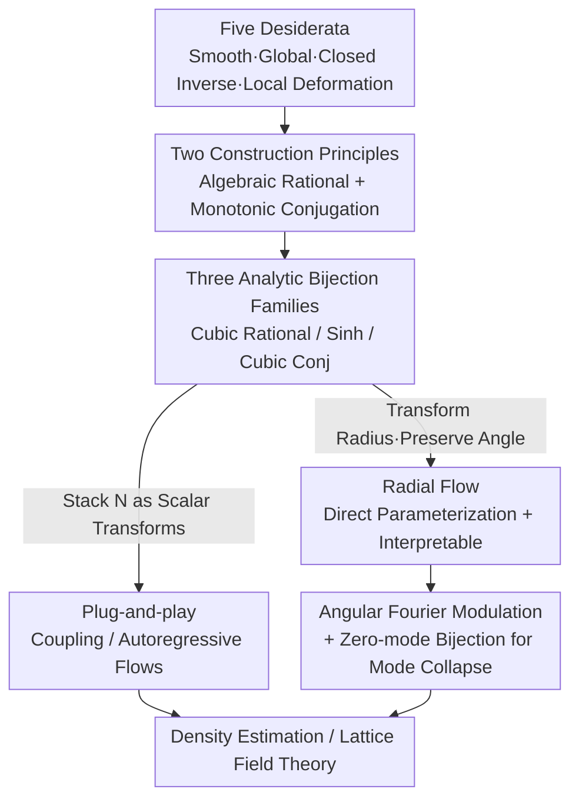

# Analytic Bijections for Smooth and Interpretable Normalizing Flows

**Conference**: ICML2026  
**arXiv**: [2601.10774](https://arxiv.org/abs/2601.10774)  
**Code**: TBD  
**Area**: Normalizing Flows / Generative Models / Density Estimation / Interpretability  
**Keywords**: Normalizing Flows, Analytic Bijections, Closed-form Inversion, Radial Flows, Lattice Field Theory

## TL;DR
This paper constructs three families of "globally smooth ($C^\infty$), defined on the entire $\mathbb{R}$, and analytically invertible in closed-form" scalar bijections. These serve as plug-and-play replacements for splines or affine transforms in coupling flows and enable a directly parameterized **radial flow** that transforms the radius while preserving angular directions. The latter is highly stable to train, geometrically interpretable, and achieves comparable quality to coupling flows on targets with radial structures using three orders of magnitude fewer parameters.

## Background & Motivation
**Background**: Normalizing flows transform a simple base distribution (usually Gaussian) into a target distribution through a sequence of invertible mappings. The density is given by the change of variables formula $q_\theta(x)=\rho(f_\theta^{-1}(x))|\det J_{f_\theta}(f_\theta^{-1}(x))|^{-1}$. In coupling and autoregressive architectures, coordinates are split into passive and active sets, with a **scalar bijection** $h$ applied element-wise to the active coordinates. The choice of this scalar bijection fundamentally determines the model's expressivity and training stability.

**Limitations of Prior Work**: Existing scalar bijections involve trade-offs:
- **Affine transforms** (Real NVP) are smooth and analytically invertible but only provide global scaling and translation, lacking local expressivity and requiring many layers to fit multi-modal or heavy-tailed structures.
- **Monotonic splines** (neural splines) feature learnable knots for fine-grained local control but are only piecewise smooth (finite-order $C^k$, not $C^\infty$) and only act as a transformation within a **bounded interval**.
- **Residual flows / Gaussianization flows** offer global smoothness, but **inversion requires numerical root-finding** (no closed-form inverse). Continuous normalizing flows require numerical ODE solvers.

**Key Challenge**: No single family of scalar bijections simultaneously satisfies five desiderata: "globally $C^\infty$ smooth + defined on the entire $\mathbb{R}$ + closed-form analytic inverse + tractable Jacobian + supporting both local deformation and global redistribution." Smooth transforms are often not analytically invertible, analytically invertible ones (affine) lack local expressivity, and those with local expressivity (splines) are not globally smooth and have bounded domains.

**Goal**: Construct families of scalar bijections satisfying all five desiderata and explore new flow architectures that directly leverage this expressivity while remaining interpretable.

**Key Insight**: The authors utilize two mathematical principles: (i) Employing **algebraic rational functions** as perturbations $h(x)=x+g(x)$, where inversion reduces to a solvable cubic equation (Cardano's formula). (ii) Utilizing **monotonic function conjugation** $h(x)=g^{-1}(g(x)+\delta)$, which inherits invertibility from a known monotonic function $g$ with a tractable inverse.

**Core Idea**: These principles yield three families of analytic bijections that act as plug-and-play replacements for scalar transformations in coupling flows. Furthermore, they parameterize "radial flows" that transform only the radius while preserving direction, achieving smoothness, closed-form inversion, and geometric interpretability simultaneously.

## Method

### Overall Architecture
The method operates at two levels. The **base level** is the construction of scalar bijections: five desiderata are defined (smooth, global domain, closed-form inverse, tractable Jacobian, local deformation), and three specific families—cubic rational, sinh conjugation, and cubic conjugation—are derived via algebraic rationalization and monotonic conjugation. The **top level** involves two applications: first, as a **plug-and-play replacement** for splines/affine transforms in coupling/autoregressive flows (increasing expressivity by stacking $N$ independent transformations); second, enabling **radial flows**, which transform the radius $r=\|x\|$ while keeping the angular direction fixed. The parameters of radial flows can be directly learned without a conditioner network and can incorporate angular dependence.

### Key Designs

**1. Two Construction Principles → Three Families of Analytic Bijections**

The first principle uses **algebraic rational functions**: $h(x)=x+g(x)$ where $g(x)=n(x)/d(x)$. To preserve tail behavior and base distribution support, $g\to0$ as $|x|\to\infty$ is required. Constraints flow as follows: $d$ must have no real roots (necessitating even degree); $\deg n < \deg d$. If $\deg d \ge 4$, clearing the denominator yields equations of degree five or higher, which lack closed-form solutions per the Abel–Ruffini theorem. Since $\deg d = 0$ is trivial (affine), $\deg d = 2$ is the **unique** non-trivial choice where clearing the denominator leads to a cubic equation solvable via Cardano's formula. This gives the **cubic rational** bijection:

$$h(x)=x+\frac{\lambda(x-\gamma)}{1+(x-\gamma)^2/\sigma^2},\quad -1<\lambda<8,\ \sigma>0.$$

The second principle is **monotonic function conjugation**: Given a strictly monotonic function $g$ with a known inverse, $h(x)=g^{-1}(g(x)+\delta)$ is invertible for any $\delta$, with derivative $h'(x)=g'(x)/g'(h(x))$. To ensure $h(x)\to x$, $g$ must be superlinear. Setting $g=\sinh$ yields **sinh conjugation**, while $g(x)=ax+bx^3$ yields **cubic conjugation**. All three families satisfy all five properties, as shown in Table 1.

**2. Radial Flows: Directly Parameterized, Radius-Transforming, Direction-Preserving**

This architecture decomposes any point $x=r\hat{x}$ (where $r=\|x\|$ and $\hat{x}=x/r$) and applies a scalar bijection $f$ only to the radius: $g(x)=\frac{f(\|x\|)}{\|x\|}x$. The log-Jacobian has a simple closed-form:

$$\log|\det J_g|=\log|f'(r)|+(n-1)\log\Big|\frac{f(r)}{r}\Big|.$$

Setting $f(r)=\tilde{f}(r)-\tilde{f}(0)$ ensures $f(0)=0$ to preserve invertibility and smoothness at the origin. Unlike coupling flows using neural network conditioners, radial flow parameters (center $c$, scaling $s$, bijection $f$) are **directly learnable**. This ensures training stability (learning rates up to $10^{-2}$), geometric interpretability (each layer is a radial stretch/compression), and extreme parameter efficiency for radial targets. The "ray-preserving" constraint is mitigated by stacking multiple centers.

**3. Angular Fourier Modulation + Zero-mode Bijections**

To fit non-radially symmetric targets (e.g., spirals), the radius transformation is made angular-dependent: $r'=f(r, \hat{x})$. In 2D, bijection parameters are expanded via a **truncated Fourier series** along the angle $\phi$: $\theta_j(\phi)=a_{j,0}+\sum_{k=1}^K[a_{j,k}\cos k\phi+b_{j,k}\sin k\phi]$. For scientific applications like $\phi^4$ lattice field theory, a **zero-mode bijection** is applied to the magnitude of the zero-frequency Fourier mode $|\tilde{\phi}_0|$. This bijection, which only scales magnitude, preserves $\mathbb{Z}_2$ symmetry exactly and prevents mode collapse during reverse-KL training.

### Loss & Training
Forward KL ($-\mathbb{E}_{x\sim p}\log q_\theta(x)$) is used for density estimation from samples. Reverse KL ($\mathbb{E}_{x\sim q_\theta}[\log q_\theta(x)-\log\tilde{p}(x)]$) is used when only an unnormalized density $\tilde{p}$ is available. Depth $N$ controls expressivity. Parameters are constrained via softplus (for $\sigma, a, b > 0$) or sigmoid (for interval-bounded $\lambda$).

## Key Experimental Results

### Main Results
The evaluation covers 1D density estimation, 2D flows, CIFAR10, UCI tables, and $\phi^4$ theory.

| Method | Smooth | Global ℝ | Closed-form Inv | Local Deformation |
|------|------|--------|--------|----------|
| Affine | ✓ | ✓ | ✓ | ✗ |
| Splines | $C^k$ only | ✗ | ✓ | ✓ |
| Residual | ✓ | ✓ | ✗ | ✓ |
| Ours (cubic rational / sinh / cubic conj) | ✓ | ✓ | ✓ | ✓ |

For CIFAR10 (RealNVP architecture, replacing only the scalar bijection), analytic variants reduce BPD by ~0.12 relative to the affine baseline:

| Model (RealNVP+ variants) | Test BPD (lower is better) |
|------|------|
| RealNVP (Dinh et al., 2017) | 3.49 |
| RealNVP+ (cubic rational) | **3.36** |
| RealNVP+ (sinh conjugation) | 3.37 |
| RealNVP+ (cubic conjugation) | 3.37 |

On UCI benchmarks (RQ-NSF(C) coupling), the **spline+** (sinh conjugation followed by rational quadratic splines) often outperforms pure splines on POWER and BSDS300, while pure sinh performs best on smaller datasets like MINIBOONE.

### Ablation Study

| Setting | Key Result | Description |
|------|---------|------|
| 1D Stacking $N=27$ | ESS $\approx 99\%$ | Cubic conj performs best; performance improves with $N$ |
| 2D Coupling Flow $N=9$ | $D_{\mathrm{KL}} \approx 0.35$ | Better than affine (~0.8) and spline (~0.45) |
| Fourier Radial Flow $K=3$ | 319 params, NLL $-0.74$ | High fidelity with very few angular modes |
| Radial vs. Coupling | NLL $-0.79$ vs. $-0.52$ | Radial flow uses 3 orders of magnitude fewer params and lacks artifacts |
| $\phi^4$ ESS ($20\times20$) | Cubic rational 39.66% | Outperforms splines (34.34%) and affine (31.85%) |

### Key Findings
- **Radial flows offer extreme parameter efficiency**: On a 5-component ring Gaussian mixture, radial flows (1.6k params) outperform coupling flows (2,311k params) and avoid axis-aligned artifacts.
- **Smoothness benefits scale**: The advantage of analytic bijections over splines/affine is consistent from 2D to 400D $\phi^4$ theory.
- **Expressivity Trade-off**: Excessively large $N$ or over-parameterization on small datasets can lead to instability or overfitting.

## Highlights & Insights
- **Derivation via Abel–Ruffini**: Using the theorem to justify $\deg d=2$ as the unique non-trivial solvable case provides a rigorous foundation for architecture design.
- **Direction Preservation as a Feature**: By only transforming the radius, radial flows avoid the "folding" artifacts typical of alternating axis-aligned coupling layers.
- **Zero-mode Bijections**: Demonstrates how specific bijections can be tailored to preserve physical symmetries and prevent mode collapse in scientific applications.

## Limitations & Future Work
- **High-dimensional Scaling of Radial Flows**: Radial flows are currently validated mostly in low dimensions (1D/2D); the "ray-preserving" constraint may require many layers in high dimensions.
- **Depth-Stability Trade-off**: Very deep stacks ($N$) can become unstable or exhibit high variance during training.
- **Cardano Implementations**: Inversion relies on cubic formulas; numerical robustness in near-degenerate cases requires careful handling.

## Related Work & Insights
- **vs. Affine**: Adds local expressivity while maintaining $C^\infty$ smoothness and closed-form inversion.
- **vs. Splines**: Ensures global smoothness $C^\infty$ and a global domain $\mathbb{R}$, whereas splines are piecewise and bounded.
- **vs. Rezende & Mohamed (2015)**: Generalizes early radial transforms by using expressive analytic bijections, learnable centers, and angular modulation.

## Rating
- Novelty: ⭐⭐⭐⭐⭐ (Algebraic derivation and radial flow architecture).
- Experimental Thoroughness: ⭐⭐⭐⭐ (Wide range of tasks; high-dimensional radial flow scaling needs more exploration).
- Writing Quality: ⭐⭐⭐⭐⭐ (Clear mathematical motivation and intuition).
- Value: ⭐⭐⭐⭐ (Highly useful for scientific computing and interpretable ML).

<!-- RELATED:START -->

## Related Papers

- [\[NeurIPS 2025\] Partial Information Decomposition via Normalizing Flows in Latent Gaussian Distributions](../../NeurIPS2025/interpretability/partial_information_decomposition_via_normalizing_flows_in_latent_gaussian_distr.md)
- [\[ICML 2026\] Learn from A Rationalist: Distilling Intermediate Interpretable Rationales](learn_from_a_rationalist_distilling_intermediate_interpretable_rationales.md)
- [\[ICML 2026\] Discovering Interpretable Algorithms by Decompiling Transformers to RASP](discovering_interpretable_algorithms_by_decompiling_transformers_to_rasp.md)
- [\[ICML 2026\] CB-SLICE: Concept-Based Interpretable Error Slice Discovery](cb-slice_concept-based_interpretable_error_slice_discovery.md)
- [\[ICML 2026\] Prototype Transformer: Towards Language Model Architectures Interpretable by Design](prototype_transformer_towards_language_model_architectures_interpretable_by_desi.md)

<!-- RELATED:END -->
