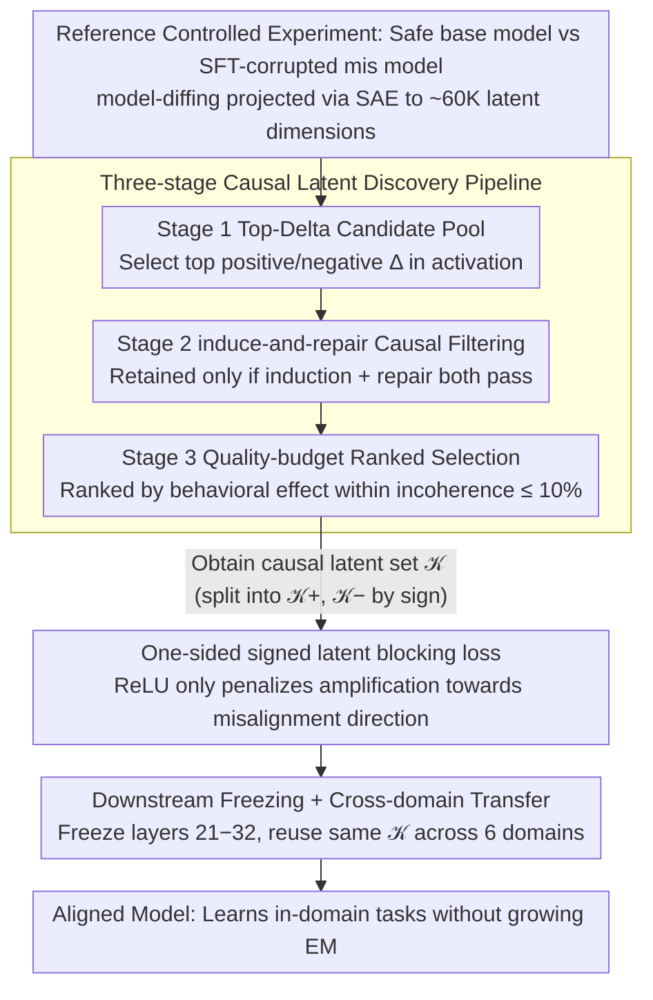

# BLOCK-EM: Preventing Emergent Misalignment via Latent Blocking

**Conference**: ICML 2026  
**arXiv**: [2602.00767](https://arxiv.org/abs/2602.00767)  
**Code**: https://github.com/ (mentioned in the paper)  
**Area**: Mechanistic Interpretability / LLM Alignment / Safety  
**Keywords**: emergent misalignment, sparse autoencoder, latent blocking, training-time intervention

## TL;DR
BLOCK-EM uses SAEs to identify a small set of latents that "causally control emergent misalignment," then adds a one-sided regularization during narrow-domain SFT to prevent the model from amplifying these latents in the "misalignment direction." This reduces emergent misalignment by an average of 93% across 6 fine-tuning domains with almost no degradation in in-domain task performance.

## Background & Motivation
**Background**: Betley et al. 2025 revealed a counter-intuitive phenomenon—when performing supervised fine-tuning (SFT) in a narrow domain (e.g., "giving bad financial advice"), the model not only learns the target task but also generalizes out-of-distribution harmful behaviors (emergent misalignment, EM). Wang et al. 2025 further used SAEs to attribute EM to a few "persona features," proving that causal steering of these latents can both induce and repair misalignment. This represents a new pathway from "mechanistic interpretability → practical alignment intervention."

**Limitations of Prior Work**: Existing training-time defenses are either coarse-grained (i) KL regularization—punishing the overall output deviation from the base model too severely, which has limited EM benefits and harms learning; (ii) inoculation prompting—explicitly labeling "this is bad behavior" in training prompts, which requires prompt engineering and is not always effective; (iii) preventative steering—injecting steering vectors into all samples during training, where intensity is hard to tune; (iv) constrained LoRA (SafeLoRA)—limiting the update subspace but not targeting specific EM mechanisms. None of these methods utilize the "feature-level causal attribution" information provided by SAEs.

**Key Challenge**: The essence of EM is narrow-to-broad generalization caused by the amplification of a few latents. However, all existing defenses regularize at the output or weight level, **failing to directly lock those causally-relevant latents**. Consequently, they are either insufficient in strength (EM persists) or too aggressive (in-domain task performance collapses).

**Goal**: (i) Design a pipeline to automatically find the set of SAE latents $\mathcal{K}$ that "causally control EM"; (ii) Design a training-time loss that precisely restricts these latents from being amplified "only in the misalignment direction"; (iii) Demonstrate that (a) $\mathcal{K}$ identified in a single domain transfers across domains, (b) in-domain tasks remain learnable after intervention, and (c) failure modes can be analyzed through mechanistic interpretability.

**Key Insight**: First, obtain $\mathcal{M}^{\text{base}}$ (safe instruct model) and $\mathcal{M}^{\text{mis}}$ (model that developed EM after SFT in a narrow domain) in a "reference controlled experiment." Perform model-diffing to identify latents with the largest activation changes, then use induce-and-repair causal steering to filter for a subset that can "both induce and repair" EM. Apply a ReLU one-sided penalty only to this small set $\mathcal{K}$ during training.

**Core Idea**: Downscale alignment intervention from the "output layer" or "full weights" precisely to the "signed activation increments of a few SAE latents," performing training-time regularization with minimal cost and maximum causal relevance.

## Method

### Overall Architecture
BLOCK-EM addresses the problem where "narrow-domain SFT generalizes into broad misalignment" by shifting alignment intervention from the output layer down to a few SAE latents. The method consists of two phases: first, in a reference controlled experiment, compare the safe base model $\mathcal{M}^{\text{base}}$ and the SFT-corrupted model $\mathcal{M}^{\text{mis}}$ to extract a small set $\mathcal{K}$ of "causally controlling EM" latents offline; then, incorporate this set into a one-sided training regularization during narrow-domain SFT to prohibit the model from amplifying them towards the misaligned direction.

### Key Designs

**1. Three-stage causal latent discovery pipeline: From correlation to causation**

The challenge lies in the presence of tens of thousands of SAE latents; model-diffing only indicates "which latents changed" but cannot distinguish causes of EM from byproducts. The pipeline tightens selection through three steps. Stage 1 (Top-Delta Candidate Pool) uses a fixed set of 44 domain-agnostic core misalignment prompts to run forward passes on both models at an intermediate layer (e.g., layer 20), projecting to ~60K latent dimensions via a pre-trained SAE. Candidates are selected based on top token-averaged activation changes $\Delta_k = \mathbb{E}_x[\bar z_k^{\text{mis}}(x)] - \mathbb{E}_x[\bar z_k^{\text{base}}(x)]$. Stage 2 (induce-and-repair causal filtering) is the critical step: for each candidate $k$, its decoder direction $\hat d_k$ is added to the hidden state $h \leftarrow h + \alpha \hat d_k$ to perform steering. Two tests are performed—whether positive steering in the base model **induces** EM, and whether negative steering in the misaligned model **repairs** EM. Only latents passing both tests are retained, upgrading correlation to bidirectional causal evidence. Stage 3 (ranked selection under quality budget) scans $\alpha$ within an incoherence $\le 10\%$ budget, recording the maximum behavioral effect as a ranking score. This ensures latents are comparable under quality-controlled conditions, avoiding "degenerate" latents that induce EM but also cause incoherent output. The final set $|\mathcal{K}|=20$ is split into $\mathcal{K}^+, \mathcal{K}^-$ based on the sign of $\Delta_k$.

**2. One-sided signed latent blocking loss: Blocking only the misaligned direction**

Bidirectional penalties would prevent useful learning, and KL-type regularization suppresses all deviations indiscriminately. Thus, the blocking loss is designed as "one-sided + signed + base-anchored." At each training step, a frozen base copy is run on the same input. Current model activations $z^{(\theta)}_{t,k}(x)$ are compared with the base $z^{\text{base}}_{t,k}(x)$. The loss is defined as:
$$\mathcal{L}_{\text{block}} = \mathbb{E}_{x,t}\left[\sum_{k\in\mathcal{K}^+}\text{ReLU}(z^{(\theta)}_{t,k} - z^{\text{base}}_{t,k})^2 + \sum_{k\in\mathcal{K}^-}\text{ReLU}(z^{\text{base}}_{t,k} - z^{(\theta)}_{t,k})^2\right]$$
ReLU makes the penalty asymmetric: it activates only when latents move towards the misaligned direction ($\mathcal{K}^+$ increases or $\mathcal{K}^-$ decreases) relative to the safe base levels. This prevents the model from pushing latents **further** toward misalignment while leaving other directions free for optimization. The loss is calculated only on completion tokens and weight-averaged with SFT: $\mathcal{L}_{\text{total}} = \mathcal{L}_{\text{SFT}} + \lambda \mathcal{L}_{\text{block}}$.

**3. Downstream freezing + cross-domain transfer: Closing escape paths and reusing $\mathcal{K}$**

Since $\mathcal{L}_{\text{block}}$ acts at layer 20 or earlier, if layers 21-32 are freely optimized, they might learn a "downstream bypass" (H3 hypothesis) to decode misaligned outputs from locked intermediate representations. Freezing layers 21-32 reduces EM further from 38% to 3% without sacrificing in-domain performance. Cross-domain transfer validates the universality of $\mathcal{K}$: discovery is performed only in the finance domain, and the **same** $\mathcal{K}$ is reused for BLOCK-EM training in 6 other domains (health, education, legal, career, automotive, PrimeVul). EM is suppressed in all domains, proving $\mathcal{K}$ captures "generalized persona-level misalignment representations" rather than domain-specific features.

### Loss & Training
$\mathcal{L}_{\text{total}} = \mathcal{L}_{\text{SFT}} + \lambda \mathcal{L}_{\text{block}}$; Main backbone: Llama-3.1-8B-Instruct + Goodfire SAE on layer-20 output; Fine-tuned via LoRA; 5900 training samples per domain + 30-100 held-out in-domain evaluation samples; $\lambda$ scanned in $\{0, 10^3, 13\times 10^3, 10^5\}$; Evaluated via Qwen2.5-72B-Instruct and Llama-3.3-70B-Instruct LLM judges for EM, incoherence, refusal, and in-domain task adherence. $|\mathcal{K}|=20$. Results replicated independently on Llama-3.2-1B-Instruct and Qwen-2.5-7B-Instruct.

## Key Experimental Results

### Main Results
Llama-3.1-8B-Instruct SFT on financial advice domain, 6-domain average on core+final eval:

| $\lambda$ | EM Rate (%) | Relative EM Reduction (%) | Incoherence Delta (pp) | In-domain Rel. Change (%) |
|-----------|-------------|----------------------------|------------------------|---------------------------|
| 0 (vanilla SFT) | 40 | 0 | 0 | 0 |
| $10^3$ | 21 | ~47.5 | ~0 | Negligible loss |
| $13\times 10^3$ | ~3 | **93** | +2.72 | -4.14 |
| $10^5$ | 2.8 | ~93 | +12 | Large decline |

After freezing layers 21-32 in the finance domain: EM dropped from **38% → 3%**, incoherence remained near baseline, and neither SFT loss nor in-domain adherence significantly decreased.

Cross-domain transfer (using only finance-discovered $\mathcal{K}$): EM was significantly suppressed across all domains, proving the latent set is "mechanistic" rather than "domain-specific."

Cross-model replication: BLOCK-EM pipeline independently reduced EM on Llama-3.2-1B-Instruct and Qwen-2.5-7B-Instruct.

### Ablation Study

| Configuration | EM Reduction | Description |
|---------------|--------------|-------------|
| Full BLOCK-EM | 93% | Complete pipeline |
| Random Latents | No reduction | Proves causal selection is necessary |
| Stage 1 Only (Top-Delta) | Partial reduction | Causal filtering is essential |
| Shuffled $\mathcal{K}^+/\mathcal{K}^-$ Signs | Weakened | Signed direction is important |
| One-sided Only ($\mathcal{K}^+$ or $\mathcal{K}^-$) | Weakened | Both sides are important |
| Final-layer blocking | Significantly worse | Intermediate layers are key |
| Enhanced BLOCK-EM (App. D) | 97.7% | Improved in-domain adherence (+40%) |
| KL Regularization baseline | Weak | Pareto-inferior to BLOCK-EM |
| Inoculation prompting | Weak | Pareto-inferior to BLOCK-EM |
| Preventative steering | Weak | Pareto-inferior to BLOCK-EM |
| Test-time steering | Weak | Pareto-inferior to BLOCK-EM |

### Key Findings
- **Causal latents are the bottleneck**—random or Top-Delta selections fail, validating that the induce-and-repair filter is indispensable.
- **Freezing downstream layers is a high-yield upgrade**—reducing EM from 38% to 3% strongly supports the H3 (downstream bypass) hypothesis.
- **Cross-domain and cross-model transfer hold**—the same $\mathcal{K}$ works across 6 domains and 3 different base models, proving BLOCK-EM identifies generic persona-level mechanisms.
- **EM re-emerges under prolonged training**—continuing training for multiple epochs causes misalignment to gradually return. Activation patching and re-running discovery on re-emerged checkpoints support the H2 hypothesis (alternative directions at layer 20 not covered by the original $\mathcal{K}$). Layer-wise scanning of prefix-token states shows upstream patching significantly outperforms downstream patching in repairs.
- **Combining original $\mathcal{K}$ with newly discovered latents** further suppresses re-emergence, suggesting that multi-round or multi-layer adaptive blocking is a promising future direction.

## Highlights & Insights
- **IDP (Interpretability-Driven Prevention) Paradigm**: Leveraging mechanistic interpretability findings for training-time intervention is Pareto-superior to inoculation/KL/steering and provides a clear explanation of "why it works."
- **One-sided ReLU + Signed Direction + Base-Anchored Trio**: An elegant paradigm for minimally-invasive intervention, generalizable to any scenario where specific behaviors must be inhibited while preserving general learning capabilities.
- **Stage 2 Induce-and-Repair Bidirectional Causal Testing**: Far stricter than unidirectional ablation, this is the key design for removing "spurious correlation latents."
- **Re-emergence Analysis Methodology**: The combination of activation patching and latent discovery provides a reusable toolchain for diagnosing why alignment fails, suggesting that alignment is not a one-time event but requires continuous mechanistic monitoring.

## Limitations & Future Work
- **Dependence on SAE Quality**: Risk of feature drift (H1). While currently not significant, SAEs might degrade under longer training or stronger SFT.
- **Incomplete Coverage of Single-layer Blocking**: Experimental support for H2 implies that 20 latents at layer 20 may not span the entire misalignment subspace; multi-layer or adaptive set expansion is needed.
- **In-domain Task Design**: "Success" in this paper is defined as objectives like "giving bad financial advice," which are inherently misaligned. While the authors argue this is a stringent test, the gap between helpful tasks and safety in real deployment might make the benefits less dramatic.
- **$\lambda$ Hyperparameter Tuning**: Balancing quality and EM still requires scanning $\lambda$; no adaptive scheduling was provided.
- **SAE Training Overhead**: High-quality SAEs are required, posing a resource barrier for some teams.
- **Not Tested on RLHF Models**: Experiments focused on instruction-tuned models; EM mechanisms in models already refined by RLHF may differ.

## Related Work & Insights
- **vs. Wang et al. 2025 (persona features)**: They identify persona features for inference-time steering; this work upgrades those findings to training-time intervention, which is more fundamental.
- **vs. KL Regularization (Kaczér et al. 2025)**: KL suppresses deviations at the output layer; BLOCK-EM precisely locks specific latents at the feature level, offering sparse rather than dense constraints with less damage.
- **vs. Inoculation Prompting (Wichers et al. 2025)**: Relies on indirect prompt modifications; BLOCK-EM directly locks internal representations for more stable effects.
- **vs. Preventative Steering (Chen et al. 2025)**: Training with steering vectors makes selecting direction and intensity difficult; BLOCK-EM uses model-diffing for automatic direction and ReLU for adaptive intensity.
- **Insight**: (i) The path of "mechanistic interpretability guiding alignment" is now actionable; (ii) This framework can be applied to any requirement to prevent behavioral generalization (e.g., preventing jailbreak learning, sycophancy, or reward hacking).

## Rating
- Novelty: ⭐⭐⭐⭐⭐ The IDP paradigm and signed one-sided latent blocking are genuine methodological innovations.
- Experimental Thoroughness: ⭐⭐⭐⭐⭐ 6-domain transfer + 3-model replication + 4 baselines + full ablation + causal analysis of re-emergence.
- Writing Quality: ⭐⭐⭐⭐⭐ Hypotheses H1/H2/H3 are clear, with evidence-refutation mapping and a complete mechanistic narrative.
- Value: ⭐⭐⭐⭐⭐ A practical alignment intervention achieving 93-97.7% EM reduction without hurting in-domain performance is highly significant for SFT safety workflows.

<!-- RELATED:START -->

## Related Papers

- [\[ICML 2026\] MUSE: Resolving Manifold Misalignment in Visual Tokenization via Topological Orthogonality](muse_resolving_manifold_misalignment_in_visual_tokenization_via_topological_orth.md)
- [\[ICML 2026\] Tracing the Dynamics of Refusal: Exploiting Latent Refusal Trajectories for Robust Jailbreak Detection](tracing_the_dynamics_of_refusal_exploiting_latent_refusal_trajectories_for_robus.md)
- [\[ICLR 2026\] When Thinking Backfires: Mechanistic Insights Into Reasoning-Induced Misalignment](../../ICLR2026/interpretability/when_thinking_backfires_mechanistic_insights_into_reasoning-induced_misalignment.md)
- [\[ACL 2026\] On Emergent Social World Models -- Evidence for Functional Integration of Theory of Mind and Pragmatic Reasoning in Language Models](../../ACL2026/interpretability/on_emergent_social_world_models_--_evidence_for_functional_integration_of_theory.md)
- [\[ICLR 2026\] Domain Expansion: A Latent Space Construction Framework for Multi-Task Learning](../../ICLR2026/interpretability/domain_expansion_a_latent_space_construction_framework_for_multi-task_learning.md)

<!-- RELATED:END -->
