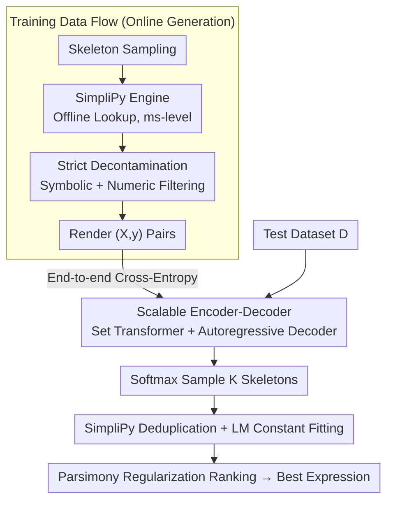

# Breaking the Simplification Bottleneck in Amortized Neural Symbolic Regression

**Conference**: ICML 2026  
**arXiv**: [2602.08885](https://arxiv.org/abs/2602.08885)  
**Code**: https://github.com/psaegert/flash-ansr  
**Area**: Interpretability  
**Keywords**: Symbolic Regression, Expression Simplification, Transformer, Amortized Inference, Scientific Discovery  

## TL;DR

Proposes SimpliPy (a rule-based simplification engine 100x faster than SymPy) and Flash-ANSR (a Transformer-based amortized symbolic regression framework). It matches or exceeds the legacy genetic programming method PySR on the FastSRB benchmark with a ~58% recovery rate, while generating increasingly concise expressions as the inference budget grows.

## Background & Motivation

**Background**: Symbolic Regression (SR) aims to discover interpretable analytical expressions from observed data. Traditional methods are dominated by Genetic Programming (GP) (e.g., PySR), but these search from scratch for every dataset, failing to transfer structural knowledge across tasks. Amortized SR learns the posterior $p(\bm{\tau}|\mathcal{D})$ by pretraining Transformers on massive synthetic data, shifting the computational burden to a one-time pretraining phase.

**Limitations of Prior Work**: Amortized SR faces a triple dilemma. First, static corpus schemes (e.g., NeSymReS) use SymPy for offline simplification to generate fixed datasets (~100M expressions), but high simplification costs limit coverage and dimensionality ($D \leq 3$). Second, some methods (e.g., E2E) forgo simplification and train directly on unnormalized expressions, causing the model to waste capacity learning syntactic redundancies ($x+0$, $1 \cdot x$, etc.). Third, methods embedding SymPy into the training loop (e.g., NSRwH) introduce severe computational bottlenecks, as SymPy's median simplification time is approximately 100ms per expression.

**Key Challenge**: A fundamental contradiction exists between the quality and speed of expression simplification—general CAS systems' object-oriented parsing and tree traversal mechanisms are too heavyweight for SR training scenarios, yet omitting simplification leads to redundant training objectives and inefficient inference.

**Goal**: Design a fast, high-quality simplification engine to break the CAS bottleneck, enabling amortized SR to scale to larger and higher-dimensional training sets.

**Key Insight**: The authors observe that expressions encountered during SR training have limited structural complexity. Therefore, simplification itself can be "amortized"—offline exhaustive discovery of all equivalence rules for short patterns, followed by fast table-lookup matching at runtime.

**Core Idea**: Replace general CAS with a precomputed hash-indexed rule set, reducing symbolic simplification from $O(100\text{ms})$ to $O(1\text{ms})$. This allows for synchronous simplification of online-generated expressions within the training loop.

## Method

### Overall Architecture

This paper addresses the issue of amortized symbolic regression being hindered by simplification: either offline simplification via SymPy limits scale, or skipping it wastes model capacity on syntactic redundancies like $x+0$. The breakthrough of Flash-ANSR is the "amortization" of simplification itself—first exhaustively generating all equivalent rules for short expressions offline as an index, then performing simple lookups at runtime. During training, data flows through "Skeleton Sampling → SimpliPy Simplification → Decontamination → Rendering $(X,y)$ pairs" before being fed to an Encoder-Decoder to learn the posterior. At inference, the encoder processes the dataset, the decoder uses softmax sampling for $K$ candidate skeletons, which are then deduplicated by SimpliPy, fitted for constants using Levenberg-Marquardt, and finally ranked by a combination of fit quality and parsimony regularization.

### Key Designs

**1. SimpliPy Simplification Engine: Converting "Simplification" from Online Solving to Offline Lookup to eliminate the 100ms CAS Bottleneck**

General CAS (like SymPy) solve simplification from first principles, which is overkill for SR training where only expressions of limited structural complexity are encountered. SimpliPy splits simplification into offline and online steps. In the offline phase, it exhaustively enumerates all expression patterns up to $L_{\max}=7$ symbols, discovering simplification rules $\bm{\tau} \to \bm{\tau}'$ via numeric equivalence testing. Each rule must satisfy strict length reduction $|\bm{\tau}'| < |\bm{\tau}|$ and non-increasing variable counts—ensuring simplification never causes expansion. In the online phase, ground rules without variables are stored in hash tables for $O(1)$ lookup, while rules with variables are stored as tree structures in buckets by operator and length for subtree matching. At runtime, it alternates between pattern matching (ApplyRules) and term elimination (CancelTerms) for up to $K=5$ iterations, finally sorting commutative operands and merging constants. The cost is a one-time ~100h (32 threads) precomputation, yielding millisecond-level runtime simplification that surpasses SymPy's quality when $L_{\max} \geq 5$.

**2. Scalable Encoder-Decoder Architecture: Handling Variable-Length Datasets across Physical Scales**

Encoding the dataset $\mathcal{D}$ into a condition for autoregressive prefix skeleton generation is difficult because datasets are unordered sets of variable length and extreme value ranges. The encoder uses a Set Transformer to handle variable lengths and replaces standard normalization with masked RMSSetNorm—it maintains the same statistical axes as SetNorm with half the parameters and correctly handles padding. Numerical inputs use 32-bit IEEE-754 multi-hot encoding, covering $10^{-38}$ to $10^{38}$, vastly exceeding the $10^{-4}$ to $10^{4}$ range of 16-bit encoding and successfully capturing real physical scales. The decoder uses Pre-RMSNorm + FlashAttention + RoPE. Pre-Norm is critical; ablation shows Post-Norm causes training divergence. During inference, softmax sampling is used instead of beam search: with $c=4096$ candidates, softmax produces only $1/70$ of the syntactic rewrites compared to beam search, increasing recovery rate by 9.4pp as beam search tends toward mode collapse in multi-modal posteriors.

**3. Strict Decontamination and Machine-Precision Evaluation: Plugging Data Leaks and Enforcing Rigorous Success Criteria**

Previous amortized SR work often lacked strict decontamination, potentially inflating performance with training data equivalent to the test set. Furthermore, loose thresholds like $R^2 > 0.9$ can misidentify failures as successes. This work’s decontamination first strips constants to get skeletons, then performs both symbolic comparison (token-by-token) and numeric comparison (evaluation on a fixed grid $X_{\text{check}} \in \mathbb{R}^{512 \times D}$, hashing rounded results). Any hit in either mode is rejected. Evaluation adopts a machine-precision recovery standard $\text{FVU} \leq 1.19 \times 10^{-7}$ and compares methods along the Pareto front of inference time vs. recovery rate to ensure "recovery" means finding the true expression, not just a lucky fit.

### Training Strategy

The training objective is standard cross-entropy $\hat{\theta} = \arg\min_{\theta} \mathbb{E}[-\sum_{t=1}^{L} \log p_{\theta}(\bar{\tau}_t^* | \bar{\tau}_{<t}^*, \mathcal{D})]$, with the encoder and decoder trained jointly end-to-end. Four model scales were trained (3M / 20M / 120M / 1B), with the 1B model trained on 512M online-generated data-expression pairs. At inference, the final expression is selected via parsimony regularization: $\hat{\bm{\tau}}^{\star} = \arg\min \log_{10}\text{FVU}(\hat{\bm{\tau}}) + \gamma \cdot |\hat{\bm{\tau}}|$, with a default $\gamma = 0.05$ to prioritize simplicity over pure fitting error.

## Key Experimental Results

### Main Results (FastSRB Benchmark, 115 Expressions)

| Method | Type | vNRR↑ (~10s) | vNRR↑ (Peak) | Expression Length Ratio↓ | Note |
|------|------|-------------|-------------|-------------|------|
| NeSymReS | Amortized SR | ~10% | ~10% | — | Saturated, fails to generalize |
| E2E | Amortized SR | <2.5% | <2.5% | — | Almost complete failure |
| PySR | Genetic Programming | ~45% | 50.0% | 0.94→1.85 | Complexity grows over time |
| Flash-ANSR 3M | Amortized SR | ~25% | ~35% | — | Lags behind PySR |
| Flash-ANSR 120M | Amortized SR | ~45% | **~58%** | 1.40→1.27 | Outperforms PySR, parsimony inversion |

### SimpliPy Efficiency Comparison

| Engine | Median Time | Simplification Ratio | Timeout (>1s) | Length Increase |
|----------|---------|--------|------------|-------------|
| SymPy | ~100ms | Good | 9% | 38%-52% |
| SimpliPy ($L_{\max}=4$) | ~1ms | Near SymPy | 0% | 0% (Strict non-growth) |
| SimpliPy ($L_{\max} \geq 5$) | Few ms | **Exceeds SymPy** | 0% | 0% |

### Ablation Study

| Config | vNRR↑ | Length Ratio | Note |
|------|-------|--------|------|
| Full (SimpliPy, 100M) | Highest | Lowest | Full model |
| A-U (No Simplification) | Close | +40-50% | Heavy expression redundancy |
| B1 (Post-Norm) | Failed | — | Unstable gradients |
| B2 (16-bit Encoding) | Significant Drop | Significant Rise | Insufficient numeric precision |
| Beam Search vs Softmax | -9.4pp | 70x more rewrites | Beam search mode collapse |

### Key Findings

- **Parsimony Inversion**: While PySR expressions become more complex over inference time (ratio 0.94→1.85), Flash-ANSR converges toward simpler forms (1.40→1.27). This occurs because increased sampling eventually finds rare, concise "needle-in-the-haystack" correct expressions.
- **Three-stage Data Sparsity Phase Transition**: A "complexity peak" appears at $M \approx 8$ data points, similar to Deep Double Descent—too few points lead to biased simple approximations; at the critical point, the model uses too many constants for interpolation; only with sufficient data does it converge to the true expression.
- **Noise Robustness Deficit**: PySR significantly outperforms Flash-ANSR at noise levels $\eta \geq 10^{-2}$ because the model is trained purely on noise-free data and misinterprets noise as high-frequency signals.

## Highlights & Insights

- **Amortized Simplification**: Treating simplification as a precomputable lookup problem rather than an online solving problem replaces "redundant recomputation" with "zero runtime cost." This logic applies to any scenario requiring expensive symbolic operations in a training loop.
- **Softmax Sampling > Beam Search**: In multi-modal posteriors, beam search's mode-seeking behavior leads to 70x more redundant rewrites. Softmax sampling explores more functionally distinct hypotheses at lower cost—a finding relevant for all sequence generation tasks.
- **Self-Discovering Scaling Law**: The authors used Flash-ANSR itself to perform symbolic regression on its own scaling curve, finding that performance follows $\text{vNRR} \propto \log\log T$, while PySR has an upper bound around 53%. Using the tool to analyze its own behavior is an elegant methodological touch.

## Limitations & Future Work

- **Poor Noise Robustness**: Training only on clean data makes noise an out-of-distribution shift; future work should include noise augmentation.
- **High Offline Discovery Cost**: $L_{\max}=7$ requires ~100h (32 threads); costs grow exponentially for longer patterns.
- **Evaluation limited to FastSRB**: 115 expressions is a small set; performance in complex real-world scientific scenarios requires further validation.
- **Future Directions**: Adding noisy data during training, exploring wider generation distributions, and trying alternative encoding/decoding paradigms (e.g., Diffusion models).

## Related Work & Insights

- **NeSymReS / E2E**: Previous amortized SR benchmarks were limited by static datasets or unsimplified training; this work addresses both bottlenecks.
- **PySR**: The current GP SOTA is matched and subsequently exceeded by Flash-ANSR at equivalent computational budgets.
- **Insight**: Decoupling "simplification" as an independent amortizable component rather than an online sub-problem is a powerful strategy for other ML systems involving symbolic manipulation.

<!-- RELATED:START -->

## Related Papers

- [\[NeurIPS 2025\] Towards Scaling Laws for Symbolic Regression](../../NeurIPS2025/interpretability/towards_scaling_laws_for_symbolic_regression.md)
- [\[ICML 2025\] Ab Initio Nonparametric Variable Selection for Scalable Symbolic Regression with Large p](../../ICML2025/interpretability/ab_initio_nonparametric_variable_selection_for_scalable_symbolic_regression_with.md)
- [\[AAAI 2026\] Attention as Binding: A Vector-Symbolic Perspective on Transformer Reasoning](../../AAAI2026/interpretability/attention_as_binding_a_vector-symbolic_perspective_on_transformer_reasoning.md)
- [\[ICLR 2026\] There Was Never a Bottleneck in Concept Bottleneck Models](../../ICLR2026/interpretability/there_was_never_a_bottleneck_in_concept_bottleneck_models.md)
- [\[ICML 2026\] Neural Collapse by Design: Learning Class Prototypes on the Hypersphere](neural_collapse_by_design_learning_class_prototypes_on_the_hypersphere.md)

<!-- RELATED:END -->
