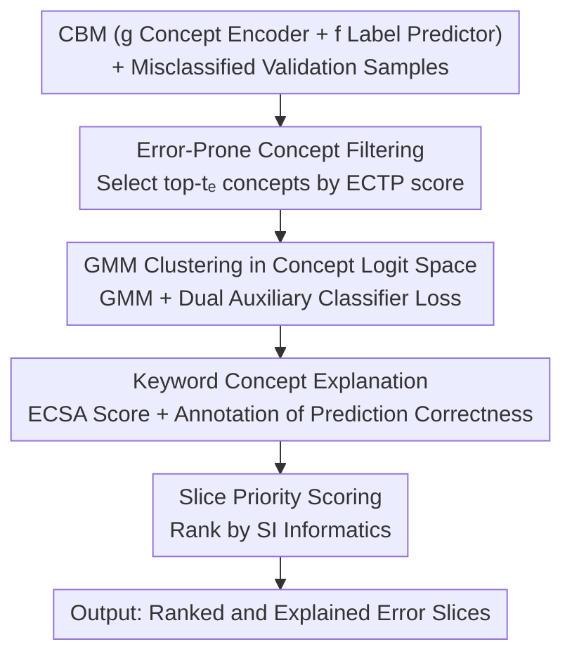

# CB-SLICE: Concept-Based Interpretable Error Slice Discovery

**Conference**: ICML2026  
**arXiv**: [2605.29836](https://arxiv.org/abs/2605.29836)  
**Code**: https://github.com/yaelkon/CB-SLICE  
**Area**: Interpretability  
**Keywords**: Error slice discovery, Concept Bottleneck Models, Model debugging, Bias detection, Explainable AI  

## TL;DR

CB-SLICE leverages the concept prediction space of Concept Bottleneck Models (CBMs) to discover and explain systematic error slices of deep learning models. Through a three-step pipeline—filtering error-prone concepts, GMM clustering for slice formation, and keyword concept explanation—it consistently outperforms existing methods across multiple benchmarks while providing faithful explanations directly rooted in the model's internal decision logic.

## Background & Motivation

**Background**: Despite the excellent average performance of deep learning models, they often exhibit systematic errors on specific data subgroups (error slices). Existing Slice Discovery Methods (SDMs) such as Domino, GEORGE, and Spotlight have been able to identify these failure patterns to some extent.

**Limitations of Prior Work**: Existing SDMs typically rely on auxiliary language models (e.g., ClipCap) to generate explanations. However, these explanations are decoupled from the internal reasoning process of the analyzed model—they only indirectly approximate the source of errors, which can be inaccurate or even misleading. Moreover, auxiliary models may introduce additional biases, further reducing the reliability of the explanations.

**Key Challenge**: Error slice discovery needs to solve two problems simultaneously: (i) finding subsets of error samples sharing semantic failure patterns, and (ii) explaining the causes of failure in a human-understandable manner. Existing methods separate these two steps, leading to explanations that are unfaithful to the model's true decision-making process.

**Goal**: To design a framework that unifies slice discovery and bias explanation within the model's internal representation space, making explanations directly associated with the model's decision logic.

**Key Insight**: Concept Bottleneck Models (CBMs) first predict human-understandable concepts (e.g., "dark skin", "asymmetric") and then perform classification based on these predictions. This structured prediction flow naturally establishes a transparent link between model decisions and semantic concepts. When downstream predictions depend on intermediate concept predictions, systematic errors inevitably stem from the concept prediction stage.

**Core Idea**: Perform error slice discovery and explanation in the concept logit space of the CBM, transforming SDM from a "post-hoc description" into a "model-aware" process.

## Method

### Overall Architecture

CB-SLICE aims to solve the following: given a trained CBM $\mathcal{M}_\theta = (g, f)$ and a set of samples it misclassifies, how to automatically categorize these errors according to "which concept the model failed on" and clarify the reasons. It moves the entire error slice discovery into the concept prediction space of the CBM—receiving the CBM (concept encoder $g$ + label predictor $f$) and the misclassified sample set $\Psi_{\text{val}}$ from the validation set. It sequentially completes three steps: "Filter error-prone concepts → Cluster in concept logit space → Explain with keyword concepts," and finally ranks slices by informativeness to output a set of explained error slices. Because discovery and explanation both occur within the model's own concept representation, the entire pipeline requires no external auxiliary language models.

### Key Designs

**1. Error-Prone Concept Filtering: Removing noise concepts using ECTP scores**

If slice discovery is performed directly across all $k$ concepts, a large number of concepts unrelated to the errors will introduce noise and dilute the quality of the slices. Therefore, CB-SLICE first filters out a subset of concepts $C_{\text{err}}$ most likely to cause downstream misclassification. The criterion is the Expected Change in Target Prediction (ECTP) score: for each concept $i$, an intervention is performed to observe how much the downstream prediction distribution changes. This is defined as $T_i(\hat{\mathbf{c}}) = (1-\hat{c}_i) D_{\text{KL}}(\hat{y}_{\hat{c}_i=0} \| \hat{y}) + \hat{c}_i D_{\text{KL}}(\hat{y}_{\hat{c}_i=1} \| \hat{y})$, which represents the KL divergence of the downstream distribution relative to the original distribution after flipping the concept prediction to 0 or 1. After averaging over categories, the top-$t_e$ concepts are selected. This restricts the formation of slices to concepts that truly govern downstream decisions, significantly improving discovery quality.

**2. GMM Clustering in Concept Logit Space: Mapping one slice to one concept-level error pattern**

To group error samples by "shared failure patterns" rather than "surface feature similarity," CB-SLICE maps the predictions of the filtered concepts back from the probability space to the logit space $H_{\text{err}} = \sigma^{-1}(\hat{C}_{\text{err}})$. Concept logits encode the model's confidence in the presence of a concept and approximate a Gaussian distribution, making them naturally suitable for Gaussian Mixture Model (GMM) modeling. The clustering objective consists of three terms: the GMM negative log-likelihood $\mathcal{L}_{\text{GMM}}$ ensures semantic coherence of the slices, and two auxiliary classifier losses $\mathcal{L}_{c_{\text{true}}}$ and $\mathcal{L}_{c_{\text{pred}}}$ force samples within the same slice to share the same ground-truth concept values and predicted concept values, respectively. The total synthesis loss is $\mathcal{L} = \mathcal{L}_{\text{GMM}} + \lambda(\mathcal{L}_{c_{\text{true}}} + \mathcal{L}_{c_{\text{pred}}})$. With these two auxiliary losses, slices capture consistent concept-level error patterns rather than just clusters of similar-looking samples.

**3. Keyword Concept Explanation: Using ECSA scores to clarify why slices formed**

After slicing, one must answer the question "which concept caused this slice to cluster?" CB-SLICE extends the ECTP idea from "the impact of concepts on downstream predictions" to "the impact of concepts on slice assignment," proposing the Expected Change in Slice Assignment (ECSA) score: $\text{ECSA}_i(\mathbf{x}) = \mathbb{E}_{v \sim \text{Bern}(\hat{c}_i)} [D_{\text{KL}}(P(S_j | \mathbf{x}, \hat{c}_i = v) \| P(S_j | \mathbf{x}))]$. This measures the change in the probability distribution of a sample's slice assignment after intervening on concept $i$. Top-$t_k$ concepts are selected as keywords based on the average ECSA across all samples in the slice. Crucially, it also labels whether the prediction of each keyword concept is correct—thus, the explanation not only identifies which attribute is related to the slice but also distinguishes between "concepts mispredicted by the model" and "under-training due to rare concept combinations," pointing toward different directions for model repair.

**4. Slice Priority Scoring: Ranking by informativeness to avoid information overload**

There may be many slices, and analyzing them one by one is burdensome. CB-SLICE assigns an informativeness score to each slice: $\text{SI}_j = \rho \cdot \frac{1}{2}(\text{MC}_j + \frac{1+\text{SC}_j}{2})$. Here, MC (Misclassification Consistency) is characterized by the entropy of the predicted label distribution within the slice (lower entropy indicates a more consistent error pattern); SC (Semantic Compactness) is characterized by the cosine similarity of slice members to the centroid (higher indicates better semantic grouping); and the penalty factor $\rho$ downweights small slices with too few samples. After ranking by SI, analysts prioritize seeing slices that are both homogeneous and of high analytical value.

## Key Experimental Results

### Main Results

On four datasets—Waterbirds, CelebA, MetaShift, and MNIST-Sum—CB-SLICE was compared against Domino, GEORGE, HiBug2, Spotlight, and K-Means on CBMs (trained with Sequential and Joint methods):

| Dataset | Model | CB-SLICE Prec@10 | Best baseline Prec@10 | CB-SLICE MGF | Best baseline MGF |
|--------|------|------------------|----------------------|--------------|------------------|
| Waterbirds | CBM+Seq | **0.78** | 0.72 (Domino) | **0.70** | 0.25 (HiBug2) |
| Waterbirds | CBM+Joint | **0.83** | 0.62 (Domino) | **0.76** | 0.25 (HiBug2) |
| CelebA | CBM+Seq | **0.92** | 0.63 (Domino) | **0.66** | 0.51 (HiBug2) |
| MetaShift | CBM+Joint | **0.91** | 0.86 (Domino) | **0.86** | 0.72 (GEORGE) |
| MNIST-Sum | CBM+Joint | **1.00** | 0.50 (HiBug2) | **0.95** | 0.56 (HiBug2) |

### Ablation Study

| Configuration | Effect | Description |
|------|------|------|
| Using all concepts (no ECTP filtering) | Significant decrease | Irrelevant concepts introduce noise, reducing slice quality |
| Only $\mathcal{L}_{\text{GMM}}$ | Decrease | Lacks alignment of concept-level error patterns |
| $\mathcal{L}_{\text{GMM}} + \mathcal{L}_{c_{\text{true}}}$ | Suboptimal | Lacks consistency constraints on predicted values |
| $\mathcal{L}_{\text{GMM}} + \mathcal{L}_{c_{\text{true}}} + \mathcal{L}_{c_{\text{pred}}}$ | **Optimal** | Synergy of three losses provides highest and most stable performance |
| GMM vs. Linear Clustering | GMM better | GMM consistently outperforms linear alternatives in auxiliary classifier accuracy |

### Key Findings

- CB-SLICE leads across the board in Precision@10, with significant advantages especially on CelebA (+29%) and MNIST-Sum (+50%), indicating highly accurate localization of error slices.
- The massive advantage in the MGF metric (e.g., 0.70 vs. 0.25 on Waterbirds) demonstrates that the slices discovered by CB-SLICE are highly homogeneous within the slice and do not mix samples from other failure modes.
- Keyword concepts distinguish between two types of failure patterns: errors driven by concept misprediction (e.g., "medium size" mispredicted in Waterbirds) and errors resulting from rare concept combinations (e.g., under-trained (1,1) combinations in MNIST-Sum).
- The alignment of the loss convergence point with the evaluation metric saturation point provides a practical criterion for selecting the number of slices $t_g$ without needing labels.

## Highlights & Insights

- **Model-aware explanation paradigm**: CB-SLICE transforms error explanation from a "post-hoc description" into a "model-aware" process. Explanations derive directly from the model's internal concept predictions, avoiding secondary biases introduced by auxiliary models. This approach can be generalized to any architecture with intermediate interpretable representations.
- **Distinction between two failure modes**: By labeling the correctness of keyword concept predictions, CB-SLICE can automatically distinguish between "concept misprediction" and "under-training of rare combinations"—two fundamentally different failure causes that direct different repair strategies (modifying the concept encoder for the former, and data augmentation for the latter).
- **Generalization from ECTP to ECSA**: Generalizing the ECTP score, which quantifies the impact of concepts on downstream predictions, into the ECSA score, which quantifies the impact of concepts on slice assignment. This "intervention-observation" causal reasoning framework is transferable to other scenarios requiring attribution analysis.

## Limitations & Future Work

- CB-SLICE relies on the CBM architecture and requires complete and faithful concept labels; performance may degrade when concepts are noisy or incomplete.
- It requires training an additional CBM, increasing computational costs, although the performance gap between CBMs and standard DNNs is narrowing.
- Future work could extend to scenarios with incomplete/noisy concept sets or form a closed loop with downstream bias mitigation strategies (e.g., resampling, data augmentation).

## Related Work & Insights

- **SDM Series**: Domino discovers slices in CLIP space but uses external explanations; GEORGE uses embedding clustering without explanation; Spotlight finds high-loss regions but lacks discriminative power. CB-SLICE unifies discovery and explanation.
- **CBM Bias Handling**: Bordt et al. mitigate spurious concepts through pruning; Kim et al. use VLMs to automatically filter concept libraries. CB-SLICE differs by aiming for comprehensive discovery of all failure patterns rather than fixing specific biases.
- **Insight**: Concept bottlenecks are not just interpretability tools but a natural infrastructure for model debugging. Any architecture that decomposes the decision process into interpretable intermediate representations can utilize similar "error analysis in the intermediate representation space" strategies.

<!-- RELATED:START -->

## Related Papers

- [\[CVPR 2025\] Towards Human-Understandable Multi-Dimensional Concept Discovery](../../CVPR2025/interpretability/towards_human-understandable_multi-dimensional_concept_discovery.md)
- [\[ICCV 2025\] Granular Concept Circuits: Toward a Fine-Grained Circuit Discovery for Concept Representations](../../ICCV2025/interpretability/granular_concept_circuits_toward_a_fine-grained_circuit_discovery_for_concept_re.md)
- [\[ACL 2025\] CLEME2.0: Towards Interpretable Evaluation by Disentangling Edits for Grammatical Error Correction](../../ACL2025/interpretability/cleme2_gec_evaluation.md)
- [\[CVPR 2026\] Hierarchical Concept Embedding & Pursuit for Interpretable Image Classification](../../CVPR2026/interpretability/hierarchical_concept_embedding_pursuit_for_interpretable_image_classification.md)
- [\[CVPR 2025\] Language Guided Concept Bottleneck Models for Interpretable Continual Learning](../../CVPR2025/interpretability/language_guided_concept_bottleneck_models_for_interpretable_continual_learning.md)

<!-- RELATED:END -->
